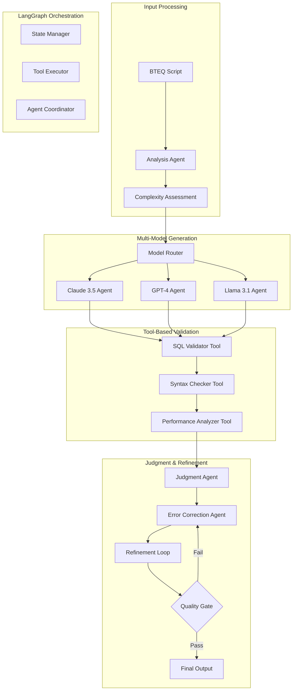

# Agentic BTEQ Migration Framework

## Overview

Enhanced BTEQ to Snowflake migration framework using LangChain/LangGraph for multi-agent orchestration, tool-based validation, error correction, and multi-model judgment systems.

## Agentic Architecture

## Key Components

### 1. Multi-Agent System
- **Analysis Agent**: Deep BTEQ pattern analysis
- **Generation Agents**: Multiple LLM models for diverse approaches
- **Validation Agents**: Tool-based verification and testing
- **Judgment Agent**: Quality assessment and decision making
- **Error Correction Agent**: Iterative refinement and fixes

### 2. Tool Ecosystem
- **SQL Validation Tools**: Syntax and semantic checking
- **Performance Analysis Tools**: Query optimization recommendations
- **Testing Tools**: Automated procedure testing
- **Snowflake Connectivity Tools**: Live database validation

### 3. Multi-Model Orchestration
- **Model Selection**: Dynamic routing based on complexity
- **Ensemble Generation**: Multiple model outputs for comparison
- **Judgment Models**: Specialized evaluation and ranking
- **Fallback Chains**: Graceful degradation strategies
