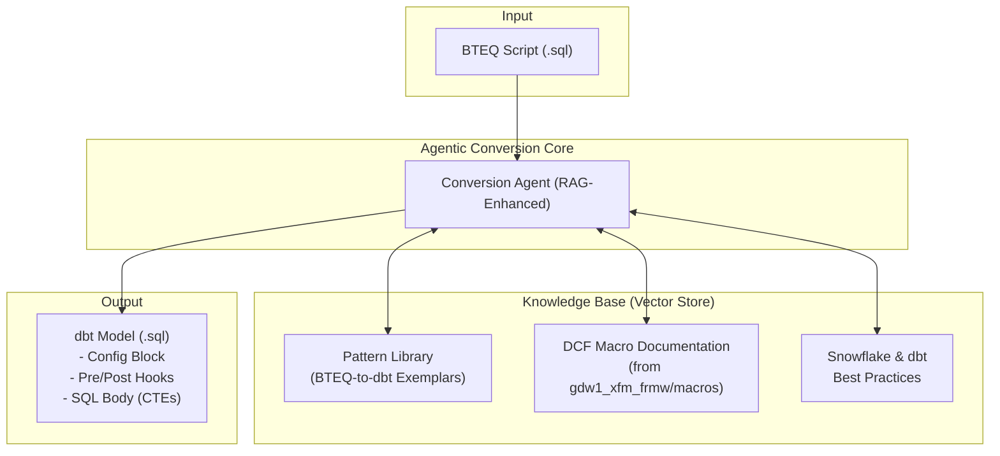

# High-Level Design: BTEQ to dbt Migration

## 1. Executive Summary

This document outlines the high-level design for a project to migrate legacy Teradata BTEQ scripts to a modern dbt (Data Build Tool) project, leveraging the existing dbt Control Framework (DCF). The conversion will be facilitated by a custom-built AI agent utilizing a Retrieval-Augmented Generation (RAG) architecture.

The chosen approach, based on a synthesis of pre-existing design documents, prioritizes a pragmatic, MVP-first implementation that ensures high-quality, maintainable, and framework-compliant dbt models.

## 2. Chosen Design: RAG-Enhanced Single-Agent Converter

We will adopt the **RAG-Enhanced Single-Agent Converter** design. This model consists of a single, sophisticated AI agent responsible for the end-to-end conversion of a BTEQ script into a dbt model.

### 2.1. Justification

- **Speed to Value:** This approach minimizes initial complexity, allowing for a faster development cycle and quicker delivery of a functional MVP.
- **Focused Learning:** A single-agent model allows us to concentrate efforts on curating a high-quality knowledge base (the "R" in RAG), which is the most critical factor for success. The agent's performance will improve iteratively as the knowledge base is enriched with more examples.
- **Alignment with Provided Materials:** This design directly leverages the specific patterns observed in `current_state/bteq_sql` and the control macros available in `gdw1_xfm_frmw`, as detailed in `agentic_design_approach_o2.md`.
- **Sufficient for Scope:** The observed BTEQ scripts, while complex, follow a limited set of patterns (simple inserts, multi-step transformations, procedural orchestration). A well-contextualized single agent is sufficient to handle this scope without the overhead of a multi-agent pipeline.

## 3. Core Conversion Philosophy

The migration will follow a principle of **declarative transformation over procedural orchestration**.

- **BTEQ Logic:** The core `INSERT`, `SELECT`, and `MERGE` statements within a BTEQ script represent the business logic. This logic will be extracted and transformed into the main `SELECT` statement of a dbt model, often consolidated into a series of Common Table Expressions (CTEs) for clarity.
- **BTEQ Control Flow:** Procedural commands (`.IF ERRORCODE`, `.GOTO`), file I/O (`.IMPORT`, `.EXPORT`), and orchestration calls (`CALL SP_...`) will not be translated directly. Instead, their *intent* will be mapped to the features of the dbt Control Framework, primarily using **pre-hooks** and **post-hooks**.

## 4. Agent Architecture

### 4.1. Key Components

1.  **BTEQ Parser & Classifier:** The agent's first step is to parse the input script. It will distinguish between the core SQL DML and the BTEQ control commands. Based on the structure, it will classify the script into a known pattern (e.g., `simple-insert`, `full-apply-scd2`, `delta-merge`).
2.  **Contextual Knowledge Base (RAG):** This is the agent's "brain." It will be a vector store populated with:
    -   **BTEQ-to-dbt Exemplars:** Curated, high-quality examples of converting specific BTEQ patterns into the target dbt model structure.
    -   **DCF Framework Documentation:** The functional specifications and usage patterns of the macros found in `gdw1_xfm_frmw/macros/dcf/`.
    -   **Project Conventions:** Guardrails and rules, such as mandated pre/post hooks, variable usage for environments (`var('intermediate_database')`), and source/ref naming conventions.
3.  **dbt Model Generator:** Using the context retrieved from the knowledge base, the agent will generate a single `.sql` file for the dbt model. This output will be strictly formatted to include the dbt `config` block, `pre_hook` and `post_hook` arrays, and the final `SELECT` statement.
4.  **Validator:** A post-generation automated check to ensure the generated code is syntactically valid and complies with project conventions (e.g., no forbidden commands, required hooks are present).

## 5. BTEQ-to-dbt Mapping Patterns

The agent will be trained on the following primary conversion patterns:

| BTEQ Feature                  | Target dbt/DCF Implementation                                  | Rationale                                                                        |
| ----------------------------- | -------------------------------------------------------------- | -------------------------------------------------------------------------------- |
| Core `INSERT-SELECT`          | Main `SELECT` body of the dbt model                            | Preserves the core business transformation logic.                                |
| Multi-step `DELETE`/`INSERT`  | Consolidated into a single `SELECT` using CTEs                 | Creates a single, atomic, and more readable transformation.                      |
| `.IF ERRORCODE`, `.GOTO`      | `pre_hook` and `post_hook` arrays with DCF validation macros     | Shifts procedural error handling to declarative, framework-managed checks.       |
| `CALL SP_GET_PROS_KEY`        | `pre_hook` call to `register_process_instance` DCF macro       | Replaces custom stored procedures with standardized framework orchestration.     |
| `.IMPORT`/`.EXPORT` for dates | `SELECT` from DCF control tables (e.g., `DCF_T_STRM_BUS_DT`)    | Eliminates fragile filesystem dependencies in favor of a robust, data-driven approach. |
| `COLLECT STATS`               | Omitted                                                        | Unnecessary, as Snowflake's query optimizer manages statistics automatically.    |
| Variable Substitution (`%%...%%`) | dbt variables (`var('...')`) and sources (`source('...','...')`) | Adopts dbt's native mechanisms for environment configuration and lineage.       |

## 6. Phased Implementation Plan (MVP)

1.  **Phase 1: Knowledge Base Curation (1 Week)**
    -   Manually analyze 5-10 representative scripts from `current_state/bteq_sql` covering the main patterns.
    -   Manually create the "gold standard" dbt model equivalent for each, adhering strictly to the `gdw1_xfm_frmw` framework.
    -   Codify the DCF macro usage rules and project conventions.
    -   Load these exemplars and rules into the vector store.
2.  **Phase 2: Agent Development (2 Weeks)**
    -   Develop the core agent application logic.
    -   Implement the prompt strategy, incorporating the RAG pattern to fetch context from the knowledge base.
    -   Build the BTEQ parser/classifier and the dbt model generator components.
    -   Implement the automated validator.
3.  **Phase 3: Pilot Conversion & Refinement (1 Week)**
    -   Run a new set of BTEQ scripts through the agent.
    -   Analyze the quality of the generated dbt models.
    -   Use any failures or suboptimal outputs to refine the prompts and add new, corrective exemplars to the knowledge base.
    -   Establish a baseline for conversion accuracy.

## 7. Target dbt Project Structure

The final output will be a set of dbt models within the `gdw1_xfm_frmw` project structure. No new directories or unconventional structures will be introduced. All orchestration logic will be embedded within the models' configuration blocks, ensuring a clean, maintainable, and "dbt-native" result.
