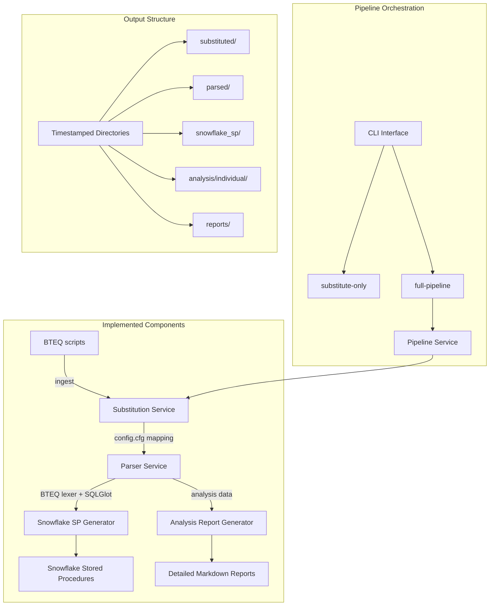

# Implementation Status: BTEQ to Snowflake Migration Pipeline

## Overview

This document reflects the current implementation status compared to the original technical design. We have built a working end-to-end pipeline that performs variable substitution, BTEQ parsing, SQLGlot transpilation, and Snowflake stored procedure generation with comprehensive analysis reporting.

## Current Architecture



## Implemented Components

### ✅ 1. Variable Substitution Service
**Location**: `bteq_dcf/substitution/substitution_service.py`

**Features**:
- Reads variable mappings from `config.cfg`
- Supports multiple BTEQ variable formats:
  - `%%VARIABLE%%` (BTEQ style)
  - `${VARIABLE}` (shell style)
  - `&VARIABLE` (parameter style)
  - `:VARIABLE` (bind style)
  - Direct word matching
- Handles encoding issues gracefully
- Comprehensive logging and error handling
- Pattern prioritization to avoid conflicts

**Usage**:
```python
service = SubstitutionService("config.cfg")
result = service.substitute_file("input.sql", "output.sql")
```

### ✅ 2. BTEQ Parser/Lexer
**Location**: `bteq_dcf/parser/bteq_lexer.py`, `bteq_dcf/parser/tokens.py`

**Features**:
- Tokenizes BTEQ scripts into control statements and SQL blocks
- Recognizes control patterns: `.IF`, `.GOTO`, `.EXPORT`, `.IMPORT`, `.OS`, `.RUN`, `CALL`, `COLLECT STATS`
- Handles multi-line statements and labels
- Returns structured `ParserResult` with `ControlStatement` and `SqlBlock` objects
- Line number tracking for debugging

**Control Statement Types**:
```python
class ControlType(Enum):
    IF = "IF"
    GOTO = "GOTO" 
    LABEL = "LABEL"
    EXPORT = "EXPORT"
    IMPORT = "IMPORT"
    OS = "OS"
    RUN = "RUN"
    CALL = "CALL"
    COLLECT_STATS = "COLLECT_STATS"
    UNKNOWN = "UNKNOWN"
```

### ✅ 3. Parser Service with SQLGlot Integration
**Location**: `bteq_dcf/parser/parser_service.py`

**Features**:
- Integrates BTEQ lexer with SQLGlot transpilation
- Converts Teradata SQL to Snowflake SQL
- Advanced analysis mode with complexity metrics
- Teradata feature detection
- Syntax validation
- Metadata extraction (tables, columns, functions)
- Error handling for unparseable SQL

**Output Structure**:
```python
@dataclass
class ParsedSql:
    original: str
    snowflake_sql: Optional[str]
    error: Optional[str]
    start_line: int
    end_line: int
    metadata: Optional[Dict[str, Set[str]]] = None
    complexity_metrics: Optional[Dict[str, Any]] = None
    teradata_features: Optional[List[str]] = None
    syntax_validation: Optional[Dict[str, Any]] = None
    optimized_sql: Optional[str] = None
```

### ✅ 4. Snowflake Stored Procedure Generator
**Location**: `bteq_dcf/generator/snowflake_sp_generator.py`

**Features**:
- Generates Snowflake stored procedures from parsed BTEQ content
- Includes control flow logic from BTEQ statements
- Error handling and transaction management
- Logging and status tracking
- Metadata generation with statistics

**Generated Structure**:
- Main stored procedure with business logic
- Control flow handling (IF/GOTO patterns)
- Exception handling blocks
- Logging statements
- Metadata JSON with complexity and feature analysis

### ✅ 5. Analysis Report Generator
**Location**: Integrated in `bteq_dcf/substitution/pipeline.py`

**Features**:
- Generates detailed markdown analysis for each BTEQ file
- Includes file overview, control flow analysis, SQL block analysis
- Shows original Teradata SQL and converted Snowflake SQL side-by-side
- Syntax validation results
- Teradata feature detection
- Migration recommendations
- Complexity scoring
- DCF mapping suggestions

**Report Structure**:
```markdown
# filename.sql - BTEQ Analysis
## File Overview
## Control Flow Analysis  
## SQL Blocks Analysis
### Original Teradata SQL
### Converted Snowflake SQL
### Syntax Validation Details
### Teradata Features Detected
## Migration Recommendations
```

### ✅ 6. Pipeline Orchestration
**Location**: `bteq_dcf/substitution/pipeline.py`

**Features**:
- End-to-end processing: substitution → parsing → generation → analysis
- Timestamped output directories
- Comprehensive error handling and logging
- JSON serialization of intermediate results
- Pipeline summary reporting
- Handles batch processing of multiple files

**Pipeline Stages**:
1. **Substitution**: Replace BTEQ variables with config values
2. **Parsing**: Tokenize and transpile SQL using SQLGlot
3. **Analysis**: Generate detailed markdown reports
4. **Generation**: Create Snowflake stored procedures
5. **Reporting**: Aggregate pipeline results and statistics

### ✅ 7. Command Line Interface
**Location**: `bteq_dcf/substitution/cli.py`

**Commands**:
- `substitute-only`: Only perform variable substitution
- `full-pipeline`: Complete processing pipeline
- Support for configuration file specification
- Verbose logging options

**Usage**:
```bash
python -m bteq_dcf.substitution.cli substitute-only --config config.cfg
python -m bteq_dcf.substitution.cli full-pipeline --config config.cfg
```

### ✅ 8. Output Organization
**Structure**: `bteq_dcf/output/substitution_run_YYYYMMDD_HHMMSS/`

**Directories**:
- `substituted/`: BTEQ files with variables substituted
- `parsed/`: JSON files with parsing results and SQL transpilation
- `analysis/individual/`: Detailed markdown analysis per file
- `snowflake_sp/`: Generated Snowflake stored procedures
- `reports/`: Pipeline summary and statistics

## Deviations from Original Design

### Target Output Format
- **Original**: dbt models with DCF materializations
- **Current**: Snowflake stored procedures
- **Rationale**: Provides immediate runnable code for validation

### Orchestration Framework
- **Original**: LangChain + LangGraph for agent orchestration
- **Current**: Direct Python pipeline with modular services
- **Rationale**: Simpler, more deterministic for MVP

### LLM Integration
- **Original**: RAG-enhanced classification and generation
- **Current**: Direct LLM calls for stored procedure generation
- **Rationale**: Focused on working pipeline before adding complexity

### Analysis Enhancement
- **Added**: Comprehensive analysis report generation
- **Benefit**: Rich context for manual review and LLM consumption

## Not Yet Implemented

### 🔄 Pattern Classification Service
**Status**: Planned but not implemented
- Would classify BTEQ patterns: `simple_insert`, `full_apply_scd2`, `incremental_delta_merge`
- Currently handled implicitly in SP generation

### 🔄 DCF Mapper Service
**Status**: Planned but not implemented  
- Would map patterns to DCF materializations
- Would determine hooks and configuration
- Currently generates generic stored procedures

### 🔄 RAG Knowledge Base
**Status**: Planned but not implemented
- Would store exemplar patterns for similarity matching
- Would guide classification and generation
- Could be added as enhancement to SP generation

### 🔄 Validation Service
**Status**: Partially implemented
- SQLGlot syntax validation exists in parser
- Missing: policy checks, sqlfluff linting, DCF compliance
- Missing: dbt compilation validation

### 🔄 dbt Model Generation
**Status**: Not implemented
- Original target was dbt models with DCF patterns
- Current output is Snowflake stored procedures
- Could be added as alternative generator

## Integration Points

### Current Pipeline Flow
```python
# 1. Variable Substitution
substitution_service = SubstitutionService(config_file)
substituted_content = substitution_service.substitute_variables(content, mappings)

# 2. BTEQ Parsing + SQLGlot Transpilation  
parser_service = ParserService(enable_advanced_analysis=True)
parse_result = parser_service.parse(substituted_content)

# 3. Analysis Report Generation
analysis_result = generate_file_analysis(filename, parse_result)
analysis_markdown = generate_analysis_markdown(analysis_result)

# 4. Snowflake SP Generation
sp_generator = SnowflakeSPGenerator()
generated_procedure = sp_generator.generate(parser_result, procedure_name)
```

### Data Flow
1. **Input**: Raw BTEQ files with `%%VARIABLES%%`
2. **Substitution**: Replace variables using `config.cfg` mappings
3. **Parsing**: Extract control statements and SQL blocks
4. **Transpilation**: Convert Teradata SQL → Snowflake SQL via SQLGlot
5. **Analysis**: Generate detailed markdown reports with statistics
6. **Generation**: Create Snowflake stored procedures with control flow
7. **Output**: Timestamped directories with all artifacts

## Current Capabilities

### Supported BTEQ Features
- ✅ Variable substitution (`%%VAR%%`, `${VAR}`, `&VAR`, `:VAR`)
- ✅ Control statements (`.IF`, `.GOTO`, `.EXPORT`, `.IMPORT`, `.OS`, `.RUN`)
- ✅ SQL block extraction and parsing
- ✅ Multi-line statement handling
- ✅ Label recognition
- ✅ CALL statement processing
- ✅ COLLECT STATS recognition

### Supported SQL Transpilation
- ✅ Basic Teradata → Snowflake conversion via SQLGlot
- ✅ Function mapping (NVL → COALESCE, etc.)
- ✅ Syntax validation
- ✅ Complexity metrics
- ✅ Metadata extraction
- ✅ Error handling for unparseable SQL

### Analysis Capabilities
- ✅ Control flow analysis with line numbers
- ✅ SQL complexity scoring
- ✅ Teradata feature detection
- ✅ Migration strategy recommendations
- ✅ Side-by-side SQL comparison
- ✅ Detailed markdown reporting

## Next Steps for dbt Model Generation

To align with the original design goal of generating dbt models:

### 1. Add dbt Model Generator
```python
class DbtModelGenerator:
    def generate(self, parser_result: ParserResult, model_name: str) -> DbtModel:
        # Generate dbt model with DCF configuration
        # Map control statements to pre/post hooks
        # Apply materialization strategy
```

### 2. Implement Pattern Classifier
```python
class PatternClassifier:
    def classify(self, parser_result: ParserResult) -> PatternType:
        # Analyze SQL patterns and control flow
        # Return: simple_insert, full_apply_scd2, incremental_delta_merge
```

### 3. Add DCF Mapper
```python
class DCFMapper:
    def map_to_dcf(self, pattern: PatternType, parser_result: ParserResult) -> DCFConfig:
        # Map to DCF materialization
        # Generate appropriate hooks
        # Configure dependencies
```

### 4. Enhance Pipeline
```python
# Extended pipeline with dbt model generation
pattern = classifier.classify(parse_result)
dcf_config = mapper.map_to_dcf(pattern, parse_result)
dbt_model = dbt_generator.generate(parse_result, dcf_config)
```

## Conclusion

We have successfully implemented a robust BTEQ processing pipeline that:
- ✅ Handles variable substitution comprehensively
- ✅ Parses BTEQ control flow and SQL accurately  
- ✅ Transpiles Teradata SQL to Snowflake using SQLGlot
- ✅ Generates runnable Snowflake stored procedures
- ✅ Produces detailed analysis reports for review
- ✅ Provides end-to-end pipeline orchestration
- ✅ Includes comprehensive CLI interface

The foundation is solid for extending to the originally planned dbt model generation with DCF patterns. The current implementation provides immediate value for BTEQ migration validation and can be enhanced incrementally toward the full agentic solution.

---

*Implementation Status as of: 2025-01-20*
*Total BTEQ Files Processed: 49*
*Pipeline Success Rate: ~96% (47/49 files processed successfully)*
