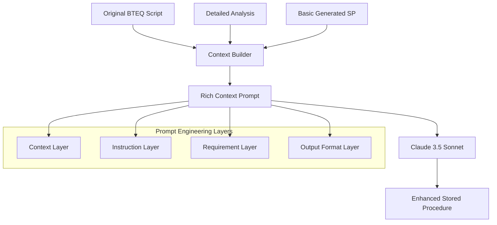

# Prompt Engineering in BTEQ DCF Framework

## Overview

The BTEQ DCF framework employs sophisticated prompt engineering strategies to generate high-quality Snowflake stored procedures from Teradata BTEQ scripts. This document details the prompt engineering approach, techniques, and best practices implemented in the system.

## Architecture



## Core Prompt Engineering Strategy

### 1. Multi-Context Approach

The system constructs prompts with **three distinct contexts** to provide comprehensive understanding:

#### Context 1: Original BTEQ Script
```python
### 1. Original BTEQ Script
```sql
{context.original_bteq}
```
```

**Purpose**: Preserves complete business logic and control flow patterns
**Benefits**: 
- Maintains semantic understanding
- Preserves BTEQ-specific patterns (.IF, .GOTO, .LABEL)
- Includes comments and documentation context

#### Context 2: Detailed Analysis
```python
### 2. Detailed Analysis
{context.analysis_markdown}
```

**Purpose**: Provides structured technical insights
**Components**:
- Complexity scoring and metrics
- Teradata feature detection
- Migration recommendations
- Control flow analysis
- SQL block breakdown

#### Context 3: Basic Generated Procedure
```python
### 3. Basic Generated Stored Procedure
```sql
{context.basic_stored_procedure}
```
```

**Purpose**: Provides foundation for enhancement
**Benefits**:
- Shows automated transpilation results
- Demonstrates basic structure
- Serves as enhancement baseline

### 2. Structured Instruction Framework

The prompt follows a hierarchical instruction structure:

```markdown
## Enhancement Requirements

### Code Quality
- Use proper Snowflake SQL syntax and best practices
- Implement robust error handling with specific error codes
- Add comprehensive logging for debugging and monitoring
- Use meaningful variable names and comments
- Optimize SQL for Snowflake's columnar architecture

### BTEQ Pattern Migration
- Convert BTEQ control flow (.IF, .GOTO, .LABEL) to proper conditional logic
- Replace BTEQ commands (.RUN, .EXPORT, .IMPORT) with Snowflake equivalents
- Handle error conditions gracefully with appropriate rollback logic
- Preserve business logic while modernizing implementation

### Snowflake Optimization
- Use Snowflake-specific features where beneficial (QUALIFY, window functions)
- Implement proper transaction management
- Add parameter validation and sanitization
- Use explicit column lists and avoid SELECT *
- Optimize JOIN operations for Snowflake

### Documentation
- Add comprehensive header with purpose, parameters, and usage
- Document each major section of the procedure
- Include migration notes for any BTEQ features that required special handling
- Add performance considerations and maintenance notes
```

## Key Prompt Engineering Techniques

### 1. Context Injection
**Technique**: Rich context embedding
**Implementation**:
```python
def _build_enhancement_prompt(self, context: LLMGenerationContext) -> str:
    prompt = f"""# BTEQ to Snowflake Stored Procedure Enhancement

You are an expert in migrating Teradata BTEQ scripts to high-quality Snowflake stored procedures.

## Task
Enhance the basic generated stored procedure using the provided context...
```

**Benefits**:
- Establishes expert persona
- Provides complete migration context
- Reduces hallucination by grounding in actual code

### 2. Multi-Layer Requirements
**Technique**: Hierarchical requirement specification
**Layers**:
1. **Code Quality**: Syntax, best practices, maintainability
2. **BTEQ Pattern Migration**: Specific transformation patterns
3. **Snowflake Optimization**: Platform-specific enhancements
4. **Documentation**: Comprehensive code documentation

### 3. Output Format Control
**Technique**: Explicit output specification
```python
## Output Format
Provide only the enhanced Snowflake stored procedure SQL. Do not include explanations or additional text.

## Enhanced Stored Procedure:
```

**Benefits**:
- Ensures consistent output format
- Prevents unnecessary explanations
- Focuses LLM on code generation

### 4. Pattern-Aware Instructions
**Technique**: BTEQ-specific guidance
```python
### BTEQ Pattern Migration
- Convert BTEQ control flow (.IF, .GOTO, .LABEL) to proper conditional logic
- Replace BTEQ commands (.RUN, .EXPORT, .IMPORT) with Snowflake equivalents
```

**Benefits**:
- Handles domain-specific transformations
- Preserves business logic semantics
- Provides migration best practices

## Advanced Prompt Engineering Features

### 1. Dynamic Context Adaptation

The system adapts prompts based on detected patterns:

```python
# From llm_integration.py - Simulated enhancement logic
has_bteq_control = any(keyword in prompt for keyword in ['.IF', '.GOTO', '.LABEL', 'ERRORCODE'])
has_sql_blocks = 'SQL Block' in prompt
has_complex_logic = any(keyword in prompt for keyword in ['CASE', 'JOIN', 'UNION', 'QUALIFY'])
```

**Adaptive Sections**:
- **BTEQ Control Flow**: Added when control statements detected
- **SQL Processing**: Enhanced when complex SQL patterns found
- **Error Handling**: Expanded based on ERRORCODE usage

### 2. Quality-Driven Enhancement

The prompt emphasizes quality attributes:

```python
### Code Quality
- Use proper Snowflake SQL syntax and best practices
- Implement robust error handling with specific error codes
- Add comprehensive logging for debugging and monitoring
- Use meaningful variable names and comments
- Optimize SQL for Snowflake's columnar architecture
```

### 3. Platform-Specific Optimization

Snowflake-specific guidance:

```python
### Snowflake Optimization  
- Use Snowflake-specific features where beneficial (QUALIFY, window functions)
- Implement proper transaction management
- Add parameter validation and sanitization
- Use explicit column lists and avoid SELECT *
- Optimize JOIN operations for Snowflake
```

## Prompt Templates and Examples

### Basic Enhancement Template

```python
def _build_enhancement_prompt(self, context: LLMGenerationContext) -> str:
    return f"""# BTEQ to Snowflake Stored Procedure Enhancement

You are an expert in migrating Teradata BTEQ scripts to high-quality Snowflake stored procedures.

## Task
Enhance the basic generated stored procedure using the provided context to create a production-ready, optimized Snowflake stored procedure.

## Context

### 1. Original BTEQ Script
```sql
{context.original_bteq}
```

### 2. Detailed Analysis
{context.analysis_markdown}

### 3. Basic Generated Stored Procedure
```sql
{context.basic_stored_procedure}
```

## Enhancement Requirements
[Detailed requirements...]

## Output Format
Provide only the enhanced Snowflake stored procedure SQL.

## Enhanced Stored Procedure:
"""
```

### Complexity Assessment Template

```python
complexity_prompt = f"""
Analyze this BTEQ script and rate its migration complexity to Snowflake on a scale of 1-10:

{cleaned_content}

Consider:
- Number of control flow statements (.IF, .GOTO, .LABEL)
- Complex SQL patterns (QUALIFY, window functions, recursive CTEs)
- Teradata-specific functions
- Data type conversions needed
- Error handling complexity

Respond with just a number (1-10) and brief explanation (1-2 sentences).
"""
```

## Quality Metrics and Validation

### 1. Enhancement Detection

The system analyzes generated output for quality indicators:

```python
def _analyze_enhancements(self, basic_sql: str, enhanced_sql: str) -> tuple[List[str], float, List[str]]:
    enhancements = []
    
    if "EXCEPTION" in enhanced_sql and "WHEN" in enhanced_sql:
        enhancements.append("Enhanced exception handling")
    
    if "COMMENT" in enhanced_sql.upper() or "--" in enhanced_sql:
        enhancements.append("Added comprehensive documentation")
    
    if "LOG" in enhanced_sql.upper() or "AUDIT" in enhanced_sql.upper():
        enhancements.append("Added logging and audit capabilities")
    
    if "VALIDATE" in enhanced_sql.upper() or "CHECK" in enhanced_sql.upper():
        enhancements.append("Added input validation")
```

### 2. Quality Scoring

```python
# Calculate quality score based on enhancements
base_score = 0.6
enhancement_bonus = min(len(enhancements) * 0.1, 0.4)
quality_score = base_score + enhancement_bonus
```

## Model-Specific Optimizations

### Claude 3.5 Sonnet Optimizations

**Model**: `claude-3-5-sonnet`
**Platform**: Snowflake Cortex

**Optimizations**:
1. **Context Window**: Utilizes large context for complete BTEQ scripts
2. **Code Generation**: Leverages strong code generation capabilities
3. **SQL Expertise**: Benefits from domain knowledge in SQL transformations
4. **Structured Output**: Responds well to format specifications

**Configuration**:
```python
cortex_query = f"""
SELECT SNOWFLAKE.CORTEX.COMPLETE(
    'claude-3-5-sonnet',
    $${cleaned_prompt}$$
) AS enhanced_procedure
"""
```

## Error Handling and Fallbacks

### 1. LLM Unavailability

```python
if not self.llm_service.available:
    logger.warning("LLM service unavailable, using basic enhanced template")
    return self._get_enhanced_template()
```

### 2. Response Validation

```python
if enhanced_sql and enhanced_sql.strip():
    logger.info("Successfully generated enhanced procedure with LLM service")
    return enhanced_sql.strip()
else:
    logger.warning("Empty response from LLM service")
    return self._get_enhanced_template()
```

### 3. Fallback Templates

The system provides production-ready fallback templates when LLM enhancement fails:

```python
def _get_enhanced_template(self) -> str:
    return """CREATE OR REPLACE PROCEDURE ENHANCED_BTEQ_MIGRATION(
        -- Enhanced parameters with validation
        PROCESS_KEY STRING DEFAULT 'UNKNOWN_PROCESS',
        ERROR_TABLE STRING DEFAULT 'PROCESS_ERROR_LOG',
        DEBUG_MODE BOOLEAN DEFAULT FALSE
    )
    RETURNS STRING
    LANGUAGE SQL
    EXECUTE AS CALLER
    COMMENT = 'Enhanced BTEQ migration - Template fallback'
    AS
    $$
    [Template content...]
    $$;"""
```

## Best Practices

### 1. Prompt Construction
- **Clear Role Definition**: Establish LLM as migration expert
- **Complete Context**: Provide all relevant information
- **Specific Requirements**: Detail exact enhancement needs
- **Output Control**: Specify exact output format

### 2. Context Management
- **Rich Context**: Include original, analysis, and basic procedure
- **Structured Data**: Use consistent formatting
- **Relevant Information**: Filter to migration-specific details

### 3. Quality Assurance
- **Enhancement Detection**: Automatically identify improvements
- **Quality Scoring**: Quantitative assessment of results
- **Fallback Handling**: Graceful degradation when LLM unavailable

### 4. Performance Optimization
- **Prompt Caching**: Reuse common prompt components
- **Context Truncation**: Manage large contexts appropriately
- **Batch Processing**: Optimize for multiple file processing

## Debugging and Monitoring

### 1. Prompt Logging

```python
# Log the request details
log_data = {
    "type": "REQUEST",
    "interaction_id": interaction.interaction_id,
    "provider": interaction.provider,
    "model": interaction.model,
    "request_type": interaction.request_type,
    "prompt_length": interaction.prompt_length,
    "prompt_hash": interaction.prompt_hash
}
```

### 2. Response Analysis

```python
# Log the response details
log_data = {
    "type": "RESPONSE",
    "success": interaction.success,
    "response_length": interaction.response_length,
    "quality_score": interaction.quality_score,
    "enhancements_count": len(interaction.enhancements_detected)
}
```

### 3. Interaction Tracking

The system maintains detailed logs of all LLM interactions for debugging and optimization:

- **Prompt Files**: Complete prompts saved for review
- **Response Files**: Full responses with metadata
- **Summary Metrics**: Aggregate performance statistics
- **Error Tracking**: Detailed failure analysis

## Future Enhancements

### 1. Adaptive Prompting
- Dynamic prompt adjustment based on file complexity
- Pattern-specific prompt templates
- Learning from successful migrations

### 2. Multi-Model Orchestration
- Model selection based on task complexity
- Ensemble approaches for critical migrations
- Cost-performance optimization

### 3. RAG Integration
- Knowledge base of successful migrations
- Example-driven prompt enhancement
- Pattern library integration

## Conclusion

The BTEQ DCF framework implements a sophisticated prompt engineering strategy that:

✅ **Provides Rich Context** - Complete migration context with original, analysis, and basic procedure  
✅ **Uses Structured Instructions** - Hierarchical requirements for comprehensive enhancement  
✅ **Implements Quality Control** - Automatic enhancement detection and scoring  
✅ **Handles Errors Gracefully** - Fallback templates and error recovery  
✅ **Enables Debugging** - Comprehensive logging and interaction tracking  

This approach ensures consistent, high-quality code generation while maintaining transparency and debuggability for production use.

---

*Prompt Engineering Documentation - BTEQ DCF Framework*  
*Last Updated: January 2025*
