# CCODS System Overview

## Documentation Sources

This comprehensive documentation was created by analyzing the following key files from the CCODS system:

### **📋 Primary Configuration Files:**
- **`CCODS.param`** (937 lines) - Master parameter file with stream configurations, database connections, and performance settings
- **`CCODS.crypt`** - Encrypted password file for secure database authentication
- **`CCODS.key`** - Encryption key file for password decryption

### **🔧 Core Shell Scripts:**
- **`initiate_job`** (150 lines) - Main job execution framework and parameter loading
- **`file_watcher_ccods.sh`** (77 lines) - Generic file monitoring with timeout handling
- **`file_watcher_ccods_1_ctl.sh`** (82 lines) - Control file-based file watcher
- **`ahl_file_watcher_ccods_ctl.sh`** (84 lines) - AHL-specific file monitoring
- **`ahl_ext_dependancy.sh`** (71 lines) - AHL dependency checker with database validation
- **`reset_autosys_jobs`** (49 lines) - Job reset and recovery operations
- **`Catchup.sh`** (117 lines) - Failure recovery and catchup mechanism
- **`setup_job`** (124 lines) - Stream setup and configuration management
- **`UtilPros_Check.sh`** (43 lines) - Utility process status checking

### **📂 Stream Configuration Files (.cnf):**
- **Primary Streams:** `BCFINSG.cnf`, `BCMASTER.cnf`
- **Segment Streams:** `SEG01.cnf` through `SEG04.cnf`, `SEG51.cnf` through `SEG54.cnf`  
- **AHL Streams:** `AHLEXT.cnf`, `AHLFINSG.cnf`, `AHLMASTER.cnf`, `AHLNAME.cnf`
- **Auxiliary Streams:** `AHLAUX2.cnf`, `AHLAUX3.cnf`, `AHLAUX4.cnf`, `AHLAUX51.cnf` through `AHLAUX54.cnf`

### **🔄 Utility Scripts:**
- **`UtilPros_Update.sh`** (67 lines) - Process status updates
- **`bcmname_file_watcher_ccods_6_ctl.sh`** (103 lines) - Specialized file monitoring
- **`aux_file_watcher_ccods_1_ctl.sh`** (86 lines) - Auxiliary file watching
- **`ccods_publ_hldy_gen.ksh`** (108 lines) - Holiday calendar generation

### **🗄️ DataStage Integration:**
- **`ds_profile`** (90 lines) - DataStage environment setup and configuration
- **`ds_common.func`** (102 lines) - Common DataStage functions

---

## Introduction

**CCODS** (Commonwealth Bank Credit Card Operations Data System) is a comprehensive ETL (Extract, Transform, Load) data processing system designed for Commonwealth Bank of Australia's credit card and customer data management operations. The system is built on IBM DataStage and manages critical data flows between source systems and the bank's Teradata-based Operational Data Store (ODS).

## System Architecture

### High-Level Component Architecture

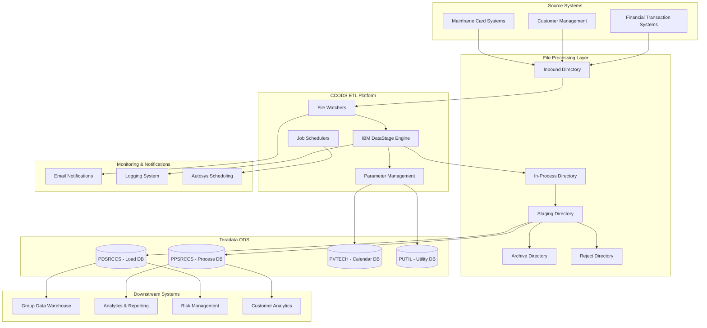

## Job Orchestration and Flow

### Daily Processing Cycle Overview

```mermaid
flowchart LR
    subgraph "6:00 AM - Morning"
        A1["📁 File Arrival Window Opens"]
        A2["👁️ File Watchers Start Monitoring"] 
        A3["📊 BCFINSG Files Expected"]
        A4["💳 BCMASTER Files Expected"]
    end
    
    subgraph "8:00 AM - Mid-Morning"
        B1["🚀 Primary Loads Start"]
        B2["📊 BCFINSG Stream Initiated"]
        B3["💳 BCMASTER Stream Initiated"]
        B4["📋 SEG01-04 Streams Triggered"]
        B5["✅ File Validation & Processing"]
    end
    
    subgraph "10:00 AM - Late Morning"
        C1["🔗 Auxiliary Processing"]
        C2["🏥 AHL Streams Wait for Dependencies"]
        C3["📑 SEG51-54 Auxiliary Segments"]
        C4["⚠️ Error Handling for Missing Files"]
        C5["🔄 Retry Mechanisms Activated"]
    end
    
    subgraph "2:00 PM - Afternoon"
        D1["⬇️ Downstream Triggers"]
        D2["🏢 GDW Extract Jobs Start"]
        D3["📈 Analytics Processing Begins"]
        D4["📦 Archive & Cleanup Operations"]
        D5["📧 Success/Failure Notifications"]
    end
    
    subgraph "6:00 PM - Evening"
        E1["🔍 End of Day"]
        E2["📊 Final Reconciliation"]
        E3["📋 Report Generation"]
        E4["🔄 Next Day Setup"]
        E5["🔧 Job Reset for Next Cycle"]
    end
    
    A1 --> A2 --> A3 --> A4
    A4 --> B1 --> B2 --> B3 --> B4 --> B5
    B5 --> C1 --> C2 --> C3 --> C4 --> C5
    C5 --> D1 --> D2 --> D3 --> D4 --> D5
    D5 --> E1 --> E2 --> E3 --> E4 --> E5
    
    classDef morning fill:#ff9800,stroke:#e65100,stroke-width:3px,color:#000000,font-weight:bold,font-size:12px
    classDef midMorning fill:#4caf50,stroke:#2e7d32,stroke-width:3px,color:#ffffff,font-weight:bold,font-size:12px
    classDef lateMorning fill:#2196f3,stroke:#1565c0,stroke-width:3px,color:#ffffff,font-weight:bold,font-size:12px
    classDef afternoon fill:#9c27b0,stroke:#6a1b9a,stroke-width:3px,color:#ffffff,font-weight:bold,font-size:12px
    classDef evening fill:#e91e63,stroke:#ad1457,stroke-width:3px,color:#ffffff,font-weight:bold,font-size:12px
    
    class A1,A2,A3,A4 morning
    class B1,B2,B3,B4,B5 midMorning
    class C1,C2,C3,C4,C5 lateMorning
    class D1,D2,D3,D4,D5 afternoon
    class E1,E2,E3,E4,E5 evening
```

### Detailed Daily Processing Flow

```mermaid
graph TB
    subgraph "Daily Processing Cycle - CCODS Job Orchestration"
        
        subgraph "6:00 AM - File Arrival Window"
            FA1[Source Systems Send Files]
            FA2[File Watchers Start Monitoring]
            FA3[BCFINSG Files Expected]
            FA4[BCMASTER Files Expected]
            FA5[AHL Files Expected]
        end
        
        subgraph "File Detection & Validation"
            FW1[file_watcher_ccods.sh]
            FW2[file_watcher_ccods_1_ctl.sh]
            FW3[ahl_file_watcher_ccods_ctl.sh]
            VAL[File Format Validation]
            TIMEOUT[Timeout Alert System]
        end
        
        subgraph "8:00 AM - Autosys Job Triggering"
            AS1[sendevent -E SET_GLOBAL file_arrived=Y]
            AS2[autorep -j job_mask dependency check]
            AS3[sendevent -E FORCE_STARTJOB]
            AS4[Job Dependency Resolution]
        end
        
        subgraph "DataStage ETL Execution"
            IJ[initiate_job stream_name sequence_name]
            PROF[Load .cnf Profile & CCODS.param]
            CRYPT[Decrypt CCODS.crypt Passwords]
            DS[DataStage Sequence Execution]
        end
        
        subgraph "Primary Stream Processing"
            BCFINSG[BCFINSG → PLAN_BALN_SEGM_MSTR]
            BCMASTER[BCMASTER → CAHD_MST1]
            SEG01[SEG01 → CAHD_MSTR_AUX_1]
            SEG02[SEG02 → CAHD_MSTR_AUX_2]
        end
        
        subgraph "10:00 AM - Auxiliary Stream Dependencies"
            DEP_CHECK[ahl_ext_dependancy.sh]
            UTIL_CHECK[Check UTIL_PROS_ISAC Table]
            AHL_TRIGGER[Trigger AHL Streams]
        end
        
        subgraph "Error Handling & Recovery"
            ERR_LOG[Log to UTIL_TRSF_EROR_RQM3]
            EMAIL_ALERT[Send Failure Notifications]
            RESET[reset_autosys_jobs.sh]
            HOLD[sendevent -E JOB_ON_HOLD]
        end
        
        subgraph "2:00 PM - Downstream Processing"
            ARCHIVE[Archive Source Files]
            GDW_TRIGGER[Trigger GDW Extracts]
            ANALYTICS[Analytics Processing]
            CLEANUP[Cleanup Operations]
        end
        
        subgraph "6:00 PM - End of Day"
            RECONCILE[Final Reconciliation]
            REPORTS[Generate Reports]
            NEXT_SETUP[Next Day Setup]
            CATCHUP[Catchup.sh for Failures]
        end
    end
    
    %% Flow connections
    FA1 --> FW1
    FA3 --> FW1
    FA4 --> FW2
    FA5 --> FW3
    
    FW1 --> VAL
    FW2 --> VAL
    FW3 --> VAL
    VAL --> AS1
    VAL --> TIMEOUT
    
    AS1 --> AS2
    AS2 --> AS3
    AS3 --> AS4
    AS4 --> IJ
    
    IJ --> PROF
    PROF --> CRYPT
    CRYPT --> DS
    
    DS --> BCFINSG
    DS --> BCMASTER
    DS --> SEG01
    DS --> SEG02
    
    BCFINSG --> DEP_CHECK
    BCMASTER --> DEP_CHECK
    DEP_CHECK --> UTIL_CHECK
    UTIL_CHECK --> AHL_TRIGGER
    
    DS --> ERR_LOG
    ERR_LOG --> EMAIL_ALERT
    EMAIL_ALERT --> RESET
    RESET --> HOLD
    
    BCFINSG --> ARCHIVE
    BCMASTER --> ARCHIVE
    ARCHIVE --> GDW_TRIGGER
    GDW_TRIGGER --> ANALYTICS
    ANALYTICS --> CLEANUP
    
    CLEANUP --> RECONCILE
    RECONCILE --> REPORTS
    REPORTS --> NEXT_SETUP
    ERR_LOG --> CATCHUP
    
    %% Styling
    classDef fileWatcher fill:#0277bd,stroke:#01579b,stroke-width:3px,color:#ffffff,font-weight:bold,font-size:11px
    classDef autosys fill:#ff8f00,stroke:#e65100,stroke-width:3px,color:#000000,font-weight:bold,font-size:11px
    classDef datastage fill:#7b1fa2,stroke:#4a148c,stroke-width:3px,color:#ffffff,font-weight:bold,font-size:11px
    classDef database fill:#388e3c,stroke:#2e7d32,stroke-width:3px,color:#ffffff,font-weight:bold,font-size:11px
    classDef error fill:#d32f2f,stroke:#b71c1c,stroke-width:3px,color:#ffffff,font-weight:bold,font-size:11px
    classDef success fill:#00796b,stroke:#004d40,stroke-width:3px,color:#ffffff,font-weight:bold,font-size:11px
    
    class FW1,FW2,FW3,VAL fileWatcher
    class AS1,AS2,AS3,AS4,RESET,HOLD autosys
    class IJ,PROF,CRYPT,DS datastage
    class BCFINSG,BCMASTER,SEG01,SEG02 database
    class ERR_LOG,EMAIL_ALERT,TIMEOUT error
    class ARCHIVE,GDW_TRIGGER,ANALYTICS,CLEANUP success
```

### Autosys Job Orchestration Flow

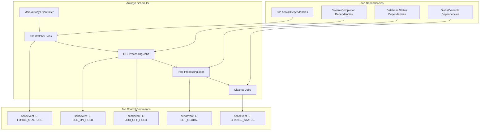

### Detailed Job Triggering Mechanism

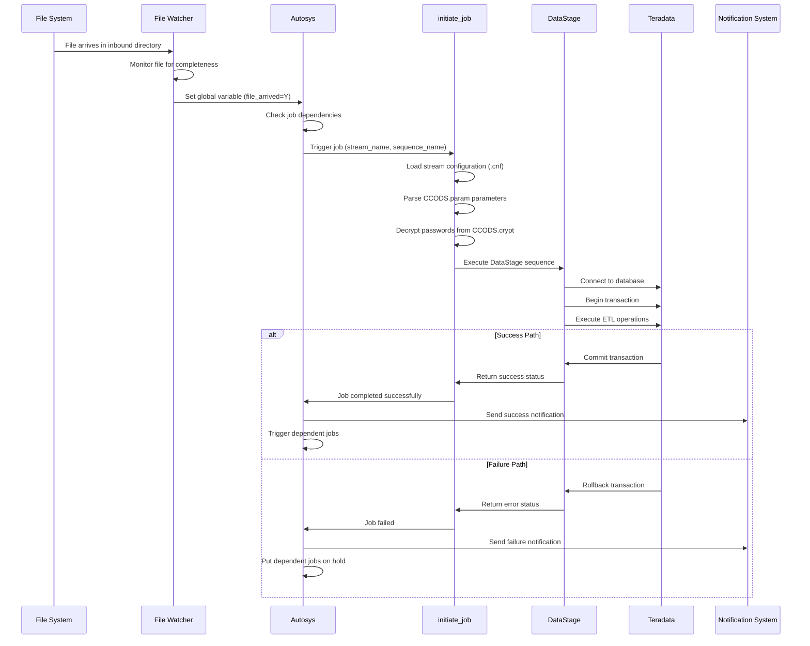

### Stream Processing Dependencies

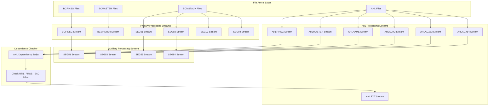

### File Watcher Triggering Logic

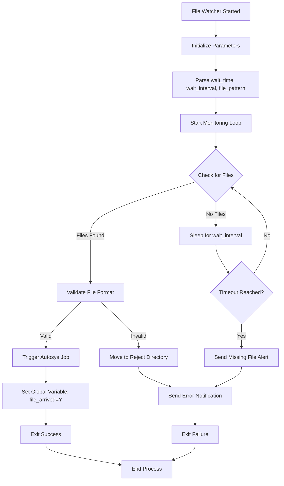

### Job Reset and Recovery Flow

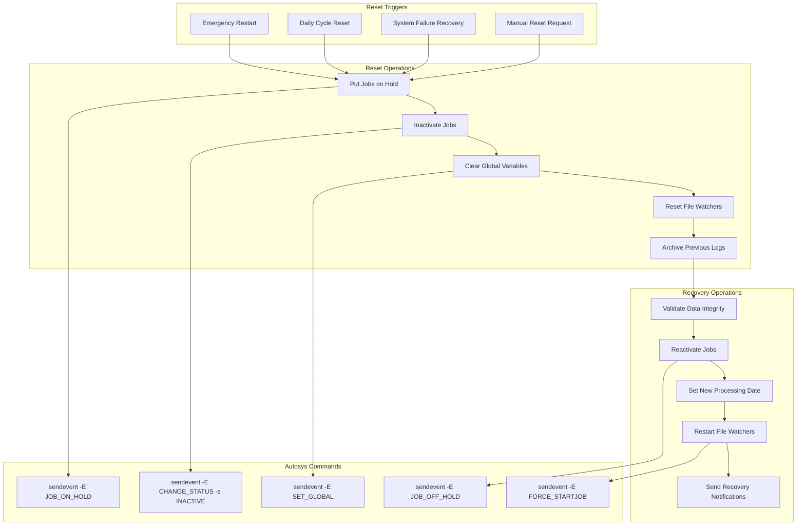

### Stream-Specific Job Execution Patterns

```mermaid
graph LR
    subgraph "BCFINSG Stream Jobs"
        BF_START[File Watcher: BCFINSG_C*]
        BF_ETL[DataStage: BCFINSG Load]
        BF_VALIDATE[Validate: PLAN_BALN_SEGM_MSTR]
        BF_ARCHIVE[Archive Source Files]
        BF_NOTIFY[Success Notification]
    end
    
    subgraph "BCMASTER Stream Jobs"
        BM_START[File Watcher: BCMASTER_C*]
        BM_ETL[DataStage: BCMASTER Load]
        BM_VALIDATE[Validate: CAHD_MST1]
        BM_ARCHIVE_TBL[Archive to CAHD_MST1_ARCH]
        BM_NOTIFY[Success Notification]
    end
    
    subgraph "SEG Stream Jobs"
        SEG_START[File Watcher: BCMSTAUX_SEG*]
        SEG_ETL[DataStage: SEG Load]
        SEG_VALIDATE[Validate: CAHD_MSTR_AUX_*]
        SEG_ERROR[Log to UTIL_TRSF_EROR_RQM3]
        SEG_NOTIFY[Business Notification]
    end
    
    subgraph "AHL Stream Jobs"
        AHL_DEP[Dependency Check]
        AHL_START[File Watcher: AHL Files]
        AHL_ETL[DataStage: AHL Load]
        AHL_VALIDATE[Validate: AHL Tables]
        AHL_NOTIFY[Analytics Team Notification]
    end
    
    BF_START --> BF_ETL --> BF_VALIDATE --> BF_ARCHIVE --> BF_NOTIFY
    BM_START --> BM_ETL --> BM_VALIDATE --> BM_ARCHIVE_TBL --> BM_NOTIFY
    SEG_START --> SEG_ETL --> SEG_VALIDATE --> SEG_ERROR --> SEG_NOTIFY
    AHL_DEP --> AHL_START --> AHL_ETL --> AHL_VALIDATE --> AHL_NOTIFY
```

### Error Handling and Recovery Patterns

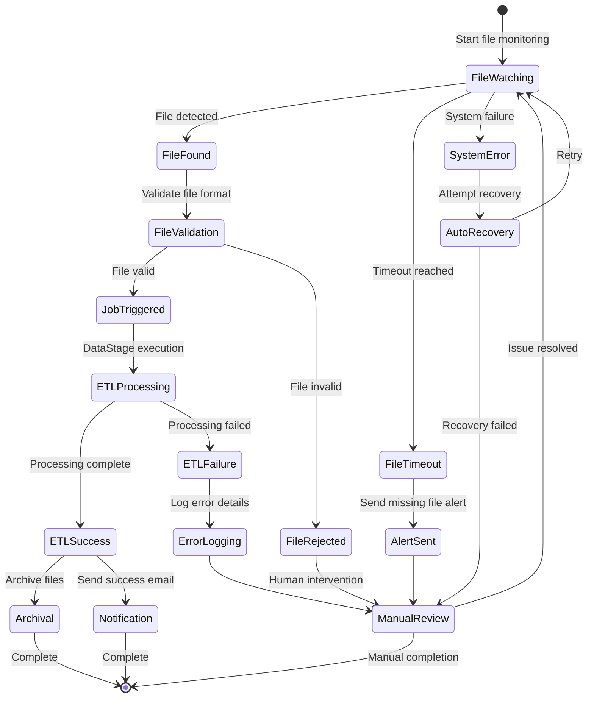

## Data Streams and Processing

### Primary Data Streams Overview

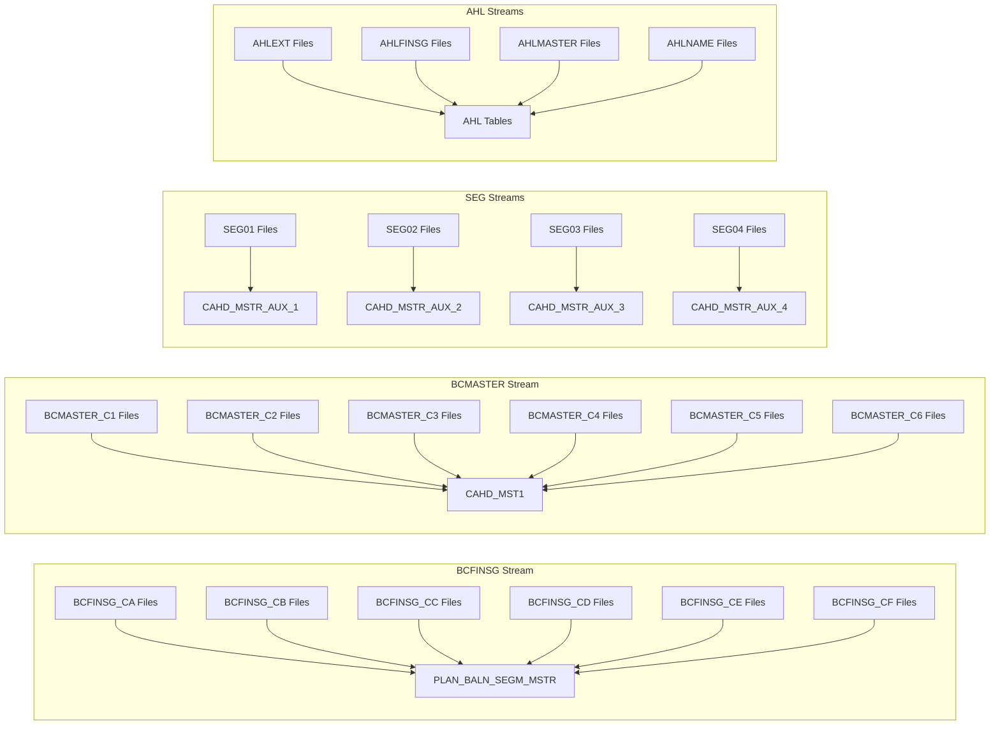

### Detailed Stream Processing

#### 1. BCFINSG Stream
- **Purpose**: Plan Balance Segment Master data processing
- **Target Table**: `PLAN_BALN_SEGM_MSTR`
- **File Pattern**: `BCFINSG_C*`
- **File Types**: BCFINSG_CA, BCFINSG_CB, BCFINSG_CC, BCFINSG_CD, BCFINSG_CE, BCFINSG_CF
- **Database User**: PUCCS001
- **Target Schema**: PDSRCCS

#### 2. BCMASTER Stream
- **Purpose**: Card Master data processing
- **Target Table**: `CAHD_MST1`
- **File Pattern**: `BCMASTER_C*`
- **File Types**: BCMASTER_C1, BCMASTER_C2, BCMASTER_C3, BCMASTER_C4, BCMASTER_C5, BCMASTER_C6
- **Database User**: PUCCS003
- **Archive Support**: `CAHD_MST1_ARCH`

#### 3. SEG Streams (SEG01-SEG04, SEG51-SEG54)
- **Purpose**: Auxiliary master data segments
- **Target Tables**: `CAHD_MSTR_AUX_1`, `CAHD_MSTR_AUX_2`, `CAHD_MSTR_AUX_3`
- **File Patterns**: Various `BCMSTAUX_SEG*` patterns
- **Database Users**: PUCCS004, PUCCS005, PUCCS006
- **Error Handling**: `UTIL_TRSF_EROR_RQM3` error table

#### 4. AHL Streams
- **Purpose**: Auxiliary Health and Lending data
- **Components**: AHLAUX2-4, AHLAUX51-54, AHLEXT, AHLFINSG, AHLMASTER, AHLNAME
- **Processing**: Specialized file watchers and dependency management

## Technical Infrastructure

### Database Schema Architecture

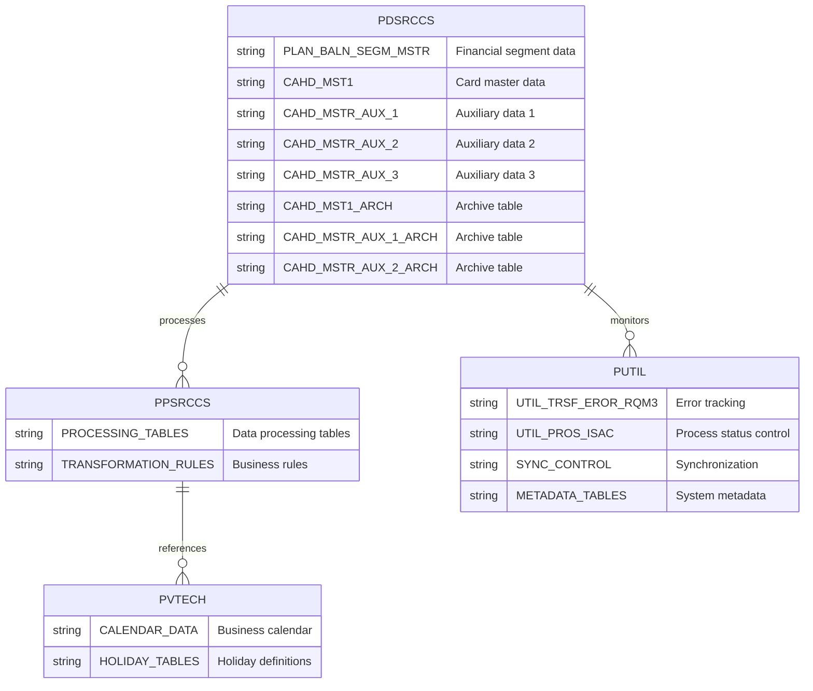

### File Processing Workflow

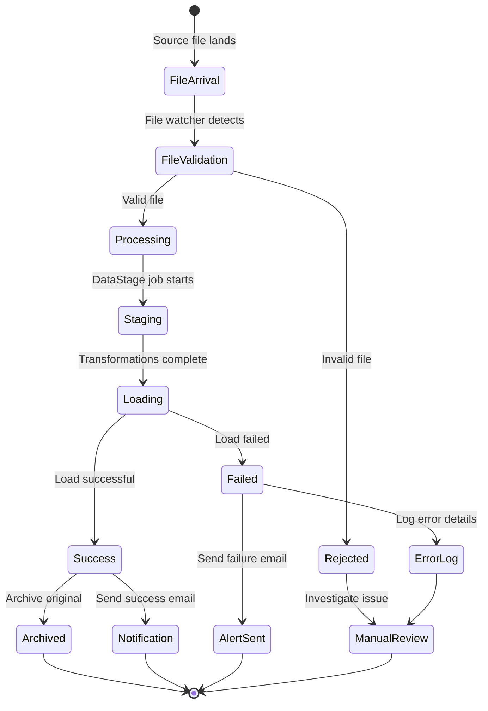

### Database Connectivity
```
Primary ODS Server: teradata.gdw.cba
- Load Database: PDSRCCS (Primary Data Source Credit Card System)
- Process Database: PPSRCCS (Primary Process Credit Card System)  
- Calendar Database: PVTECH (Technical/Calendar data)
- Utility Database: PUTIL (Synchronization and utilities)
```

### File Processing Architecture
```
Directory Structure:
├── inbound/          # Incoming data files
├── inprocess/        # Files being processed
├── outbound/         # Processed output files
├── archive/          # Archived files (inbound/outbound)
├── staging/          # Temporary staging area
├── reject/           # Rejected/error files
├── log/              # System logs
├── scripts/          # Execution scripts
└── temp/             # Temporary processing files
```

### Performance Configuration
- **Teradata Sessions**: 1-4 concurrent sessions per player
- **Sync Timeout**: 10,800 seconds (3 hours) for long-running operations
- **Buffer Configuration**: 64K buffers enabled for optimal performance
- **Parallel Processing**: 4-node APT configuration

## Operational Processes

### File Monitoring and Processing

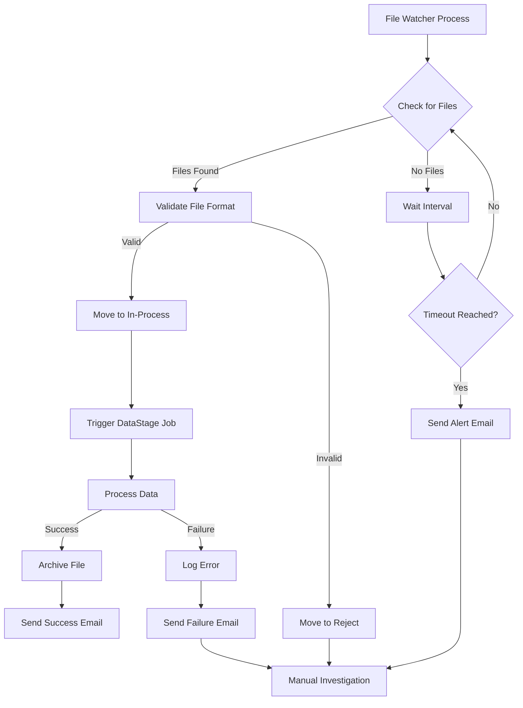

1. **File Watchers**
   - Configurable wait times and intervals
   - Automatic email notifications for missing files
   - Support for dated file patterns with control files

2. **Stream Processing**
   - Date-driven processing with `STREAM_ETL_DATE`
   - Stream-specific configuration files (`.cnf`)
   - Parameter-driven job execution

3. **Error Handling**
   - Comprehensive logging framework
   - Email notifications to business stakeholders
   - Error tracking in dedicated utility tables

### Data Archival and Retention

- **Archive Retention**: 2-day retention for inbound/outbound archives
- **Log Retention**: 3-day retention for system logs
- **In-Process Retention**: 1-day retention for processing files
- **Historical Data**: Archive tables with configurable intervals

## Notification and Monitoring

### Notification Flow

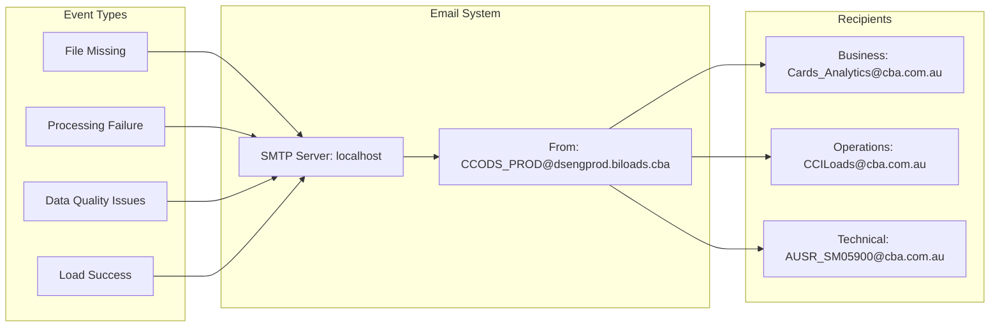

### Email Configuration
- **SMTP Server**: localhost
- **Sending Address**: CCODS_PROD@dsengprod.biloads.cba
- **Business Recipients**: Cards_Analytics@cba.com.au, CCILoads@cba.com.au
- **Technical Recipients**: AUSR_SM05900@cba.com.au

### Stakeholder Notifications
- File arrival delays
- Processing failures
- Load completion reports
- Data quality issues

## Integration Points

### System Integration Map

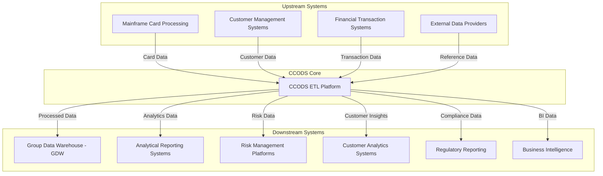

## Development and Deployment

### Environment Structure
- **Project**: CCODS_PROD
- **Application Directory**: `/cba_app/CCODS/PROD`
- **DataStage Project**: IBM InfoSphere DataStage environment
- **Configuration Management**: Parameter files with environment-specific settings

### Key Scripts and Utilities
- `initiate_job`: Main job execution framework
- `file_watcher_*`: File monitoring utilities
- `UtilPros_*.sh`: Utility processing management
- `reset_jobs`: Job reset and cleanup utilities
- `ccods_publ_hldy_gen.ksh`: Holiday calendar generation

## Security and Access Control

### Security Architecture

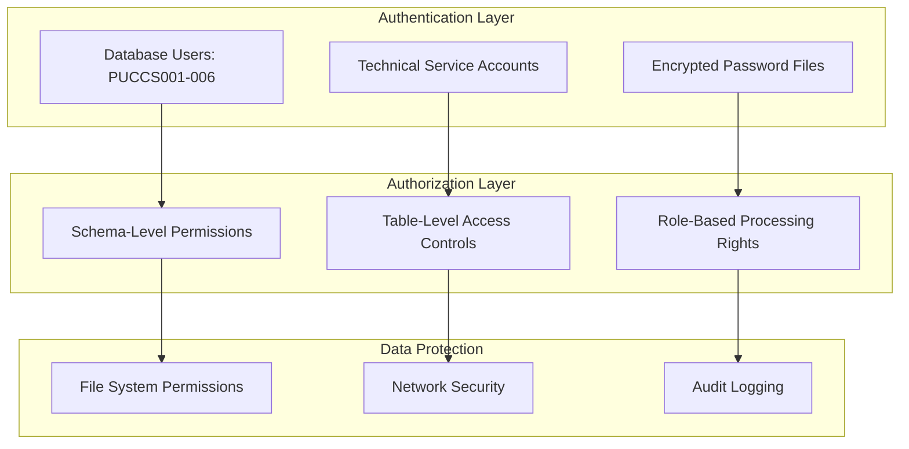

### Database Security
- Role-based access with specific technical users
- Password management through encrypted parameter files
- Separate users for different processing streams

### File System Security
- Controlled access to processing directories
- Secure transfer mechanisms
- Audit trails for all data movement

## Business Impact

CCODS serves as a critical component in CBA's data infrastructure, enabling:

- **Real-time Credit Card Operations**: Processing card transactions and customer data
- **Risk Management**: Providing timely data for credit risk assessment
- **Customer Analytics**: Supporting customer segmentation and behavior analysis
- **Regulatory Reporting**: Ensuring compliance with banking regulations
- **Business Intelligence**: Feeding analytical systems with clean, processed data

## Migration Considerations

### Current State vs Future State

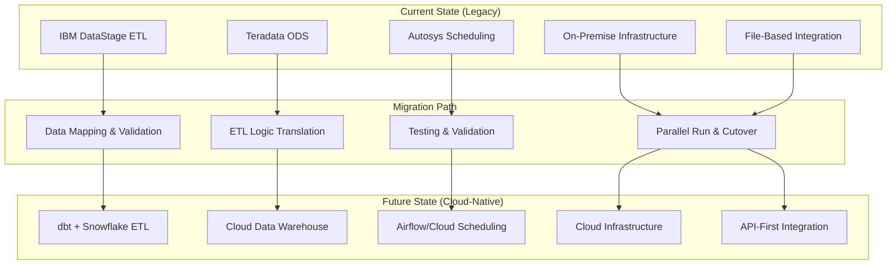

As part of the GDW1 migration to cloud-native architecture:

1. **ETL Modernization**: Transition from DataStage to modern cloud ETL tools (dbt, Snowflake)
2. **Database Migration**: Move from Teradata to cloud data warehouse
3. **Orchestration**: Replace Autosys with cloud-native scheduling
4. **Monitoring**: Implement modern observability and alerting
5. **Security**: Adopt cloud security best practices and identity management

---

## 🔗 Detailed Job Analysis

For comprehensive analysis of individual DataStage jobs within the BCFINSG stream, see:

### **📋 BCFINSG Job-Specific Documentation**
**[BCFINSG Job Analysis](BCFINSG/job_specific_detailed/)** - Detailed current state analysis for all 12 DataStage jobs including:
- SQ10COMMONPreprocess, RunStreamStart (Initialization)  
- SQ20BCFINSGValidateFiles, ValidateBcFinsg (Validation)
- SQ40BCFINSGXfmPlanBalnSegmMstr, XfmPlanBalnSegmMstrFromBCFINSG (Transformation)
- SQ60BCFINSGLdPlnBalSegMstr, LdBCFINSGPlanBalnSegmMstr (Loading)
- GDWUtilProcessMetaDataFL, SQ70COMMONLdErr, CCODSLdErr (Utilities & Error Handling)
- SQ80COMMONAHLPostprocess (Post-processing)

### **📊 Technical Analysis**
- **[CCODS DataStage Analysis](CCODS_DataStage_Analysis.md)** - Technical ETL pipeline analysis with data flow architecture

### **🎯 Migration Documentation**  
- **Target State Design**: See `../target_state/` folder for modernization approach using dbt + Snowflake + DCF framework

---

*This documentation represents the legacy CCODS system architecture and will be updated as migration to modern cloud-native solutions progresses.*