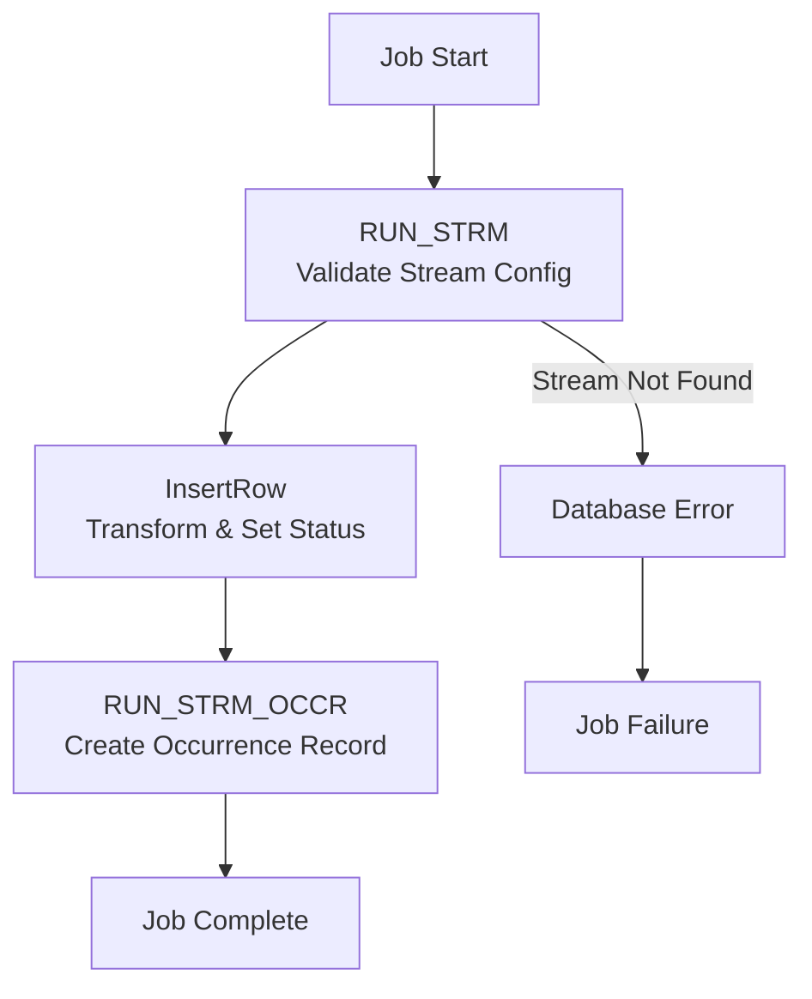

# RunStreamStart - DataStage Job Analysis

## Overview

`RunStreamStart` is a **critical server job** in the CCODS ETL pipeline that manages **stream occurrence tracking**. It creates an audit record in the `RUN_STRM_OCCR` table to track the execution of each stream processing instance, providing essential monitoring and process control capabilities.

**Job Type**: DataStage Server Job  
**Version**: 56.0.0  
**Last Modified**: 2020-04-21 16:13:48  
**Category**: \_COMMON\10 Preprocess  

## Business Purpose

This job implements the **"stream occurrence tracking and auditing"** pattern:

1. **Stream Validation**: Verifies the stream exists and is configured properly in control database
2. **Occurrence Creation**: Creates a unique tracking record for this specific stream execution instance
3. **Status Management**: Initializes the process status as 'R' (Running) for downstream monitoring
4. **Audit Trail**: Provides comprehensive execution tracking for monitoring, troubleshooting, and restart capabilities
5. **Execution Context**: Establishes the foundational record that subsequent jobs will reference and update

## Execution Flow

### **Key Actions**
- **Validate Stream**: Confirm stream exists in `RUN_STRM` control table before creating occurrence
- **Create Occurrence**: Insert tracking record in `RUN_STRM_OCCR` with unique execution details
- **Set Running Status**: Mark status as 'R' to indicate stream processing has begun
- **Capture Timestamps**: Record start time for performance monitoring and audit purposes
- **Enable Tracking**: Establish foundation for downstream jobs to update occurrence status

### **Step Flow**



### **Step Details**

**1. RUN_STRM Source - Validate Stream Configuration**
- **Database**: Oracle Control Database (`GRIDDEV`)
- **Action**: `SELECT` from `RUN_STRM` table
- **Purpose**: Validates that the stream code exists and retrieves processing date configuration
- **Table Read**: `RUN_STRM` (stream configuration master table)
- **SQL Operation**: 
  ```sql
  SELECT RUN_STRM_C, TO_CHAR(RUN_STRM_PROS_D, 'YYYY-MM-DD HH24:MI:SS') 
  FROM RUN_STRM WHERE RUN_STRM_C = 'BCFINSG'
  ```
- **Why**: Prevents invalid streams from creating occurrence records and ensures processing date alignment

**2. InsertRow Transform - Set Occurrence Details**
- **Database**: DataStage Engine (in-memory transformation)
- **Action**: Field mapping and status assignment (no database I/O)
- **Purpose**: Transforms stream config data and sets execution context for occurrence record
- **Key Transformations**:
  - Status set to `'R'` (Running)
  - Start timestamp captured from job execution context
  - Batch ID inherited from SQ10COMMONPreprocess parameter
- **Why**: Establishes the execution state and audit context before persisting to tracking table

**3. RUN_STRM_OCCR Target - Create Occurrence Record**
- **Database**: Oracle Control Database (`GRIDDEV`)
- **Action**: `INSERT` into `RUN_STRM_OCCR` table
- **Purpose**: Creates the official tracking record for this stream execution instance
- **Data Written**: Stream code, processing date, status='R', start timestamp, batch ID
- **Why**: Provides the foundational record that all downstream jobs will reference and update throughout the stream lifecycle

### **Table Roles Explained**

**`RUN_STRM` (Oracle Control Database)**
- **Role**: Stream configuration master table
- **Purpose**: Defines all available streams, their processing schedules, and system mappings
- **Key Fields**: Stream code, system code, processing date, target configurations, business rules
- **Usage**: Stream validation, processing date determination, system routing for batch ID generation

**`RUN_STRM_OCCR` (Oracle Control Database)**  
- **Role**: Stream execution occurrence tracking table
- **Purpose**: Tracks individual stream execution instances with lifecycle status management
- **Key Fields**: Stream code, processing date, status codes ('R'=Running, 'C'=Complete, 'E'=Error), start/end timestamps, batch ID
- **Usage**: Real-time monitoring, restart logic, performance analysis, downstream job coordination

### **Critical Completion Context**

**Important Note**: The completion of `RunStreamStart` marks only the **initialization of stream occurrence tracking**, NOT the completion of actual data processing. The 'R' (Running) status indicates that:
- Stream execution context has been established
- Downstream jobs can now reference this occurrence record
- Actual data processing (validation, transformation, loading) happens in subsequent jobs
- Status will be updated to 'C' (Complete) or 'E' (Error) by later jobs in the stream

## Parameters

### **Required Parameters**
| Parameter | Type | Description | Example |
|-----------|------|-------------|---------|
| `pRUN_STRM_C` | String | Stream code identifier | `BCFINSG` |
| `pRUN_STRM_PROS_D` | String | Processing date (YYYYMMDD) | `20241201` |
| `pODS_BTCH_ID` | Integer | ODS Batch identifier | `12345` |

### **Database Connection Parameters**
| Parameter | Default | Description |
|-----------|---------|-------------|
| `pCTL_DATABASE` | `GRIDDEV` | Control database name |
| `pCTL_USER` | `CCODS_CTL_UAT_OWNER` | Database username |
| `pCTL_PASSWD` | (Encrypted) | Database password |

## Data Model

### **Source Table: RUN_STRM**
```sql
RUN_STRM_C           VARCHAR(20)    -- Stream code
RUN_STRM_PROS_D      DATE          -- Processing date
```

### **Target Table: RUN_STRM_OCCR**
```sql
CREATE TABLE RUN_STRM_OCCR (
    RUN_STRM_C           VARCHAR(20) NOT NULL,  -- Stream code
    RUN_STRM_PROS_D      DATE NOT NULL,         -- Processing date
    RUN_STRM_STUS_C      VARCHAR(1),            -- Status code ('R'=Running, 'C'=Complete, 'E'=Error)
    RUN_STRM_OCCR_STRT_S TIMESTAMP NOT NULL,    -- Start timestamp
    RUN_STRM_OCCR_END_S  TIMESTAMP,             -- End timestamp (nullable)
    ODS_BTCH_ID          NUMBER NOT NULL        -- Batch identifier
);
```

## Business Logic

### **Process Flow**
1. **Stream Lookup**: Query `RUN_STRM` table to validate stream exists and get processing date
2. **Occurrence Creation**: Insert new record into `RUN_STRM_OCCR` with:
   - Stream code from parameter
   - Processing date from lookup
   - Status = 'R' (Running)
   - Start time = current job start timestamp
   - End time = NULL (to be updated later)
   - Batch ID from parameter

### **Status Management**
- **'R' (Running)**: Initial status when stream starts
- **'C' (Complete)**: Updated by subsequent jobs when stream completes successfully
- **'E' (Error)**: Updated by error handling jobs when stream fails

### **Error Handling**
- **Warning Checks**: Stage variable `svWarningFlag` monitors for issues
- **Stream Validation**: If stream code not found in `RUN_STRM`, job fails
- **Duplicate Prevention**: Primary key constraints prevent duplicate occurrence records

## Integration Points

### **Upstream Dependencies**
- `SQ10COMMONPreprocess` - Calls this job as part of stream initialization
- `RUN_STRM` table - Must contain valid stream configuration

### **Downstream Impact**
- Subsequent jobs check `RUN_STRM_OCCR` table for process status
- Monitoring systems use this table for stream tracking
- Error handling jobs update the occurrence record status

## Core Business Logic Analysis

### **Stream Occurrence Lifecycle**
```sql
-- Step 1: Validate Stream Exists
SELECT RUN_STRM_C, TO_CHAR(RUN_STRM_PROS_D, 'YYYY-MM-DD HH24:MI:SS')
FROM RUN_STRM 
WHERE RUN_STRM_C = 'BCFINSG';

-- Step 2: Create Occurrence Record  
INSERT INTO RUN_STRM_OCCR (
    RUN_STRM_C,           -- Stream code from parameter
    RUN_STRM_PROS_D,      -- Processing date from RUN_STRM lookup
    RUN_STRM_STUS_C,      -- 'R' = Running (initial status)
    RUN_STRM_OCCR_STRT_S, -- Current job start timestamp
    RUN_STRM_OCCR_END_S,  -- NULL (updated by downstream jobs)
    ODS_BTCH_ID           -- Batch ID from SQ10COMMONPreprocess
);
```

### **Status Management Pattern**
| **Status Code** | **Meaning** | **Set By** | **When** |
|-----------------|-------------|------------|----------|
| `'R'` | Running | `RunStreamStart` | Stream initialization |
| `'C'` | Complete | Downstream jobs | Stream completion |
| `'E'` | Error | Error handlers | Stream failure |
| `'A'` | Aborted | Exception handlers | Manual termination |

### **Integration with SQ10COMMONPreprocess**
- **Dependency**: Requires `pODS_BTCH_ID` from SQ10COMMONPreprocess
- **Sequence**: Called immediately after SQ10 completes successfully
- **Context**: Uses same stream code and processing date established by SQ10
- **Purpose**: Extends SQ10's initialization by creating execution occurrence tracking

## Dependencies

### **Tables**
- `RUN_STRM` (source) - Stream configuration
- `RUN_STRM_OCCR` (target) - Occurrence tracking

### **Called By**
- `SQ10COMMONPreprocess` - Main preprocessing sequence
- Other stream initialization jobs

### **Database Objects**
- Oracle 12c connector
- Control database connection

## Performance Characteristics

### **Execution Time**
- **Typical Duration**: 30 seconds - 2 minutes
- **Peak Duration**: 3-5 minutes (during database contention)
- **Critical Path**: Oracle database operations (source query + target insert)

### **Resource Usage**
- **Memory**: Minimal (single-row operations)
- **CPU**: Low (simple field transformations)
- **I/O**: Low (2 database operations total)
- **Network**: Low (small data volume, single transaction)

### **Bottlenecks**
1. **Oracle Database Performance**: Control database response time and connectivity
2. **Table Lock Contention**: Concurrent access to `RUN_STRM_OCCR` table
3. **Network Latency**: DataStage server to Oracle database connection

## Monitoring and Alerting

### **Success Validation**
```sql
-- Check successful occurrence creation
SELECT * FROM RUN_STRM_OCCR
WHERE RUN_STRM_C = 'BCFINSG'
  AND RUN_STRM_PROS_D = '2024-12-20'
  AND RUN_STRM_STUS_C = 'R'
  AND RUN_STRM_OCCR_STRT_S IS NOT NULL;
```

### **Failure Detection**
```sql
-- Check for missing or failed occurrence records
SELECT COUNT(*) as missing_records
FROM RUN_STRM rs
LEFT JOIN RUN_STRM_OCCR rso ON rs.RUN_STRM_C = rso.RUN_STRM_C
  AND rs.RUN_STRM_PROS_D = rso.RUN_STRM_PROS_D
WHERE rs.RUN_STRM_C = 'BCFINSG'
  AND rso.RUN_STRM_C IS NULL;
```

