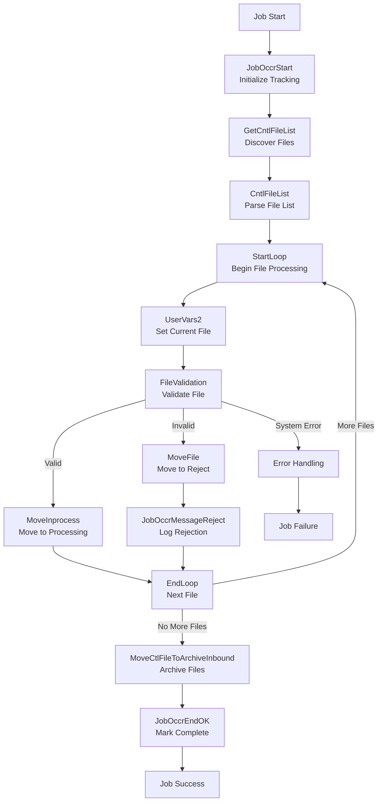

# SQ20BCFINSGValidateFiles - DataStage Job Analysis

## Overview

`SQ20BCFINSGValidateFiles` is a **file validation sequence job** in the CCODS ETL pipeline that validates BCFINSG files before processing. It implements a robust file validation framework with comprehensive error handling, file movement between directories, and process tracking.

**Job Type**: DataStage Sequence Job  
**Version**: 56.0.0  
**Last Modified**: 2020-04-21 15:55:48  
**Category**: \\Jobs\\CCODS\\20 Validate Files  

## Business Purpose

This job implements the **"file validation and staging"** pattern:

1. **File Discovery**: Scans inbound directory for BCFINSG files
2. **File Validation**: Validates each file format and content
3. **File Staging**: Moves valid files to inprocess directory
4. **Error Handling**: Moves invalid files to reject directory
5. **Process Tracking**: Maintains audit trail of validation activities
6. **Notification**: Alerts on validation failures

## Execution Flow

### **Key Actions**
- **Initialize Tracking**: Create job occurrence record for process monitoring and audit
- **Discover Files**: Scan inbound directory for BCFINSG control files matching naming pattern
- **Process Each File**: Loop through discovered files with individual validation
- **Validate Files**: Execute detailed validation logic for each file
- **Move Valid Files**: Transfer successfully validated files to inprocess directory
- **Reject Invalid Files**: Move failed files to reject directory with error logging
- **Archive Processed**: Move control files to archive for audit trail
- **Complete Process**: Update tracking record with success status and metrics

### **Step Flow**



### **Step Details**

**1. JobOccrStart - Initialize Tracking**
- **Database**: Oracle Control Database (`GRIDDEV`)
- **Action**: `INSERT` into `UTIL_PROS_ISAC` table
- **Purpose**: Creates tracking record for file validation process with start timestamp
- **Data Written**: Stream ID, process date, job name, start time, initial status
- **Why**: Establishes audit trail and enables monitoring of file validation process

**2. GetCntlFileList - Discover Files**
- **Database**: File System (inbound directory)
- **Action**: `ls -m BCFINSG_C*_date.DLY` command execution
- **Purpose**: Scans inbound directory for BCFINSG control files matching naming pattern
- **File Pattern**: `BCFINSG_C*_YYYYMMDD.DLY` (e.g., BCFINSG_C001_20241201.DLY)
- **Why**: Dynamically discovers files available for processing without hardcoding filenames

**3. CntlFileList - Parse File List**
- **Database**: DataStage Engine (in-memory processing)
- **Action**: String parsing of file list from `ls` command output
- **Purpose**: Converts comma-separated file list into individual file entries for loop processing
- **Data Processed**: Raw file list string → individual file names for iteration
- **Why**: Prepares file collection for loop-based individual file processing

**4. StartLoop / UserVars2 - Set Current File**
- **Database**: DataStage Engine (in-memory loop variable)
- **Action**: Variable assignment `ControlFileName = CurrentFileFromLoop`
- **Purpose**: Sets current file context for validation and movement operations
- **Loop Control**: Iterates through each discovered file sequentially
- **Why**: Enables file-by-file processing with proper variable scoping

**5. FileValidation - Validate Individual File**
- **Database**: File System + DataStage Engine
- **Action**: Executes `ValidateBcFinsg` job with current file parameters
- **Purpose**: Performs comprehensive file validation including date checks and format validation
- **Validation Logic**: Processing date validation, file format checks, business rule validation
- **Why**: Ensures only valid files proceed to downstream processing

**6a. MoveInprocess - Move Valid Files**
- **Database**: File System (directory operations)
- **Action**: `mv ControlFileName /inprocess/` command execution
- **Purpose**: Moves successfully validated files to inprocess directory for downstream processing
- **Directory Flow**: `/inbound/` → `/inprocess/`
- **Why**: Separates validated files from raw inbound files for systematic processing

**6b. MoveFile + JobOccrMessageReject - Handle Invalid Files**
- **Database**: File System + Oracle Control Database
- **Action**: `mv ControlFileName /reject/` + error logging
- **Purpose**: Quarantines invalid files and logs detailed rejection reasons
- **Error Logging**: Captures validation failure details, file name, timestamps
- **Why**: Prevents invalid files from corrupting downstream processes and provides audit trail

**7. MoveCtlFileToArchiveInbound - Archive Processed Files**
- **Database**: File System (archive directory)
- **Action**: `mv` control files to archive directory
- **Purpose**: Preserves processed control files for audit and compliance requirements
- **Retention**: Files moved to archive for historical tracking and troubleshooting
- **Why**: Maintains complete audit trail of all processed files for regulatory compliance

**8. JobOccrEndOK - Mark Process Complete**
- **Database**: Oracle Control Database (`GRIDDEV`)
- **Action**: `UPDATE UTIL_PROS_ISAC SET PROCESS_STATUS='C', PROCESS_END_TIME=CURRENT_TIMESTAMP`
- **Purpose**: Updates tracking record with completion status, end time, and processing metrics
- **Metrics Captured**: Files processed, files validated, files rejected, total processing time
- **Why**: Completes audit trail and provides operational metrics for monitoring and reporting

### **Table Roles Explained**

**`UTIL_PROS_ISAC` (Oracle Control Database)**
- **Role**: Process execution tracking and audit trail
- **Purpose**: Monitors execution of all DataStage file validation processes
- **Key Fields**: Process ID, start/end times, status, file counts, error messages
- **Usage**: Operational monitoring, performance analysis, SLA tracking, restart logic

**File System Directories**
- **`/inbound/`**: Raw files awaiting validation (source directory)
- **`/inprocess/`**: Validated files ready for transformation (staging directory)
- **`/reject/`**: Invalid files quarantined for investigation (error directory)
- **`/archive/`**: Processed control files for audit trail (retention directory)

### **Critical Process Context**

**Important Note**: The completion of `SQ20BCFINSGValidateFiles` marks the **file validation phase**, NOT the data processing phase. Successful completion indicates:
- All discovered files have been validated
- Valid files are staged in `/inprocess/` directory for downstream processing
- Invalid files are quarantined with detailed error logging
- Complete audit trail is maintained for compliance and troubleshooting
- Downstream transformation jobs can proceed with confidence in file validity

## Architecture

### **High-Level Flow**
```
JobOccrStart → GetCntlFileList → StartLoop → [For Each File] → 
  UserVars2 → FileValidation → MoveInprocess → EndLoop → 
  MoveCtlFileToArchiveInbound → JobOccrEndOK
```

### **Error Flow**
```
Any Failure → ExceptionHandler → JobOccrEndNOK → 
  JobOccrMessageException → Notify → Terminate
```

## Parameters

### **Core Parameters**
| Parameter | Default | Description |
|-----------|---------|-------------|
| `pRUN_STRM_C` | `BCFINSG` | Stream code identifier |
| `pRUN_STRM_PROS_D` | `20101213` | Processing date (YYYYMMDD) |
| `pFILENAME` | `BCFINSG_C*` | File pattern to validate |

### **Database Connection**
| Parameter | Default | Description |
|-----------|---------|-------------|
| `pCTL_DATABASE` | `GRIDDEV` | Control database name |
| `pCTL_USER` | `CCODS_DEV_CTL_OWNER` | Database username |
| `pCTL_PASSWD` | (Encrypted) | Database password |

### **Directory Structure**
| Parameter | Default | Description |
|-----------|---------|-------------|
| `pINBOUND` | `/cba_app/CCODS/DEV/inbound` | Incoming files directory |
| `pINPROCESS` | `/cba_app/CCODS/DEV/inprocess` | Files ready for processing |
| `pREJECT` | `/cba_app/CCODS/DEV/reject` | Invalid files directory |
| `pARCHIVE_INBOUND` | `/cba_app/CCODS/DEV/archive/inbound` | Archive directory |
| `pTEMP` | `/cba_app/CCODS/DEV/temp` | Temporary files directory |

### **Notification Parameters**
| Parameter | Default | Description |
|-----------|---------|-------------|
| `pSMTP_SERVER` | `dsdev.bi_loads.cba` | SMTP server for notifications |
| `pSEND_MAIL` | `DataStage@CCODS_DEV` | From email address |
| `pRECEIVE_MAIL` | `balaji.prabhakar@cba.com.au` | To email address |

## Detailed Process Flow

### **1. Initialization**
- **JobOccrStart**: Creates occurrence tracking record
- **GetCntlFileList**: Scans inbound directory for files matching pattern
  ```bash
  cd /cba_app/CCODS/DEV/inbound
  ls -m BCFINSG_C*_20101213.DLY
  ```

### **2. File Processing Loop**
- **CntlFileList**: Converts file list to delimited format
- **StartLoop**: Iterates through each file found
- **UserVars2**: Sets current file name in `ControlFileName` variable

### **3. File Validation (Per File)**
- **FileValidation**: Executes validation job (likely `ValidateBcFinsg`)
- **Decision Logic**: 
  - If validation succeeds → Move to inprocess
  - If validation fails → Move to reject

### **4. File Movement**
- **MoveInprocess**: Moves valid files to inprocess directory
  ```bash
  mv /inbound/{filename} /inprocess
  ```
- **MoveFile**: Moves invalid files to reject directory (on failure)
  ```bash
  mv /inbound/{filename} /reject
  ```

### **5. Completion**
- **EndLoop**: Continues until all files processed
- **MoveCtlFileToArchiveInbound**: Archives control files
  ```bash
  mv /inbound/BCFINSG*_20101213* /archive/inbound
  ```
- **JobOccrEndOK**: Updates occurrence status to 'C' (Complete)

## Error Handling

### **Exception Flow**
1. **ExceptionHandler**: Captures any activity failure
2. **JobOccrEndNOK**: Updates occurrence status to 'A' (Aborted)
3. **JobOccrMessageException**: Logs exception details
4. **Notify**: Sends email notification
5. **Terminate**: Stops sequence execution

### **Email Notification**
```
To: {pRECEIVE_MAIL}
From: {pSEND_MAIL}
Subject: DataStage job {JobName} has failed in activity {ActivityName}
Body: This is an automatically generated email from DataStage. Do not reply.
```

## Data Validation Pattern

### **File Naming Convention**
- Expected pattern: `BCFINSG_C*_{YYYYMMDD}.DLY`
- Example: `BCFINSG_C001_20241201.DLY`

### **Validation Scope**
- **File Existence**: Files present in inbound directory
- **File Format**: Correct naming convention
- **File Content**: Structure and data validation (via FileValidation job)
- **Processing Date**: Matches expected processing date

## Integration Points

### **Upstream Dependencies**
- `SQ10COMMONPreprocess` - Triggers this validation sequence
- External file delivery systems - Must place files in inbound directory

### **Downstream Dependencies**
- `SQ40BCFINSGXfmPlanBalnSegmMstr` - Processes validated files from inprocess directory
- `ValidateBcFinsg` job - Called for individual file validation

### **Database Tables**
- `UTIL_PROS_ISAC` - Process tracking and occurrence management
- Control tables for metadata and configuration

## Business Rules

### **File Processing Rules**
1. **Sequential Processing**: Files processed one at a time in loop
2. **Atomic Operations**: Each file validation is independent
3. **Fail-Fast**: Any validation failure triggers error handling
4. **Archive Policy**: All processed files archived regardless of status

### **Error Recovery**
- **Invalid Files**: Moved to reject directory for manual review
- **System Failures**: Complete job failure with notification
- **Retry Logic**: No automatic retry - manual intervention required

## Dependencies

### **Called Jobs**
- `ValidateBcFinsg` - Individual file validation (inferred)
- Various utility routines (JobOccrStart, JobOccrEnd, etc.)

### **File System**
- Inbound directory access and monitoring
- Write permissions to inprocess, reject, archive directories
- UNIX/Linux file system commands (mv, ls, cd)

### **External Systems**
- SMTP server for email notifications
- File delivery systems placing files in inbound directory