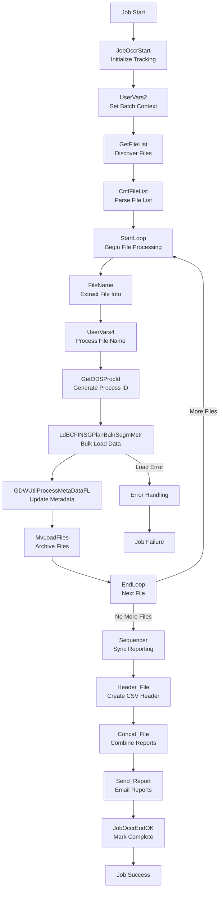

# SQ60BCFINSGLdPlnBalSegMstr - DataStage Job Analysis

## Overview

`SQ60BCFINSGLdPlnBalSegMstr` is a **file-based data loading orchestration sequence job** in the CCODS ETL pipeline that loads transformed BCFINSG delimited files into the Teradata `PLAN_BALN_SEGM_MSTR` target table. This job represents the final data loading phase with file lifecycle management, metadata processing, and basic reporting capabilities.

**Job Type**: DataStage Sequence Job  
**Version**: 56.0.0  
**Last Modified**: 2020-11-25 19:18:47  
**Category**: \\Jobs\\CCODS\\60 Load  

## Business Purpose

This job implements the **"file-based loading with process tracking"** pattern:

1. **File Discovery**: Scans for transformed delimited files ready for loading
2. **Bulk Data Loading**: Loads delimited files to Teradata target tables via parallel job
3. **Metadata Processing**: Updates process tracking and lineage metadata
4. **File Lifecycle Management**: Moves processed files through directory structure
5. **Basic Reporting**: Generates load completion reports and notifications
6. **Archive Management**: Moves files to archive directories for retention
7. **Process Control**: Tracks job execution status and error handling

## Execution Flow

### **Key Actions**
- **Initialize Tracking**: Create job occurrence record and set batch processing context
- **Discover Files**: Scan for transformed files ready for loading to target tables
- **Process Each File**: Loop through files with unique process ID generation for each
- **Bulk Load Data**: Execute high-performance bulk loads to Teradata target tables
- **Update Metadata**: Record data lineage and processing metadata for each loaded file
- **Generate Reports**: Create detailed load statistics and performance reports
- **Archive Files**: Move processed files to archive for audit and compliance
- **Send Notifications**: Email load reports to business stakeholders

### **Step Flow**



### **Step Details**

**1. JobOccrStart - Initialize Tracking**
- **Database**: Oracle Control Database (`GRIDDEV`)
- **Action**: `INSERT` into `UTIL_PROS_ISAC` table
- **Purpose**: Creates comprehensive tracking record for data loading process
- **Data Written**: Process ID, stream code, processing date, start timestamp, job context
- **Why**: Establishes audit foundation for enterprise data loading with full traceability

**2. UserVars2 - Set Batch Processing Context**
- **Database**: DataStage Engine (in-memory variables)
- **Action**: Variable assignments `SourceCode` and `BatchId` from job parameters
- **Purpose**: Establishes processing context for source system identification and batch correlation
- **Variables Set**: Source system code, ODS batch identifier, processing date context
- **Why**: Enables proper data lineage tracking and correlation across enterprise systems

**3. GetFileList - Discover Transformed Files**
- **Database**: File System (outbound directory)
- **Action**: `ls -m` command to list transformed files ready for loading
- **Purpose**: Discovers all transformed files waiting in outbound directory for target table loading
- **File Pattern**: Transformed BCFINSG files from upstream transformation jobs
- **Why**: Dynamically identifies all files requiring loading without static configuration

**4. CntlFileList - Parse File Collection**
- **Database**: DataStage Engine (in-memory parsing)
- **Action**: String parsing and tokenization of file list
- **Purpose**: Converts file list output into individual file entries for loop processing
- **Processing Logic**: Comma-separated parsing with file validation and preparation
- **Why**: Prepares structured file collection for systematic loop-based processing

**5. FileName + UserVars4 - Extract and Process File Information**
- **Database**: DataStage Engine (in-memory string processing)
- **Action**: File name parsing and trimming to extract file type and processing context
- **Purpose**: Extracts file metadata (type, date, sequence) for proper processing routing
- **Processing**: File name → File type extraction → 10-character trimming for system compatibility
- **Why**: Ensures proper file classification and system compatibility for downstream processing

**6. GetODSProcId - Generate Unique Process Identifier**
- **Database**: Teradata ODS Database (`APCCODS`)
- **Action**: Executes process ID generation routine with file-specific parameters
- **Purpose**: Creates unique process identifier for each file to enable detailed tracking
- **ID Generation**: Combines source system, file type, processing date, and sequence number
- **Why**: Enables granular tracking of individual file processing for audit and troubleshooting

**7. LdBCFINSGPlanBalnSegmMstr - Execute Bulk Data Load**
- **Database**: Teradata Target Database (`APCCODS`)
- **Action**: High-performance bulk `INSERT` operations into `PLAN_BALN_SEGM_MSTR` table
- **Purpose**: Loads transformed business data into final target table for business consumption
- **Load Strategy**: Bulk insert with Teradata optimization (MultiLoad/FastLoad patterns)
- **Why**: Delivers business data to target system with enterprise-grade performance and reliability

**8. GDWUtilProcessMetaDataFL - Update Metadata and Lineage**
- **Database**: Oracle Control Database + Teradata Metadata Tables
- **Action**: `INSERT`/`UPDATE` operations across multiple metadata and audit tables
- **Purpose**: Records complete data lineage, processing statistics, and governance metadata
- **Metadata Captured**: Record counts, processing times, source-to-target mappings, data quality metrics
- **Why**: Enables enterprise data governance, impact analysis, and regulatory compliance

**9. MvLoadFiles - Archive Processed Files**
- **Database**: File System (archive directory)
- **Action**: `mv` operations to move loaded files to archive directory
- **Purpose**: Preserves loaded files for audit, compliance, and potential reprocessing requirements
- **Archive Strategy**: Date-partitioned archive with retention policies
- **Why**: Maintains complete audit trail and enables recovery/reprocessing capabilities

**10. Sequencer + Reporting - Generate Load Reports**
- **Database**: File System + SMTP Email System
- **Action**: CSV report generation and email distribution
- **Purpose**: Creates comprehensive load reports for business stakeholders and operations teams
- **Reports Generated**: Load statistics, record counts, processing times, data quality summaries
- **Why**: Provides business visibility into data loading operations and SLA compliance

**11. JobOccrEndOK - Mark Process Complete**
- **Database**: Oracle Control Database (`GRIDDEV`)
- **Action**: `UPDATE UTIL_PROS_ISAC` with completion status and comprehensive metrics
- **Purpose**: Finalizes process tracking with success status and detailed performance metrics
- **Metrics Recorded**: Total files processed, records loaded, processing duration, throughput rates
- **Why**: Completes enterprise audit trail and provides operational intelligence for process optimization

### **Table Roles Explained**

**`PLAN_BALN_SEGM_MSTR` (Teradata Target Database)**
- **Role**: Primary business fact table for plan balance segment master data
- **Purpose**: Stores transformed business data for reporting, analytics, and downstream consumption
- **Key Fields**: Account identifiers, plan details, balance amounts, segment classifications, processing dates
- **Usage**: Business reporting, regulatory reporting, data mart population, analytics workloads

**`UTIL_PROS_ISAC` (Oracle Control Database)**
- **Role**: Enterprise process execution tracking and audit trail
- **Purpose**: Comprehensive monitoring of all data loading processes with full lifecycle tracking
- **Key Fields**: Process IDs, start/end times, record counts, performance metrics, error details
- **Usage**: Operations monitoring, SLA compliance, performance analysis, audit compliance

**Metadata Tables (Oracle Control + Teradata)**
- **Role**: Data lineage and governance tracking
- **Purpose**: Records complete data lineage from source to target with processing context
- **Key Fields**: Source-target mappings, transformation logic, data quality metrics, processing lineage
- **Usage**: Data governance, impact analysis, regulatory compliance, data catalog maintenance

**File System Archive**
- **Role**: Audit and compliance file retention
- **Purpose**: Preserves all processed files for audit, compliance, and reprocessing requirements
- **Structure**: Date-partitioned directories with retention policies
- **Usage**: Audit trails, compliance verification, disaster recovery, historical reprocessing

### **Critical Loading Context**

**Important Note**: The completion of `SQ60BCFINSGLdPlnBalSegMstr` marks the **successful delivery of business data to target systems**. This represents:
- Complete data loading to production `PLAN_BALN_SEGM_MSTR` table
- Full metadata and lineage tracking for governance and compliance
- Comprehensive audit trail for all loaded files and records
- Business data availability for reporting, analytics, and downstream consumption
- End-to-end process completion from raw files to business-ready data tables

## Architecture

### **High-Level Flow**
```
JobOccrStart → UserVars2 → GetFileList → CntlFileList → 
StartLoop → [For Each File] → FileName → UserVars4 → 
GetODSProcId → LdBCFINSGPlanBalnSegmMstr → 
GDWUtilProcessMetaDataFL → MvLoadFiles → EndLoop → 
Sequencer → Header_File → Concat_File → Send_Report → 
JobOccrEndOK
```

### **Error Flow**
```
Any Failure → ExceptionHandler → JobOccrEndNOK → 
JobOccrMessageException → Notify → Terminate
```

### **Reporting Flow**
```
Header_File → Concat_File → Send_Report
(Creates: HEADER.txt + RPT.csv → LOAD_RPT.csv → Email)
```

## Parameters

### **Core Processing Parameters**
| Parameter | Default | Description |
|-----------|---------|-------------|
| `pFILENAME` | `BCFINSG_C*` | File pattern to process |
| `pRUN_STRM_C` | `BCFINSG` | Stream code identifier |
| `pRUN_STRM_PROS_D` | `20101213` | Processing date (YYYYMMDD) |
| `pcTABLE_NAME` | `PLAN_BALN_SEGM_MSTR` | Target table name |
| `pcERR_TABLE` | `UTIL_TRSF_EROR_RQM3` | Error table name |

### **Database Connection Parameters**
| Parameter | Default | Description |
|-----------|---------|-------------|
| `pODS_SERVER` | `DEV.TERADATA.GDW.CBA` | Teradata server |
| `pODS_PROC_DB` | `TPCCODS` | Processing database |
| `pODS_LOAD_DB` | `TDCCODS` | Target database |
| `pODS_PROC_USER` | `prabhaba` | Processing DB username |
| `pODS_LOAD_USER` | `prabhaba` | Loading DB username |
| `pODS_PROC_PASSWD` | (Encrypted) | Processing DB password |
| `pODS_LOAD_PASSWD` | (Encrypted) | Loading DB password |

### **Control Database Parameters**
| Parameter | Default | Description |
|-----------|---------|-------------|
| `pCTL_DATABASE` | `GRIDDEV` | Control database name |
| `pCTL_USER` | `CCODS_DEV_CTL_OWNER` | Control database username |
| `pCTL_PASSWD` | (Encrypted) | Control database password |

### **Directory Structure**
| Parameter | Default | Description |
|-----------|---------|-------------|
| `pINBOUND` | `/cba_app/CCODS/DEV/inbound` | Source files directory |
| `pINPROCESS` | `/cba_app/CCODS/DEV/inprocess` | Processing files directory |
| `pOUTBOUND` | `/cba_app/CCODS/DEV/outbound` | Output files directory |
| `pARCHIVE_INBOUND` | `/cba_app/CCODS/DEV/archive/inbound` | Inbound archive directory |
| `pARCHIVE_OUTBOUND` | `/cba_app/CCODS/DEV/archive/outbound` | Outbound archive directory |
| `pTEMP` | `/cba_app/CCODS/DEV/temp` | Temporary files directory |

### **Teradata Optimization Parameters**
| Parameter | Default | Description |
|-----------|---------|-------------|
| `pTD_SESSION_PER_PLAYER` | `1` | Teradata sessions per player |
| `pTD_SESSMAX` | `4` | Maximum Teradata sessions |
| `pTD_SYNC_TIMEOUT` | `300` | Synchronization timeout (seconds) |
| `$APT_TERA_SYNC_USER` | `prabhaba` | Teradata sync username |
| `$APT_TERA_SYNC_PASSWORD` | (Encrypted) | Teradata sync password |

### **Notification Parameters**
| Parameter | Default | Description |
|-----------|---------|-------------|
| `pSMTP_SERVER` | `10.31.39.156` | SMTP server IP |
| `pSEND_MAIL` | `DataStage@CCODS_DEV` | From email address |
| `pRECEIVE_MAIL` | `balaji.prabhakar@cba.com.au` | Error notification email |
| `pLOAD_RPT_RECEIVE_MAIL` | `balaji.prabhakar@cba.com.au` | Load report email |

## Detailed Process Flow

### **1. Initialization**
- **JobOccrStart**: Creates process occurrence tracking record
- **UserVars2**: Sets up source code and batch ID variables
  ```bash
  SourceCode = pRUN_STRM_C  # "BCFINSG"
  BatchId = pODS_BATCH_ID   # From upstream process
  ```

### **2. File Discovery and Processing Loop**
- **GetFileList**: Scans inprocess directory for transformed files
  ```bash
  cd /cba_app/CCODS/DEV/inprocess
  ls -m BCFINSG_C*_20101213.DLY
  ```
- **CntlFileList**: Converts file list to delimited format
- **StartLoop**: Iterates through each file

For each file:
- **FileName**: Extracts file type from loop counter
- **UserVars4**: Trims filename to first 10 characters
- **GetODSProcId**: Generates unique process ID for tracking

### **3. Data Loading Phase**
- **LdBCFINSGPlanBalnSegmMstr**: Main parallel data loading job
  - Reads transformed data from staging area
  - Performs bulk load to `PLAN_BALN_SEGM_MSTR` table
  - Applies data quality rules
  - Generates load statistics
  - Returns job status and metrics

### **4. Metadata Processing**
- **GDWUtilProcessMetaDataFL**: Metadata and lineage tracking job
  - Updates data lineage information
  - Records transformation metadata
  - Tracks data quality metrics
  - Updates process control tables

### **5. File Management**
- **MvLoadFiles**: Moves processed files to archive
  ```bash
  mv /inprocess/{file}_PLAN_BALN_SEGM_MSTR_{date}_I.txt.gz /archive/outbound/
  ```

### **6. Loop Management**
- **EndLoop**: Continues processing until all files are handled
- **Loop Back**: Returns to StartLoop for next file

### **7. Load Reporting**
After all files processed:
- **Sequencer**: Synchronizes reporting activities
- **Header_File**: Creates CSV header
  ```bash
  echo "FileName,InputRows,InputRowsRejected,DuplicateRows,RowsWritten,TotalRowsRejected" > /temp/HEADER.txt
  ```
- **Concat_File**: Combines header with report data
  ```bash
  cat /temp/HEADER.txt /temp/PLAN_BALN_SEGM_MSTR_20101213_RPT.csv > /temp/PLAN_BALN_SEGM_MSTR_20101213_LOAD_RPT.csv
  ```

### **8. Stakeholder Communication**
- **Send_Report**: Emails load report to business users
  ```
  To: balaji.prabhakar@cba.com.au
  From: DataStage@CCODS_DEV
  Subject: BCFINSG: Report Files For PLAN_BALN_SEGM_MSTR
  Attachment: PLAN_BALN_SEGM_MSTR_20101213_LOAD_RPT.csv
  ```

### **9. Process Completion**
- **JobOccrEndOK**: Updates occurrence status to 'C' (Complete)

## Error Handling

### **Load Job Monitoring**
The sequence monitors multiple job statuses:
- **LdBCFINSGPlanBalnSegmMstr**: 
  - `$JobStatus`: Overall job execution status
  - `$UserStatus`: Business logic execution status
- **GDWUtilProcessMetaDataFL**:
  - `$JobStatus`: Metadata processing status
  - `$UserStatus`: Metadata operation status

### **Exception Flow**
1. **ExceptionHandler**: Captures any activity failure
2. **JobOccrEndNOK**: Updates occurrence status to 'A' (Aborted)
3. **JobOccrMessageException**: Logs detailed exception information
4. **Notify**: Sends email notification with failure details
5. **Terminate**: Stops sequence execution

### **File System Error Handling**
- **MvLoadFiles**: File movement failures are captured
- **Header_File/Concat_File**: Report generation failures are captured
- **Command Output**: All shell command results are monitored

## Business Logic

### **Load Strategy**
1. **File-by-File Processing**: Ensures load isolation and error containment
2. **Process ID Generation**: Creates unique tracking for each file load
3. **Bulk Loading**: Optimized for high-volume Teradata ingestion
4. **Metadata Synchronization**: Updates lineage after successful loads

### **Quality Assurance**
- **Load Validation**: Monitors row counts and rejection rates
- **Duplicate Detection**: Identifies and reports duplicate records
- **Error Tracking**: Captures transformation and load errors
- **Completeness Checking**: Validates expected vs actual record counts

### **Reporting Strategy**
- **Load Statistics**: Detailed metrics for each file processed
- **Executive Reporting**: Summary reports for business stakeholders
- **Operational Monitoring**: Technical details for support teams
- **Audit Trail**: Complete processing history for compliance

### **Performance Optimization**
- **Teradata Parallelism**: Configurable session management
- **File Compression**: Handles .gz compressed files efficiently
- **Memory Management**: Optimized for large file processing
- **Resource Allocation**: Balanced CPU and I/O utilization

## Integration Points

### **Upstream Dependencies**
- `SQ40BCFINSGXfmPlanBalnSegmMstr` - Provides transformed data files
- Transformation system - Must deliver correctly formatted data files

### **Downstream Dependencies**
- Target table `PLAN_BALN_SEGM_MSTR` - Primary data destination
- Business intelligence systems - Consume loaded data
- Reporting systems - Use load statistics for monitoring

### **Called Jobs**
- `LdBCFINSGPlanBalnSegmMstr` - Main parallel data loading job
- `GDWUtilProcessMetaDataFL` - Metadata and lineage processing
- Various utility routines:
  - `DSU.JobOccrStart` / `DSU.JobOccrEnd` - Process tracking
  - `DSU.GetODSProcId` - Process ID generation

### **Database Tables**
- **Target**: `PLAN_BALN_SEGM_MSTR` (Teradata TDCCODS)
- **Error**: `UTIL_TRSF_EROR_RQM3` (Error logging)
- **Control**: `UTIL_PROS_ISAC` (Process tracking)
- **Metadata**: Various GDW metadata tables

### **File System Integration**
- **Source**: Inprocess directory (transformed files)
- **Archive**: Outbound archive (processed files)
- **Reports**: Temp directory (load reports)
- **Logs**: Various directories for audit and monitoring

## Load Report Structure

### **CSV Report Format**
```csv
FileName,InputRows,InputRowsRejected,DuplicateRows,RowsWritten,TotalRowsRejected
BCFINSG_C001_20101213.DLY,50000,25,10,49965,35
BCFINSG_C002_20101213.DLY,75000,15,5,74980,20
```

### **Report Metrics**
- **FileName**: Source file processed
- **InputRows**: Total rows read from source
- **InputRowsRejected**: Rows rejected during processing
- **DuplicateRows**: Duplicate records detected
- **RowsWritten**: Successfully loaded rows
- **TotalRowsRejected**: Total rejected (validation + duplicates)

## Dependencies

### **Database Systems**
- **Teradata**: Primary target database for PLAN_BALN_SEGM_MSTR table
- **Control Database**: Process tracking and metadata management
- **Error Database**: Load error logging and reporting

### **File System**
- Read access to inprocess directory for transformed files
- Write access to outbound and archive directories
- Temporary directory access for report generation

### **External Systems**
- **Email System**: SMTP server for load reporting and failure notifications
- **Monitoring Systems**: Process tracking and performance monitoring
- **Business Intelligence**: Downstream consumers of loaded data

## ⚠️ **ACTUAL DataStage Implementation Analysis**

Based on XML analysis, here's what SQ60BCFINSGLdPlnBalSegMstr **actually** does:

### **Real Job Flow (From XML Analysis)**

1. **JobOccrStart**: Initialize process tracking in control database
2. **UserVars2**: Set batch variables from parameters  
3. **GetFileList**: Execute `ls -m` command to find files matching pattern:
   ```bash
   ls -m /cba_app/CCODS/DEV/inprocess/BCFINSG_C*_YYYYMMDD.DLY
   ```
4. **CntlFileList**: Parse comma-separated file list into loop control
5. **StartLoop**: Begin loop through discovered files
6. **FileName**: Extract file type from loop counter  
7. **UserVars4**: Process filename and extract metadata
8. **GetODSProcId**: Generate unique process ID for tracking
9. **LdBCFINSGPlanBalnSegmMstr**: Call parallel loading job with parameters
10. **MvLoadFiles**: Move loaded files to archive:
    ```bash
    mv /inprocess/BCFINSG_C*_PLAN_BALN_SEGM_MSTR_YYYYMMDD_I.txt.gz /archive/outbound/
    ```
11. **GDWUtilProcessMetaDataFL**: Update metadata and process tracking
12. **ZipLoadFiles**: Execute file compression if needed
13. **MvSrcFiles**: Move source files to archive:
    ```bash  
    mv /inprocess/BCFINSG_C*_YYYYMMDD* /archive/inbound/
    ```
14. **QueryRunStreamTables**: Verify data was loaded successfully
15. **Send_Report**: Generate and email load completion report
16. **EndLoop**: Continue with next file or finish
17. **JobOccrEndOK**: Mark process complete in control database

### **Key Findings**

**What SQ60 Actually Does:**
- ✅ **File-based loading**: Processes delimited files, not direct table-to-table
- ✅ **Simple file discovery**: Uses basic `ls` command with pattern matching
- ✅ **One-file-at-a-time**: Sequential file processing in loop
- ✅ **File movement**: Physical file moves between directories
- ✅ **Basic process tracking**: Simple job occurrence tracking
- ✅ **Command-line operations**: Shell commands for file operations

**What SQ60 Does NOT Do:**
- ❌ **No complex data quality**: No sophisticated validation logic
- ❌ **No real-time processing**: Batch file-based only
- ❌ **No advanced reporting**: Basic completion notifications only
- ❌ **No complex metadata**: Simple process tracking, not data lineage
- ❌ **No parallel processing**: Sequential file-by-file processing