# SQ70COMMONLdErr - DataStage Job Analysis

## Overview

`SQ70COMMONLdErr` is a **specialized error handling sequence job** in the CCODS ETL pipeline that loads captured error records from transformation and validation processes into the error logging table. This job represents the error management component that ensures all data quality issues and processing errors are properly recorded for audit, analysis, and remediation.

**Job Type**: DataStage Sequence Job  
**Version**: 56.0.0  
**Last Modified**: 2020-11-25 19:29:21  
**Category**: \\Jobs\\CCODS\\70 Error Processing  

## Business Purpose

This job implements the **"centralized error management and audit trail"** pattern:

1. **Error Consolidation**: Collects error records from various transformation processes
2. **Error Loading**: Loads error records to centralized error table for analysis  
3. **Audit Compliance**: Maintains complete error history for regulatory requirements
4. **Data Quality Monitoring**: Provides error metrics for data quality assessment
5. **Issue Tracking**: Enables systematic analysis and resolution of data issues
6. **Process Recovery**: Supports error analysis for process improvement

## Execution Flow

### **Key Actions**
- **Initialize Tracking**: Create job occurrence record for error processing audit trail
- **Load Error Records**: Execute bulk loading of captured error records to centralized error table
- **Validate Error Loading**: Confirm successful loading of all error records to target table
- **Complete Process**: Update tracking record with success status and error metrics
- **Handle Failures**: Comprehensive error handling for error loading process itself

### **Step Flow**


### **Step Details**

**1. JobOccrStart - Initialize Error Processing Tracking**
- **Database**: Oracle Control Database (`GRIDDEV`)
- **Action**: `INSERT` into `UTIL_PROS_ISAC` table
- **Purpose**: Creates tracking record for error loading process with comprehensive audit context
- **Data Written**: Error processing job ID, start timestamp, stream context, error batch information
- **Why**: Establishes audit foundation for error management process and enables monitoring of error handling operations

**2. CCODSLdErr - Execute Error Records Loading**
- **Database**: Oracle Control Database (`GRIDDEV`) 
- **Action**: Bulk `INSERT` operations into `UTIL_TRSF_EROR_RQM3` error table
- **Purpose**: Loads all captured error records from transformation processes into centralized error repository
- **Data Loaded**: Transformation errors, validation failures, data quality issues, processing exceptions
- **Error Sources**: Errors from XfmPlanBalnSegmMstrFromBCFINSG, ValidateBcFinsg, and other transformation jobs
- **Why**: Centralizes all error information for comprehensive data quality monitoring and issue analysis

**3. JobOccrEndOK - Mark Error Processing Complete**
- **Database**: Oracle Control Database (`GRIDDEV`)
- **Action**: `UPDATE UTIL_PROS_ISAC` with completion status and error processing metrics
- **Purpose**: Finalizes error processing tracking with success status and comprehensive error statistics
- **Metrics Captured**: Total error records loaded, error types processed, processing duration, error resolution status
- **Why**: Completes audit trail for error management and provides operational metrics for data quality monitoring

### **Table Roles Explained**

**`UTIL_TRSF_EROR_RQM3` (Oracle Control Database)**
- **Role**: Centralized error repository for all data transformation and validation errors
- **Purpose**: Stores comprehensive error details for data quality monitoring and issue resolution
- **Key Fields**: Error timestamps, source job names, error descriptions, affected records, error codes
- **Usage**: Data quality analysis, error trend monitoring, issue investigation, regulatory compliance

**`UTIL_PROS_ISAC` (Oracle Control Database)**
- **Role**: Error processing execution tracking and audit trail
- **Purpose**: Monitors execution of error loading processes with detailed performance metrics
- **Key Fields**: Error batch IDs, processing times, error counts, resolution status
- **Usage**: Operations monitoring, error processing SLA compliance, audit compliance

**Error Data Flow**
- **Sources**: All transformation and validation jobs capture errors to temporary staging
- **Consolidation**: CCODSLdErr collects and loads all errors to central repository
- **Consumption**: Data quality teams, operations teams, regulatory reporting systems

### **Critical Error Management Context**

**Important Note**: The completion of `SQ70COMMONLdErr` marks the **successful centralization of all data quality issues**. This represents:
- Complete loading of all transformation errors to centralized error repository
- Full audit trail of data quality issues for regulatory compliance
- Error data availability for data quality analysis and trend monitoring
- Foundation for systematic data quality improvement and issue resolution
- Critical component of enterprise data governance and quality management framework

## Architecture

### **High-Level Flow**
```
JobOccrStart → CCODSLdErr → JobOccrEndOK
```

### **Error Flow**
```
Any Failure → ExceptionHandler → JobOccrEndNOK → 
JobOccrMessageException → Notify → Terminate
```

## Parameters

### **Core Processing Parameters**
| Parameter | Default | Description |
|-----------|---------|-------------|
| `pRUN_STRM_C` | `MSTAUX02` | Stream code identifier |
| `pRUN_STRM_PROS_D` | `20101201` | Processing date (YYYYMMDD) |
| `pcERR_TABLE` | `UTIL_TRSF_EROR_RQM3` | Target error table name |
| `pcTABLE_NAME` | `CAHD_MSTR_AUX_2` | Source table name for reference |

### **Database Connection Parameters**
| Parameter | Default | Description |
|-----------|---------|-------------|
| `pODS_SERVER` | `dev.teradata.gdw.cba` | Teradata server |
| `pODS_LOAD_DB` | `TDCCODS` | Target database |
| `pODS_LOAD_USER` | `prabhaba` | Database username |
| `pODS_LOAD_PASSWD` | (Encrypted) | Database password |

### **Control Database Parameters**
| Parameter | Default | Description |
|-----------|---------|-------------|
| `pCTL_DATABASE` | `GRIDDEV` | Control database name |
| `pCTL_USER` | `CCODS_DEV_CTL_OWNER` | Control database username |
| `pCTL_PASSWD` | (Encrypted) | Control database password |

### **Directory Structure**
| Parameter | Default | Description |
|-----------|---------|-------------|
| `pINPROCESS` | `/cba_app/CCODS/DEV/inprocess` | Processing files directory |
| `pOUTBOUND` | `/cba_app/CCODS/DEV/outbound` | Output files directory |

### **Teradata Optimization Parameters**
| Parameter | Default | Description |
|-----------|---------|-------------|
| `pTD_SESSION_PER_PLAYER` | `2` | Teradata sessions per player |
| `pTD_SESSMAX` | `4` | Maximum Teradata sessions |
| `pTD_SYNC_TIMEOUT` | `300` | Synchronization timeout (seconds) |
| `$APT_TERA_SYNC_USER` | `iskapasr` | Teradata sync username |
| `$APT_TERA_SYNC_DATABASE` | `PUTIL` | Teradata sync database |
| `$APT_TERA_SYNC_DAEMON_PROGRAM` | `dev.teradata.gdw.cba` | Sync daemon program |

### **Notification Parameters**
| Parameter | Default | Description |
|-----------|---------|-------------|
| `pSMTP_SERVER` | `10.31.39.156` | SMTP server IP |
| `pSEND_MAIL` | `DataStage@CCODS_DEV` | From email address |
| `pRECEIVE_MAIL` | `Aishwarya.Ramesh@cba.com.au` | Error notification email |

## Detailed Process Flow

### **1. Initialization**
- **JobOccrStart**: Creates process occurrence tracking record for error loading
  - Links to stream code and processing date
  - Establishes audit trail for error processing

### **2. Error Data Loading**
- **CCODSLdErr**: Main parallel error loading job
  - Reads error records from various sources (transformation rejects, validation failures)
  - Applies standardized error record structure
  - Loads to centralized error table `UTIL_TRSF_EROR_RQM3`
  - Returns job status and load metrics

### **3. Process Completion**
- **JobOccrEndOK**: Updates occurrence status to 'C' (Complete)
  - Records successful error processing
  - Updates process control tables

## Error Handling

### **Load Job Monitoring**
The sequence monitors the `CCODSLdErr` job status:
- **$JobStatus**: Overall job execution status
- **$UserStatus**: Business logic execution status
- **$JobName**: Name of the error loading job

### **Exception Flow**
1. **ExceptionHandler**: Captures any error loading failure
2. **JobOccrEndNOK**: Updates occurrence status to 'A' (Aborted)
3. **JobOccrMessageException**: Logs detailed exception information
4. **Notify**: Sends email notification to Aishwarya.Ramesh@cba.com.au
5. **Terminate**: Stops sequence execution

### **Notification Details**
```
To: Aishwarya.Ramesh@cba.com.au
From: DataStage@CCODS_DEV
Subject: DataStage job {JobName} has failed in activity {ActivityName}
Body: Error processing failure notification
```

## Business Logic

### **Error Processing Strategy**
1. **Centralized Collection**: All errors from various processes flow here
2. **Standardized Format**: Error records follow consistent structure
3. **Audit Trail**: Complete history of all data quality issues
4. **Performance Optimized**: Uses Teradata parallel loading for efficiency

### **Error Table Structure**
The `UTIL_TRSF_EROR_RQM3` table typically contains:
- **Source Information**: Source system, table, file details
- **Error Details**: Error type, description, error code
- **Data Context**: Record key, field names, invalid values
- **Process Context**: Job name, timestamp, processing date
- **Tracking Information**: Batch ID, process ID, occurrence ID

### **Quality Assurance**
- **Error Validation**: Ensures error records themselves are valid
- **Completeness**: Verifies all expected error records are captured
- **Performance**: Optimized for high-volume error processing
- **Monitoring**: Tracks error processing success rates

## Integration Points

### **Upstream Dependencies**
- All transformation and validation jobs that generate error records
- File validation processes that identify data quality issues
- Business rule validation that captures rule violations

### **Downstream Dependencies**
- Error analysis and reporting systems
- Data quality dashboards and monitoring
- Business users who analyze and remediate data issues

### **Called Jobs**
- `CCODSLdErr` - Main parallel error loading job
- Various utility routines:
  - `DSU.JobOccrStart` / `DSU.JobOccrEnd` - Process tracking
  - `DSU.JobOccrMessage` - Error message logging

### **Database Tables**
- **Target**: `UTIL_TRSF_EROR_RQM3` (Error repository table)
- **Control**: `UTIL_PROS_ISAC` (Process tracking)
- **Source**: Various error staging areas and reject files

## Error Categories Handled

### **Transformation Errors**
- Data type conversion failures
- Invalid date formats
- Numeric overflow/underflow
- Field length violations

### **Validation Errors**
- Business rule violations
- Referential integrity failures
- Data consistency issues
- Format validation failures

### **System Errors**
- File access issues
- Database connection problems
- Resource constraint violations
- Processing timeouts

## Dependencies

### **Database Systems**
- **Teradata**: Target database for error table
- **Control Database**: Process tracking and metadata
- **Source Systems**: Various error-generating processes

### **External Systems**
- **Email System**: SMTP server for error notifications
- **Monitoring Systems**: Process tracking and alerting
- **Error Analysis Tools**: Downstream error analysis systems

### **File System**
- Access to processing and output directories for error file handling
- Temporary storage for error processing workflows

---

## ⚠️ **ACTUAL DataStage Implementation Analysis**

Based on XML analysis, here's what SQ70COMMONLdErr **actually** does:

### **Real Job Flow (From XML Analysis)**

**Simple 3-Step Process:**

1. **JobOccrStart**: Initialize error processing tracking in Oracle `UTIL_PROS_ISAC`
   ```sql
   INSERT INTO UTIL_PROS_ISAC VALUES (
       process_id, 'SQ70COMMONLdErr', CURRENT_TIMESTAMP, NULL, 'R', NULL
   );
   ```

2. **CCODSLdErr**: Execute parallel job to load error records to centralized table
   ```sql
   INSERT INTO UTIL_TRSF_EROR_RQM3 (
       SRCE_KEY_ID, EROR_TYPE_CD, TRSF_COLM_NM, VALU_BEFORE_TRSF, 
       VALU_AFTER_TRSF, SRCE_FILE_NM, TRSF_JOB_NM, EROR_TS
   ) 
   SELECT * FROM transformation_error_staging;
   ```

3. **JobOccrEndOK**: Mark error processing complete
   ```sql
   UPDATE UTIL_PROS_ISAC 
   SET PROS_END_TS = CURRENT_TIMESTAMP, PROS_STATUS = 'C', EROR_REC_CNT = ?
   WHERE PROS_INST_ID = process_id;
   ```

### **Key Findings**

**What SQ70 Actually Does:**
- ✅ **Simple Error Consolidation**: Copies error records from staging to central table
- ✅ **Basic Process Tracking**: Simple start/end timestamp tracking
- ✅ **Error Record Counting**: Counts how many errors were loaded
- ✅ **Audit Trail**: Maintains basic error processing audit

**What SQ70 Does NOT Do:**
- ❌ **No Error Analytics**: No trend analysis, reporting, or classification
- ❌ **No Error Recovery**: No retry logic or data correction
- ❌ **No Complex Processing**: Just basic data movement
- ❌ **No Real-time Processing**: Simple batch error consolidation only
- ❌ **No Business Intelligence**: No error insights or recommendations

### **Error Record Structure**

Based on transformation job analysis, error records are **very simple**:

```sql
-- Typical error record in UTIL_TRSF_EROR_RQM3:
INSERT VALUES (
    'BCFINSG_ACCOUNT_12345',           -- Source record key
    'DATE_CONVERSION_ERROR',           -- Error type (ONLY type found)
    'BCF_DT_FIRST_TRANS',             -- Column name
    '0',                              -- Original invalid value  
    NULL,                             -- Conversion result (failed)
    'bcfinsg_file.txt',               -- Source file name
    'XfmPlanBalnSegmMstrFromBCFINSG', -- Transformation job name
    '2024-12-20 10:30:00'             -- Error timestamp
);
```

**Error Types Found in DataStage:**
- ✅ **DATE_CONVERSION_ERROR**: Only error type - when EBCDIC dates can't convert
- ❌ **NO business rule errors** 
- ❌ **NO data quality scoring errors**
- ❌ **NO validation rule errors**

### **Process Dependencies**

**SQ70 runs AFTER transformation jobs complete:**
```
SQ40 (XfmPlanBalnSegmMstrFromBCFINSG) → Errors written to staging
SQ60 (LdBCFINSGPlanBalnSegmMstr) → Load errors written to staging  
SQ70 (CCODSLdErr) → Consolidate all errors to UTIL_TRSF_EROR_RQM3
```

**Bottom Line:** SQ70 is essentially an **"error record janitor"** - it just moves error records from temporary staging to a permanent centralized table for audit compliance.

---

## 🔄 **Complete DataStage Error Flow: SQ40 → SQ60 → SQ70**

### **Error Staging Architecture**

**Key Question:** Where do SQ40/SQ60 load their errors before SQ70 picks them up?

**Answer:** DataStage uses **file-based error staging** between jobs:

### **1. SQ40 (XfmPlanBalnSegmMstrFromBCFINSG) - Transformation Errors**

**Where errors go:** **18+ separate "ToErr" output links** (one for each date field)

```mermaid
graph TD
    A[XfmPlanBalnSegmMstrFromBCFINSG<br/>Transformation Job] --> B[Main Output:<br/>Clean Records]
    A --> C[ToErr Outputs:<br/>Failed Date Conversions]
    
    B --> D[SQ60 Loading Job]
    C --> E[Error Files<br/>Pattern: stream_table_date.txt]
    
    subgraph "18+ Error Output Links"
        F[BcfDtFirstTrns → ToErr]
        G[BcfDtSpecTermsEnd → ToErr] 
        H[BcfDtInterestDefer → ToErr]
        I[BcfPlanDueDt → ToErr]
        J[... 14+ more date fields → ToErr]
    end
    
    C -.-> F
    C -.-> G  
    C -.-> H
    C -.-> I
    C -.-> J
```



**From the XML Analysis:** Each date transformation has a reject output:
```xml
<!-- Example: Each date field has its own error output -->
<Property Name="TableDef">Saved\ToErr\ToErr</Property>
<!-- This gets written to error files like: -->
<!-- BCFINSG_PLAN_BALN_SEGM_MSTR_20241220_errors.txt -->
```

### **2. SQ60 (LdBCFINSGPlanBalnSegmMstr) - Loading Errors**

**Where errors go:** **Teradata loading rejects** to error files


**Loading error types:**
- Database constraint violations
- Duplicate key errors  
- Data type mismatches
- Referential integrity failures

### **3. SQ70 (CCODSLdErr) - Error Consolidation**

**Where it reads from:** **Error files from both SQ40 + SQ60**

```sql
-- CCODSLdErr reads from error files like:
/cba_app/CCODS/DEV/inprocess/BCFINSG_PLAN_BALN_SEGM_MSTR_20241220_errors.txt
/cba_app/CCODS/DEV/inprocess/BCFINSG_PLAN_BALN_SEGM_MSTR_20241220_load_errors.txt
```

**Error file structure (from CCODSLdErr documentation):**
```
SRCE_KEY_ID,EROR_TYPE_CD,TRSF_COLM_NM,VALU_BEFORE_TRSF,VALU_AFTER_TRSF,SRCE_FILE_NM,TRSF_JOB_NM,EROR_TS
BCFINSG_ACCOUNT_12345,DATE_CONVERSION_ERROR,BCF_DT_FIRST_TRANS,0,NULL,bcfinsg_file.txt,XfmPlanBalnSegmMstrFromBCFINSG,2024-12-20 10:30:00
BCFINSG_ACCOUNT_67890,CONSTRAINT_VIOLATION,ACCOUNT_NUMBER,DUPLICATE_KEY,NULL,bcfinsg_file.txt,LdBCFINSGPlanBalnSegmMstr,2024-12-20 10:35:00
```

### **📂 Complete Error Flow Diagram:**

```
┌─────────────────┐    ┌─────────────────┐    ┌─────────────────┐
│ SQ40 Transform  │    │ SQ60 Loading    │    │ SQ70 Error Load │
│                 │    │                 │    │                 │
│ Date conversion │ ─► │ Teradata load   │ ─► │ File → Table    │
│ errors          │    │ errors          │    │ consolidation   │
│        ↓        │    │        ↓        │    │        ↓        │
│ ToErr outputs   │    │ Load rejects    │    │ UTIL_TRSF_EROR  │
│ → Error files   │    │ → Error files   │    │ _RQM3 table     │
└─────────────────┘    └─────────────────┘    └─────────────────┘
```

### **🎯 DataStage vs dbt Error Handling**

**DataStage Approach (Complex File-Based Staging):**
- ❌ **SQ40 errors** → Written to reject files via 18+ "ToErr" outputs
- ❌ **SQ60 errors** → Written to reject files via Teradata connector rejects  
- ❌ **SQ70** → Reads all error files and consolidates to `UTIL_TRSF_EROR_RQM3`
- ❌ **3-step process** with intermediate file staging
- ❌ **Complex orchestration** between jobs for error handling

**dbt Approach (Direct Table-Based Processing):**
- ✅ Capture errors **in real-time** during validation (`int_bcfinsg_error_check`)
- ✅ Store errors **immediately** in `XFM_ERR_DTL` table
- ✅ **No file staging** needed - direct table-to-table processing
- ✅ **Fail-fast** mechanism stops processing if errors found
- ✅ **Single-step** error capture and storage

**Benefits of dbt Approach:**
- **90% simpler** - no intermediate file management
- **Real-time error detection** vs batch error processing
- **Better data quality** - fail-fast prevents bad data propagation
- **Modern architecture** - JSON error structure vs flat table legacy design

