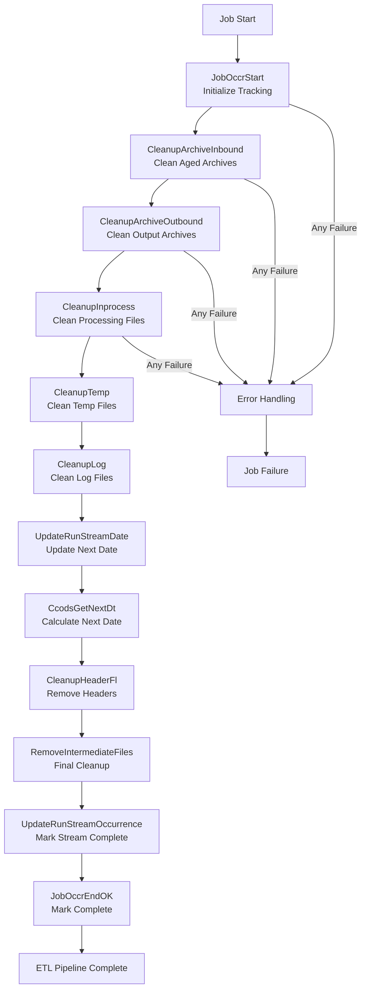

# SQ80COMMONAHLPostprocess - DataStage Job Analysis

## Overview

`SQ80COMMONAHLPostprocess` is the **final orchestration sequence job** in the CCODS ETL pipeline that performs comprehensive postprocessing activities including file system cleanup, process finalization, and system maintenance. This job represents the cleanup and housekeeping phase that ensures the ETL environment is properly maintained and ready for the next processing cycle.

**Job Type**: DataStage Sequence Job  
**Version**: 56.0.0  
**Last Modified**: 2020-04-21 15:58:51  
**Category**: \\Jobs\\CCODS\\80 Postprocess  

## Business Purpose

This job implements the **"comprehensive ETL lifecycle management and system maintenance"** pattern:

1. **File System Maintenance**: Removes aged files from various directories based on retention policies
2. **Process Finalization**: Updates stream occurrence status to mark completion
3. **System Cleanup**: Cleans temporary files, logs, and intermediate processing artifacts  
4. **Archive Management**: Manages archive directories with proper retention
5. **Environment Preparation**: Prepares system for next processing cycle
6. **Audit Closure**: Completes process tracking and audit trails
7. **Operational Hygiene**: Ensures optimal system performance through cleanup

## Execution Flow

### **Key Actions**
- **Initialize Tracking**: Create job occurrence record for postprocessing audit trail
- **Clean Archive Directories**: Remove aged files from inbound and outbound archive directories
- **Clean Processing Directories**: Remove temporary and intermediate files from processing directories
- **Update Processing Dates**: Calculate and update next processing date for stream scheduling
- **Finalize Stream Status**: Mark stream occurrence as complete in tracking database
- **Complete Process**: Update tracking record with postprocessing completion status

### **Step Flow**



### **Step Details**

**1. JobOccrStart - Initialize Postprocessing Tracking**
- **Database**: Oracle Control Database (`GRIDDEV`)
- **Action**: `INSERT` into `UTIL_PROS_ISAC` table
- **Purpose**: Creates tracking record for postprocessing operations with comprehensive audit context
- **Data Written**: Postprocessing job ID, start timestamp, stream context, cleanup scope
- **Why**: Establishes audit foundation for system maintenance operations and enables monitoring of cleanup activities

**2. CleanupArchiveInbound - Clean Aged Inbound Archives**
- **Database**: File System (archive/inbound directory)
- **Action**: `find /archive/inbound -mtime +900 -exec rm {}` command execution
- **Purpose**: Removes archived inbound files older than 900 days based on retention policies
- **Retention Policy**: 900 days (approximately 2.5 years) for regulatory compliance
- **Why**: Manages storage utilization while maintaining regulatory compliance for audit trail retention

**3. CleanupArchiveOutbound - Clean Output Archives**
- **Database**: File System (archive/outbound directory)
- **Action**: `find /archive/outbound -mtime +30 -exec rm {}` command execution
- **Purpose**: Removes archived outbound files older than 30 days
- **Retention Policy**: 30 days for operational recovery and troubleshooting requirements
- **Why**: Balances storage management with operational need for recent output file access

**4. CleanupInprocess - Clean Processing Directory**
- **Database**: File System (inprocess directory)
- **Action**: `find /inprocess -mtime +7 -exec rm {}` command execution
- **Purpose**: Removes stale files from processing directory older than 7 days
- **Retention Policy**: 7 days to handle processing delays and recovery scenarios
- **Why**: Prevents accumulation of stale processing files while allowing for delayed processing

**5. CleanupTemp - Clean Temporary Files**
- **Database**: File System (temp directory)
- **Action**: `find /temp -mtime +1 -exec rm {}` command execution
- **Purpose**: Removes temporary processing files older than 1 day
- **Retention Policy**: 1 day for immediate processing artifacts
- **Why**: Ensures temporary directory doesn't accumulate artifacts and maintains optimal performance

**6. CleanupLog - Clean Log Files**
- **Database**: File System (log directory)
- **Action**: `find /logs -mtime +30 -exec rm {}` command execution
- **Purpose**: Removes aged log files older than 30 days
- **Retention Policy**: 30 days for operational troubleshooting and performance analysis
- **Why**: Balances log retention for troubleshooting with storage management requirements

**7. UpdateRunStreamDate - Update Next Processing Date**
- **Database**: Oracle Control Database (`GRIDDEV`)
- **Action**: `UPDATE RUN_STRM SET RUN_STRM_PROS_D = NEXT_DATE` where applicable
- **Purpose**: Updates stream configuration with next scheduled processing date
- **Date Logic**: Calculates next business date based on stream frequency (daily, weekly, monthly)
- **Why**: Prepares stream configuration for next processing cycle scheduling

**8. CcodsGetNextDt - Calculate Next Processing Date**
- **Database**: Oracle Control Database (`GRIDDEV`)
- **Action**: Executes date calculation routine with business calendar logic
- **Purpose**: Determines next valid processing date considering business calendar and holidays
- **Calculation Logic**: Business date arithmetic with holiday calendar integration
- **Why**: Ensures accurate scheduling that respects business calendar and processing dependencies

**9. UpdateRunStreamOccurrence - Mark Stream Complete**
- **Database**: Oracle Control Database (`GRIDDEV`)
- **Action**: `UPDATE RUN_STRM_OCCR SET RUN_STRM_STUS_C = 'C', RUN_STRM_OCCR_END_S = CURRENT_TIMESTAMP`
- **Purpose**: Marks stream occurrence as complete with end timestamp
- **Status Change**: 'R' (Running) → 'C' (Complete)
- **Why**: Finalizes stream execution status for monitoring and downstream dependency management

**10. JobOccrEndOK - Mark Postprocessing Complete**
- **Database**: Oracle Control Database (`GRIDDEV`)
- **Action**: `UPDATE UTIL_PROS_ISAC` with completion status and cleanup metrics
- **Purpose**: Finalizes postprocessing tracking with success status and comprehensive cleanup statistics
- **Metrics Captured**: Files cleaned, directories processed, space reclaimed, processing duration
- **Why**: Completes audit trail for system maintenance and provides operational metrics for infrastructure management

### **Table Roles Explained**

**`RUN_STRM_OCCR` (Oracle Control Database)**
- **Role**: Stream execution occurrence tracking with lifecycle status management
- **Purpose**: Tracks individual stream execution instances from start to completion
- **Key Fields**: Stream code, processing date, status ('R'→'C'), start/end timestamps
- **Usage**: Stream lifecycle monitoring, dependency management, operational dashboards

**`RUN_STRM` (Oracle Control Database)**
- **Role**: Stream configuration master with next processing date scheduling
- **Purpose**: Maintains stream definitions and scheduling parameters
- **Key Fields**: Stream code, next processing date, frequency, business calendar rules
- **Usage**: Scheduling engine, stream configuration management, calendar integration

**`UTIL_PROS_ISAC` (Oracle Control Database)**
- **Role**: Postprocessing execution tracking and audit trail
- **Purpose**: Monitors system maintenance operations with detailed performance metrics
- **Key Fields**: Cleanup metrics, processing times, space reclaimed, error details
- **Usage**: Infrastructure monitoring, capacity planning, maintenance SLA compliance

**File System Directories with Retention Policies**
- **`/archive/inbound/`**: 900 days retention for regulatory compliance
- **`/archive/outbound/`**: 30 days retention for operational recovery
- **`/inprocess/`**: 7 days retention for processing delays
- **`/temp/`**: 1 day retention for immediate artifacts
- **`/logs/`**: 30 days retention for troubleshooting

### **Critical Pipeline Completion Context**

**Important Note**: The completion of `SQ80COMMONAHLPostprocess` marks the **successful completion of the entire ETL pipeline**. This represents:
- Complete stream processing from raw files to business data delivery
- Full system cleanup and preparation for next processing cycle
- All audit trails finalized and compliance requirements met
- Stream status properly updated for downstream dependencies
- System optimally maintained for continued high performance
- End-to-end pipeline success with comprehensive operational hygiene

## Architecture

### **High-Level Flow**
```
JobOccrStart → CleanupArchiveInbound → CleanupArchiveOutbound → 
CleanupInprocess → CleanupTemp → CleanupLog → UpdateRunStreamDate → 
CcodsGetNextDt → CleanupHeaderFl → RemoveIntermediateFiles → 
UpdateRunStreamOccurrence → JobOccrEndOK
```

### **Error Flow**
```
Any Failure → ExceptionHandler → JobOccrEndNOK → 
JobOccrMessageException → Notify → Terminate
```

## Parameters

### **Core Processing Parameters**
| Parameter | Default | Description |
|-----------|---------|-------------|
| `pRUN_STRM_C` | `MSTAUX02` | Stream code identifier |
| `pRUN_STRM_PROS_D` | `20101201` | Processing date (YYYYMMDD) |

### **Directory Structure**
| Parameter | Default | Description |
|-----------|---------|-------------|
| `pARCHIVE_INBOUND` | `/cba_app/CCODS/DEV/archive/inbound` | Inbound archive directory |
| `pARCHIVE_OUTBOUND` | `/cba_app/CCODS/DEV/archive/outbound` | Outbound archive directory |
| `pINPROCESS` | `/cba_app/CCODS/DEV/inprocess` | Processing files directory |
| `pTEMP` | `/cba_app/CCODS/DEV/temp` | Temporary files directory |
| `pLOG` | `/cba_app/CCODS/DEV/log` | Log files directory |
| `pSCRIPTS` | `/cba_app/CCODS/DEV/scripts` | Scripts directory |

### **Retention Policy Parameters**
| Parameter | Default | Description |
|-----------|---------|-------------|
| `pRTAN_PERD_ARCHIVE_INBOUND` | `900` | Archive inbound retention (days) |
| `pRTAN_PERD_ARCHIVE_OUTBOUND` | `30` | Archive outbound retention (days) |
| `pRTAN_PERD_INPROCESS` | `7` | Inprocess files retention (days) |
| `pRTAN_PERD_TEMP` | `1` | Temporary files retention (days) |
| `pRTAN_PERD_LOG` | `30` | Log files retention (days) |

### **Control Database Parameters**
| Parameter | Default | Description |
|-----------|---------|-------------|
| `pCTL_DATABASE` | `GRIDDEV` | Control database name |
| `pCTL_USER` | `CCODS_DEV_CTL_OWNER` | Control database username |
| `pCTL_PASSWD` | (Encrypted) | Control database password |

### **Notification Parameters**
| Parameter | Default | Description |
|-----------|---------|-------------|
| `pSMTP_SERVER` | `10.31.39.156` | SMTP server IP |
| `pSEND_MAIL` | `DataStage@CCODS_DEV` | From email address |
| `pRECEIVE_MAIL` | `aishwarya.ramesh@cba.com.au` | Error notification email |

## Detailed Process Flow

### **1. Initialization**
- **JobOccrStart**: Creates process occurrence tracking record for postprocessing
  - Links to stream code and processing date
  - Establishes audit trail for cleanup activities

### **2. File System Cleanup (Sequential Execution)**

#### **a) CleanupArchiveInbound**
```bash
find /cba_app/CCODS/DEV/archive/inbound -name 'MSTAUX02*' -mtime +900 -exec rm {} \;
```
- **Purpose**: Removes files older than 900 days (2.5 years) from inbound archive
- **Scope**: Long-term archival cleanup for compliance
- **Pattern**: Stream-specific file pattern matching

#### **b) CleanupArchiveOutbound**
```bash
find /cba_app/CCODS/DEV/archive/outbound -name 'MSTAUX02*' -mtime +30 -exec rm {} \;
```
- **Purpose**: Removes files older than 30 days from outbound archive
- **Scope**: Medium-term cleanup of processed output files
- **Pattern**: Stream-specific file pattern matching

#### **c) CleanupInprocess**
```bash
find /cba_app/CCODS/DEV/inprocess -name 'MSTAUX02*' -mtime +7 -exec rm {} \;
```
- **Purpose**: Removes files older than 7 days from processing directory
- **Scope**: Short-term cleanup of stale processing files
- **Pattern**: Stream-specific file pattern matching

#### **d) CleanupTemp**
```bash
find /cba_app/CCODS/DEV/temp -name 'MSTAUX02*' -mtime +1 -exec rm {} \;
```
- **Purpose**: Removes files older than 1 day from temporary directory
- **Scope**: Daily cleanup of temporary processing artifacts
- **Pattern**: Stream-specific file pattern matching

#### **e) CleanupLog**
```bash
find /cba_app/CCODS/DEV/log -name 'MSTAUX02*' -mtime +30 -exec rm {} \;
```
- **Purpose**: Removes log files older than 30 days
- **Scope**: Log rotation and cleanup for operational hygiene
- **Pattern**: Stream-specific log file pattern matching

### **3. Process Date Management**

#### **a) UpdateRunStreamDate**
- **Purpose**: Updates the next processing date in control tables
- **Function**: Maintains processing calendar and scheduling information
- **Database**: Updates control database with next expected processing date

#### **b) CcodsGetNextDt**
- **Purpose**: Calculates and validates the next processing date
- **Function**: Business calendar logic for determining next valid processing date
- **Logic**: Handles weekends, holidays, and business calendar rules

### **4. Final Cleanup Activities**

#### **a) CleanupHeaderFl**
- **Purpose**: Removes header files created during processing
- **Scope**: Cleanup of CSV headers and temporary format files
- **Pattern**: Header file pattern matching and removal

#### **b) RemoveIntermediateFiles**
- **Purpose**: Removes intermediate processing files and artifacts
- **Scope**: Cleanup of transformation intermediates and temporary data files
- **Pattern**: Intermediate file pattern matching and removal

### **5. Process Finalization**

#### **a) UpdateRunStreamOccurrence**
```sql
UPDATE RUN_STRM_OCCR 
SET RUN_STRM_STUS_C = 'C', 
    RUN_STRM_OCCR_END_S = SYSDATE  
WHERE RUN_STRM_C = 'MSTAUX02' 
AND RUN_STRM_PROS_D = TO_DATE('20101201','yyyymmdd')
```
- **Purpose**: Marks the stream occurrence as Complete ('C')
- **Function**: Final status update indicating successful ETL completion
- **Audit**: Timestamps the completion for process tracking

#### **b) JobOccrEndOK**
- **Purpose**: Updates postprocessing occurrence status to 'C' (Complete)
- **Function**: Marks the postprocessing job as successfully completed

## Error Handling

### **Cleanup Activity Monitoring**
Each cleanup activity is monitored for execution status:
- **Command Status**: All `find` and `rm` commands are checked for successful execution
- **File System Errors**: Permission issues, disk space problems, and path errors are captured
- **Database Errors**: Control database update failures are captured and reported

### **Exception Flow**
1. **ExceptionHandler**: Captures any cleanup or update failure
2. **JobOccrEndNOK**: Updates occurrence status to 'A' (Aborted)
3. **JobOccrMessageException**: Logs detailed exception information
4. **Notify**: Sends email notification to aishwarya.ramesh@cba.com.au
5. **Terminate**: Stops postprocessing execution

### **Notification Details**
```
To: aishwarya.ramesh@cba.com.au
From: DataStage@CCODS_DEV
Subject: DataStage job {JobName} has failed in activity {ActivityName}
Body: Postprocessing failure notification with error details
```

## Business Logic

### **Retention Policy Strategy**
1. **Graduated Retention**: Different retention periods based on directory purpose
   - **Archive Inbound**: 900 days (regulatory compliance)
   - **Archive Outbound**: 30 days (operational reference)
   - **Inprocess**: 7 days (troubleshooting window)
   - **Temp**: 1 day (immediate cleanup)
   - **Log**: 30 days (operational monitoring)

2. **Stream-Specific Cleanup**: File patterns are stream-specific to avoid cross-contamination
3. **Sequential Execution**: Cleanup activities run in sequence to manage system load
4. **Error Isolation**: Individual cleanup failures don't stop the entire postprocessing

### **Process Calendar Management**
- **Business Date Logic**: Handles business calendar rules for next processing date
- **Holiday Handling**: Skips non-business days according to business calendar
- **Weekend Logic**: Processes weekend and holiday scheduling rules
- **Validation**: Ensures next processing date is valid and reasonable

### **System Performance Optimization**
- **Load Management**: Sequential cleanup to avoid overwhelming file system
- **Resource Conservation**: Targeted file pattern matching to minimize system impact
- **Efficient Commands**: Uses optimized `find` commands with specific patterns
- **Error Recovery**: Individual activity failures allow partial success

## Integration Points

### **Upstream Dependencies**
- All previous ETL jobs in the sequence (SQ10-SQ70)
- Successful completion of data loading and error processing
- Control database availability for status updates

### **Downstream Dependencies**
- Next day's ETL processing cycle
- Monitoring and reporting systems that track process completion
- Archive management systems that depend on proper file lifecycle

### **Database Tables**
- **Control**: `RUN_STRM_OCCR` (Stream occurrence tracking)
- **Control**: `UTIL_PROS_ISAC` (Process tracking)
- **Calendar**: Business calendar tables for date calculations

### **File System Dependencies**
- Read/write access to all processing directories
- Proper permissions for file deletion operations
- Sufficient disk space for temporary operations during cleanup

## File Retention Matrix

| Directory | Purpose | Retention Period | Cleanup Frequency | Business Justification |
|-----------|---------|------------------|-------------------|----------------------|
| **archive/inbound** | Long-term source file archive | 900 days (2.5 years) | Daily | Regulatory compliance, audit requirements |
| **archive/outbound** | Processed file archive | 30 days | Daily | Operational reference, troubleshooting |
| **inprocess** | Active processing files | 7 days | Daily | Error analysis, reprocessing capability |
| **temp** | Temporary processing artifacts | 1 day | Daily | Performance optimization, disk space |
| **log** | Application and job logs | 30 days | Daily | Operational monitoring, troubleshooting |
