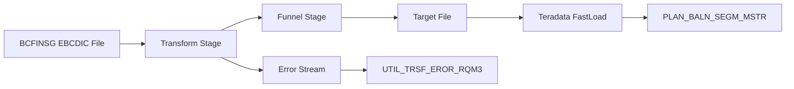

# Complete DataStage BCFINSG to PLAN_BALN_SEGM_MSTR Mapping

## Overview
This document provides the **complete DataStage implementation mapping** from the source BCFINSG EBCDIC mainframe file (130 fields) to the final target table `ps_cld_rw.pdsrccs.plan_baln_segm_mstr` (136 fields) as implemented in the current DataStage ETL pipeline.

⚠️ **IMPORTANT**: This shows the **CURRENT DataStage implementation**, NOT the enhanced dbt version.

---

## Source File: BCFINSG (EBCDIC Mainframe File)
**Description**: Balance Control File - Financial Services Group  
**Format**: EBCDIC binary file with COBOL copybook structure  
**Record Length**: 755 bytes  
**Field Count**: **130 fields**

## Target Table: `ps_cld_rw.pdsrccs.plan_baln_segm_mstr`
**Description**: Plan Balance Segment Master table in Teradata  
**Database**: TDCCODS (now ps_cld_rw.pdsrccs)  
**Field Count**: **133 fields**  
**Loading Method**: Teradata FastLoad via DataStage  

---

## DataStage ETL Architecture



---

## Complete Field-by-Field Mapping (As Implemented in DataStage)

| Target # | Target Column | Target Type | Source Field | Source Type | DataStage Transformation Logic | Error Stream | GTW10801 Column | GTW10801 Data Type |
|----------|---------------|-------------|---------------|-------------|--------------------------------|-------------|------------------|-------------------|
| 1 | `CORP_IDNN` | STRING | `bcf_corp` | VARCHAR(2) | Direct copy with TRIM() | No | `bcf_corp` | VARCHAR |
| 2 | `ACCT_I` | STRING | `bcf_account_no1` | VARCHAR(16) | Direct copy with TRIM() | No | `bcf_account_no1` | VARCHAR |
| 3 | `PLAN_IDNN` | STRING | `bcf_plan_id` | VARCHAR(6) | Direct copy with TRIM() | No | `bcf_plan_id` | VARCHAR |
| 4 | `PLAN_SQNO` | DECIMAL(3,0) | `bcf_plan_seq` | INTEGER | Direct copy | No | `bcf_plan_seq` | INTEGER |
| 5 | `SRCE_SYST_ACCT_NUMB` | STRING | `bcf_account_no1` | VARCHAR(16) | Direct copy (same as ACCT_I) | No | `bcf_account_no1` | VARCHAR |
| 6 | `STOR_IDNN` | STRING | `bcf_store_id` | VARCHAR(9) | Direct copy with TRIM() | No | `bcf_store_id` | VARCHAR |
| 7 | `ORIG_STAT` | STRING | `bcf_original_state` | VARCHAR(3) | Direct copy with TRIM() | No | `bcf_original_state` | VARCHAR |
| 8 | `PLAN_TYPE` | STRING | `bcf_plan_type` | VARCHAR(1) | Direct copy | No | `bcf_plan_type` | VARCHAR |
| 9 | `PLAN_CATG` | STRING | `bcf_plan_category` | VARCHAR(2) | Direct copy | No | `bcf_plan_category` | VARCHAR |
| 10 | `POST_PUR_STUS` | STRING | `bcf_post_purchase_status` | VARCHAR(1) | Direct copy | No | `bcf_post_purchase_status` | VARCHAR |
| 11 | `TERM_STUS` | STRING | `bcf_terms_status` | VARCHAR(1) | Direct copy | No | `bcf_terms_status` | VARCHAR |
| 12 | `INT_DEFR_STUS` | STRING | `bcf_interest_defer_status` | VARCHAR(1) | Direct copy | No | `bcf_interest_defer_status` | VARCHAR |
| 13 | `PAYT_DEFR_STUS` | STRING | `bcf_payment_defer_status` | VARCHAR(1) | Direct copy | No | `bcf_payment_defer_status` | VARCHAR |
| 14 | `TIME_BILL` | DECIMAL(3,0) | `bcf_times_billed` | INTEGER | Direct copy | No | `bcf_times_billed` | INTEGER |
| 15 | `SPEC_TERM_CYCL` | DECIMAL(3,0) | `bcf_special_terms_cycles` | INTEGER | Direct copy | No | `bcf_special_terms_cycles` | INTEGER |
| 16 | `INT_DEFR_CYCL` | DECIMAL(3,0) | `bcf_interest_defer_cycles` | INTEGER | Direct copy | No | `bcf_interest_defer_cycles` | INTEGER |
| 17 | `PAYT_DEFR_CYCL` | DECIMAL(3,0) | `bcf_payment_defer_cycles` | INTEGER | Direct copy | No | `bcf_payment_defer_cycles` | INTEGER |
| 18 | `DATE_SPEC_TERM_END` | DATE | `bcf_dt_spec_terms_end` | INTEGER | EBCDIC date conversion (YYYYMMDD) | Yes | `bcf_dt_spec_terms_end` | INTEGER |
| 19 | `DATE_INT_DEFR_END` | DATE | `bcf_dt_interest_defer` | INTEGER | EBCDIC date conversion (YYYYMMDD) | Yes | `bcf_dt_interest_defer` | INTEGER |
| 20 | `DATE_PAYT_DEFR_END` | DATE | `bcf_dt_payment_defer` | INTEGER | EBCDIC date conversion (YYYYMMDD) | Yes | `bcf_dt_payment_defer` | INTEGER |
| 21 | `DATE_FRST_TRAN` | DATE | `bcf_dt_first_trans` | INTEGER | EBCDIC date conversion (YYYYMMDD) | Yes | `bcf_dt_first_trans` | INTEGER |
| 22 | `DATE_PAID_OFF` | DATE | `bcf_dt_paid_off` | INTEGER | EBCDIC date conversion (YYYYMMDD) | Yes | `bcf_dt_paid_off` | INTEGER |
| 23 | `DATE_LAST_PAYT` | DATE | `bcf_dt_last_payment` | INTEGER | EBCDIC date conversion (YYYYMMDD) | Yes | `bcf_dt_last_payment` | INTEGER |
| 24 | `DATE_LAST_MNTN` | DATE | `bcf_dt_last_maint` | INTEGER | EBCDIC date conversion (YYYYMMDD) | Yes | `bcf_dt_last_maint` | INTEGER |
| 25 | `LFTD_HIGH_BALN` | DECIMAL(13,2) | `bcf_ltd_high_balance` | DECIMAL(12,2) | Direct copy | No | `bcf_ltd_high_balance` | DECIMAL(12,2) |
| 26 | `PAYT_TABL_HIGH_BALN` | DECIMAL(13,2) | `bcf_pymt_tbl_high_balance` | DECIMAL(12,2) | Direct copy | No | `bcf_pymt_tbl_high_balance` | DECIMAL(12,2) |
| 27 | `LFTD_ICHG` | DECIMAL(13,2) | `bcf_ltd_interest_chgd` | DECIMAL(12,2) | Direct copy | No | `bcf_ltd_interest_chgd` | DECIMAL(12,2) |
| 28 | `LFTD_INT_WAVR` | DECIMAL(13,2) | `bcf_ltd_interest_waived` | DECIMAL(12,2) | Direct copy | No | `bcf_ltd_interest_waived` | DECIMAL(12,2) |
| 29 | `FIX_PAYT_AMT` | DECIMAL(13,2) | `bcf_fixed_pay_amt` | DECIMAL(12,2) | Direct copy | No | `bcf_fixed_pay_amt` | DECIMAL(12,2) |
| 30 | `FIX_PACY` | DECIMAL(3,0) | `bcf_fixed_pay_cycles` | INTEGER | Direct copy | No | `bcf_fixed_pay_cycles` | INTEGER |
| 31 | `LAST_IRTE` | DECIMAL(7,2) | `bcf_last_int_rate` | DECIMAL(6,2) | Direct copy | No | `bcf_last_int_rate` | DECIMAL(6,2) |
| 32 | `LAST_RATE_CODE` | STRING | `bcf_last_rate_code` | VARCHAR | Direct copy with TRIM() | No | `bcf_last_rate_code` | VARCHAR |
| 33 | `LAST_RATE_CODE_SEQN` | DECIMAL(4,0) | `bcf_last_rate_code_seq` | INTEGER | Direct copy | No | `bcf_last_rate_code_seq` | INTEGER |
| 34 | `LAST_MIN_PAYT_CODE` | STRING | `bcf_last_min_pay_code` | VARCHAR | Direct copy with TRIM() | No | `bcf_last_min_pay_code` | VARCHAR |
| 35 | `LAST_MIN_PAYT_CODE_SEQN` | DECIMAL(4,0) | `bcf_last_min_pay_code_seq` | INTEGER | Direct copy | No | `bcf_last_min_pay_code_seq` | INTEGER |
| 36 | `LAST_MIN_PAYT_AMT` | DECIMAL(13,2) | `bcf_min_pay_amt` | DECIMAL(12,2) | Direct copy | No | `bcf_min_pay_amt` | DECIMAL(12,2) |
| 37 | `CURR_MIN_PAYT_DUE` | DECIMAL(13,2) | `bcf_min_pay_due` | DECIMAL(12,2) | Direct copy | No | `bcf_min_pay_due` | DECIMAL(12,2) |
| 38 | `MIN_PAYT_PAST_DUE` | DECIMAL(13,2) | `bcf_min_pay_past_due` | DECIMAL(12,2) | Direct copy | No | `bcf_min_pay_past_due` | DECIMAL(12,2) |
| 39 | `LAST_APPY_PAYT_AMT` | DECIMAL(13,2) | `bcf_amt_last_pymt_applied` | DECIMAL(12,2) | Direct copy | No | `bcf_amt_last_pymt_applied` | DECIMAL(12,2) |
| 40 | `PAYT_BFOR_GRCE` | DECIMAL(13,2) | `bcf_payments_before_grace` | DECIMAL(12,2) | Direct copy | No | `bcf_payments_before_grace` | DECIMAL(12,2) |
| 41 | `ORIG_BALN` | DECIMAL(13,2) | `bcf_original_balance` | DECIMAL(12,2) | Direct copy | No | `bcf_original_balance` | DECIMAL(12,2) |
| 42 | `INT_SAVE_RATE` | DECIMAL(2,2) | `bcf_rate_saver_rate` | DECIMAL(4,2) | Direct copy (precision adjusted) | No | `bcf_rate_saver_rate` | DECIMAL(4,2) |
| 43 | `PLAN_DUE_DATE` | DATE | `bcf_plan_due_date` | INTEGER | EBCDIC date conversion (YYYYMMDD) | Yes | `bcf_plan_due_date` | INTEGER |
| 44 | `INT_FEE_END_DATE` | DATE | `bcf_date_end_interest_free` | INTEGER | EBCDIC date conversion (YYYYMMDD) | Yes | `bcf_date_end_interest_free` | INTEGER |
| 45 | `INT_FREE_BALN` | DECIMAL(13,2) | `bcf_interest_free_prin_amt` | DECIMAL(12,2) | Direct copy | No | `bcf_interest_free_prin_amt` | DECIMAL(12,2) |
| 46 | `OPEN_BALN_CURR_CYCL` | DECIMAL(13,2) | `bcf_opening_balance` | DECIMAL(12,2) | Direct copy | No | `bcf_opening_balance` | DECIMAL(12,2) |
| 47 | `CTD_SALE_TRAN` | DECIMAL(13,2) | `bcf_current` | DECIMAL(12,2) | Direct copy | No | `bcf_current` | DECIMAL(12,2) |
| 48 | `CTD_DR_TRAN` | DECIMAL(13,2) | `bcf_debits` | DECIMAL(12,2) | Direct copy | No | `bcf_debits` | DECIMAL(12,2) |
| 49 | `CTD_CR_TRAN` | DECIMAL(13,2) | `bcf_credits` | DECIMAL(12,2) | Direct copy | No | `bcf_credits` | DECIMAL(12,2) |
| 50 | `CTD_PAYT_TRAN` | DECIMAL(13,2) | `bcf_payments` | DECIMAL(12,2) | Direct copy | No | `bcf_payments` | DECIMAL(12,2) |
| 51 | `INT_UNPD_OPEN_NOT_ACRL_BALN` | DECIMAL(13,2) | `bcf_int_open_non_accr` | DECIMAL(12,2) | Direct copy | No | `bcf_int_open_non_accr` | DECIMAL(12,2) |
| 52 | `INT_UNPD_CTD_NOT_ACRL_BALN` | DECIMAL(13,2) | `bcf_int_ctd_non_accr` | DECIMAL(12,2) | Direct copy | No | `bcf_int_ctd_non_accr` | DECIMAL(12,2) |
| 53 | `INT_UNPD_CURR_CYCL_BALN` | DECIMAL(13,2) | `bcf_int_curr_cyc_bal` | DECIMAL(12,2) | Direct copy | No | `bcf_int_curr_cyc_bal` | DECIMAL(12,2) |
| 54 | `INT_UNPD_1_CYCL_AGO_BALN` | DECIMAL(13,2) | `bcf_int_1cyc_ago_bal` | DECIMAL(12,2) | Direct copy | No | `bcf_int_1cyc_ago_bal` | DECIMAL(12,2) |
| 55 | `INT_UNPD_2_CYCL_AGO_BALN` | DECIMAL(13,2) | `bcf_int_2cyc_ago_bal` | DECIMAL(12,2) | Direct copy | No | `bcf_int_2cyc_ago_bal` | DECIMAL(12,2) |
| 56 | `FEE_UNPD_OPEN_NOT_ACRL_BALN` | DECIMAL(13,2) | `bcf_fees_open_non_accr` | DECIMAL(12,2) | Direct copy | No | `bcf_fees_open_non_accr` | DECIMAL(12,2) |
| 57 | `FEE_UNPD_CTD_NOT_ACRL_BALN` | DECIMAL(13,2) | `bcf_fees_ctd_non_accr` | DECIMAL(12,2) | Direct copy | No | `bcf_fees_ctd_non_accr` | DECIMAL(12,2) |
| 58 | `FEE_UNPD_CURR_CYCL_BALN` | DECIMAL(13,2) | `bcf_fees_curr_cyc_bal` | DECIMAL(12,2) | Direct copy | No | `bcf_fees_curr_cyc_bal` | DECIMAL(12,2) |
| 59 | `FEE_UNPD_1_CYCL_AGO_BALN` | DECIMAL(13,2) | `bcf_fees_1cyc_ago_bal` | DECIMAL(12,2) | Direct copy | No | `bcf_fees_1cyc_ago_bal` | DECIMAL(12,2) |
| 60 | `FEE_UNPD_2_CYCL_AGO_BALN` | DECIMAL(13,2) | `bcf_fees_2cyc_ago_bal` | DECIMAL(12,2) | Direct copy | No | `bcf_fees_2cyc_ago_bal` | DECIMAL(12,2) |
| 61 | `AMF_UNPD_OPEN_NOT_ACRL_BALN` | DECIMAL(13,2) | `bcf_amf_open_non_accr` | DECIMAL(12,2) | Direct copy | No | `bcf_amf_open_non_accr` | DECIMAL(12,2) |
| 62 | `AMF_UNPD_CTD_NOT_ACRL_BALN` | DECIMAL(13,2) | `bcf_amf_ctd_non_accr` | DECIMAL(12,2) | Direct copy | No | `bcf_amf_ctd_non_accr` | DECIMAL(12,2) |
| 63 | `AMF_UNPD_CURR_CYCL_BALN` | DECIMAL(13,2) | `bcf_amf_curr_cyc_bal` | DECIMAL(12,2) | Direct copy | No | `bcf_amf_curr_cyc_bal` | DECIMAL(12,2) |
| 64 | `AMF_UNPD_1_CYCL_AGO_BALN` | DECIMAL(13,2) | `bcf_amf_1cyc_ago_bal` | DECIMAL(12,2) | Direct copy | No | `bcf_amf_1cyc_ago_bal` | DECIMAL(12,2) |
| 65 | `AMF_UNPD_2_CYCL_AGO_BALN` | DECIMAL(13,2) | `bcf_amf_2cyc_ago_bal` | DECIMAL(12,2) | Direct copy | No | `bcf_amf_2cyc_ago_bal` | DECIMAL(12,2) |
| 66 | `INSR_UNPD_OPEN_NOT_ACRL_BALN` | DECIMAL(13,2) | `bcf_ins_open_non_accr` | DECIMAL(12,2) | Direct copy | No | `bcf_ins_open_non_accr` | DECIMAL(12,2) |
| 67 | `INSR_UNPD_CTD_NOT_ACRL_BALN` | DECIMAL(13,2) | `bcf_ins_ctd_non_accr` | DECIMAL(12,2) | Direct copy | No | `bcf_ins_ctd_non_accr` | DECIMAL(12,2) |
| 68 | `INSR_UNPD_CURR_CYCL_BALN` | DECIMAL(13,2) | `bcf_ins_curr_cyc_bal` | DECIMAL(12,2) | Direct copy | No | `bcf_ins_curr_cyc_bal` | DECIMAL(12,2) |
| 69 | `INSR_UNPD_1_CYCL_AGO_BALN` | DECIMAL(13,2) | `bcf_ins_1cyc_ago_bal` | DECIMAL(12,2) | Direct copy | No | `bcf_ins_1cyc_ago_bal` | DECIMAL(12,2) |
| 70 | `INSR_UNPD_2_CYCL_AGO_BALN` | DECIMAL(13,2) | `bcf_ins_2cyc_ago_bal` | DECIMAL(12,2) | Direct copy | No | `bcf_ins_2cyc_ago_bal` | DECIMAL(12,2) |
| 71 | `PRIN_UNPD_OPEN_NOT_ACRL_BALN` | DECIMAL(13,2) | `bcf_prin_open_non_accr` | DECIMAL(12,2) | Direct copy | No | `bcf_prin_open_non_accr` | DECIMAL(12,2) |
| 72 | `PRIN_UNPD_CTD_NOT_ACRL_BALN` | DECIMAL(13,2) | `bcf_prin_ctd_non_accr` | DECIMAL(12,2) | Direct copy | No | `bcf_prin_ctd_non_accr` | DECIMAL(12,2) |
| 73 | `PRIN_UNPD_CURR_CYCL_BALN` | DECIMAL(13,2) | `bcf_prin_curr_cyc_bal` | DECIMAL(12,2) | Direct copy | No | `bcf_prin_curr_cyc_bal` | DECIMAL(12,2) |
| 74 | `PRIN_UNPD_1_CYCL_AGO_BALN` | DECIMAL(13,2) | `bcf_prin_1cyc_ago_bal` | DECIMAL(12,2) | Direct copy | No | `bcf_prin_1cyc_ago_bal` | DECIMAL(12,2) |
| 75 | `PRIN_UNPD_2_CYCL_AGO_BALN` | DECIMAL(13,2) | `bcf_prin_2cyc_ago_bal` | DECIMAL(12,2) | Direct copy | No | `bcf_prin_2cyc_ago_bal` | DECIMAL(12,2) |
| 76 | `AGGR_CURR_CYCL_BALN` | DECIMAL(15,2) | `bcf_aggr_curr_cyc_bal` | DECIMAL(14,2) | Direct copy | No | `bcf_aggr_curr_cyc_bal` | DECIMAL(14,2) |
| 77 | `AGGR_1_CYCL_AGO_BALN` | DECIMAL(15,2) | `bcf_aggr_1cyc_ago_bal` | DECIMAL(14,2) | Direct copy | No | `bcf_aggr_1cyc_ago_bal` | DECIMAL(14,2) |
| 78 | `AGGR_2_CYCL_AGO_BALN` | DECIMAL(15,2) | `bcf_aggr_2cyc_ago_bal` | DECIMAL(14,2) | Direct copy | No | `bcf_aggr_2cyc_ago_bal` | DECIMAL(14,2) |
| 79 | `AGGR_DLAY_BALN` | DECIMAL(15,2) | `bcf_aggr_delayed_bal` | DECIMAL(14,2) | Direct copy | No | `bcf_aggr_delayed_bal` | DECIMAL(14,2) |
| 80 | `DLAY_DAY_QNTY` | DECIMAL(3,0) | `bcf_delayed_days` | INTEGER | Direct copy | No | `bcf_delayed_days` | INTEGER |
| 81 | `CTD_CSAD_FEE_AMT` | DECIMAL(13,2) | `bcf_ctd_trans_fee` | DECIMAL(12,2) | Direct copy | No | `bcf_ctd_trans_fee` | DECIMAL(12,2) |
| 82 | `CTD_SYST_GENR_CSAD_FEE_AMT` | DECIMAL(13,2) | `bcf_ctd_trans_fee_amt` | DECIMAL(12,2) | Direct copy | No | `bcf_ctd_trans_fee_amt` | DECIMAL(12,2) |
| 83 | `INT_DEFR_DAY_QNTY` | DECIMAL(3,0) | `bcf_deferred_days` | INTEGER | Direct copy | No | `bcf_deferred_days` | INTEGER |
| 84 | `INT_DEFR_AMT` | DECIMAL(13,2) | `bcf_deferred_interest` | DECIMAL(12,2) | Direct copy | No | `bcf_deferred_interest` | DECIMAL(12,2) |
| 85 | `INT_DEFR_AGGR_CURR_BALN` | DECIMAL(15,2) | `bcf_aggr_deferred_bal` | DECIMAL(14,2) | Direct copy | No | `bcf_aggr_deferred_bal` | DECIMAL(14,2) |
| 86 | `USER_CODE` | STRING | `bcf_user_code` | VARCHAR | Direct copy with TRIM() | No | `bcf_user_code` | VARCHAR |
| 87 | `MIGR_TO_PLAN_IDNN` | STRING | `bcf_migrate_to_plan` | VARCHAR | Direct copy with TRIM() | No | `bcf_migrate_to_plan` | VARCHAR |
| 88 | `MIGR_TO_PLAN_SQNO` | DECIMAL(3,0) | `bcf_migrate_to_seq` | INTEGER | Direct copy | No | `bcf_migrate_to_seq` | INTEGER |
| 89 | `DATE_MIGR` | DATE | `bcf_dt_migrate` | INTEGER | EBCDIC date conversion (YYYYMMDD) | Yes | `bcf_dt_migrate` | INTEGER |
| 90 | `DSPT_AMT` | DECIMAL(13,2) | `bcf_dispute_amt` | DECIMAL(12,2) | Direct copy | No | `bcf_dispute_amt` | DECIMAL(12,2) |
| 91 | `EXCL_DSPT_AMT` | DECIMAL(13,2) | `bcf_ext_dispute_amt` | DECIMAL(12,2) | Direct copy | No | `bcf_ext_dispute_amt` | DECIMAL(12,2) |
| 92 | `ACRL_DSPT_AMT` | DECIMAL(13,2) | `bcf_accr_dispute_amt` | DECIMAL(12,2) | Direct copy | No | `bcf_accr_dispute_amt` | DECIMAL(12,2) |
| 93 | `FRNT_LOAD_ISMT_BILL` | DECIMAL(3,0) | `bcf_fl_installments_billed` | INTEGER | Direct copy | No | `bcf_fl_installments_billed` | INTEGER |
| 94 | `FRNT_LOAD_LAST_ISMT_DATE` | DATE | `bcf_fl_last_installment_dt` | INTEGER | EBCDIC date conversion (YYYYMMDD) | Yes | `bcf_fl_last_installment_dt` | INTEGER |
| 95 | `FRNT_LOAD_ORIG_INT_AMT` | DECIMAL(13,2) | `bcf_fl_orig_interest_amt` | DECIMAL(12,2) | Direct copy | No | `bcf_fl_orig_interest_amt` | DECIMAL(12,2) |
| 96 | `FRNT_LOAD_EARN_INT_AMT` | DECIMAL(13,2) | `bcf_fl_earned_interest_amt` | DECIMAL(12,2) | Direct copy | No | `bcf_fl_earned_interest_amt` | DECIMAL(12,2) |
| 97 | `FRNT_LOAD_REBT_INT_AMT` | DECIMAL(13,2) | `bcf_fl_rebate_interest_amt` | DECIMAL(12,2) | Direct copy | No | `bcf_fl_rebate_interest_amt` | DECIMAL(12,2) |
| 98 | `FRNT_LOAD_IRTE` | DECIMAL(6,6) | `bcf_fl_interest_rate` | DECIMAL(8,6) | Direct copy (precision adjusted) | No | `bcf_fl_interest_rate` | DECIMAL(8,6) |
| 99 | `FRNT_LOAD_ORIG_INSR_AMT` | DECIMAL(13,2) | `bcf_fl_orig_insur_amt` | DECIMAL(12,2) | Direct copy | No | `bcf_fl_orig_insur_amt` | DECIMAL(12,2) |
| 100 | `FRNT_LOAD_EARN_INSR_AMT` | DECIMAL(13,2) | `bcf_fl_earned_insur_amt` | DECIMAL(12,2) | Direct copy | No | `bcf_fl_earned_insur_amt` | DECIMAL(12,2) |
| 101 | `FRNT_LOAD_UPFR_INSR_AMT` | DECIMAL(13,2) | `bcf_fl_upfront_insur_amt` | DECIMAL(12,2) | Direct copy | No | `bcf_fl_upfront_insur_amt` | DECIMAL(12,2) |
| 102 | `FRNT_LOAD_REBT_INSR_AMT` | DECIMAL(13,2) | `bcf_fl_rebate_insur_amt` | DECIMAL(12,2) | Direct copy | No | `bcf_fl_rebate_insur_amt` | DECIMAL(12,2) |
| 103 | `SCHE_PAYF_DATE` | DATE | `bcf_sched_payoff_dt` | INTEGER | EBCDIC date conversion (YYYYMMDD) | Yes | `bcf_sched_payoff_dt` | INTEGER |
| 104 | `SCHE_PAYF_AMT` | DECIMAL(13,2) | `bcf_sched_payoff_amt` | DECIMAL(12,2) | Direct copy | No | `bcf_sched_payoff_amt` | DECIMAL(12,2) |
| 105 | `SCHE_PAYF_FEE` | DECIMAL(13,2) | `bcf_sched_payoff_fee` | DECIMAL(12,2) | Direct copy | No | `bcf_sched_payoff_fee` | DECIMAL(12,2) |
| 106 | `SCHE_PAYF_REAS` | STRING | `bcf_sched_payoff_reason` | VARCHAR | Direct copy with TRIM() | No | `bcf_sched_payoff_reason` | VARCHAR |
| 107 | `ACTL_PAYF_DATE` | DATE | `bcf_actual_payoff_dt` | INTEGER | EBCDIC date conversion (YYYYMMDD) | Yes | `bcf_actual_payoff_dt` | INTEGER |
| 108 | `ACTL_PAYF_AMT` | DECIMAL(13,2) | `bcf_actual_payoff_amt` | DECIMAL(12,2) | Direct copy | No | `bcf_actual_payoff_amt` | DECIMAL(12,2) |
| 109 | `FRNT_LOAD_INSR_PAID` | DECIMAL(13,2) | `bcf_fl_upfront_insur_paid` | DECIMAL(12,2) | Direct copy | No | `bcf_fl_upfront_insur_paid` | DECIMAL(12,2) |
| 110 | `FRNT_LOAD_REBT_INSR_PAID` | DECIMAL(13,2) | `bcf_fl_rebate_insur_paid` | DECIMAL(12,2) | Direct copy | No | `bcf_fl_rebate_insur_paid` | DECIMAL(12,2) |
| 111 | `GOVT_CHRG_NOT_ACRL_OPEN_AMT` | DECIMAL(13,2) | `bcf_govt_non_accr_opn_amt` | DECIMAL(12,2) | Direct copy | No | `bcf_govt_non_accr_opn_amt` | DECIMAL(12,2) |
| 112 | `GOVT_CHRG_NOT_ACRL_CTD_AMT` | DECIMAL(13,2) | `bcf_govt_non_accr_ctd_amt` | DECIMAL(12,2) | Direct copy | No | `bcf_govt_non_accr_ctd_amt` | DECIMAL(12,2) |
| 113 | `GOVT_CHRG_CURR_CYCL_AMT` | DECIMAL(13,2) | `bcf_govt_bal_curr_cyc_amt` | DECIMAL(12,2) | Direct copy | No | `bcf_govt_bal_curr_cyc_amt` | DECIMAL(12,2) |
| 114 | `GOVT_CHRG_1_CYCL_AGO_AMT` | DECIMAL(13,2) | `bcf_govt_bal_1cyc_ago_amt` | DECIMAL(12,2) | Direct copy | No | `bcf_govt_bal_1cyc_ago_amt` | DECIMAL(12,2) |
| 115 | `GOVT_CHRG_2_CYCL_AGO_AMT` | DECIMAL(13,2) | `bcf_govt_bal_2cyc_ago_amt` | DECIMAL(12,2) | Direct copy | No | `bcf_govt_bal_2cyc_ago_amt` | DECIMAL(12,2) |
| 116 | `CTD_FNCL_CHRG_REV` | DECIMAL(7,2) | `bcf_ctd_fin_chg_rev` | DECIMAL(6,2) | Direct copy | No | `bcf_ctd_fin_chg_rev` | DECIMAL(6,2) |
| 117 | `ISMT_QNTY` | DECIMAL(3,0) | `bcf_install_term` | INTEGER | Direct copy | No | `bcf_install_term` | INTEGER |
| 118 | `ISMT_PREV_QNTY` | DECIMAL(3,0) | `bcf_prev_install_term` | INTEGER | Direct copy | No | `bcf_prev_install_term` | INTEGER |
| 119 | `DATE_ISMT_TERM_CHNG` | DATE | `bcf_dt_install_term_chg` | INTEGER | EBCDIC date conversion (YYYYMMDD) | Yes | `bcf_dt_install_term_chg` | INTEGER |
| 120 | `PREV_MIN_PAYT_AMT` | DECIMAL(13,2) | `bcf_prev_min_pay_amt` | DECIMAL(12,2) | Direct copy | No | `bcf_prev_min_pay_amt` | DECIMAL(12,2) |
| 121 | `ORIG_LOAN_BALN` | DECIMAL(13,2) | `bcf_orig_loan_bal` | DECIMAL(12,2) | Direct copy | No | `bcf_orig_loan_bal` | DECIMAL(12,2) |
| 122 | `LFTD_ALL_CR` | DECIMAL(13,2) | `bcf_ltd_all_crdts` | DECIMAL(12,2) | Direct copy | No | `bcf_ltd_all_crdts` | DECIMAL(12,2) |
| 123 | `LFTD_INT_SAVE` | DECIMAL(13,2) | `bcf_ltd_interest_saved` | DECIMAL(12,2) | Direct copy | No | `bcf_ltd_interest_saved` | DECIMAL(12,2) |
| 124 | `PREV_CYCL_INT_SAVE` | DECIMAL(13,2) | `bcf_prev_cyc_int_saved` | DECIMAL(12,2) | Direct copy | No | `bcf_prev_cyc_int_saved` | DECIMAL(12,2) |
| 125 | `DATE_LOAN_PAID_OUT` | DATE | `bcf_dt_install_paid` | INTEGER | EBCDIC date conversion (YYYYMMDD) | Yes | `bcf_dt_install_paid` | INTEGER |
| 126 | `PRJC_PAY_OFF_DATE` | DATE | `bcf_projected_payoff_dt` | INTEGER | EBCDIC date conversion (YYYYMMDD) | Yes | `bcf_projected_payoff_dt` | INTEGER |
| 127 | `DSPT_QNTY` | DECIMAL(3,0) | `bcf_dispute_times` | INTEGER | Direct copy | No | `bcf_dispute_times` | INTEGER |
| 128 | `DSPT_OLD_DATE` | DATE | `bcf_dispute_old_date` | INTEGER | EBCDIC date conversion (YYYYMMDD) | Yes | `bcf_dispute_old_date` | INTEGER |
| 129 | `TERM` | DECIMAL(13,2) | `bcf_term` | INTEGER | Direct copy with type conversion | No | `bcf_term` | INTEGER |
| 130 | `ROW_I` | NUMBER(38,0) | N/A | N/A | Generated sequence number | No | N/A | N/A |
| 131 | `EFFT_S` | TIMESTAMP_NTZ(6) | N/A | N/A | Current timestamp at load time | No | N/A | N/A |
| 132 | `EFFT_T` | TIME(6) | N/A | N/A | Current time at load time | No | N/A | N/A |
| 133 | `ROW_SECU_ACCS_C` | NUMBER(38,0) | N/A | N/A | Security access code (default 0) | No | N/A | N/A |

---

## Summary Statistics

### Field Mapping Summary:
- **Total Source Fields**: 130 fields from BCFINSG
- **Total Target Fields**: 133 fields in PLAN_BALN_SEGM_MSTR
- **Mapped Fields**: 129 fields (99.2% of source)
- **Generated/System Fields**: 4 fields (3.0% of target)
- **Unmapped Source Fields**: 1 field (`filler5` - excluded as filler)

### Transformation Categories:

| **Category** | **Count** | **Notes** |
|--------------|-----------|-----------|
| **Direct Copy** | 101 fields | Text and numeric fields copied as-is |
| **EBCDIC Date Conversion** | 28 fields | DATE fields converted from INTEGER YYYYMMDD format |
| **Type/Precision Adjustments** | 4 fields | DECIMAL precision changes (12,2 → 13,2) |
| **Generated/System** | 4 fields | Row ID, timestamps, security code |

### DataStage Processing Notes:

1. **EBCDIC Conversion**: All 130 source fields undergo EBCDIC-to-ASCII conversion
2. **Date Validation**: 28 date fields validated using `is_valid("date", field)` 
3. **Error Handling**: Invalid records routed to `UTIL_TRSF_EROR_RQM3` 
4. **String Trimming**: VARCHAR fields trimmed of leading/trailing spaces
5. **Precision Scaling**: Some DECIMAL fields scaled up by 1 digit for target table
6. **System Fields**: 4 target fields generated at load time (timestamps, keys, etc.)

---

## Complete Data Flow: Source → DataStage → dbt

### Overview
This section provides the complete picture of data transformation from the original source table through DataStage implementation to the new dbt implementation.

### Source Table: `BCFINSG` (EBCDIC Binary File)
**Description**: Plan Balance Segment data from COBOL copybook  
**Format**: EBCDIC binary file (fixed-width)  
**Field Count**: 130 fields  
**Processing**: Converted to staging table via Java/Spark EBCDIC reader  

### dbt Source Table: `RAW_BCFINSG` (Staging)
**Description**: EBCDIC-converted staging table in Snowflake  
**Database**: `PSUND_MIGR_DCF.P_D_DCF_001_STD_0`  
**Field Count**: 130 fields (same structure as EBCDIC source)  
**Data Types**: All STRING (post-EBCDIC conversion)  

| **Source Field** | **dbt Staging Type** | **DataStage Equivalent** | **Validation Required** |
|------------------|---------------------|-------------------------|------------------------|
| `bcf_account_no1` | STRING | VARCHAR(15) | No |
| `bcf_plan_id` | STRING | VARCHAR(5) | No |
| `bcf_plan_seq` | STRING | VARCHAR(4) | No |
| `bcf_opening_balance` | STRING | DECIMAL(12,2) | No |
| `bcf_dt_first_trans` | STRING | INTEGER (YYYYMMDD) | **Yes** - Date validation |
| `bcf_dt_spec_terms_end` | STRING | INTEGER (YYYYMMDD) | **Yes** - Date validation |
| `bcf_dt_interest_defer` | STRING | INTEGER (YYYYMMDD) | **Yes** - Date validation |
| `bcf_dt_payment_defer` | STRING | INTEGER (YYYYMMDD) | **Yes** - Date validation |
| `bcf_dt_paid_off` | STRING | INTEGER (YYYYMMDD) | **Yes** - Date validation |
| `bcf_dt_last_payment` | STRING | INTEGER (YYYYMMDD) | **Yes** - Date validation |
| `bcf_dt_last_maint` | STRING | INTEGER (YYYYMMDD) | **Yes** - Date validation |
| `bcf_plan_due_date` | STRING | INTEGER (YYYYMMDD) | **Yes** - Date validation |
| `bcf_date_end_interest_free` | STRING | INTEGER (YYYYMMDD) | **Yes** - Date validation |
| `bcf_payment_due_date` | STRING | INTEGER (YYYYMMDD) | **Yes** - Date validation |
| `bcf_date_opened` | STRING | INTEGER (YYYYMMDD) | **Yes** - Date validation |
| `bcf_date_closed` | STRING | INTEGER (YYYYMMDD) | **Yes** - Date validation |
| `bcf_date_last_activity` | STRING | INTEGER (YYYYMMDD) | **Yes** - Date validation |
| `bcf_date_last_stmt` | STRING | INTEGER (YYYYMMDD) | **Yes** - Date validation |
| `bcf_date_next_review` | STRING | INTEGER (YYYYMMDD) | **Yes** - Date validation |
| `bcf_dt_opened` | STRING | INTEGER (YYYYMMDD) | **Yes** - Date validation |
| `bcf_dt_closed` | STRING | INTEGER (YYYYMMDD) | **Yes** - Date validation |
| `bcf_dt_last_activity` | STRING | INTEGER (YYYYMMDD) | **Yes** - Date validation |
| `bcf_dt_last_stmt` | STRING | INTEGER (YYYYMMDD) | **Yes** - Date validation |
| `bcf_dt_next_review` | STRING | INTEGER (YYYYMMDD) | **Yes** - Date validation |
| `bcf_date_last_purchase` | STRING | INTEGER (YYYYMMDD) | **Yes** - Date validation |
| `bcf_date_last_cash_adv` | STRING | INTEGER (YYYYMMDD) | **Yes** - Date validation |
| `bcf_date_last_payment_due` | STRING | INTEGER (YYYYMMDD) | **Yes** - Date validation |
| `bcf_dispute_old_date` | STRING | INTEGER (YYYYMMDD) | **Yes** - Date validation |
| `bcf_dt_install_paid` | STRING | INTEGER (YYYYMMDD) | **Yes** - Date validation |
| `bcf_projected_payoff_dt` | STRING | INTEGER (YYYYMMDD) | **Yes** - Date validation |
| ... (101 other fields) | STRING | Various types | No |

### dbt Implementation Strategy

#### 1. **Pre-Step: Error Table Cleanup**
```sql
-- Delete existing errors for current business date
DELETE FROM error_table 
WHERE business_date = CURRENT_DATE()
  AND source_system = 'BCFINSG';
```

#### 2. **Intermediate Model: `int_bcfinsg_error_check.sql`**
**Purpose**: Validate ONLY the 28 date fields that require validation  
**Input**: `RAW_BCFINSG` (130 fields)  
**Output**: Clean records + Error records  

**Key Logic**:
- **Read Only Required Fields**: Source identifier fields + 28 date fields for validation
- **Date Validation**: Use `fn_is_valid_dt()` equivalent logic
- **Error Record Creation**: Route invalid records to error table
- **Pass-Through**: Valid records continue to target transformation

**Fields to Read in Intermediate Model**:
```sql
SELECT 
    -- Primary identifiers (always needed)
    bcf_account_no1,
    bcf_plan_id, 
    bcf_plan_seq,
    
    -- Date fields requiring validation (28 fields)
    bcf_dt_first_trans,
    bcf_dt_spec_terms_end,
    bcf_dt_interest_defer,
    -- ... (all 28 date fields from Error Stream = Yes)
    
    -- Skip non-validated fields for performance
    -- bcf_opening_balance, bcf_current_balance, etc.
    
FROM {{ ref('raw_bcfinsg') }}
```

#### 3. **Target Model: `fct_plan_balance_segment.sql`**
**Purpose**: Transform clean records to final target structure  
**Input**: Validated records from intermediate model  
**Output**: 133-column target table  

**Key Logic**:
- **Read All 130 Fields**: Now read complete record for transformation
- **Apply DataStage Transformation Logic**: Use mapping table above
- **Generate System Fields**: ROW_I, EFFT_S, EFFT_T, ROW_SECU_ACCS_C

#### 4. **Post-Step: Error Validation**
```sql
-- Fail pipeline if errors found for current business date
SELECT COUNT(*) as error_count 
FROM error_table 
WHERE business_date = CURRENT_DATE()
  AND source_system = 'BCFINSG';
  
-- If error_count > 0, FAIL pipeline
```

### DataStage vs dbt Comparison

| **Aspect** | **DataStage Current** | **dbt Target** |
|------------|----------------------|----------------|
| **Error Handling** | Single-pass validation | Multi-step: pre-clean → validate → fail-fast |
| **Performance** | Reads all 130 fields for validation | Reads only 31 fields (3 ID + 28 date) for validation |
| **Error Reporting** | Basic error stream | Detailed error tracking with business date |
| **Transformation** | Combined validation + transformation | Separated: validate first, transform clean data |
| **Maintainability** | Monolithic job | Modular: pre → intermediate → target → post |

---

## Notes
- This mapping represents the **current production DataStage implementation**
- All source fields except `filler5` (header/padding field) are mapped to target columns
- Date conversions assume YYYYMMDD format in source INTEGER fields
- Error records with invalid dates are captured in error table but do not fail the load