# GDW1 BCFINSG Target State Design Document

## 📋 Overview

This design document outlines the complete modernization strategy for migrating the GDW1 BCFINSG DataStage ETL pipeline to a dbt-based solution using the DBT Control Framework (DCF) on Snowflake.

**Project Scope**: GDW1 BCFINSG Plan Balance Segment Master Load (Stream ID: 1490)

---

## 🎯 Target State Architecture

### **Modern dbt + DCF Architecture**

```mermaid
flowchart TD
    %% External Data Sources
    subgraph "☁️ Snowflake Raw Layer"
        RAW1["RAW.BCFINSG_DAILY_FILES<br/>📄 Auto-loaded via Snowpipe"]
        RAW2["RAW.BCFINSG_CONTROL_FILES<br/>📄 Header/Metadata"]
        RAW3["RAW.SYSTEM_PARAMETERS<br/>📄 Configuration"]
    end

    %% DCF Control Framework
    subgraph "🔧 DCF Control Framework"
        DCF1["DCF_T_STRM<br/>📋 Stream Configuration"]
        DCF2["DCF_T_STRM_BUS_DT<br/>📅 Business Date Management"]
        DCF3["DCF_T_STRM_INST<br/>🔄 Stream Instance Tracking"]
        DCF4["DCF_T_PRCS_INST<br/>📊 Process Instance Tracking"]
        DCF5["DCF_T_EXEC_LOG<br/>📝 Execution Audit Log"]
    end

    %% dbt Model Layer
    subgraph "🔄 dbt Transformation Layer"
        direction TB
        STG1["stg_bcfinsg_plan_baln_segm<br/>🔍 Staging & Basic Validation"]
        INT1["int_bcfinsg_validated<br/>✅ Business Validation & Quality"]
        MART1["fct_plan_baln_segm_mstr<br/>💰 Final Business Table"]
    end

    %% Target Data Layer
    subgraph "🎯 Target Data Layer"
        TGT1["P_D_BAL_001_STD_0.PLAN_BALN_SEGM_MSTR<br/>💰 Plan Balance Segment Master"]
        TGT2["DCF Audit Tables<br/>📊 Process Metadata & Execution Logs"]
    end

    %% Data Flow
    RAW1 --> STG1
    RAW2 --> STG1
    RAW3 --> STG1
    
    STG1 --> INT1
    INT1 --> MART1
    MART1 --> TGT1

    %% DCF Integration
    DCF1 -.-> STG1
    DCF2 -.-> STG1
    STG1 --> DCF3
    STG1 --> DCF4
    STG1 --> DCF5
    
    INT1 --> DCF4
    INT1 --> DCF5
    
    MART1 --> DCF4
    MART1 --> DCF5
    MART1 --> TGT2
```

---

## 🚀 Implementation Plan: Phase 1 - SQ10 Preprocess & RunStreamStart

### **Job 1: SQ10COMMONPreprocess Implementation**

#### **📋 Current State: What SQ10COMMONPreprocess Does**

**DataStage SequenceJob with 6 orchestration steps:**
- ✅ **JobOccrStart**: Initialize tracking record in Oracle `UTIL_PROS_ISAC` table
- ✅ **Parameter Setup**: Set environment variables and runtime parameters (`pRUN_STRM_C`, `pRUN_STRM_PROS_D`)
- ✅ **RunStreamStart Trigger**: Execute RunStreamStart ServerJob to create occurrence in `RUN_STRM_OCCR`
- ✅ **Status Monitoring**: Monitor RunStreamStart execution status and handle failures
- ✅ **Error Handling**: Capture job failures and log errors with email notifications
- ✅ **JobOccrEnd**: Mark preprocessing completion in `UTIL_PROS_ISAC` (status 'COMPLETED')

#### **🎯 Target State: What We Will Implement**

**Single dbt DCF Operation - Detailed Stream Initialization Process:**

##### **Step 1: Stream Validation & Configuration**
- **Stream Existence Check**: Validate `BCFINSG_PLAN_BALN_SEGM_LOAD` exists in `DCF_T_STRM` table
- **Stream Status Check**: Verify stream status = `ACTIVE` (not `INACTIVE` or `DEPRECATED`)
- **Stream Configuration**: Load stream metadata (ID: 1490, business domain, target schema)

##### **Step 2: Cycle Management & Duplicate Prevention**
- **Existing Cycle Check**: Query `DCF_T_STRM_INST` for active instances on same business date
- **Enhanced Duplicate Prevention**: Application-level checking (current state only has DB constraints)
- **Intelligent Cycle Detection**: Support intraday cycles if stream configuration allows

##### **Step 3: Stream Instance Creation**
- **New Instance Record**: Create entry in `DCF_T_STRM_INST` with unique instance ID
- **Business Date Entry**: Initialize `DCF_T_STRM_BUS_DT` with cycle tracking
- **Status Initialization**: Set instance status to `RUNNING`
- **Metadata Capture**: Record start timestamp, user, and execution context

##### **Step 4: Audit & Process Context Setup**
- **Execution Log**: Create entry in `DCF_T_EXEC_LOG` for stream start event
- **Process Context**: Set dbt variables for downstream model execution
- **Error Handling**: Comprehensive error capture and rollback on failures

#### **❌ Features NOT Being Implemented**

**Explicitly NOT implementing these DataStage features:**
- ❌ **Email Notifications**: No DSSendMail equivalent (will use external alerting)
- ❌ **Oracle Database Dependency**: Not using Oracle `UTIL_PROS_ISAC` or `RUN_STRM_OCCR`
- ❌ **Job-to-Job Parameter Passing**: Not needed with dbt vars approach
- ❌ **Manual Status Monitoring**: DCF provides automatic status tracking
- ❌ **Separate JobOccrStart/End**: Absorbed into unified stream operation
- ❌ **DataStage Job Status Variables**: (`$JobName`, `$JobStatus`, `$UserStatus`) - using dbt equivalents
- ❌ **File System Parameter Files**: Not reading `CCODS.param` file (using dbt vars)
- ❌ **Multi-Database Coordination**: Snowflake-only approach eliminates complexity

#### **🔄 Migration Mapping**

| **DataStage (Current State)** | **dbt DCF (Target State)** |
|------------------------------|----------------------------|
| SQ10COMMONPreprocess SequenceJob | `start_stream_op` macro call |
| RunStreamStart ServerJob | Absorbed into `start_stream_op` |
| Oracle UTIL_PROS_ISAC + RUN_STRM_OCCR | DCF_T_STRM_INST + DCF_T_PRCS_INST |
| 6-step manual orchestration | Single unified operation |
| Multi-database coordination | Snowflake-only architecture |
| Manual parameter file management | dbt vars + environment variables |
| Email-based error notifications | DCF audit trail + external alerting |

#### **📊 Legacy to DCF Table Mapping**

| **Legacy Table (Oracle/Teradata)** | **DCF Target Tables (Snowflake)** | **Purpose** |
|-------------------------------------|-----------------------------------|-------------|
| `UTIL_PROS_ISAC` | `DCF_T_STRM_INST` + `DCF_T_PRCS_INST` | Process tracking and metadata |
| `RUN_STRM_OCCR` | `DCF_T_STRM_INST` + `DCF_T_STRM_BUS_DT` | Stream occurrence and business date management |
| `RUN_STRM` | `DCF_T_STRM` | Stream configuration (read-only) |

#### **🆕 Enhanced DCF Capabilities**

| **Enhancement Area** | **DCF Advantage** | **Legacy Limitation** |
|---------------------|------------------|----------------------|
| **Cycle Management** | Intraday cycle tracking with `CYCLE_NUM` | Single occurrence only |
| **Restart Capability** | Stream reset with `reset_stream_op` macro | Manual intervention required |
| **Execution Logging** | Detailed audit trail in `DCF_T_EXEC_LOG` | Basic status tracking only |
| **Duplicate Prevention** | Application-level validation logic | Database constraints only |
| **Stream Status** | ACTIVE/INACTIVE status validation | Basic existence checking |

### **Job 2: SQ20 ValidateFiles Implementation**

#### **📋 Current State: What SQ20BCFINSGValidateFiles Does**

**DataStage SequenceJob with file validation and staging workflow:**
- **File Discovery**: Scans inbound directory for BCFINSG files matching naming patterns
- **File Validation**: Loops through each file executing ValidateBcFinsg parallel job
- **Date Validation**: Validates BCF_DT_CURR_PROC field in control records matches pRUN_STRM_PROS_D parameter
- **File Movement**: Moves valid files to inprocess directory, invalid files to reject directory
- **Process Tracking**: Creates job occurrence records and maintains audit trail of validation activities
- **Error Handling**: Comprehensive error logging and notification on validation failures

**Core Validation Logic (ValidateBcFinsg):**
- **EBCDIC File Processing**: Reads mainframe format files with complex flat file reader
- **Control Record Filtering**: Extracts records where BCF_ACCOUNT_NO = '0000000000000000'
- **Date Extraction**: Reads BCF_DT_CURR_PROC field (positions 3-8) containing YYYYMMDD processing date
- **Temporal Validation**: Compares file processing date against ETL processing date parameter
- **Error Logging**: Records validation failures for audit and troubleshooting

#### **🎯 Target State: What We Will Implement**

**First Process in BCFINSG Stream with DCF Process Instance Tracking:**

##### **Step 1: DCF Process Instance Registration**
- **Process Start Registration**: Create entry in `DCF_T_PRCS_INST` for 'VALIDATE_FILES' process
- **Process Metadata**: Record process name, business date, start timestamp, and stream association
- **Audit Trail**: Log process initiation event in `DCF_T_EXEC_LOG` for comprehensive tracking

##### **Step 2: Table-Based Data Validation**
- **Source Data**: Process pre-loaded `bcfinsg_as_is` table (files loaded automatically into Snowflake)
- **Control Record Identification**: Filter records where BCF_ACCOUNT_NO = '0000000000000000'
- **Date Extraction**: Extract processing date from BCF_DT_CURR_PROC field using SUBSTR function
- **Validation Logic**: Compare extracted date against processing_date parameter
- **Data Quality Scoring**: Assign validation scores (100=valid, 0=invalid) for quality metrics

##### **Step 3: Validation Results and Error Handling**
- **Validation Status**: Mark records as 'VALID', 'ERROR_DATE_MISMATCH', or 'ERROR_NO_DATE'
- **Error Messages**: Generate detailed error descriptions for failed validations
- **Quality Metrics**: Calculate data quality scores for monitoring and reporting
- **Audit Columns**: Add DCF stream metadata (stream_id, process_name, timestamps)

##### **Step 4: Process Completion and Audit**
- **Process Completion**: Register process completion in `DCF_T_PRCS_INST` with success/failure status
- **Execution Statistics**: Log model execution statistics in `DCF_T_EXEC_LOG`
- **Quality Reporting**: Provide validation summary for monitoring dashboards

#### **❌ Features NOT Being Implemented**

**Explicitly NOT implementing these DataStage features:**
- **File System Operations**: No directory scanning, file movement, or archival (cloud ingestion handles this)
- **Loop-Based Processing**: Table-based batch processing instead of individual file loops
- **EBCDIC File Reading**: Data pre-converted during cloud ingestion process
- **Directory Management**: No inbound/inprocess/reject/archive directory structure
- **File Naming Pattern Matching**: All files pre-loaded into tables with metadata
- **Email Notifications**: External alerting systems handle notifications
- **Oracle UTIL_PROS_ISAC Tracking**: Using DCF process instance tracking instead

#### **🔄 Modern Table-Based Approach**

| **DataStage Pattern** | **dbt DCF Approach** | **Key Benefit** |
|----------------------|---------------------|-----------------|
| File discovery loops | Pre-loaded table processing | Eliminates file system dependencies |
| EBCDIC file reading | Cloud-converted table data | Simplified data access |
| Individual file validation | Batch table validation | Improved performance and scalability |
| Directory-based state | DCF process tracking | Enterprise audit trail |
| Manual error handling | Built-in data quality scoring | Automated quality metrics |

### **Job 3: SQ40 Transform PlanBalnSegmMstr Implementation**

#### **📋 Current State: What SQ40BCFINSGXfmPlanBalnSegmMstr ACTUALLY Does**

**⚠️ Reality Check: DataStage is much simpler than documented!**

**SQ40 (Sequence Job) - Simple file orchestration:**
- **File Discovery**: Scans inprocess directory for validated BCFINSG files 
- **Loop Processing**: Iterates through each file with basic process ID generation
- **Job Calling**: Calls parallel transformation job (XfmPlanBalnSegmMstrFromBCFINSG) 
- **Status Monitoring**: Basic job status monitoring and completion tracking
- **NO Complex Logic**: SQ40 itself does no transformation or validation

**XfmPlanBalnSegmMstrFromBCFINSG (Parallel Job) - Simple EBCDIC conversion:**
- **EBCDIC File Reading**: Reads binary files using COBOL copybook
- **MINIMAL Transformation**: Only basic field mapping and date conversion
- **Date Processing**: ONLY validates if EBCDIC integer can convert to valid date
- **NO Business Rules**: No credit card logic, no range validation, no complex rules
- **Simple Error Handling**: Routes failed dates to error file with fixed message
- **Output**: Creates pipe-delimited text file for loading

**What it Does NOT Do:**
- ❌ No complex business rules or credit card logic
- ❌ No data quality scoring or comprehensive validation  
- ❌ No sophisticated error categorization
- ❌ Only 1 validation rule: date conversion success/failure

#### **🎯 Target State: What We Will Implement**

**Second Process in BCFINSG Stream with DCF Process Instance Tracking:**

##### **Step 1: DCF Process Instance Registration**
- **Process Start Registration**: Create entry in `DCF_T_PRCS_INST` for 'TRANSFORM_DATA' process
- **Process Metadata**: Record transformation process name, business date, start timestamp
- **Audit Trail**: Log transformation initiation event in `DCF_T_EXEC_LOG` for process tracking

##### **Step 2: Table-Based Data Transformation**
- **Source Data**: Process validated data from previous step (stg_bcfinsg_validated table)
- **Business Logic Application**: Apply complex transformation rules using SQL and dbt macros
- **Date Transformations**: Convert and validate multiple date fields using modern SQL functions
- **Data Quality**: Implement comprehensive validation logic with data quality scoring
- **Error Handling**: Segregate invalid records with detailed error descriptions

##### **Step 3: Target Data Generation**
- **Intermediate Model**: Create int_bcfinsg_transformed with business-ready data structure
- **Data Enrichment**: Add derived fields, calculated values, and business rule outputs
- **Quality Metrics**: Calculate transformation success rates and data completeness scores
- **Target Schema**: Generate PLAN_BALN_SEGM_MSTR structure ready for final loading

##### **Step 4: Process Completion and Metrics**
- **Process Completion**: Register transformation completion in `DCF_T_PRCS_INST` with success status
- **Execution Statistics**: Log transformation metrics (records processed, success rates, errors)
- **Quality Reporting**: Provide transformation summary for monitoring and business validation
- **Data Lineage**: Maintain complete audit trail from source validation through transformation

#### **❌ Features NOT Being Implemented**

**Explicitly NOT implementing these DataStage features:**
- **File Loop Processing**: Table-based batch processing instead of individual file iterations
- **EBCDIC File Reading**: Data pre-converted during cloud ingestion process
- **Directory Management**: No inprocess/outbound directory file movement
- **Process ID Generation Routines**: Using DCF process instance IDs instead of custom ODS proc IDs
- **Complex Flat File Reader**: Working with pre-loaded normalized table data
- **COBOL Copybook Structure**: Data already converted to SQL-compatible format
- **Funnel Stage Complexity**: Modern SQL joins and unions replace DataStage funnel operations
- **Oracle UTIL_PROS_ISAC Tracking**: Using DCF process instance tracking

#### **🔄 Modern Transformation Approach**

| **DataStage Pattern** | **dbt DCF Approach** | **Key Benefit** |
|----------------------|---------------------|-----------------|
| File-loop orchestration | Table-based batch transformation | Simplified processing logic |
| EBCDIC/COBOL processing | Pre-converted SQL tables | Eliminates complex file handling |
| DataStage transformer | SQL-based business logic | Version-controlled, testable transformations |
| Multiple output links | dbt model layering | Clear data lineage and dependencies |
| Process ID generation | DCF instance tracking | Enterprise-grade audit capabilities |
| Error file segregation | Data quality scoring | Integrated quality monitoring |

### **Job 4: SQ60 Load PlanBalnSegmMstr Implementation**

#### **📋 Current State: What SQ60BCFINSGLdPlnBalSegMstr ACTUALLY Does**

**⚠️ Reality Check: Simple file-based loading, not enterprise-grade!**

**SQ60 (Sequence Job) - Basic file loading orchestration:**
- **File Discovery**: Uses `ls -m` command to find transformed delimited files
- **Simple Loop Processing**: Iterates through files one-by-one sequentially  
- **Basic Job Calling**: Calls parallel loading job (LdBCFINSGPlanBalnSegmMstr)
- **File Movement**: Uses `mv` commands to move files between directories
- **Simple Reporting**: Basic completion email with minimal information
- **Archive Management**: Basic file moves to archive directories

**LdBCFINSGPlanBalnSegmMstr (Parallel Job) - Basic file loading:**
- **File-Based Loading**: Reads delimited text files and loads to Teradata
- **Simple Bulk INSERT**: Basic Teradata connector operations
- **Basic Process Tracking**: Simple metadata updates in control tables
- **NO Advanced Features**: No FastLoad, no complex optimization
- **Basic Verification**: Simple row count checks

**What it Does NOT Do:**
- ❌ No sophisticated metadata or lineage tracking
- ❌ No advanced load optimization or FastLoad utilities  
- ❌ No detailed reporting or data quality summaries
- ❌ No real-time monitoring or performance analytics
- ❌ Basic file operations, not enterprise data management

#### **🎯 Target State: What We Will Implement**

**Final Process in BCFINSG Stream with DCF Process Instance Tracking:**

##### **Step 1: DCF Process Instance Registration**
- **Process Start Registration**: Create entry in `DCF_T_PRCS_INST` for 'LOAD_TARGET_TABLE' process
- **Process Metadata**: Record loading process name, business date, start timestamp, and target table info
- **Audit Trail**: Log loading initiation event in `DCF_T_EXEC_LOG` for comprehensive process tracking

##### **Step 2: Incremental Target Table Loading**
- **Source Data**: Process transformed data from previous step (int_bcfinsg_transformed table)
- **Incremental Strategy**: Use dbt incremental materialization with merge strategy for optimal performance
- **Target Generation**: Create final fct_plan_baln_segm_mstr fact table with business-ready structure
- **Data Quality**: Final validation and quality checks before loading to production structure
- **Performance Optimization**: Leverage Snowflake clustering and partitioning for query performance

##### **Step 3: Data Lineage and Metadata Tracking**
- **DCF Audit Columns**: Add comprehensive audit metadata (load timestamp, process info, data lineage)
- **Quality Metrics**: Calculate and record final data quality scores and completeness metrics
- **Target Validation**: Verify loaded record counts and data integrity against source expectations
- **Business Metadata**: Enrich with business context and data governance information

##### **Step 4: Process Completion and Stream Finalization**
- **Process Completion**: Register loading completion in `DCF_T_PRCS_INST` with success metrics
- **Stream Finalization**: Call end_stream_op to complete the entire BCFINSG stream processing
- **Execution Statistics**: Log comprehensive metrics (records loaded, processing duration, performance)
- **Quality Dashboard**: Provide loading summary and data quality metrics for business monitoring

#### **❌ Features NOT Being Implemented**

**Explicitly NOT implementing these DataStage features:**
- **File Loop Processing**: Single table-based incremental loading instead of individual file iterations
- **File System Operations**: No outbound/archive directory management (cloud handles file lifecycle)
- **Teradata FastLoad Utilities**: Using Snowflake-native bulk loading capabilities
- **Process ID Generation Routines**: Using DCF process instance IDs instead of custom ODS proc IDs
- **CSV Report Generation**: External monitoring dashboards replace custom CSV reports
- **Email Notifications**: External alerting systems handle stakeholder communications
- **Archive File Management**: Cloud storage handles file retention and compliance
- **Oracle UTIL_PROS_ISAC Tracking**: Using DCF process instance tracking and audit capabilities

#### **🔄 Modern Cloud-Native Loading Approach**

| **DataStage Pattern** | **dbt DCF Approach** | **Key Benefit** |
|----------------------|---------------------|-----------------|
| File-loop loading | Incremental table materialization | Simplified, more reliable processing |
| Teradata FastLoad | Snowflake bulk operations | Cloud-native performance optimization |
| Custom metadata updates | DCF audit framework | Enterprise-grade metadata management |
| CSV report generation | Modern monitoring dashboards | Real-time operational visibility |
| Manual file archival | Cloud storage lifecycle | Automated compliance and retention |
| Email notifications | Integrated alerting systems | Comprehensive operational monitoring |
| Process ID tracking | DCF instance management | Unified audit and lineage tracking |

### **Job 5: GDWUtilProcessMetaDataFL Implementation**

#### **📋 Current State: What GDWUtilProcessMetaDataFL Does**

**DataStage ParallelJob with comprehensive metadata and audit tracking:**
- **FastLoad Log Processing**: Extracts row counts and statistics from Teradata FastLoad logs
- **Process Tracking Updates**: Updates UTIL_PROS_ISAC table with actual load counts and statistics
- **Data Completeness Verification**: Compares expected vs actual record counts for validation
- **Load Statistics Reporting**: Generates detailed load reports for operational monitoring
- **Audit Trail Maintenance**: Maintains complete audit trail for regulatory compliance requirements
- **Process Quality Assurance**: Validates data loading completeness and accuracy metrics
- **Operational Monitoring**: Provides metrics for ETL process monitoring and alerting systems

#### **🎯 Target State: What We Will Implement**

**Metadata Process with Enhanced DCF Capabilities:**

##### **Step 1: DCF Process Instance Registration**
- **Process Start Registration**: Create entry in `DCF_T_PRCS_INST` for 'METADATA_PROCESSING' process
- **Process Metadata**: Record metadata processing name, business date, start timestamp
- **Audit Trail**: Log metadata processing initiation in `DCF_T_EXEC_LOG`

##### **Step 2: Automated Execution Statistics Collection**
- **Built-in Statistics**: Leverage dbt's automatic execution logging and performance metrics
- **DCF Audit Integration**: Automatically captured row counts, execution times, and success metrics
- **Data Quality Metrics**: Calculate and record final data completeness and validation scores
- **Lineage Tracking**: Maintain complete data lineage from source through final target

##### **Step 3: Enhanced Quality Reporting**
- **Real-time Monitoring**: Provide live execution statistics through DCF audit tables
- **Quality Dashboard**: Generate comprehensive quality metrics for business monitoring
- **Comparative Analysis**: Compare execution metrics across processing cycles for trend analysis
- **Automated Validation**: Built-in validation of expected vs actual record counts

##### **Step 4: Process Completion**
- **Process Completion**: Register metadata processing completion in `DCF_T_PRCS_INST`
- **Comprehensive Metrics**: Log detailed execution statistics and quality metrics
- **Quality Score**: Provide overall data quality score for the entire stream processing

#### **❌ Features NOT Being Implemented**
- **FastLoad Log Parsing**: DCF framework provides automatic execution statistics
- **Manual Report Generation**: Modern monitoring dashboards replace custom CSV reports
- **Separate Metadata Job**: Metadata collection integrated into each process step
- **Oracle UTIL_PROS_ISAC Updates**: Using DCF process instance tracking instead

### **Job 6: SQ70 Error Processing Implementation**

#### **📋 Current State: What SQ70COMMONLdErr Does**

**DataStage SequenceJob with centralized error management:**
- **Error Consolidation**: Collects error records from various transformation processes
- **Error Loading**: Loads error records to centralized UTIL_TRSF_EROR_RQM3 table for analysis
- **Audit Compliance**: Maintains complete error history for regulatory requirements
- **Data Quality Monitoring**: Provides error metrics for data quality assessment
- **Issue Tracking**: Enables systematic analysis and resolution of data issues

#### **🎯 Target State: What We Will Implement**

**Integrated Error Handling with DCF Framework:**

##### **Step 1: Automatic Error Collection**
- **Built-in Error Handling**: dbt models automatically capture and log transformation errors
- **DCF Error Logging**: All process errors automatically logged in `DCF_T_EXEC_LOG`
- **Data Quality Integration**: Error handling integrated into data quality scoring framework

##### **Step 2: Enhanced Error Analytics**
- **Error Classification**: Categorize errors by type, severity, and business impact
- **Error Trending**: Track error patterns and trends across processing cycles
- **Quality Impact**: Calculate impact of errors on overall data quality scores

##### **Step 3: Error Reporting and Alerting**
- **Real-time Alerts**: Immediate notification of critical errors through external systems
- **Error Dashboard**: Comprehensive error analytics and trending through monitoring tools
- **Root Cause Analysis**: Enhanced error context and lineage for faster resolution

#### **❌ Features NOT Being Implemented**
- **Separate Error Loading Job**: Error handling integrated into each process step
- **Oracle UTIL_TRSF_EROR_RQM3**: Using DCF_T_EXEC_LOG for error tracking
- **Manual Error Consolidation**: Automatic error collection and aggregation

### **Job 7: SQ80 Postprocessing Implementation**

#### **📋 Current State: What SQ80COMMONAHLPostprocess Does**

**DataStage SequenceJob with comprehensive postprocessing and system maintenance:**
- **File System Maintenance**: Removes aged files from directories based on retention policies
- **Process Finalization**: Updates stream occurrence status to mark completion  
- **System Cleanup**: Cleans temporary files, logs, and intermediate processing artifacts
- **Archive Management**: Manages archive directories with proper retention policies
- **Environment Preparation**: Prepares system for next processing cycle
- **Audit Closure**: Completes process tracking and audit trails

#### **🎯 Target State: What We Will Implement**

**Stream Finalization with DCF Framework:**

##### **Step 1: DCF Stream Completion**
- **Stream Finalization**: Call `end_stream_op` to complete the entire BCFINSG stream processing
- **Final Status Update**: Update stream status to 'COMPLETED' in `DCF_T_STRM_BUS_DT`
- **Completion Audit**: Log stream completion event in `DCF_T_EXEC_LOG`

##### **Step 2: Data Quality Summary**
- **Final Quality Report**: Generate comprehensive data quality summary for the entire stream
- **Business Metrics**: Provide business-relevant metrics (records processed, quality scores)
- **SLA Reporting**: Report against established SLAs and processing benchmarks

##### **Step 3: Next Cycle Preparation**
- **Cycle Management**: Prepare DCF framework for next processing cycle
- **Quality Baseline**: Establish quality baselines for next cycle comparisons
- **Process Optimization**: Capture performance metrics for process improvement

#### **❌ Features NOT Being Implemented**
- **File System Cleanup**: Cloud storage handles file lifecycle and retention automatically
- **Manual Archive Management**: Cloud storage policies manage retention and archival
- **Directory Maintenance**: No file system directories to maintain in cloud architecture
- **Temporary File Cleanup**: Cloud compute handles temporary resource cleanup
- **Log File Management**: Cloud logging services handle log retention and cleanup

#### **🔄 Modern Cloud-Native Approach**

| **DataStage Pattern** | **dbt DCF Approach** | **Key Benefit** |
|----------------------|---------------------|-----------------|
| Manual file cleanup | Cloud storage lifecycle | Automated, policy-driven maintenance |
| Directory management | Cloud storage organization | Simplified, scalable storage management |
| Log file rotation | Cloud logging services | Enterprise-grade log management |
| Manual archive retention | Cloud storage policies | Compliance-ready retention management |
| Process date calculation | DCF cycle management | Automated business date progression |

---

## 📋 Implementation

For detailed implementation instructions, execution steps, and success criteria, see:

**[GDW1 BCFINSG Implementation Guide](./GDW1_BCFINSG_Implementation_Guide.md)**

---

---

## 🎯 **Implementation Documentation Status**

### **✅ COMPLETE: All 12 DataStage Jobs Documented**

| **DataStage Job** | **Implementation Guide** | **Priority** | **Status** |
|-------------------|--------------------------|--------------|------------|
| SQ10COMMONPreprocess | [SQ10COMMONPreprocess.md](job_specific_detailed/SQ10COMMONPreprocess.md) | 🔴 Critical | ✅ Complete |
| RunStreamStart | [RunStreamStart.md](job_specific_detailed/RunStreamStart.md) | 🔴 Critical | ✅ Complete |
| SQ20BCFINSGValidateFiles | [SQ20BCFINSGValidateFiles.md](job_specific_detailed/SQ20BCFINSGValidateFiles.md) | 🔴 Critical | ✅ Complete |
| ValidateBcFinsg | [ValidateBcFinsg.md](job_specific_detailed/ValidateBcFinsg.md) | 🔴 Critical | ✅ Complete |
| SQ40BCFINSGXfmPlanBalnSegmMstr | [SQ40BCFINSGXfmPlanBalnSegmMstr.md](job_specific_detailed/SQ40BCFINSGXfmPlanBalnSegmMstr.md) | 🔴 Critical | ✅ Complete |
| **XfmPlanBalnSegmMstrFromBCFINSG** | [XfmPlanBalnSegmMstrFromBCFINSG.md](job_specific_detailed/XfmPlanBalnSegmMstrFromBCFINSG.md) | 🔴 Critical | ✅ Complete |
| **SQ60BCFINSGLdPlnBalSegMstr** | [SQ60BCFINSGLdPlnBalSegMstr.md](job_specific_detailed/SQ60BCFINSGLdPlnBalSegMstr.md) | 🔴 Critical | ✅ Complete |
| **LdBCFINSGPlanBalnSegmMstr** | [LdBCFINSGPlanBalnSegmMstr.md](job_specific_detailed/LdBCFINSGPlanBalnSegmMstr.md) | 🔴 Critical | ✅ Complete |
| **GDWUtilProcessMetaDataFL** | [GDWUtilProcessMetaDataFL.md](job_specific_detailed/GDWUtilProcessMetaDataFL.md) | 🟡 Important | ✅ Complete |
| **SQ70COMMONLdErr** | [SQ70COMMONLdErr.md](job_specific_detailed/SQ70COMMONLdErr.md) | 🟡 Important | ✅ Complete |
| **CCODSLdErr** | [CCODSLdErr.md](job_specific_detailed/CCODSLdErr.md) | 🟡 Important | ✅ Complete |
| **SQ80COMMONAHLPostprocess** | [SQ80COMMONAHLPostprocess.md](job_specific_detailed/SQ80COMMONAHLPostprocess.md) | 🟢 Standard | ✅ Complete |

### **📊 Coverage Summary**
- **Total DataStage Jobs**: 12
- **Implementation Guides Created**: 12
- **Coverage Percentage**: 100%
- **Critical Priority Jobs**: 8/8 (100% complete)
- **Important Priority Jobs**: 3/3 (100% complete)
- **Standard Priority Jobs**: 1/1 (100% complete)

### **🔑 Key Implementation Highlights**
- **Core Transformation Logic**: 16+ date field transformations documented with SQL implementation
- **Cloud-Native Loading**: Snowflake optimization strategies for high-performance bulk loading
- **DCF Framework Integration**: Built-in error handling, metadata management, and audit trails
- **Enhanced Capabilities**: Real-time monitoring, predictive maintenance, and cost optimization

---

**Document Version**: 1.1  
**Last Updated**: 2024-08-03  
**Implementation Status**: ✅ **COMPLETE** - All documentation ready for development  
**Next Review**: After dbt implementation begins