# CSEL & CCODS Shared DBT Project

This is the shared DBT project for both CSEL (Commonwealth Bank Service Layer) and CCODS (Commonwealth Bank Operations Data System) configured for Snowflake deployment.

## Project Overview

> **Note**: If Mermaid diagrams don't render in your Git viewer, see alternative formats in the [`../diagrams/`](../diagrams/) folder:
> - [PlantUML version](../diagrams/execution_flow.puml) 
> - [ASCII art version](../diagrams/infrastructure_ascii.md)

```mermaid
graph LR
    subgraph "CSEL DBT Models (18 Steps)"
        A[02processkey<br/>🔑 Keys]
        B[04MappingLookupSets<br/>🗺️ Lookups] 
        C[08extraction<br/>📥 Extract]
        D[12MappingTransformation<br/>🔄 Transform]
        E[14loadtotemp<br/>📝 Temp]
        F[16transformdelta<br/>🔺 Delta]
        G[18loadtogdw<br/>📤 Load]
        H[24processmetadata<br/>📋 Metadata]
        I[appt_pdct<br/>📅 Appointments]
    end
    
    subgraph "CCODS DBT Models (2 Steps)"
        J[40_transform<br/>🔄 BCFINSG Transform]
        K[60_load_gdw<br/>📤 PLAN_BALN_SEGM_MSTR]
    end
    
    A --> B
    B --> C
    C --> D
    D --> E
    E --> F
    F --> G
    G --> I
    C --> H
    
    J --> K
    
    style J fill:#f3e5f5
    style K fill:#e8f5e8
```



## Key Configuration

- **Project Name**: `np_projects_commbank_sf_dbt`
- **Target Database**: `NPD_D12_DMN_GDWMIG_IBRG_V`
- **Materialization**: Views (default)
- **Execution**: Via Snowflake stored procedures
  - **CSEL**: `P_EXECUTE_DBT_CSEL` (18 steps)
  - **CCODS**: `P_EXECUTE_DBT_CCODS` (2 steps)

## CSEL Model Categories

| Directory | Purpose | Description |
|-----------|---------|-------------|
| `cse_dataload/02processkey` | 🔑 Keys | Process key generation and management |
| `cse_dataload/04MappingLookupSets` | 🗺️ Lookups | Mapping tables and lookup sets |
| `cse_dataload/08extraction` | 📥 Extract | Data extraction from source systems |
| `cse_dataload/12MappingTransformation` | 🔄 Transform | Data transformation and business rules |
| `cse_dataload/14loadtotemp` | 📝 Temp | Load data to temporary staging tables |
| `cse_dataload/16transformdelta` | 🔺 Delta | Delta processing and change capture |
| `cse_dataload/18loadtogdw` | 📤 Load | Final load to GDW target tables |
| `cse_dataload/24processmetadata` | 📋 Metadata | Process metadata and control logic |
| `appt_pdct` | 📅 Appointments | Appointment and product specific models |

## CCODS Model Categories

| Directory | Purpose | Description |
|-----------|---------|-------------|
| `ccods/40_transform` | 🔄 Transform | BCFINSG data transformation layer |
| `ccods/60_load_gdw` | 📤 Load | Final GDW loading for PLAN_BALN_SEGM_MSTR |

## Deployment

This shared project is deployed via:

### CSEL Deployment
1. **Snowflake Workspace**: `NPD_D12_DMN_GDWMIG.TMP.GDW1_DBT`
2. **Stored Procedure**: `NPD_D12_DMN_GDWMIG.TMP.P_EXECUTE_DBT_CSEL()`
3. **Scheduled Task**: `NPD_D12_DMN_GDWMIG.TMP.T_EXECUTE_DBT_CSEL`
4. **Schedule**: Daily at 3:00 AM Australia/Sydney

### CCODS Deployment
1. **Snowflake Workspace**: `NPD_D12_DMN_GDWMIG.TMP.GDW1_DBT` (shared)
2. **Stored Procedure**: `NPD_D12_DMN_GDWMIG.TMP.P_EXECUTE_DBT_CCODS()`
3. **Scheduled Task**: `NPD_D12_DMN_GDWMIG.TMP.T_EXECUTE_DBT_CCODS`
4. **Schedule**: Daily at 4:00 AM Australia/Sydney (1 hour after CSEL)

## Usage

### Execution Order
1. **CSEL Process** runs first (3:00 AM) - 18 sequential steps
2. **1-hour buffer** to ensure CSEL completion
3. **CCODS Process** runs second (4:00 AM) - 2 sequential steps

### Development Guidelines
- Models are executed sequentially through stored procedures
- Do not run individual models directly in production
- For development/testing, use DBT workspace directly
- Both processes share the same DBT project and models directory

## Project Structure

```
models/
├── cse_dataload/          # CSEL models (18-step process)
│   ├── 02processkey/
│   ├── 04MappingLookupSets/
│   ├── 08extraction/
│   ├── 12MappingTransformation/
│   ├── 14loadtotemp/
│   ├── 16transformdelta/
│   ├── 18loadtogdw/
│   └── 24processmetadata/
├── appt_pdct/             # Shared appointment/product models
└── ccods/                 # CCODS models (2-step process)
    ├── 40_transform/      # BCFINSG transformations
    └── 60_load_gdw/       # Final GDW loading
```

## Resources
- [Main CSEL & CCODS Documentation](../README.md)
- [Diagram Alternatives](../diagrams/README.md)
- [DBT Documentation](https://docs.getdbt.com/docs/introduction)
- [Snowflake DBT Integration](https://docs.snowflake.com/en/user-guide/dbt)
