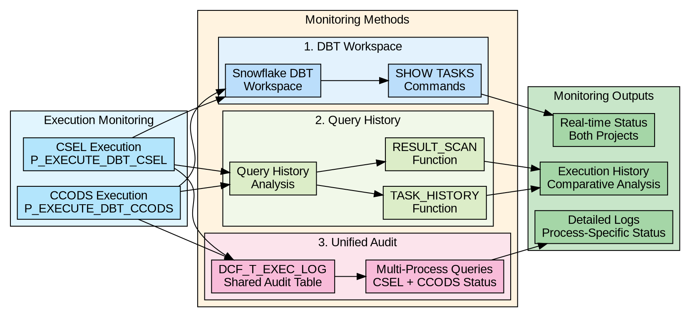

# CSEL & CCODS DBT Projects - Graphviz DOT Version

## Overview

This repository contains two complementary data pipeline projects implemented using DBT (Data Build Tool) and deployed within Snowflake:

- **CSEL (Commonwealth Bank Service Layer)**: Processes customer service data, appointments, products, and department information through 18 sequential transformations
- **CCODS (Commonwealth Bank Operations Data System)**: Processes BCFINSG data and populates the PLAN_BALN_SEGM_MSTR table through 2 sequential model groups

Both projects share the same Snowflake infrastructure and deployment framework while serving different business domains.

> **Note**: To render these Graphviz diagrams, visit https://dreampuf.github.io/GraphvizOnline/ and paste the DOT code.

---

## 🏗️ **CSEL Project**

### CSEL Execution Flow (18 Steps)

```dot
digraph CSEL_Flow {
    rankdir=TB;
    bgcolor="white";
    fontname="Arial";
    
    node [shape=box, style=filled, fontname="Arial", fontsize=10];
    edge [fontname="Arial", fontsize=8];
    
    subgraph cluster_control {
        label="Control Setup (Steps 1-5)";
        style=filled;
        fillcolor="#E1F5FE";
        
        step1 [label="Step 1\nStream Status", fillcolor="#B3E5FC"];
        step2 [label="Step 2\nISAC Check", fillcolor="#B3E5FC"];
        step3 [label="Step 3\nProcess Keys", fillcolor="#B3E5FC"];
        step4 [label="Step 4\nLookups", fillcolor="#B3E5FC"];
        step5 [label="Step 5\nFinishing Point", fillcolor="#B3E5FC"];
        
        step1 -> step2 -> step3 -> step4 -> step5;
    }
    
    subgraph cluster_data {
        label="Data Processing (Steps 6-12)";
        style=filled;
        fillcolor="#F3E5F5";
        
        step6 [label="Step 6\nStream Check", fillcolor="#E1BEE7"];
        step7 [label="Step 7\nExtract Apps", fillcolor="#E1BEE7"];
        step8 [label="Step 8\nTransform", fillcolor="#E1BEE7"];
        step9 [label="Step 9\nLoad Temp", fillcolor="#E1BEE7"];
        step10 [label="Step 10\nDelta Process", fillcolor="#E1BEE7"];
        step11 [label="Step 11\nUpdate Data", fillcolor="#E1BEE7"];
        step12 [label="Step 12\nInsert Data", fillcolor="#E1BEE7"];
        
        step6 -> step7 -> step8 -> step9 -> step10 -> step11 -> step12;
    }
    
    subgraph cluster_product {
        label="Product Processing (Steps 13-16)";
        style=filled;
        fillcolor="#FFF3E0";
        
        step13 [label="Step 13\nLoad Product Temp", fillcolor="#FFCC80"];
        step14 [label="Step 14\nProduct Delta", fillcolor="#FFCC80"];
        step15 [label="Step 15\nUpdate Products", fillcolor="#FFCC80"];
        step16 [label="Step 16\nInsert Products", fillcolor="#FFCC80"];
        
        step13 -> step14 -> step15 -> step16;
    }
    
    subgraph cluster_final {
        label="Final Loading (Steps 17-18)";
        style=filled;
        fillcolor="#E8F5E8";
        
        step17 [label="Step 17\nUpdate Dept Appt", fillcolor="#A5D6A7"];
        step18 [label="Step 18\nInsert Dept Appt", fillcolor="#A5D6A7"];
        
        step17 -> step18;
    }
    
    success [label="✅ CSEL Complete\nAll 18 Steps", fillcolor="#C8E6C9", shape=ellipse];
    failure [label="❌ CSEL Failed\nLog Error", fillcolor="#FFCDD2", shape=ellipse];
    
    step5 -> step6;
    step12 -> step13;
    step16 -> step17;
    step18 -> success;
    
    // Error paths
    {step1, step2, step3, step4, step5, step6, step7, step8, step9, step10, step11, step12, step13, step14, step15, step16, step17, step18} -> failure [style=dashed, color=red];
}
```

---

## 🏗️ **CCODS Project**

### CCODS Execution Flow (2 Steps)

```dot
digraph CCODS_Flow {
    rankdir=TB;
    bgcolor="white";
    fontname="Arial";
    
    node [shape=box, style=filled, fontname="Arial", fontsize=12];
    edge [fontname="Arial", fontsize=10];
    
    start [label="CCODS Process Start\n4:00 AM Australia/Sydney", fillcolor="#F3E5F5", shape=ellipse];
    
    subgraph cluster_ccods {
        label="CCODS Processing";
        style=filled;
        fillcolor="#F3E5F5";
        
        step1 [label="Step 1\nTransform BCFINSG\n(40_transform)", fillcolor="#E1BEE7"];
        step2 [label="Step 2\nLoad to GDW\n(60_load_gdw)", fillcolor="#E1BEE7"];
        
        step1 -> step2;
    }
    
    success [label="✅ CCODS Complete\nPLAN_BALN_SEGM_MSTR\nPopulated", fillcolor="#C8E6C9", shape=ellipse];
    failure [label="❌ CCODS Failed\nLog Error Details", fillcolor="#FFCDD2", shape=ellipse];
    
    start -> step1;
    step2 -> success;
    
    // Error paths
    step1 -> failure [style=dashed, color=red, label="Transform\nFailed"];
    step2 -> failure [style=dashed, color=red, label="Load\nFailed"];
}
```

---

## 🏛️ **Shared Infrastructure**

### Snowflake Database Structure

```dot
digraph Infrastructure {
    rankdir=TB;
    bgcolor="white";
    fontname="Arial";
    compound=true;
    
    node [shape=box, style=filled, fontname="Arial"];
    edge [fontname="Arial"];
    
    subgraph cluster_snowflake {
        label="Snowflake Environment";
        style=filled;
        fillcolor="#E3F2FD";
        fontsize=16;
        
        subgraph cluster_main_db {
            label="NPD_D12_DMN_GDWMIG Database";
            style=filled;
            fillcolor="#F3E5F5";
            
            subgraph cluster_tmp {
                label="TMP Schema";
                style=filled;
                fillcolor="#E8F5E8";
                
                csel_proc [label="P_EXECUTE_DBT_CSEL\n🔄 18 Steps", fillcolor="#E1F5FE"];
                ccods_proc [label="P_EXECUTE_DBT_CCODS\n🔄 2 Steps", fillcolor="#F3E5F5"];
                dbt_project [label="GDW1_DBT\n📦 Shared Project", fillcolor="#FFF3E0"];
                
                csel_task [label="T_EXECUTE_DBT_CSEL\n⏰ 3:00 AM", fillcolor="#E1F5FE"];
                ccods_task [label="T_EXECUTE_DBT_CCODS\n⏰ 4:00 AM", fillcolor="#F3E5F5"];
            }
        }
        
        subgraph cluster_ibrg_db {
            label="NPD_D12_DMN_GDWMIG_IBRG_V Database";
            style=filled;
            fillcolor="#E8F5E8";
            
            subgraph cluster_std {
                label="P_V_OUT_001_STD_0 Schema";
                style=filled;
                fillcolor="#FFF3E0";
                
                audit [label="DCF_T_EXEC_LOG\n📊 Unified Audit", fillcolor="#C8E6C9"];
                control [label="RUN_STRM_TMPL\n⚙️ Control Table", fillcolor="#FFECB3"];
                
                csel_models [label="📋 CSEL Models\nAppointments\nProducts\nDepartments", fillcolor="#E1F5FE"];
                ccods_models [label="📈 CCODS Models\nBCFINSG Transform\nPLAN_BALN_SEGM_MSTR", fillcolor="#F3E5F5"];
            }
        }
        
        subgraph cluster_external {
            label="External Systems";
            style=filled;
            fillcolor="#FFECB3";
            
            workspace [label="Snowflake\nDBT Workspace", fillcolor="#E3F2FD"];
            warehouse [label="wh_usr_npd_d12_gdwmig_001\nCompute Warehouse", fillcolor="#FFCDD2"];
        }
    }
    
    // Connections
    csel_task -> csel_proc [color="#4CAF50", penwidth=2];
    ccods_task -> ccods_proc [color="#4CAF50", penwidth=2];
    csel_proc -> dbt_project [color="#2196F3"];
    ccods_proc -> dbt_project [color="#9C27B0"];
    dbt_project -> workspace [color="#FF9800"];
    dbt_project -> warehouse [color="#FF9800"];
    csel_proc -> audit [color="#4CAF50"];
    ccods_proc -> audit [color="#4CAF50"];
    dbt_project -> csel_models [color="#2196F3"];
    dbt_project -> ccods_models [color="#9C27B0"];
}
```

---

## 📊 **Monitoring and Troubleshooting**

### Monitoring Methods

---

## 🔧 **Installation Sequence**

### Installation Flow

```dot
digraph Installation {
    rankdir=TB;
    bgcolor="white";
    fontname="Arial";
    
    node [shape=box, style=filled, fontname="Arial"];
    edge [fontname="Arial", fontsize=10];
    
    admin [label="Database Admin", fillcolor="#E3F2FD", shape=ellipse];
    
    subgraph cluster_csel_setup {
        label="CSEL Setup (Steps 1-4)";
        style=filled;
        fillcolor="#E1F5FE";
        
        csel_db [label="1. Deploy CSEL\nDatabase Setup", fillcolor="#B3E5FC"];
        csel_data [label="2. Deploy CSEL\nControl Data", fillcolor="#B3E5FC"];
        csel_proc [label="3. Deploy CSEL\nProcedure", fillcolor="#B3E5FC"];
        csel_task [label="4. Deploy CSEL\nTask", fillcolor="#B3E5FC"];
        
        csel_db -> csel_data -> csel_proc -> csel_task;
    }
    
    subgraph cluster_ccods_setup {
        label="CCODS Setup (Steps 5-6)";
        style=filled;
        fillcolor="#F3E5F5";
        
        ccods_proc [label="5. Deploy CCODS\nProcedure", fillcolor="#E1BEE7"];
        ccods_task [label="6. Deploy CCODS\nTask", fillcolor="#E1BEE7"];
        
        ccods_proc -> ccods_task;
    }
    
    subgraph cluster_final_setup {
        label="Final Setup (Steps 7-9)";
        style=filled;
        fillcolor="#E8F5E8";
        
        dbt_upload [label="7. Upload Shared\nDBT Project", fillcolor="#A5D6A7"];
        csel_resume [label="8. Resume\nCSEL Task", fillcolor="#A5D6A7"];
        ccods_resume [label="9. Resume\nCCODS Task", fillcolor="#A5D6A7"];
        
        dbt_upload -> csel_resume;
        dbt_upload -> ccods_resume;
    }
    
    complete [label="✅ Both Projects\nOperational", fillcolor="#C8E6C9", shape=ellipse];
    
    // Flow
    admin -> csel_db;
    csel_task -> ccods_proc;
    ccods_task -> dbt_upload;
    csel_resume -> complete;
    ccods_resume -> complete;
    
    // Success indicators
    csel_db -> success1 [style=invis];
    success1 [label="✅ Tables & Views Created", fillcolor="#C8E6C9", shape=note];
    
    csel_data -> success2 [style=invis];
    success2 [label="✅ Reference Data Populated", fillcolor="#C8E6C9", shape=note];
    
    csel_proc -> success3 [style=invis];
    success3 [label="✅ P_EXECUTE_DBT_CSEL Created", fillcolor="#C8E6C9", shape=note];
    
    csel_task -> success4 [style=invis];
    success4 [label="✅ T_EXECUTE_DBT_CSEL Created", fillcolor="#C8E6C9", shape=note];
    
    ccods_proc -> success5 [style=invis];
    success5 [label="✅ P_EXECUTE_DBT_CCODS Created", fillcolor="#C8E6C9", shape=note];
    
    ccods_task -> success6 [style=invis];
    success6 [label="✅ T_EXECUTE_DBT_CCODS Created", fillcolor="#C8E6C9", shape=note];
    
    dbt_upload -> success7 [style=invis];
    success7 [label="✅ GDW1_DBT Workspace Ready", fillcolor="#C8E6C9", shape=note];
}
```

---

*This README demonstrates Graphviz DOT diagrams with automatic layout algorithms and professional styling. Visit https://dreampuf.github.io/GraphvizOnline/ to render these diagrams.* 