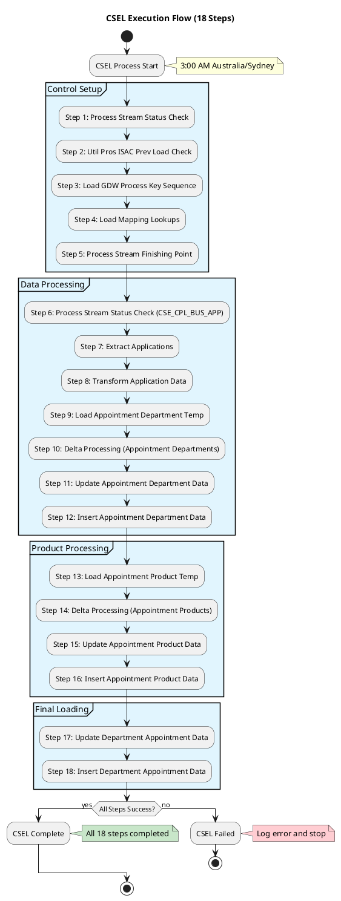
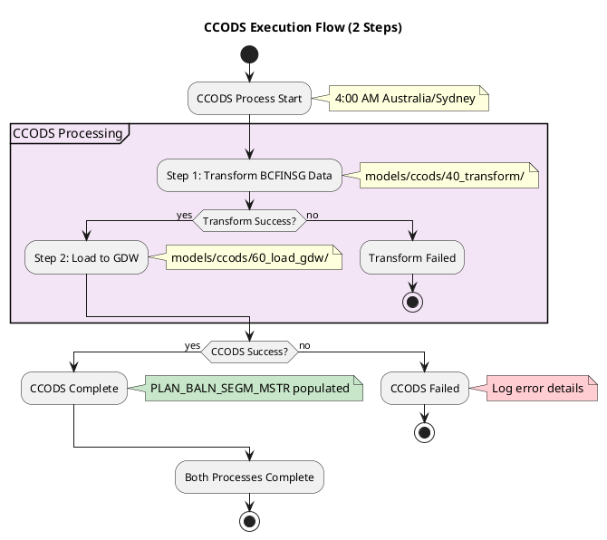
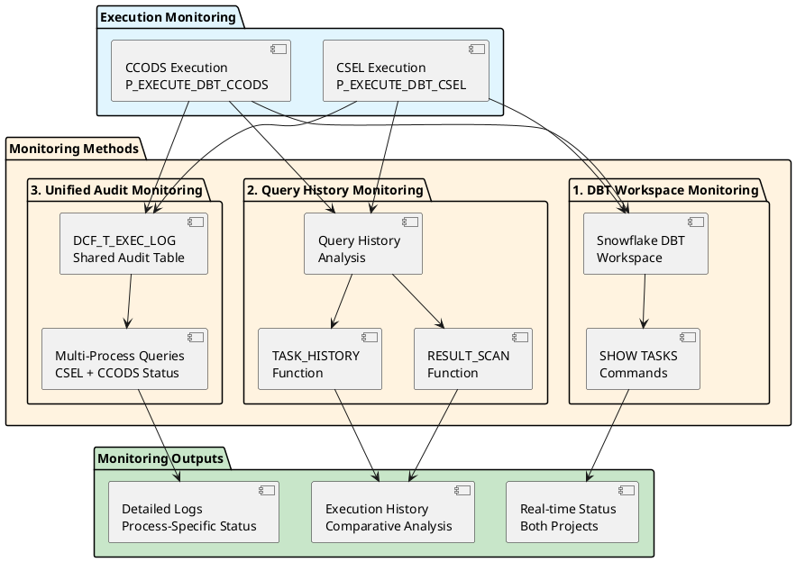

# CSEL & CCODS DBT Projects - PlantUML Version

## Overview

This repository contains two complementary data pipeline projects implemented using DBT (Data Build Tool) and deployed within Snowflake:

- **CSEL (Commonwealth Bank Service Layer)**: Processes customer service data, appointments, products, and department information through 18 sequential transformations
- **CCODS (Commonwealth Bank Operations Data System)**: Processes BCFINSG data and populates the PLAN_BALN_SEGM_MSTR table through 2 sequential model groups

Both projects share the same Snowflake infrastructure and deployment framework while serving different business domains.

---

## 🏗️ **CSEL Project**

### CSEL Execution Flow (18 Steps)

---

## 🏗️ **CCODS Project**

### CCODS Execution Flow (2 Steps)

---

## 🏛️ **Shared Infrastructure**

### Snowflake Database Structure

```plantuml
@startuml Infrastructure
!define SNOWFLAKE_COLOR #E3F2FD
!define CSEL_COLOR #E1F5FE
!define CCODS_COLOR #F3E5F5
!define AUDIT_COLOR #C8E6C9

package "Snowflake Environment" SNOWFLAKE_COLOR {
  
  package "NPD_D12_DMN_GDWMIG Database" {
    package "TMP Schema" {
      [P_EXECUTE_DBT_CSEL\n🔄 18 Steps] as CSEL_PROC CSEL_COLOR
      [P_EXECUTE_DBT_CCODS\n🔄 2 Steps] as CCODS_PROC CCODS_COLOR
      [GDW1_DBT\n📦 Shared Project] as DBT
      
      [T_EXECUTE_DBT_CSEL\n⏰ 3:00 AM] as CSEL_TASK CSEL_COLOR
      [T_EXECUTE_DBT_CCODS\n⏰ 4:00 AM] as CCODS_TASK CCODS_COLOR
    }
  }
  
  package "NPD_D12_DMN_GDWMIG_IBRG_V Database" {
    package "P_V_OUT_001_STD_0 Schema" {
      [DCF_T_EXEC_LOG\n📊 Unified Audit] as AUDIT AUDIT_COLOR
      [RUN_STRM_TMPL\n⚙️ Control Table] as CONTROL
      
      package "Model Outputs" {
        [📋 CSEL Models\nAppointments, Products, Departments] as CSEL_MODELS CSEL_COLOR
        [📈 CCODS Models\nBCFINSG, PLAN_BALN_SEGM_MSTR] as CCODS_MODELS CCODS_COLOR
      }
    }
  }
  
  package "External Systems" {
    [Snowflake\nDBT Workspace] as WORKSPACE
    [wh_usr_npd_d12_gdwmig_001\nCompute Warehouse] as WAREHOUSE
  }
}

' Connections
CSEL_TASK --> CSEL_PROC
CCODS_TASK --> CCODS_PROC
CSEL_PROC --> DBT
CCODS_PROC --> DBT
DBT --> WORKSPACE
DBT --> WAREHOUSE
CSEL_PROC --> AUDIT
CCODS_PROC --> AUDIT
DBT --> CSEL_MODELS
DBT --> CCODS_MODELS

@enduml
```

---

## 📊 **Monitoring and Troubleshooting**

### Monitoring Methods

---

## 🔧 **Installation Sequence**

```plantuml
@startuml Installation
participant Admin as "Database Admin"
participant CSEL as "CSEL Installation"
participant CCODS as "CCODS Installation"
participant DBT as "DBT Workspace"

Admin->>CSEL: 1. Deploy CSEL Database Setup
CSEL->>Admin: ✅ Tables & Views Created

Admin->>CSEL: 2. Deploy CSEL Control Data
CSEL->>Admin: ✅ Reference Data Populated

Admin->>CSEL: 3. Deploy CSEL Procedure
CSEL->>Admin: ✅ P_EXECUTE_DBT_CSEL Created

Admin->>CSEL: 4. Deploy CSEL Task
CSEL->>Admin: ✅ T_EXECUTE_DBT_CSEL Created

Admin->>CCODS: 5. Deploy CCODS Procedure
CCODS->>Admin: ✅ P_EXECUTE_DBT_CCODS Created

Admin->>CCODS: 6. Deploy CCODS Task
CCODS->>Admin: ✅ T_EXECUTE_DBT_CCODS Created

Admin->>DBT: 7. Upload Shared DBT Project
DBT->>Admin: ✅ GDW1_DBT Workspace Ready

Admin->>CSEL: 8. Resume CSEL Task
Admin->>CCODS: 9. Resume CCODS Task

Note over Admin, DBT: Both projects now scheduled and operational

@enduml
```

---

*This README demonstrates PlantUML diagrams with professional styling and comprehensive coverage.* 