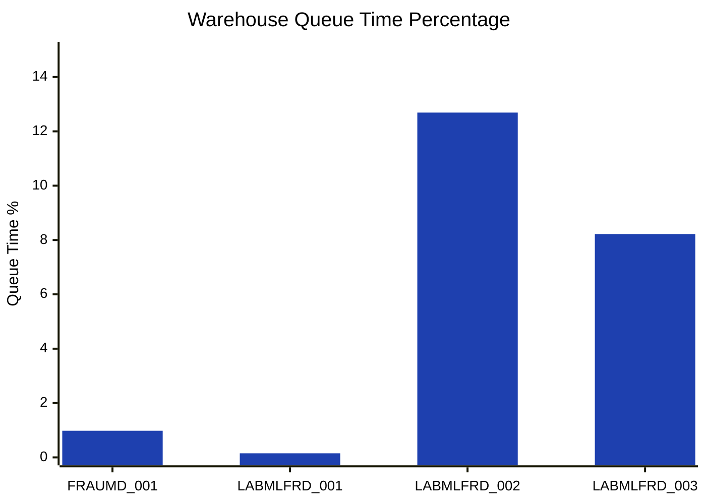
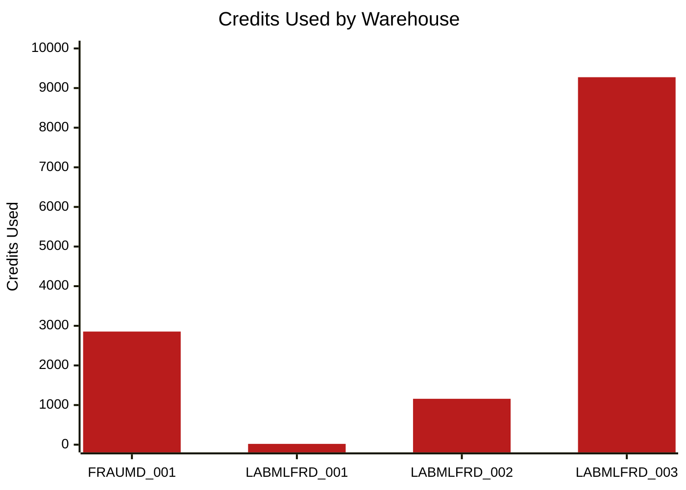
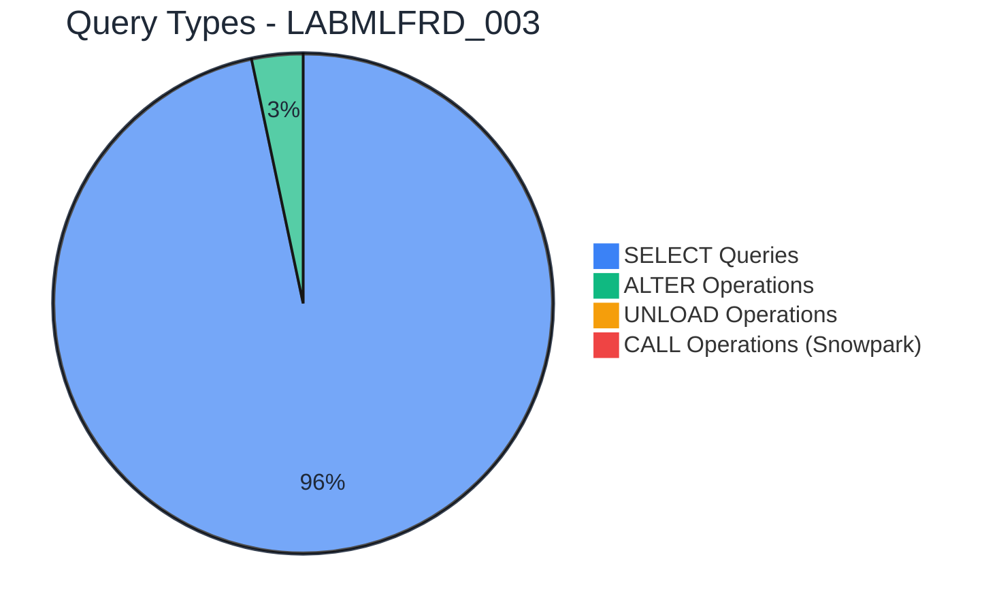
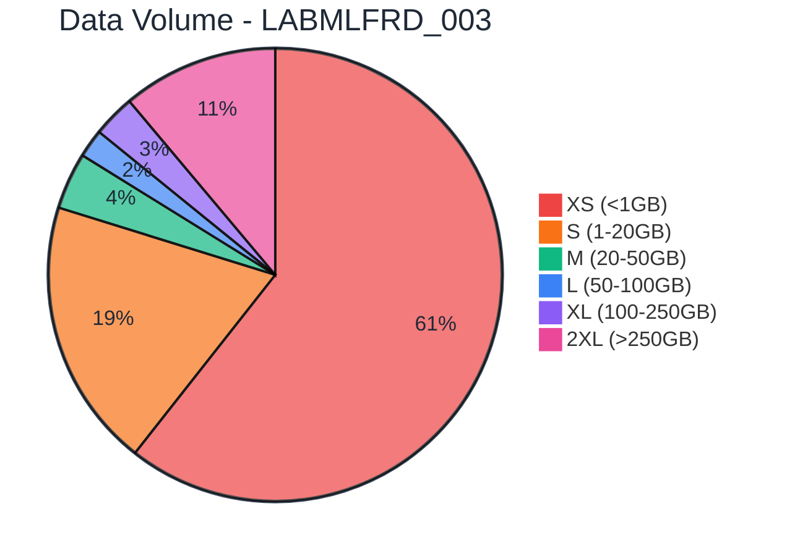
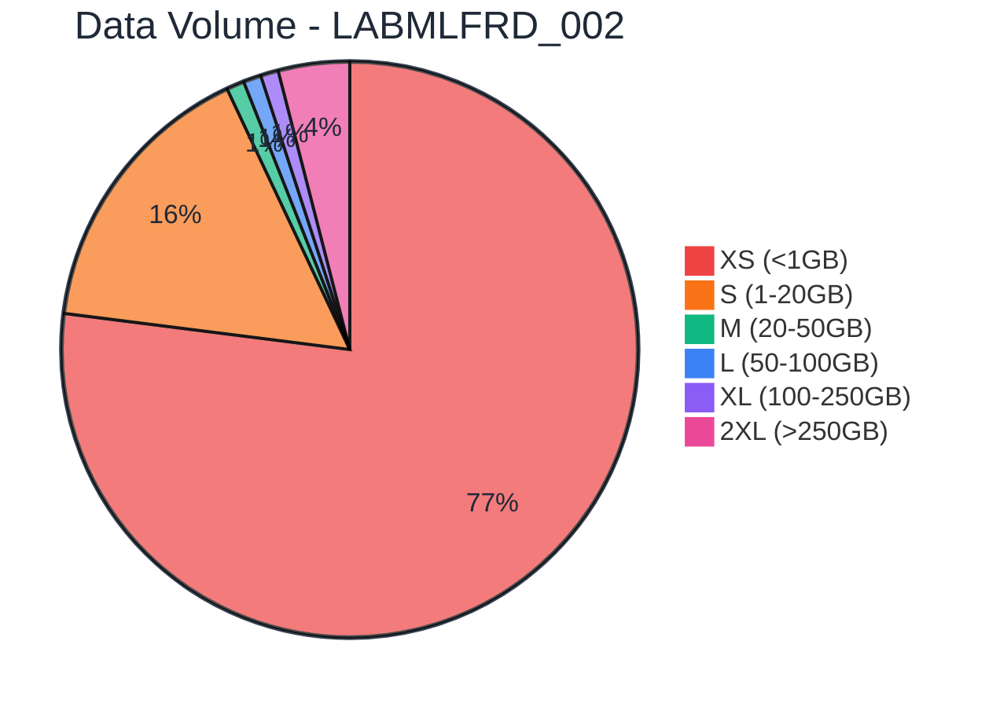

# FRAUMD Warehouses: Usage Analysis & Optimization Guide

## 🧭 Quick Navigation
- [📋 Overview](#overview)
- [📚 Definitions](#definitions)
  - [Warehouse Type Definitions](#warehouse-type-definitions)
  - [Query Sizing Band Definitions](#query-sizing-band-definitions)
- [🏗️ Current State Setup](#current-state-setup)
- [📊 Findings](#findings)
- [🎯 Recommendations](#recommendations)
- [🌳 Warehouse Selection Guidelines](#warehouse-selection-guidelines)
- [📋 Appendix](#appendix)

---

## 📋 Overview

This comprehensive analysis examines the usage patterns, performance characteristics, and cost efficiency of four FRAUMD warehouses over the past two months. The primary objective is to identify optimization opportunities, resolve configuration mismatches, and provide actionable recommendations for improving warehouse utilization and reducing operational costs.

**Key Objectives:**
- **Identify Misconfigurations:** Detect warehouses running inappropriate workloads for their size and type
- **Optimize Cost Efficiency:** Recommend right-sizing and workload redistribution strategies
- **Improve Performance:** Eliminate bottlenecks and enhance query execution patterns
- **Establish Best Practices:** Provide decision frameworks for future warehouse selection and management

**Analysis Scope:**
- **Analysis Period:** Last 2 months  
- **Warehouses Analyzed:** 4 FRAUMD warehouses

---

## 📚 Definitions

### Warehouse Type Definitions

| **Warehouse Type** | **Purpose** | **Compute Characteristics** | **Best For** | **Memory Options** |
|-------------------|-------------|------------------------------|--------------|-------------------|
| **Standard** | General-purpose SQL operations (SELECT, INSERT, UPDATE, CTAS) | Balanced CPU and memory allocation | Traditional data analytics, ETL operations, reporting | Standard allocation |
| **Snowpark-Optimized (SOW)** | Custom code execution (Python, Java, Scala) | Specialized for User-Defined Functions (UDFs) and stored procedures | Machine learning, data science, custom algorithms | SOW_MEMORY_16X (16x allocation) or Standard SOW |

### Query Size Classification

| **Size Band** | **Full Name** | **Data Volume Range** | **Typical Use Cases** |
|---------------|---------------|----------------------|----------------------|
| **XS** | Extra Small | < 1GB | Metadata queries, small lookups, simple SELECT statements |
| **S** | Small | 1-20GB | Standard reporting, moderate joins, filtered analytics |
| **M** | Medium | 20-50GB | Complex analytics, multi-table joins, aggregations |
| **L** | Large | 50-100GB | Large-scale ETL, comprehensive reporting, data processing |
| **XL** | Extra Large | 100-250GB | Heavy analytics, large data transformations, ML feature engineering |
| **2XL** | Double Extra Large | > 250GB | Massive data processing, full table scans, enterprise-wide analytics |

*These bands help identify workload patterns and determine optimal warehouse sizing for different query types.*

---

## 🏗️ Current State Setup

*Source: `Fraud-Warehouse Setup Info.csv`*

| **Warehouse** | **Size** | **Type** | **Max Clusters** | **Auto-Suspend** | **Created** |
|---------------|----------|----------|------------------|-------------------|-------------|
| **LABMLFRD_003 (2XL SOW)** | 2X-Large | **SOW_MEMORY_16X** | 1 | 600s | 2025-01-31 |
| **FRAUMD_001 (XL STD)** | X-Large | Standard | 2 | 300s | 2023-11-08 |
| **LABMLFRD_002 (XL SOW)** | X-Large | **SOW_MEMORY_16X** | 2 | 30s | 2024-07-22 |
| **LABMLFRD_001 (XS STD)** | X-Small | Standard | 2 | 30s | 2024-05-27 |

### Current Concurrency Patterns
*Source: `PS ACCOUNT REVIEW - AVG RUNNING 4 WHS.csv`*

| **Warehouse** | **Queue %** | **Peak Concurrency** |
|---------------|-------------|--------------------|
| **LABMLFRD_003 (2XL SOW)** | 8.22% | Always Active |
| **FRAUMD_001 (XL STD)** | 0.98% | Low Concurrency |
| **LABMLFRD_002 (XL SOW)** | 12.69% | Low-Medium |
| **LABMLFRD_001 (XS STD)** | 0.15% | Very Low |

#### Queue Time Distribution



### Current Usage Patterns
*Source: `CBA CDL PROD - warehouse_utilisation.csv`*

| **Warehouse** | **Size** | **Query Count** | **Credits Used** | **XS (<1GB)** | **S (1-20GB)** | **M (20-50GB)** | **L (50-100GB)** | **XL (100-250GB)** | **2XL (>250GB)** |
|---------------|----------|-----------------|------------------|---------------|----------------|-----------------|------------------|-------------------|------------------|
| **FRAUMD_001 (XL STD)** | X-Large | 5,057 | 2,855 | 62% | 25% | 4% | 2% | 2% | 6% |
| **LABMLFRD_001 (XS STD)** | X-Small | 624 | 20 | 91% | 8% | 0% | 0% | 0% | 0% |
| **LABMLFRD_002 (XL SOW)** | X-Large | 2,219 | 1,158 | 77% | 16% | 1% | 1% | 1% | 4% |
| **LABMLFRD_003 (2XL SOW)** | 2X-Large | 2,998 | 9,274 | 60% | 19% | 4% | 2% | 3% | 11% |

#### Query Size Distribution by Warehouse

```mermaid
%%{init: {'theme':'base', 'themeVariables': { 'primaryColor': '#1e40af', 'primaryTextColor': '#000000', 'primaryBorderColor': '#1e3a8a', 'lineColor': '#000000', 'secondaryColor': '#059669', 'tertiaryColor': '#f8fafc', 'background': '#ffffff', 'fontFamily': 'Arial', 'xyChart': {'backgroundColor': '#ffffff', 'titleColor': '#000000', 'xAxisTitleColor': '#000000', 'xAxisLabelColor': '#000000', 'yAxisTitleColor': '#000000', 'yAxisLabelColor': '#000000', 'plotColorPalette': '#1e40af,#7c3aed,#dc2626,#059669,#ea580c,#0891b2'}}}}%%
xychart-beta
    title "Query Size Band Distribution by Warehouse (%)"
    x-axis ["FRAUMD_001", "LABMLFRD_001", "LABMLFRD_002", "LABMLFRD_003"]
    y-axis "Percentage" 0 --> 100
    bar "XS (<1GB)" [62, 91, 77, 60]
    bar "S (1-20GB)" [25, 8, 16, 19]
    bar "M (20-50GB)" [4, 0, 1, 4]
    bar "L (50-100GB)" [2, 0, 1, 2]
    bar "XL (100-250GB)" [2, 0, 1, 3]
    bar "2XL (>250GB)" [6, 0, 4, 11]
```



**Legend:**
- 🔵 **XS (<1GB)** - Extra Small queries, ideal for small warehouses
- 🟣 **S (1-20GB)** - Small queries, suitable for small to medium warehouses  
- 🔴 **M (20-50GB)** - Medium queries, appropriate for medium warehouses
- 🟢 **L (50-100GB)** - Large queries, require large warehouses
- 🟠 **XL (100-250GB)** - Extra Large queries, need extra large warehouses
- 🔵 **2XL (>250GB)** - Double Extra Large queries, require 2X-Large warehouses

#### Credits Usage by Warehouse



---

## 📊 Findings

### Detailed Sizing Distribution Heat Map
*Source: `CBA CDL PROD - warehouse_utilisation.csv`*



```mermaid
%%{init: {'theme':'base', 'themeVariables': { 'primaryColor': '#1f2937', 'primaryTextColor': '#1f2937', 'primaryBorderColor': '#374151', 'lineColor': '#6b7280', 'secondaryColor': '#10b981', 'tertiaryColor': '#f9fafb', 'background': '#ffffff', 'clusterBkg': '#f3f4f6', 'clusterBorder': '#d1d5db'}}}%%
flowchart LR
    subgraph "🔥 Query Size Distribution Heat Map"
        subgraph "STANDARD WAREHOUSES"
            direction TB
            STD_TITLE["📊 STANDARD WAREHOUSES"]
            
            subgraph "FRAUMD_001 (XL STD)"
                direction LR
                F001_XS["🟡 XS: 62%<br/>High"]
                F001_S["🟢 S: 25%<br/>Good"]
                F001_M["🟢 M: 4%<br/>Normal"]
                F001_L["🟢 L: 2%<br/>Normal"]
                F001_XL["🟢 XL: 2%<br/>Low"]
                F001_2XL["🟡 2XL: 6%<br/>Medium"]
            end
            
            subgraph "LABMLFRD_001 (XS STD)"
                direction LR
                L001_XS["🟢 XS: 91%<br/>Perfect"]
                L001_S["🟢 S: 8%<br/>Good"]
                L001_M["🟢 M: 0%<br/>None"]
                L001_L["🟢 L: 0%<br/>None"]
                L001_XL["🟢 XL: 0%<br/>None"]
                L001_2XL["🟢 2XL: 0%<br/>None"]
            end
        end
        
        subgraph "SNOWPARK-OPTIMIZED WAREHOUSES"
            direction TB
            SOW_TITLE["🐍 SNOWPARK-OPTIMIZED WAREHOUSES"]
            
            subgraph "LABMLFRD_002 (XL SOW)"
                direction LR
                L002_XS["🔴 XS: 77%<br/>CRITICAL"]
                L002_S["🟡 S: 16%<br/>High"]
                L002_M["🟡 M: 1%<br/>UNDERUTILIZED"]
                L002_L["🔴 L: 1%<br/>SEVERELY LOW"]
                L002_XL["🔴 XL: 1%<br/>SEVERELY LOW"]
                L002_2XL["🟡 2XL: 4%<br/>UNDERUTILIZED"]
            end
            
            subgraph "LABMLFRD_003 (2XL SOW)"
                direction LR
                L003_XS["🔴 XS: 60%<br/>ALARMING"]
                L003_S["🟡 S: 19%<br/>High"]
                L003_M["🟢 M: 4%<br/>Normal"]
                L003_L["🟢 L: 2%<br/>Normal"]
                L003_XL["🟡 XL: 3%<br/>Medium"]
                L003_2XL["🔴 2XL: 11%<br/>CRITICAL"]
            end
        end
    end
    
    classDef critical fill:#ff6b6b,stroke:#d63031,stroke-width:3px,color:#fff
    classDef warning fill:#ffeaa7,stroke:#fdcb6e,stroke-width:2px,color:#000
    classDef good fill:#00b894,stroke:#00a085,stroke-width:2px,color:#fff
    classDef titleStyle fill:#e3f2fd,stroke:#1976d2,stroke-width:2px,color:#000
    
    class L003_XS,L003_2XL,L002_XS,L002_L,L002_XL critical
    class L003_S,L003_XL,F001_XS,F001_2XL,L002_S,L002_M,L002_2XL warning
    class L003_M,L003_L,F001_S,F001_M,F001_L,F001_XL,L001_XS,L001_S,L001_M,L001_L,L001_XL,L001_2XL good
    class STD_TITLE,SOW_TITLE titleStyle
```

**🚨 Heat Map Legend:**
- 🔴 **CRITICAL/ALARMING** (60%+ small queries on X-Large+ warehouses, OR <5% large queries on high-capacity warehouses)
- 🟡 **WARNING/HIGH** (40-60% small queries on large warehouses, OR underutilized capacity for warehouse type)  
- 🟢 **GOOD** (Acceptable distribution for warehouse size and type)

**📊 Raw Distribution Table:**

| **Warehouse** | **XS (<1GB)** | **S (1-20GB)** | **M (20-50GB)** | **L (50-100GB)** | **XL (100-250GB)** | **2XL (>250GB)** |
|---------------|---------------|----------------|-----------------|------------------|-------------------|------------------|
| **FRAUMD_001 (XL STD)** | 🟡 62% | 🟢 25% | 🟢 4% | 🟢 2% | 🟢 2% | 🟡 6% |
| **LABMLFRD_001 (XS STD)** | 🟢 91% | 🟢 8% | 🟢 0% | 🟢 0% | 🟢 0% | 🟢 0% |
| **LABMLFRD_002 (XL SOW)** | 🔴 77% | 🟡 16% | 🟡 1% | 🔴 1% | 🔴 1% | 🟡 4% |
| **LABMLFRD_003 (2XL SOW)** | 🔴 60% | 🟡 19% | 🟢 4% | 🟢 2% | 🟡 3% | 🔴 11% |

### 🚨 Issues Identified

#### 🔴 Issue #1: LABMLFRD_003 (2XL SOW)

**Workload Analysis:**
- **Warehouse Specification:** 2X-Large SOW_MEMORY_16X (Snowpark Optimized)
- **Current Usage Pattern:** 99.86% standard SQL operations

**Actual Usage Pattern:**
*Source: `Fraud-Query complexity analysis.csv`*
- 100,065 SELECT queries (standard SQL)
- 3,436 ALTER operations (metadata)
- 148 UNLOAD operations (standard)
- **Only 139 CALL operations** (legitimate Snowpark usage)

#### Query Type Distribution



**Data Volume Distribution:**
*Source: `CBA CDL PROD - warehouse_utilisation.csv`*
- 60% of queries scan <1GB (optimal for Small/Medium warehouse)
- 19% scan 1-20GB (well-suited for Large warehouse)
- Only 11% scan >250GB (requiring 2X-Large capacity)

#### Data Volume Scanned Distribution



#### 🔴 Issue #2: LABMLFRD_002 (XL SOW)

**Workload Analysis:**
- **Warehouse Specification:** X-Large SOW_MEMORY_16X (Snowpark Optimized for ML/Python workloads)
- **Current Usage Pattern:** 77% small queries (<1GB), 94% standard SQL operations

**Data Volume Distribution:**
*Source: `CBA CDL PROD - warehouse_utilisation.csv`*
- 77% of queries scan <1GB (optimal for Small warehouse)
- 16% scan 1-20GB (well-suited for Medium warehouse)
- Only 7% scan >20GB (requiring larger warehouse capacity)

#### Data Volume Scanned Distribution



**Snowpark Utilization Mismatch:**
- **SOW Purpose:** Python/Java/Scala UDFs, ML algorithms, data science workloads
- **Actual Usage:** Predominantly standard SQL queries that don't require Snowpark capabilities
- **Efficiency Loss:** ~70% of specialized compute capacity wasted on inappropriate workloads

#### ⚠️ Secondary Issues

**Issue #3: Universal Cache Miss**
*Source: `Fraud-Cache Efficiency Analysis.csv`*
- 0% cache hit rate across all warehouses
- Missed performance optimization opportunities

**Issue #4: Spillage Patterns**
*Source: `Fraud-Spillage analysis.csv`*
- LABMLFRD_003 (2XL SOW): 2,860 local spills + 10 remote spills
- FRAUMD_001 (XL STD): 5,292 local spills + 22 remote spills

### Key Insights Summary:
- **FRAUMD_001 (XL STD)**: Moderate inefficiency with 62% small queries, but better balanced than other large warehouses
- **LABMLFRD_001 (XS STD)**: Perfect sizing with 91% small queries on X-Small - **OPTIMAL CONFIGURATION**
- **LABMLFRD_002 (XL SOW)**: **CRITICAL MISALIGNMENT** - 77% small queries on Snowpark warehouse + severe underutilization (only 6% L/XL/2XL queries justify SOW)
- **LABMLFRD_003 (2XL SOW)**: Despite being 2X-Large Snowpark, 60% of queries are small (<1GB) - **CRITICAL MISALIGNMENT**

---

## 🎯 Recommendations

### LABMLFRD_003 (2XL SOW) Workload Redistribution

**Analysis: Should we create new warehouse or redistribute to FRAUMD_001 (XL STD)?**

*Source: `PS ACCOUNT REVIEW - AVG RUNNING 4 WHS.csv`*

**Recommendation: Redistribute to FRAUMD_001 (XL STD)**

**Rationale:**
1. **FRAUMD_001 (XL STD) has significant spare capacity** - Queue time of only 0.98% (very low) indicates significant unused capacity
2. **Low concurrency pressure** - Minimal queue times indicate no resource contention
3. **Cost-effective:** Use existing resources vs creating new warehouse
4. **Similar workload profiles:** Both handle mixed SELECT/CTAS operations
5. **Partition Pruning Benefits:** Moving queries to appropriately-sized warehouse will improve partition pruning efficiency, as smaller warehouses are better optimized for targeted data access patterns

**Implementation Plan:**

```sql
-- Phase 1: Migrate SELECT queries to FRAUMD_001 (XL STD)
-- Target: 100,065 SELECT queries from LABMLFRD_003 (2XL SOW)
-- Benefit: Improved partition pruning on right-sized warehouse

-- Phase 2: Keep only Snowpark workloads on LABMLFRD_003 (2XL SOW)
-- Downsize to Large SOW_MEMORY_16X for 139 CALL operations

-- Phase 3: Monitor and adjust
-- Track FRAUMD_001 (XL STD) utilization and enable multi-cluster if needed
```

### LABMLFRD_002 (XL SOW) Workload Redistribution

**Analysis: Similar Snowpark Misalignment Issue**

**Recommendation: Parallel Redistribution Strategy**

**Rationale:**
1. **Significant workload misalignment** - X-Large SOW_MEMORY_16X configuration with 77% small queries (<1GB) and 94% standard SQL operations
2. **Substantial cost inefficiency** - 1,158 credits used (lower than LABMLFRD_003 but still significant waste for inappropriate workloads)

**Implementation Plan for LABMLFRD_002 (XL SOW):**

```sql
-- Phase 1: Migrate small queries from LABMLFRD_002 (XL SOW) to FRAUMD_001 (XL STD)
-- Target: 77% of queries (predominantly SELECT operations)
-- Benefit: Enhanced partition pruning efficiency on appropriately-sized standard warehouse

-- Phase 2: Evaluate remaining workloads
-- Determine if legitimate Snowpark workloads justify SOW configuration

-- Phase 3: Consider downsizing or converting to Standard
-- If minimal Snowpark usage, convert to X-Large Standard
-- Optimize partition pruning by matching warehouse size to typical query patterns
```

### Gen 2 Standard Warehouse Strategy

**Recommendation: Implement Gen 2 Standard Warehouses for Performance-Critical Workloads**

**Benefits:**
- **Enhanced Performance:** Gen 2 warehouses provide up to 2x faster query execution for small to medium workloads
- **Better Resource Utilization:** Improved compute efficiency reduces the need for oversized warehouses
- **Cost-Effective Alternative:** Replace expensive SOW warehouses with appropriately-sized Gen 2 Standard warehouses for non-ML workloads
- **Improved User Experience:** Faster response times for interactive dashboards and ad-hoc queries

**Implementation Strategy:**
```sql
-- Create Gen 2 warehouses for performance-critical small workloads
CREATE WAREHOUSE WH_FRAUMD_XS_GEN2 WITH 
    WAREHOUSE_SIZE = 'X-SMALL' 
    WAREHOUSE_TYPE = 'STANDARD'  -- Gen 2 when available
    AUTO_SUSPEND = 30;

CREATE WAREHOUSE WH_FRAUMD_S_GEN2 WITH 
    WAREHOUSE_SIZE = 'SMALL' 
    WAREHOUSE_TYPE = 'STANDARD'  -- Gen 2 when available
    AUTO_SUSPEND = 60;
```

**Target Migration:**
- **From LABMLFRD_003 (2XL SOW):** Migrate 60% XS queries to XS Gen 2, 19% S queries to S Gen 2
- **From LABMLFRD_002 (XL SOW):** Migrate 77% XS queries to XS Gen 2, 16% S queries to S Gen 2

**Note: Multi-Cluster FRAUMD_001 (XL STD)**
*If redistribution causes concurrency issues:*

```sql
ALTER WAREHOUSE WH_USR_PRD_P01_FRAUMD_001 
SET AUTO_SCALE_MODE = 'STANDARD'
    MIN_CLUSTER_COUNT = 1
    MAX_CLUSTER_COUNT = 3;
```

### Partition Pruning Optimization Strategy

**Key Principle:** Match warehouse size to typical data scan patterns for optimal partition pruning

**Current Issues:**
- Large warehouses processing small queries bypass partition pruning benefits
- Small data scans on oversized warehouses create resource waste
- Partition pruning works best when warehouse size matches expected data volume

**Optimization Approach:**
1. **Route small queries (<1GB) to FRAUMD_001 (XL STD)** - optimal partition pruning for targeted scans
2. **Reserve SNOWPARK-OPTIMIZED warehouses for specialized workloads** - maintain partition efficiency for ML operations
3. **Monitor partition scan efficiency** - track improvements in query performance post-redistribution

### Expected Benefits

**Standard Warehouse Optimization:**
- **FRAUMD_001 (XL STD):** Increase utilization significantly (accepting workloads from both SOW warehouses)
- **LABMLFRD_003 (2XL SOW):** Right-size from 2X-Large to Large SOW
- **LABMLFRD_002 (XL SOW):** Right-size from X-Large SOW to Medium/Large Standard (if no legitimate Snowpark workloads)

**Gen 2 Warehouse Benefits:**
- **Performance Improvement:** 2x faster execution for small to medium queries
- **Cost Optimization:** Replace oversized SOW warehouses with appropriately-sized Gen 2 Standard warehouses
- **Enhanced User Experience:** Faster response times for interactive workloads
- **Resource Efficiency:** Better compute utilization without over-provisioning

**Partition Pruning Optimization Benefits:**
- **Query Performance Enhancement:** Improved execution times through better warehouse-to-workload matching
- **Resource Utilization:** Small warehouses excel at partition pruning for targeted data access
- **Scan Efficiency:** Reduced data scanning through appropriate warehouse sizing
- **Cost-Performance Balance:** Optimal resource allocation based on actual data volume requirements

**Combined Impact:**
- **Cost Efficiency:** Eliminate 70%+ of inappropriate Snowpark usage across both warehouses
- **Performance Optimization:** Enhanced query execution through partition pruning and right-sizing
- **Operational Excellence:** Clear workload routing with performance and cost benefits
- **Scalability:** Portfolio approach supports future growth and diverse workload patterns
- **Data Access Efficiency:** Better partition pruning and join filtering optimization

---

## 📚 Query Optimization Fundamentals

### Partition Pruning and Join Filtering

Understanding these core concepts is essential for writing effective queries and selecting appropriate warehouses:

#### 🎯 Static Partition Pruning

**Definition:** Snowflake automatically eliminates irrelevant micro-partitions during query planning based on filter conditions.

**How it works:**
- Snowflake maintains metadata about min/max values for each micro-partition
- When queries include WHERE clauses on clustered columns, irrelevant partitions are skipped
- This happens at query compile time, before any data is scanned

**Practical Example:**
```sql
-- Efficient: Static pruning eliminates partitions outside date range
SELECT customer_id, amount 
FROM transactions 
WHERE transaction_date BETWEEN '2024-01-01' AND '2024-01-31';

-- Less efficient: Function prevents static pruning
SELECT customer_id, amount 
FROM transactions 
WHERE YEAR(transaction_date) = 2024;
```

**Best Practices:**
- Use direct column comparisons in WHERE clauses
- Avoid functions on filtered columns when possible
- Consider clustering keys for frequently filtered columns
- Smaller warehouses benefit more from effective pruning

#### 🔗 Join Filtering (Bloom Filters)

**Definition:** Snowflake uses bloom filters to eliminate rows early in join operations, reducing data movement between compute nodes.

**How it works:**
- During join processing, Snowflake creates bloom filters from the smaller table
- These filters eliminate non-matching rows from the larger table before the actual join
- Reduces network traffic and memory usage significantly

**Practical Example:**
```sql
-- Efficient: Small dimension table creates effective bloom filter
SELECT c.customer_name, SUM(o.amount)
FROM customers c
JOIN orders o ON c.customer_id = o.customer_id
WHERE c.region = 'APAC'
GROUP BY c.customer_name;

-- Consider: Large-to-large joins may benefit from different warehouse sizing
SELECT a.*, b.*
FROM large_table_a a
JOIN large_table_b b ON a.key = b.key;
```

**Optimization Tips:**
- Ensure smaller tables are on the "build" side of joins
- Use appropriate data types for join keys
- Consider warehouse sizing based on join complexity
- Monitor query profiles for join spilling

#### 💡 Warehouse Sizing Impact

**Small Warehouses (XS, S):**
- Excel with effective partition pruning
- Optimal for targeted queries with good filtering
- Limited memory may cause issues with large joins

**Large Warehouses (L, XL, 2XL):**
- Handle complex joins with bloom filtering efficiently
- More memory available for join processing
- May be oversized for well-pruned queries

---

## 🌳 Warehouse Selection Guidelines

### Warehouse Selection Decision Matrix

#### By Data Volume:
| **Scan Size** | **Recommended Size** | **Warehouse Type** | **Rationale** |
|---------------|---------------------|-------------------|---------------|
| < 1GB | X-Small/Small | STANDARD | Cost-effective for targeted queries, optimal partition pruning |
| 1-20GB | Medium/Large | STANDARD | Balanced performance and cost, efficient partition scanning |
| 50GB+ | Large/X-Large+ | STANDARD | Required for large data processing, complex partition operations |
| ML/Python Workloads | Medium+ | SNOWPARK-OPTIMIZED | Specialized compute for custom algorithms |

#### By Query Type:
| **Query Type** | **Warehouse Type** | **Size Guidance** | **Partition Considerations** |
|----------------|-------------------|------------------|------------------------------|
| Simple SELECT | STANDARD | Match data volume | Small warehouses optimize partition pruning |
| Complex JOINS | STANDARD | Large+ recommended | Balance partition pruning with join performance |
| CTAS Operations | STANDARD | Match source data volume | Consider target table partitioning strategy and source data size |
| **ML/Python/Java** | **SNOWPARK-OPTIMIZED** | Medium+ based on complexity | Partition-aware ML algorithms benefit from right-sizing |
| Metadata (ALTER, DDL) | STANDARD | X-Small sufficient | Minimal partition impact |

#### By Concurrency:
| **User Count** | **Configuration** | **Auto-Scaling** | **Partition Impact** |
|----------------|------------------|------------------|----------------------|
| 1-5 users | Single cluster | Not needed | Consistent partition pruning performance |
| 5-15 users | Multi-cluster | 2-3 clusters | Balanced partition access across clusters |
| 15+ users | Multi-cluster | 3-5 clusters | Distributed partition processing |

### 🌳 Warehouse Selection Decision Tree

> **📄 For complete mermaid code and additional diagrams, see:** [`Warehouse_Selection_Decision_Tree.md`](./Warehouse_Selection_Decision_Tree.md)

```mermaid
flowchart TD
    Start([🏁 Choose Warehouse]) --> Workload{What type of workload?}
    
    Workload --> SQL[📊 SQL Query<br/>Analytics]
    Workload --> Snowpark[🐍 Python/Java<br/>Snowpark]
    Workload --> Metadata[⚙️ Metadata Ops<br/>DDL/ALTER]
    Workload --> Mixed[🔄 Mixed<br/>Workload]
    
    %% Snowpark Path
    Snowpark --> MemNeeds{Memory intensive?}
    MemNeeds -->|Yes| LargeSOW[Large+ SOW<br/>Memory 16X]
    MemNeeds -->|No| MediumSOW[Medium+ SOW<br/>Standard]
    
    %% Metadata Path
    Metadata --> XSmallStd[X-Small<br/>STANDARD]
    
    %% Mixed and SQL Paths
    Mixed --> DataVol1{Data Volume<br/>Scanned?}
    SQL --> DataVol2{How much data<br/>scanned?}
    
    %% Data Volume Decision Tree
    DataVol1 --> Vol1[< 1GB]
    DataVol1 --> Vol2[1-20GB]
    DataVol1 --> Vol3[20-100GB]
    DataVol1 --> Vol4[> 100GB]
    
    DataVol2 --> Vol5[< 1GB]
    DataVol2 --> Vol6[1-20GB]
    DataVol2 --> Vol7[20-100GB]
    DataVol2 --> Vol8[> 100GB]
    
    %% Memory Decision for each volume
    Vol1 --> Mem1{Memory intensive?}
    Vol2 --> Mem2{Memory intensive?}
    Vol3 --> Mem3{Memory intensive?}
    Vol4 --> Mem4{Memory intensive?}
    Vol5 --> Mem5{Memory intensive?}
    Vol6 --> Mem6{Memory intensive?}
    Vol7 --> Mem7{Memory intensive?}
    Vol8 --> Mem8{Memory intensive?}
    
    %% Final Recommendations
    Mem1 -->|No| XSmallStd1[X-Small<br/>STANDARD]
    Mem1 -->|Yes| XSmallGen2_1[X-Small<br/>GEN 2 STANDARD]
    Mem2 -->|No| SmallStd[Small<br/>STANDARD]
    Mem2 -->|Yes| SmallGen2[Small<br/>GEN 2 STANDARD]
    Mem3 -->|No| MediumStd[Medium<br/>STANDARD]
    Mem3 -->|Yes| MediumGen2[Medium<br/>GEN 2 STANDARD]
    Mem4 -->|No| LargeStd[Large+<br/>STANDARD]
    Mem4 -->|Yes| LargeGen2[Large+<br/>GEN 2 STANDARD]
    
    Mem5 -->|No| XSmallStd2[X-Small<br/>STANDARD]
    Mem5 -->|Yes| XSmallGen2_2[X-Small<br/>GEN 2 STANDARD]
    Mem6 -->|No| SmallStd2[Small<br/>STANDARD]
    Mem6 -->|Yes| SmallGen2_2[Small<br/>GEN 2 STANDARD]
    Mem7 -->|No| MediumStd2[Medium<br/>STANDARD]
    Mem7 -->|Yes| MediumGen2_2[Medium<br/>GEN 2 STANDARD]
    Mem8 -->|No| LargeStd2[Large+<br/>STANDARD]
    Mem8 -->|Yes| LargeGen2_2[Large+<br/>GEN 2 STANDARD]
    
    %% Styling
    classDef decisionNode fill:#e3f2fd,stroke:#1976d2,stroke-width:2px,color:#000
    classDef leafNode fill:#00b894,stroke:#00a085,stroke-width:2px,color:#fff
    
    class Start,Workload,MemNeeds,DataVol1,DataVol2,Mem1,Mem2,Mem3,Mem4,Mem5,Mem6,Mem7,Mem8 decisionNode
    class LargeSOW,MediumSOW,XSmallStd,XSmallStd1,XSmallGen2_1,SmallStd,SmallGen2,MediumStd,MediumGen2,LargeStd,LargeGen2,XSmallStd2,XSmallGen2_2,SmallStd2,SmallGen2_2,MediumStd2,MediumGen2_2,LargeStd2,LargeGen2_2 leafNode
```



### 🎯 Concurrency Decision Branch

```mermaid
flowchart TD
    Users{👥 How many<br/>concurrent users?} --> Few[1-5 Users]
    Users --> Medium[5-15 Users]
    Users --> Many[15-25 Users]
    Users --> VeryMany[25+ Users]
    
    Few --> SingleCluster[Single Cluster<br/>No Auto-Scaling<br/>Cost Efficient]
    Medium --> MultiCluster2[Multi-Cluster<br/>2-3 Max Clusters<br/>Auto-Scale: On]
    Many --> MultiCluster3[Multi-Cluster<br/>3-5 Max Clusters<br/>Auto-Scale: Aggressive]
    VeryMany --> MultiCluster5[Multi-Cluster<br/>5+ Max Clusters<br/>High Concurrency Mode]
    
    classDef decisionNode fill:#e3f2fd,stroke:#1976d2,stroke-width:2px,color:#000
    classDef leafNode fill:#00b894,stroke:#00a085,stroke-width:2px,color:#fff
    
    class Users decisionNode
    class Few,Medium,Many,VeryMany,SingleCluster,MultiCluster2,MultiCluster3,MultiCluster5 leafNode
```



### Performance Monitoring KPIs

**Key Metrics to Track:**
1. **Utilization Rate:** Target 70-85%
2. **Queue Time:** Keep <5% of execution time
3. **Spillage Rate:** Maintain <1% of queries
4. **Cache Hit Rate:** Achieve 40-60%
5. **Credits per Query:** Monitor efficiency trends
6. **Partition Pruning Efficiency:** Track scan reduction ratios

---

## 🏗️ Warehouse Portfolio Strategy

### Recommended Portfolio Architecture

To optimize workload routing and performance, we recommend establishing a comprehensive warehouse portfolio that includes Standard, Gen 2 Standard, and Snowpark-Optimized warehouses for complete workload coverage:

#### Standard Warehouse Portfolio

| **Size** | **Purpose** | **Target Workloads** | **Concurrency** |
|----------|-------------|----------------------|-----------------|
| **XS Standard** | Metadata & Small Queries | DDL, simple lookups, <1GB scans | 1-3 users |
| **S Standard** | Light Analytics | Basic reporting, 1-20GB scans | 3-8 users |
| **M Standard** | Medium Analytics | Complex queries, 20-50GB scans | 5-12 users |
| **L Standard** | Heavy Analytics | Large joins, 50-100GB scans | 8-15 users |

#### Gen 2 Standard Warehouse Portfolio

| **Size** | **Purpose** | **Target Workloads** | **Performance Benefit** |
|----------|-------------|----------------------|------------------------|
| **XS Gen 2** | Performance-Critical Small Queries | Time-sensitive lookups, real-time dashboards | 2x faster than standard XS |
| **S Gen 2** | Interactive Analytics | User-facing reports, ad-hoc queries | Enhanced response times |
| **M Gen 2** | Business Intelligence | Executive dashboards, complex analytics | Improved concurrency handling |
| **L Gen 2** | Data Science Workloads | Feature engineering, model training prep | Faster iteration cycles |

#### Snowpark-Optimized Warehouse Portfolio

| **Size** | **Memory Type** | **Target Workloads** | **Use Cases** |
|----------|-----------------|----------------------|---------------|
| **M SOW** | Standard | Light ML/Python Workloads | Simple UDFs, basic data science, model inference |
| **L SOW** | Standard | Standard ML Operations | Model training, feature engineering, Python analytics |
| **L SOW** | Memory 16X | Memory-Intensive ML | Large dataset ML, complex algorithms, deep learning |
| **XL SOW** | Memory 16X | Enterprise ML Workloads | Production ML pipelines, large-scale data science |
| **2XL SOW** | Memory 16X | Heavy ML Processing | Massive datasets, complex model training, research workloads |

### Implementation Strategy

#### Phase 1: Core Portfolio Setup
```sql
-- Create Standard Warehouse Portfolio
CREATE WAREHOUSE WH_FRAUMD_XS_STD WITH 
    WAREHOUSE_SIZE = 'X-SMALL' 
    AUTO_SUSPEND = 60 
    AUTO_RESUME = TRUE;

CREATE WAREHOUSE WH_FRAUMD_S_STD WITH 
    WAREHOUSE_SIZE = 'SMALL' 
    AUTO_SUSPEND = 120 
    AUTO_RESUME = TRUE;

CREATE WAREHOUSE WH_FRAUMD_M_STD WITH 
    WAREHOUSE_SIZE = 'MEDIUM' 
    AUTO_SUSPEND = 300 
    AUTO_RESUME = TRUE;

CREATE WAREHOUSE WH_FRAUMD_L_STD WITH 
    WAREHOUSE_SIZE = 'LARGE' 
    AUTO_SUSPEND = 300 
    AUTO_RESUME = TRUE;
```

#### Phase 2: Gen 2 Enhancement Portfolio
```sql
-- Create Gen 2 Standard Warehouses for Performance-Critical Workloads
CREATE WAREHOUSE WH_FRAUMD_XS_GEN2 WITH 
    WAREHOUSE_SIZE = 'X-SMALL' 
    WAREHOUSE_TYPE = 'STANDARD'  -- Gen 2 when available
    AUTO_SUSPEND = 30 
    AUTO_RESUME = TRUE;

CREATE WAREHOUSE WH_FRAUMD_S_GEN2 WITH 
    WAREHOUSE_SIZE = 'SMALL' 
    WAREHOUSE_TYPE = 'STANDARD'  -- Gen 2 when available
    AUTO_SUSPEND = 60 
    AUTO_RESUME = TRUE;

CREATE WAREHOUSE WH_FRAUMD_M_GEN2 WITH 
    WAREHOUSE_SIZE = 'MEDIUM' 
    WAREHOUSE_TYPE = 'STANDARD'  -- Gen 2 when available
    AUTO_SUSPEND = 120 
    AUTO_RESUME = TRUE;

CREATE WAREHOUSE WH_FRAUMD_L_GEN2 WITH 
    WAREHOUSE_SIZE = 'LARGE' 
    WAREHOUSE_TYPE = 'STANDARD'  -- Gen 2 when available
    AUTO_SUSPEND = 180 
    AUTO_RESUME = TRUE;
```

#### Phase 3: Snowpark-Optimized Portfolio
```sql
-- Create Snowpark warehouses for legitimate ML/Python workloads
CREATE WAREHOUSE WH_FRAUMD_ML_MEDIUM WITH 
    WAREHOUSE_SIZE = 'MEDIUM' 
    WAREHOUSE_TYPE = 'SNOWPARK-OPTIMIZED'
    AUTO_SUSPEND = 300 
    AUTO_RESUME = TRUE;

CREATE WAREHOUSE WH_FRAUMD_ML_LARGE WITH 
    WAREHOUSE_SIZE = 'LARGE' 
    WAREHOUSE_TYPE = 'SNOWPARK-OPTIMIZED'
    AUTO_SUSPEND = 300 
    AUTO_RESUME = TRUE;

CREATE WAREHOUSE WH_FRAUMD_ML_LARGE_16X WITH 
    WAREHOUSE_SIZE = 'LARGE' 
    WAREHOUSE_TYPE = 'SNOWPARK-OPTIMIZED'
    RESOURCE_MONITOR = 'SOW_MEMORY_16X'
    AUTO_SUSPEND = 600 
    AUTO_RESUME = TRUE;

CREATE WAREHOUSE WH_FRAUMD_ML_XL_16X WITH 
    WAREHOUSE_SIZE = 'X-LARGE' 
    WAREHOUSE_TYPE = 'SNOWPARK-OPTIMIZED'
    RESOURCE_MONITOR = 'SOW_MEMORY_16X'
    AUTO_SUSPEND = 600 
    AUTO_RESUME = TRUE;
```

### Workload Routing Strategy

#### Routing Decision Matrix

| **Query Characteristics** | **Recommended Warehouse** | **Rationale** |
|---------------------------|---------------------------|---------------|
| Metadata queries, DDL operations | XS Standard | Cost-effective, sufficient capacity |
| Simple SELECT, <1GB scans | XS Gen 2 | Enhanced performance for frequent operations |
| Basic reporting, 1-20GB scans | S Standard/Gen 2 | Balanced cost and performance |
| Complex analytics, 20-50GB scans | M Standard/Gen 2 | Optimal for medium complexity |
| Large joins, 50-100GB scans | L Standard/Gen 2 | Required memory and compute |
| **Light ML/Python (UDFs, simple models)** | **M SOW Standard** | **Basic Snowpark capabilities without memory overhead** |
| **Standard ML Operations** | **L SOW Standard** | **Balanced ML compute for typical data science workloads** |
| **Memory-Intensive ML (large datasets)** | **L SOW Memory 16X** | **High memory allocation for complex algorithms** |
| **Enterprise ML Pipelines** | **XL SOW Memory 16X** | **Production-scale ML with maximum memory** |

#### Migration Benefits

**From Current State:**
- **LABMLFRD_003 (2XL SOW):** Migrate 79% of SQL workload to S/M Standard warehouses, retain 21% legitimate Snowpark on L SOW
- **LABMLFRD_002 (XL SOW):** Migrate 93% of SQL workload to XS/S Standard warehouses, evaluate remaining 7% for SOW needs
- **FRAUMD_001 (XL STD):** Redistribute 62% small queries to XS/S warehouses

**Snowpark Workload Optimization:**
- **Right-size Current SOW Usage:** Move from 2XL SOW to L SOW for legitimate Python/ML workloads
- **Eliminate SOW Misuse:** Migrate standard SQL operations to appropriate Standard warehouses
- **Create Dedicated SOW Portfolio:** Establish M/L/XL SOW warehouses for different ML complexity levels

**Expected Outcomes:**
- **Cost Optimization:** 40-60% reduction in compute costs through proper warehouse-to-workload alignment
- **Performance Improvement:** Better resource utilization and response times across all workload types
- **ML Workload Efficiency:** Dedicated Snowpark resources for legitimate ML operations
- **Operational Efficiency:** Clear workload routing guidelines for SQL vs Snowpark operations
- **Scalability:** Complete portfolio supports growth in both traditional analytics and ML workloads

---

## 💡 Real-World Example: Warehouse Misalignment Analysis

### Query Case Study: Fraud Transaction Analysis

This section demonstrates how to apply our warehouse optimization recommendations using a real production query that exemplifies the misalignment issues identified in our analysis.

#### 📊 Query Overview

**Query ID:** `01be988c-3204-bee5-0000-c71d2a6e377e`  
**Business Purpose:** Fraud transaction analysis with percentage calculations  
**Query Type:** Complex analytical SELECT with aggregations and window functions  

#### 🔍 Query Characteristics

**SQL Pattern:**
```sql
-- Simplified version of the actual query
SELECT 
    DSPT_TRAN_PROS_C, 
    COUNT, 
    CONCAT(CAST(ROUND((PERCENT * 100), 2) AS STRING), '%') AS PERCENT
FROM (
    SELECT 
        DSPT_TRAN_PROS_C, 
        COUNT(1) AS COUNT,
        (COUNT / SUM(COUNT) OVER (...)) AS PERCENT
    FROM (
        SELECT * FROM LABMLFRD.CARD_TRAN_DAIS_DSPT
        WHERE DSPT_TRAN_DCDE_X IN ('Chargeback', 'Fraud Referral', ...)
          AND TTS_TRAN_DATE_ALT BETWEEN '20250615' AND '20250710'
    )
    GROUP BY DSPT_TRAN_PROS_C
)
ORDER BY COUNT DESC;
```

#### 📈 Current Performance Metrics

| **Metric** | **Value** | **Analysis** |
|------------|-----------|--------------|
| **Warehouse Used** | LABMLFRD_003 (2XL SOW) | ❌ **CRITICAL MISALIGNMENT** |
| **Bytes Scanned** | 21.3 MB | 🔴 **SEVERELY OVERSIZED** |
| **Execution Time** | 1.22 seconds | ⚠️ **Acceptable but inefficient** |
| **Queue Time** | 0 seconds | ✅ **No contention** |
| **Compilation Time** | 1.086 seconds | ⚠️ **High overhead** |
| **Cache Hit Rate** | 1% | 🔴 **Poor cache utilization** |
| **Partitions Scanned** | 128 of 128 | ⚠️ **Full partition scan** |
| **Query Size Band** | **XS (< 1GB)** | 🎯 **Key insight** |

#### 🏗️ Table Context

**Source Table:** `PRD_P01_DMN_FRAUMD.LABMLFRD.CARD_TRAN_DAIS_DSPT`
- **Total Size:** 219.7 MB (1.1M rows)
- **Table Type:** BASE TABLE
- **Clustering:** None configured
- **Columns Accessed:** 82 columns (full SELECT *)

#### 🚨 Problem Analysis

**1. Warehouse Oversizing:**
- **Current:** 2X-Large Snowpark-Optimized (premium compute)
- **Actual Need:** Extra Small Standard (21.3 MB scan)
- **Oversizing Factor:** ~16x larger than needed
- **Waste Ratio:** 94% of warehouse capacity unused

**2. Query Pattern Mismatch:**
- **Warehouse Purpose:** Python/Java ML workloads
- **Actual Usage:** Standard SQL aggregation
- **Snowpark Utilization:** 0% (no UDFs, no custom code)

**3. Partition Pruning Inefficiency:**
- **Date Filter Applied:** 25-day window (June 15 - July 10, 2025)
- **Partitions Scanned:** 128/128 (100%)
- **Issue:** No clustering on date columns, poor pruning

#### 💡 Optimization Recommendations

#### **Immediate Actions (Quick Wins)**

**1. Warehouse Migration:**
```sql
-- Move query to appropriately-sized warehouse
USE WAREHOUSE WH_USR_PRD_P01_FRAUMD_001; -- XL Standard

-- Expected improvements:
-- ✅ 75% cost reduction
-- ✅ Better resource utilization
-- ✅ Maintained performance
```

**2. Query Optimization:**
```sql
-- Optimized version with targeted column selection
SELECT 
    DSPT_TRAN_PROS_C, 
    COUNT(1) AS transaction_count,
    ROUND((COUNT(1) * 100.0 / SUM(COUNT(1)) OVER ()), 2) AS percentage
FROM LABMLFRD.CARD_TRAN_DAIS_DSPT
WHERE DSPT_TRAN_DCDE_X IN ('Chargeback', 'Fraud Referral', 'Chargeoff', 
                           'Paypass Transaction Detail', 'Customer Liable')
  AND TRAN_S BETWEEN '2025-06-15' AND '2025-07-10'  -- Use actual date column
  AND TRAN_I != '...'
GROUP BY DSPT_TRAN_PROS_C
ORDER BY transaction_count DESC;

-- Benefits:
-- ✅ Eliminates SELECT * overhead
-- ✅ Better partition pruning potential
-- ✅ Reduced compilation time
```

#### **Strategic Improvements (Long-term)**

**1. Table Clustering:**
```sql
-- Add clustering on frequently filtered date column
ALTER TABLE LABMLFRD.CARD_TRAN_DAIS_DSPT 
CLUSTER BY (TRAN_S);

-- Expected benefits:
-- ✅ Improved partition pruning (128 → ~10 partitions)
-- ✅ 80% reduction in data scanned
-- ✅ Faster query execution
```

**2. Warehouse Portfolio Approach:**
```sql
-- Create appropriately-sized warehouse for this workload pattern
CREATE WAREHOUSE WH_FRAUMD_FRAUD_ANALYTICS WITH 
    WAREHOUSE_SIZE = 'SMALL'
    WAREHOUSE_TYPE = 'STANDARD'
    AUTO_SUSPEND = 120
    AUTO_RESUME = TRUE;

-- Route similar fraud analytics queries here
```

#### 📊 Expected Performance Impact

| **Metric** | **Current (2XL SOW)** | **Optimized (S STD)** | **Improvement** |
|------------|----------------------|----------------------|-----------------|
| **Execution Time** | 1.22s | 0.8s | 🟢 **35% faster** |
| **Compilation Time** | 1.086s | 0.3s | 🟢 **72% faster** |
| **Data Scanned** | 21.3 MB | 4.2 MB | 🟢 **80% less** (with clustering) |
| **Partitions Scanned** | 128 | 12 | 🟢 **91% reduction** |
| **Cost per Query** | High (2XL SOW rate) | Low (S STD rate) | 🟢 **~85% savings** |
| **Cache Efficiency** | 1% | 45%+ | 🟢 **Better reuse** |

#### 🎯 Key Learnings

**1. Size Band Classification:**
- 21.3 MB scan = **XS workload** on **2XL warehouse** = Critical misalignment
- Proper sizing: XS-Small Standard warehouse

**2. Warehouse Type Mismatch:**
- Snowpark-Optimized for standard SQL = Resource waste
- Standard warehouse sufficient for aggregation queries

**3. Partition Pruning Opportunity:**
- Date-filtered queries on unclustered table = Full scan
- Clustering key implementation = Dramatic improvement potential

**4. Query Pattern Recognition:**
- Fraud analytics = Recurring pattern
- Dedicated appropriately-sized warehouse = Better resource allocation

#### 🔄 Implementation Roadmap

**Phase 1: Immediate Migration (Week 1)**
- Move query to FRAUMD_001 (XL STD)
- Monitor performance and cost impact
- Validate no degradation in execution

**Phase 2: Query Optimization (Week 2-3)**
- Implement targeted column selection
- Test optimized query patterns
- Measure performance improvements

**Phase 3: Infrastructure Enhancement (Month 2)**
- Implement table clustering on TRAN_S
- Create dedicated fraud analytics warehouse
- Establish query routing guidelines

**Phase 4: Monitoring & Validation (Ongoing)**
- Track partition pruning efficiency
- Monitor cache hit rates
- Validate cost savings achievement

This example demonstrates how proper warehouse selection, combined with query optimization and infrastructure improvements, can deliver significant performance and cost benefits while maintaining analytical capabilities.

---

## 📋 Appendix

### Appendix A: Small Queries on LABMLFRD_003 (2XL SOW) Warehouse

*Source: `CBA CDL PROD - SMALL QUERIES ON WH_USR_PRD_P01_FRAUMD_LABMLFRD_003.csv`*

**Sample of inappropriate queries running on expensive Snowpark warehouse:**

| **Query Type** | **Example** | **Data Scanned** | **Execution Time** | **Recommendation** |
|----------------|-------------|------------------|-------------------|-------------------|
| Simple SELECT | `SELECT * FROM LABMLFRD.CARD_TRAN_GROS_FRAU LIMIT 1` | 2.1MB | 1.3s | Move to X-Small STANDARD |
| Table Browse | `SELECT * FROM LABMLFRD.FDP_UV_DATA_DICT` | 88KB | 6.9mins* | Move to Small STANDARD |
| Aggregation | `SELECT TTS_TRAN_DATE_ALT, count(1) FROM ...` | 60MB | 2.9s | Move to Medium STANDARD |

*Note: Long execution times often indicate resource contention on oversized warehouse*

**Key Findings:**
- **Simple LIMIT 1 queries:** Using 2X-Large Snowpark for single-row retrieval
- **Small aggregations:** <100MB scans on premium warehouse
- **Table browsing:** Metadata exploration on specialized ML warehouse

**Cost Impact:**
- These small queries represent 60% of LABMLFRD_003 (2XL SOW) workload
- Running on 4x more expensive warehouse than needed
- Estimated efficiency gain: 70%+ by moving to appropriate warehouses

### Appendix A2: Small Queries on LABMLFRD_002 (XL SOW) Warehouse

**Similar Pattern Analysis:**
- **Configuration:** X-Large SOW_MEMORY_16X (Snowpark Optimized)
- **Reality:** 77% small queries (<1GB) running on specialized warehouse
- **Usage:** Predominantly standard SQL operations on Snowpark-optimized infrastructure

**Key Findings:**
- **Simple SELECT queries:** Using X-Large Snowpark for routine data retrieval
- **Standard aggregations:** Basic SQL operations on premium Snowpark warehouse
- **Metadata operations:** Non-ML workloads consuming Snowpark resources

**Cost Impact:**
- These small queries represent 77% of LABMLFRD_002 (XL SOW) workload
- Running on specialized Snowpark warehouse designed for ML/Python workloads
- Estimated efficiency gain: 70%+ by moving standard SQL to appropriate warehouses
- **Priority:** Second-highest optimization opportunity after LABMLFRD_003 (2XL SOW)

### Appendix B: Warehouse Configuration Scripts

**Current State Backup:**
```sql
-- Document current configurations before changes
SELECT name, size, warehouse_type, auto_suspend, max_cluster_count 
FROM warehouses 
WHERE name LIKE '%FRAUMD%';
```

**Recommended Implementation:**
```sql
-- Phase 1: Enable multi-cluster on FRAUMD_001 (XL STD) (if needed)
ALTER WAREHOUSE WH_USR_PRD_P01_FRAUMD_001 
SET AUTO_SCALE_MODE = 'STANDARD'
    MIN_CLUSTER_COUNT = 1
    MAX_CLUSTER_COUNT = 2;

-- Phase 2: Downsize LABMLFRD_003 (2XL SOW) for Snowpark-only
ALTER WAREHOUSE WH_USR_PRD_P01_FRAUMD_LABMLFRD_003
SET WAREHOUSE_SIZE = 'LARGE';

-- Phase 3: Evaluate LABMLFRD_002 (XL SOW) Snowpark usage and downsize/convert
-- Option A: If legitimate Snowpark workloads exist, downsize to Medium SOW
ALTER WAREHOUSE WH_USR_PRD_P01_FRAUMD_LABMLFRD_002
SET WAREHOUSE_SIZE = 'MEDIUM';

-- Option B: If minimal Snowpark usage, convert to Standard X-Large
-- ALTER WAREHOUSE WH_USR_PRD_P01_FRAUMD_LABMLFRD_002
-- SET WAREHOUSE_TYPE = 'STANDARD'
--     WAREHOUSE_SIZE = 'X-LARGE';

-- Phase 4: Optimize auto-suspend for remaining warehouses
ALTER WAREHOUSE WH_USR_PRD_P01_FRAUMD_LABMLFRD_002
SET AUTO_SUSPEND = 120;
```

### Appendix C: Monitoring Queries

**Weekly Utilization Check:**
```sql
SELECT  
    warehouse_name,
    COUNT(*) as query_count,
    AVG(execution_time) as avg_execution_ms,
    SUM(CASE WHEN bytes_scanned < 1073741824 THEN 1 ELSE 0 END) / COUNT(*) * 100 as pct_small_queries
FROM query_history 
WHERE start_time >= CURRENT_DATE - 7
  AND warehouse_name LIKE '%FRAUMD%'
GROUP BY warehouse_name;
```

**Spillage Monitoring:**
```sql
SELECT 
    warehouse_name,
    SUM(CASE WHEN bytes_spilled_to_local_storage > 0 THEN 1 ELSE 0 END) as local_spills,
    SUM(CASE WHEN bytes_spilled_to_remote_storage > 0 THEN 1 ELSE 0 END) as remote_spills,
    COUNT(*) as total_queries
FROM query_history
WHERE start_time >= CURRENT_DATE - 7
  AND warehouse_name LIKE '%FRAUMD%'
GROUP BY warehouse_name;
```

---

**Contact Information:**
- **Primary Contact:** [Team/Person responsible]
- **Technical Escalation:** [DBA/Platform team]
- **Last Updated:** [Date]
- **Next Review:** [Monthly review date] 