# Managed Schemas in Snowflake

## 📋 Overview

**Managed Schemas** (also known as **MANAGED ACCESS schemas**) are a Snowflake security feature that provides enhanced access control and ownership delegation capabilities. Unlike regular schemas where object owners have full control over access permissions, managed schemas centralize access control management through the schema owner, making it easier to implement consistent security policies and delegate administrative responsibilities.

### Key Characteristics:
- **Centralized Access Control**: Only the schema owner can grant/revoke access to objects within the schema
- **Object Owner Limitations**: Individual object owners cannot grant access to their own objects
- **Enhanced Security**: Prevents unauthorized access grants and maintains consistent security policies
- **Simplified Administration**: Reduces the complexity of managing permissions across multiple object owners

## 🎯 When to Use Managed Schemas

### **Primary Use Cases:**

#### 1. **Multi-Tenant Environments**
```sql
-- Example: SaaS application with multiple customers
CREATE SCHEMA customer_data WITH MANAGED ACCESS;
-- Each customer's data is isolated, but access is centrally managed
```

#### 2. **Regulated Industries (Banking, Healthcare, Finance)**
```sql
-- Example: Financial institution with strict compliance requirements
CREATE SCHEMA pii_data WITH MANAGED ACCESS;
-- Ensures PII data access is controlled and auditable
```

#### 3. **Data Sharing Scenarios**
```sql
-- Example: Sharing data with external partners
CREATE SCHEMA shared_analytics WITH MANAGED ACCESS;
-- Prevents partners from granting access to unauthorized users
```

#### 4. **Enterprise Data Governance**
```sql
-- Example: Centralized data warehouse with multiple teams
CREATE SCHEMA enterprise_warehouse WITH MANAGED ACCESS;
-- Ensures consistent access policies across all teams
```

### **Benefits of Managed Schemas:**

#### 🔒 **Enhanced Security**
- **Prevents Privilege Escalation**: Object owners cannot grant access beyond their intended scope
- **Consistent Access Policies**: All access grants go through the schema owner
- **Audit Trail**: Clear visibility into who granted access to what

#### 👥 **Simplified Access Management**
- **Single Point of Control**: Schema owner manages all access permissions
- **Reduced Complexity**: No need to track multiple object owners' permissions
- **Centralized Administration**: Easier to implement and maintain security policies

#### 📊 **Better Compliance**
- **Regulatory Compliance**: Meets requirements for data access control
- **Data Governance**: Supports enterprise data governance frameworks
- **Audit Readiness**: Clear access control documentation

## 🏗️ How Managed Schemas Simplify Ownership Delegation

### **Normal Schema vs Managed Schema Comparison**

#### **Normal Schema Challenges:**

```sql
-- Normal schema example
CREATE SCHEMA normal_schema;
CREATE TABLE normal_schema.sensitive_data (id INT, ssn VARCHAR);

-- Problems with normal schemas:
-- 1. Object owner can grant access to anyone
GRANT SELECT ON normal_schema.sensitive_data TO ROLE analyst_role;
-- 2. No centralized control
-- 3. Difficult to track who has access to what
-- 4. Object owners can bypass security policies
```

#### **Managed Schema Solution:**

```sql
-- Managed schema example
CREATE SCHEMA managed_schema WITH MANAGED ACCESS;
CREATE TABLE managed_schema.sensitive_data (id INT, ssn VARCHAR);

-- Benefits of managed schemas:
-- 1. Only schema owner can grant access
-- 2. Object owners cannot grant access to their own objects
-- 3. Centralized access control
-- 4. Consistent security policies
```

### **Ownership Delegation Scenarios**

#### **Scenario 1: Data Team Handoff**

**Normal Schema Problem:**
```sql
-- Data engineer creates objects
CREATE TABLE normal_schema.customer_data AS SELECT * FROM source_table;

-- Data engineer can grant access to anyone
GRANT SELECT ON normal_schema.customer_data TO ROLE external_partner;
-- This bypasses security review!
```

**Managed Schema Solution:**
```sql
-- Data engineer creates objects
CREATE TABLE managed_schema.customer_data AS SELECT * FROM source_table;

-- Data engineer CANNOT grant access (will fail)
-- GRANT SELECT ON managed_schema.customer_data TO ROLE external_partner;
-- Error: Insufficient privileges to operate on table 'CUSTOMER_DATA'

-- Only schema owner can grant access
GRANT SELECT ON managed_schema.customer_data TO ROLE approved_analyst;
```

#### **Scenario 2: Multi-Team Collaboration**

**Normal Schema Problem:**
```sql
-- Team A creates table
CREATE TABLE normal_schema.team_a_data AS SELECT * FROM source_a;

-- Team B creates table  
CREATE TABLE normal_schema.team_b_data AS SELECT * FROM source_b;

-- Both teams can grant access independently
-- No coordination or consistency in access policies
```

**Managed Schema Solution:**
```sql
-- Both teams create objects in managed schema
CREATE TABLE managed_schema.team_a_data AS SELECT * FROM source_a;
CREATE TABLE managed_schema.team_b_data AS SELECT * FROM source_b;

-- Only schema owner coordinates access
-- Ensures consistent security policies across all teams
GRANT SELECT ON ALL TABLES IN SCHEMA managed_schema TO ROLE data_analysts;
```

#### **Scenario 3: External Data Sharing**

**Normal Schema Problem:**
```sql
-- Internal team creates shared data
CREATE TABLE normal_schema.shared_metrics AS SELECT * FROM internal_data;

-- Internal team member grants access to external partner
GRANT SELECT ON normal_schema.shared_metrics TO ROLE external_partner;

-- External partner can then grant access to others
-- Security breach potential!
```

**Managed Schema Solution:**
```sql
-- Internal team creates shared data
CREATE TABLE managed_schema.shared_metrics AS SELECT * FROM internal_data;

-- Only authorized schema owner grants access
GRANT SELECT ON managed_schema.shared_metrics TO ROLE external_partner;

-- External partner cannot grant access to others
-- Security maintained!
```

## 🛠️ Implementation Examples

### **Creating Managed Schemas**

```sql
-- Basic managed schema creation
CREATE SCHEMA analytics WITH MANAGED ACCESS;

-- Managed schema with specific owner
CREATE SCHEMA customer_data WITH MANAGED ACCESS;
GRANT OWNERSHIP ON SCHEMA customer_data TO ROLE data_governance_admin;

-- Converting existing schema to managed access
ALTER SCHEMA existing_schema SET MANAGED ACCESS;
```

### **Access Management in Managed Schemas**

```sql
-- Schema owner grants access to objects
GRANT SELECT ON TABLE managed_schema.sensitive_table TO ROLE analyst_role;
GRANT SELECT ON ALL TABLES IN SCHEMA managed_schema TO ROLE reporting_role;

-- Schema owner can revoke access
REVOKE SELECT ON TABLE managed_schema.sensitive_table FROM ROLE analyst_role;

-- Bulk access management
GRANT USAGE ON SCHEMA managed_schema TO ROLE data_consumers;
GRANT SELECT ON ALL TABLES IN SCHEMA managed_schema TO ROLE data_consumers;
```

### **Object Creation in Managed Schemas**

```sql
-- Objects can be created by any user with appropriate privileges
CREATE TABLE managed_schema.new_table (
    id INT,
    sensitive_data VARCHAR(100)
);

-- Object creators cannot grant access (managed access prevents this)
-- Only schema owner can manage access
```

## 📋 Best Practices

### **1. Schema Ownership Strategy**
```sql
-- Assign managed schemas to dedicated governance roles
CREATE ROLE data_governance_admin;
GRANT OWNERSHIP ON SCHEMA managed_schema TO ROLE data_governance_admin;
```

### **2. Access Policy Documentation**
```sql
-- Document access policies
-- Example: Only analysts with proper training can access PII data
GRANT SELECT ON TABLE managed_schema.pii_table TO ROLE certified_analysts;
```

### **3. Regular Access Reviews**
```sql
-- Query to review current access
SELECT 
    grantee_name,
    privilege_type,
    object_name,
    granted_on
FROM snowflake.account_usage.grants_to_roles
WHERE object_name LIKE 'MANAGED_SCHEMA%'
ORDER BY grantee_name, object_name;
```

### **4. Gradual Migration Strategy**
```sql
-- Phase 1: Create new managed schemas
CREATE SCHEMA new_managed_schema WITH MANAGED ACCESS;

-- Phase 2: Migrate existing schemas
ALTER SCHEMA existing_schema SET MANAGED ACCESS;

-- Phase 3: Update access policies
-- Review and update all existing grants
```

## ⚠️ Important Considerations

### **Limitations:**
1. **Object Owner Restrictions**: Object owners cannot grant access to their own objects
2. **Migration Complexity**: Converting existing schemas requires careful planning
3. **Access Management Overhead**: Schema owner must handle all access requests
4. **Role Dependencies**: Requires well-defined role hierarchy

### **Migration Considerations:**
1. **Existing Grants**: Review all existing grants before conversion
2. **Application Impact**: Ensure applications can handle access changes
3. **User Training**: Train users on new access request procedures
4. **Testing**: Thoroughly test access patterns in development environment

## 🔍 Monitoring and Auditing

### **Access Audit Queries**

```sql
-- Monitor managed schema access
SELECT 
    grantee_name,
    privilege_type,
    object_name,
    granted_by,
    granted_on
FROM snowflake.account_usage.grants_to_roles
WHERE object_name LIKE 'MANAGED_SCHEMA%'
AND granted_on >= DATEADD(day, -30, CURRENT_DATE());

-- Track schema access patterns
SELECT 
    schema_name,
    COUNT(*) as access_grants,
    COUNT(DISTINCT grantee_name) as unique_users
FROM snowflake.account_usage.grants_to_roles
WHERE schema_name LIKE '%MANAGED%'
GROUP BY schema_name;
```

## 📚 Additional Resources

- [Snowflake Documentation: Managed Access Schemas](https://docs.snowflake.com/en/sql-reference/sql/create-schema.html#managed-access-schemas)
- [Snowflake Security Best Practices](https://docs.snowflake.com/en/user-guide/security.html)
- [Data Governance Framework](https://docs.snowflake.com/en/user-guide/data-governance.html)

---

**Note**: Managed schemas are particularly valuable in enterprise environments where data governance, compliance, and security are critical requirements. They provide a robust foundation for implementing consistent access control policies across your Snowflake data platform.

## 📊 Managed Schemas Access Control Flow Diagram

The following diagram illustrates how managed schemas control access and simplify ownership delegation:


## 🔄 Managed Schema Implementation Workflow

```mermaid
sequenceDiagram
    %%{init: {'theme':'base', 'themeVariables': {'primaryColor': '#1f77b4', 'primaryTextColor': '#ffffff', 'primaryBorderColor': '#0d47a1', 'lineColor': '#1976d2', 'secondaryColor': '#f5f5f5', 'tertiaryColor': '#ffffff', 'background': '#ffffff', 'mainBkg': '#ffffff', 'secondBkg': '#f5f5f5', 'tertiaryBkg': '#ffffff'}}}%%
    
    participant Admin as Schema Owner<br/>(Data Governance Admin)
    participant Engineer as Data Engineer<br/>(Object Creator)
    participant Analyst as Data Analyst<br/>(End User)
    participant System as Snowflake<br/>(Managed Schema)
    
    Note over Admin,System: Schema Setup Phase
    Admin->>System: CREATE SCHEMA analytics WITH MANAGED ACCESS
    Admin->>System: GRANT OWNERSHIP ON SCHEMA analytics TO ROLE data_governance_admin
    
    Note over Engineer,System: Object Creation Phase
    Engineer->>System: CREATE TABLE analytics.sensitive_data (id INT, ssn VARCHAR)
    System-->>Engineer: ✅ Table created successfully
    
    Note over Engineer,System: Access Request Phase
    Engineer->>Admin: Request: "Can I grant access to analyst_role?"
    Admin->>System: GRANT SELECT ON TABLE analytics.sensitive_data TO ROLE analyst_role
    System-->>Admin: ✅ Access granted
    
    Note over Engineer,System: Failed Access Attempt
    Engineer->>System: GRANT SELECT ON TABLE analytics.sensitive_data TO ROLE external_user
    System-->>Engineer: ❌ Error: Insufficient privileges to operate on table
    
    Note over Analyst,System: Successful Data Access
    Analyst->>System: SELECT * FROM analytics.sensitive_data
    System-->>Analyst: ✅ Data returned (with proper permissions)
    
    Note over Admin,System: Access Management
    Admin->>System: REVOKE SELECT ON TABLE analytics.sensitive_data FROM ROLE analyst_role
    System-->>Admin: ✅ Access revoked
    
    Analyst->>System: SELECT * FROM analytics.sensitive_data
    System-->>Analyst: ❌ Error: Insufficient privileges
```



## 🏢 Enterprise Managed Schema Architecture


## 🔐 Security Comparison Matrix

| Aspect | Normal Schema | Managed Schema |
|--------|---------------|----------------|
| **Access Control Points** | Multiple (Schema + Object Owners) | Single (Schema Owner Only) |
| **Security Risk** | High (Privilege Escalation Possible) | Low (Centralized Control) |
| **Audit Complexity** | Complex (Multiple Grant Sources) | Simple (Single Source) |
| **Compliance** | Difficult to Maintain | Easy to Maintain |
| **Administration** | Distributed & Complex | Centralized & Simple |
| **Object Owner Powers** | Full Access Control | No Access Control |
| **Governance** | Weak | Strong |

