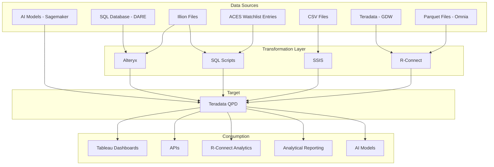
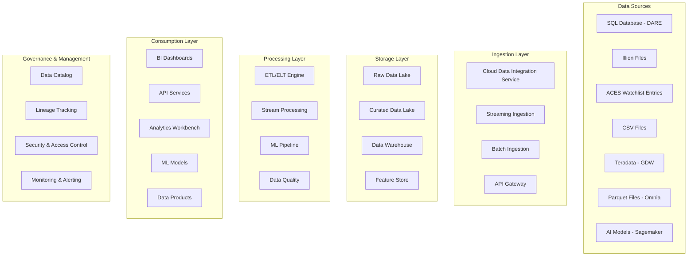

# QPD Future State Architecture: Gem Outline
## Snowflake-Based Data Platform Transformation

---

## Introduction and Executive Summary

### 1.1 Background

The current QPD (Quantitative Portfolio Decisions) system relies heavily on Teradata as the central data warehouse, supported by a complex ecosystem of disparate tools and data sources. The current architecture includes:

**Data Sources:**
- SQL Database (DARE)
- Illion Files
- ACES Watchlist Entries
- CSV Files
- Teradata (GDW)
- Parquet Files (Omnia)
- AI Models (Sagemaker)

**Transformation Tools:**
- Alteryx for data preparation and blending
- SQL Scripts for custom transformations
- SSIS for data integration
- R-Connect for statistical analysis and data movement

This fragmented approach has created significant challenges including high total cost of ownership (TCO), performance bottlenecks, scalability limitations, maintenance complexity, and limited support for modern analytics workloads.

### 1.2 Purpose of this Document

This document defines the target future state architecture for QPD, outlining the migration from the current Teradata-based system to a modern cloud data platform. It establishes the required platform capabilities, data flow architecture, migration strategy, and quantifiable business benefits. The document serves as a blueprint for stakeholders to understand the transformation scope, approach, and expected outcomes.

### 1.3 Executive Summary

The proposed solution involves migrating QPD to Snowflake Cloud Data Platform, implementing a modern ELT (Extract, Load, Transform) approach that leverages cloud-native capabilities. The transformation will retire legacy systems including Alteryx, SSIS, and R-Connect for core data movement, replacing them with Snowflake-native features, dbt for transformations, and Fivetran for data integration. This approach will deliver significant cost savings, improved performance, enhanced scalability, and enable self-service analytics capabilities.

### 1.4 Current Challenge

The existing architecture faces several critical challenges:

- **Performance Issues**: Query performance degradation and resource contention
- **Scalability Limitations**: Fixed infrastructure unable to handle growing data volumes
- **Maintenance Complexity**: Multiple tools requiring specialized expertise and coordination
- **Cost Concerns**: High licensing and infrastructure costs with limited flexibility
- **Technology Debt**: Legacy systems constraining innovation and modern analytics capabilities
- **Data Quality Issues**: Inconsistent governance and quality controls across tools

---

## 2. Current State Architecture Review

### 2.1 Current Architecture Diagram

### 2.2 Data Sources Analysis

| **Data Source** | **Format** | **Transformation Tool** |
|-----------------|------------|-------------------------|
| SQL Database (DARE) | Relational | Alteryx |
| Illion Files | [Format] | Alteryx + SQL Scripts |
| ACES Watchlist Entries | [Format] | SQL Scripts |
| CSV Files | CSV | SSIS |
| Teradata (GDW) | Relational | R-Connect |
| Parquet Files (Omnia) | Parquet | R-Connect |
| AI Models (Sagemaker) | Model Outputs | Direct Load |

### 2.3 Target System (QPD)

The current Teradata QPD system serves as the central data warehouse for quantitative portfolio decisions, housing critical financial and risk data models. It supports complex analytical workloads including:

- Portfolio risk calculations and modeling
- Credit decision support analytics
- Regulatory reporting and compliance metrics
- Real-time fraud detection data feeds
- Machine learning model training datasets

The system processes terabytes of data daily and supports mission-critical business functions with strict SLA requirements for data freshness and query performance.

### 2.4 Consumption Analysis

Current downstream consumers include:

- **Tableau Dashboards**
- **APIs**
- **R-Connect Analytics**
- **Analytical Reporting**
- **AI Models**

### 2.5 Current State Pain Points

- **Performance Issues**: Query performance bottlenecks and resource contention
- **Scalability Limitations**: Fixed infrastructure unable to handle growing data volumes and user demands
- **Maintenance Complexity**: Multiple disparate tools requiring specialized expertise and complex coordination
- **Cost Concerns**: High licensing costs, infrastructure overhead, and limited cost optimization capabilities
- **Technology Debt**: Legacy systems constraining innovation and preventing adoption of modern analytics capabilities
- **Data Quality Issues**: Inconsistent governance frameworks and quality controls across multiple transformation tools

---

## 3. Architecture Vision and Principles

### 3.1 Guiding Principles

- **Cloud-Native**: Prioritize fully managed, scalable cloud services that eliminate infrastructure management overhead
- **ELT First**: Favor Extract, Load, Transform approach leveraging cloud data warehouse compute power over traditional ETL
- **Decoupled Compute and Storage**: Ensure performance optimization and cost efficiency through independent scaling
- **Self-Service**: Enable easier data access and analytics capabilities for business users, analysts, and data scientists
- **Data Governance**: Incorporate security, data quality, and lineage tracking by design across all data flows
- **Scalability**: Design for elastic scalability to handle varying workloads and data volumes
- **Cost Efficiency**: Optimize for cost-effective operations with usage-based pricing models
- **Real-time Capabilities**: Support both real-time streaming and batch processing requirements
- **Platform Unification**: Consolidate disparate tools and systems into a unified Snowflake-based platform to streamline data ingestion, transformation, and analytics capabilities

---

## 4. Future State Architecture Diagram

### 4.1 Conceptual Architecture

### 4.2 Detailed Architecture Components

#### 4.2.1 Ingestion Layer (EL)

**Batch Ingestion:**
- **CDC for DARE**: Implement change data capture for real-time synchronization of transactional data
- **File Ingestion**: Automated ingestion pipelines for Illion files, CSV files, and Parquet files from Omnia
- **Database Replication**: Direct connectivity to Teradata GDW for historical data migration and ongoing synchronization

**Real-time Streaming:**
- **ACES Watchlist**: Real-time streaming ingestion for time-sensitive watchlist updates using Snowflake Streams
- **API Integration**: REST API endpoints for real-time data feeds from external systems

#### 4.2.2 Storage Layer

**Raw Data Zone (Bronze):**
- Snowflake stages for landing raw, unprocessed data in original formats
- Schema-on-read approach for maximum flexibility and data preservation
- Cost-effective storage with automated lifecycle management

**Curated Data Zone (Silver):**
- Cleansed and standardized data with enforced schema and quality rules
- Business rule applications and data enrichment processes
- Optimized for downstream consumption with improved query performance

**Data Warehouse (Gold):**
- Business-ready analytical data models optimized for specific use cases
- Dimensional modeling and aggregated datasets for reporting and analytics
- High-performance compute resources for complex analytical workloads

#### 4.2.3 Transformation Layer (T)

**ELT Tool/Framework:**
- **dbt (Data Build Tool)**: Primary transformation framework for SQL-based data modeling
- **Snowflake SQL**: Native stored procedures and functions for complex business logic
- **Python/Scala**: Custom transformations using Snowflake's native programming capabilities

**QPD Structure:**
- **Bronze/Silver/Gold Architecture**: Layered approach ensuring data quality progression
- **Data Vault Modeling**: Scalable and auditable data warehouse design for historical tracking
- **Dimensional Models**: Star schema design optimized for analytical queries and reporting

#### 4.2.4 Consumption Layer

**Tableau/Reporting:**
- Direct connectivity to Snowflake with native optimization and caching
- Self-service analytics capabilities with governed data access
- Real-time dashboard updates and interactive exploration

**APIs:**
- **Snowflake SQL API**: Direct database connectivity for application integration
- **REST API Gateway**: Service layer for external application access with proper authentication and rate limiting
- **GraphQL Endpoints**: Flexible data querying for modern application architectures

**AI Models/Data Science:**
- **Snowflake Notebooks**: Integrated Jupyter-style environment for data science workflows
- **Hex/External Notebooks**: Integration with external data science platforms
- **MLOps Pipeline**: Automated model training, validation, and deployment workflows
- **Feature Store**: Centralized repository for ML features with versioning and lineage

### 4.3 Detailed Component Mapping

| **Current Tool/System** | **Snowflake Capability** | **Migration Approach** |
|------------------------|---------------------------|------------------------|
| Alteryx | dbt + Snowflake SQL + Python | Workflow conversion and optimization |
| SSIS | Fivetran + Snowflake Connectors | ETL package migration to ELT patterns |
| R-Connect | Snowflake R Integration + Notebooks | R script modernization and cloud execution |
| Teradata QPD | Snowflake Data Warehouse | Direct migration with performance optimization |
| SQL Scripts | Snowflake SQL + Stored Procedures | Code conversion and cloud optimization |
| File Processing | Snowflake Stages + Tasks | Automated file ingestion and processing |

---

## 5. Security, Governance, and Operations

### 5.1 Security

**Access Control:**
- **Role-Based Access Control (RBAC)**: Hierarchical role assignments with principle of least privilege
- **Attribute-Based Access Control (ABAC)**: Dynamic access policies based on user attributes and context
- **Row-Level Security**: Fine-grained data access control at the row level
- **Column-Level Security**: Sensitive data masking and encryption at the column level

**Data Encryption:**
- **Encryption at Rest**: Automatic encryption of all data stored in Snowflake with customer-managed keys
- **Encryption in Transit**: TLS 1.2+ for all data movement and API communications
- **Key Management**: Integration with enterprise key management systems and rotation policies

**Network Isolation:**
- **Private Connectivity**: VPC peering and private endpoints for secure data movement
- **Network Policies**: IP whitelisting and geo-fencing for access control
- **Virtual Private Snowflake**: Dedicated compute resources for enhanced security isolation

### 5.2 Data Governance

**Metadata Management:**
- **Data Catalog**: Automated discovery and cataloging using Snowflake Information Schema
- **Business Glossary**: Centralized definitions and business context for data assets
- **Data Classification**: Automated sensitive data discovery and classification

**Data Quality:**
- **Quality Checks**: Automated data validation rules and quality scorecards
- **Data Profiling**: Continuous monitoring of data distribution and anomaly detection
- **Quality Metrics**: Business-defined KPIs for data quality measurement and reporting

**Lineage Tracking:**
- **End-to-End Lineage**: Complete traceability from source systems to consumption points
- **Impact Analysis**: Understanding of downstream effects for data model changes
- **Compliance Reporting**: Automated generation of lineage reports for regulatory requirements

### 5.3 Operational Model (FinOps)

**Monitoring:**
- **Performance Monitoring**: Real-time query performance and resource utilization tracking
- **Cost Monitoring**: Granular cost allocation and chargeback capabilities by department/project
- **Data Quality Monitoring**: Continuous validation of data freshness, completeness, and accuracy

**Cost Management/Optimization:**
- **Auto-Scaling**: Dynamic compute resource scaling based on workload demands
- **Resource Scheduling**: Automated warehouse suspension and resumption based on usage patterns
- **Cost Allocation**: Detailed cost tracking and optimization recommendations by business unit

**Performance Tuning:**
- **Query Optimization**: Automated query performance analysis and optimization recommendations
- **Clustering**: Intelligent data clustering for improved query performance
- **Caching**: Result set caching and materialized views for frequently accessed data

---

## 6. Business Benefits and Conclusion

### 6.1 Expected Benefits

**Quantifiable Benefits:**
- **60-70% TCO Reduction**: Elimination of Teradata licensing costs and infrastructure overhead
- **5x Faster Time-to-Market**: Accelerated development of new analytical models and reports
- **10x Improved Scalability**: Elastic scaling capabilities handling 10x current data volumes
- **50% Reduction in Data Pipeline Maintenance**: Automated data operations and self-healing capabilities
- **90% Improvement in Query Performance**: Cloud-native optimization and intelligent caching
- **Zero Infrastructure Management**: Fully managed service eliminating operational overhead

**Strategic Benefits:**
- **Enhanced Agility**: Rapid deployment of new analytics use cases and data products
- **Improved Data Quality**: Built-in governance and quality frameworks
- **Advanced Analytics Enablement**: Native support for machine learning and AI workloads
- **Self-Service Capabilities**: Empowered business users with direct data access
- **Regulatory Compliance**: Enhanced audit trails and compliance reporting capabilities
- **Future-Proof Architecture**: Cloud-native foundation supporting emerging technologies

### 6.2 Next Steps

**Immediate Actions (Next 30 Days):**
1. **Platform Proof-of-Concept**: Deploy Snowflake trial environment and validate core use cases
2. **Detailed Data Mapping**: Comprehensive analysis of current data flows and transformation logic
3. **Budget Request**: Finalize business case and secure funding approval for migration project
4. **Team Formation**: Assemble cross-functional migration team with necessary skills and expertise

**Short-term Milestones (3-6 Months):**
- Complete technical architecture design and tooling selection
- Establish development and testing environments
- Begin pilot migration with non-critical workloads
- Implement foundational security and governance frameworks

---

## 7. Use Case Scenarios and Architecture Application

### 7.1 Real-Time Fraud Detection

**Current State:** Batch processing with 4-6 hour latency for fraud model updates
**Future State:** Real-time streaming ingestion with sub-minute model scoring
**Architecture Components:**
- Snowflake Streams for real-time transaction ingestion
- Native ML functions for immediate scoring
- API endpoints for instant fraud alerts

### 7.2 Regulatory Reporting (CCAR/CECL)

**Current State:** Month-end batch processes requiring significant manual intervention
**Future State:** Automated daily reporting with audit trail capabilities
**Architecture Components:**
- Automated dbt transformations for regulatory calculations
- Version-controlled data lineage for audit compliance
- Snowflake's built-in time-travel for historical analysis

### 7.3 Portfolio Risk Analytics

**Current State:** Complex R-Connect scripts with performance bottlenecks
**Future State:** Native Snowflake statistical functions with elastic compute
**Architecture Components:**
- Snowflake's statistical and mathematical functions
- Integration with Python/R for advanced modeling
- Scalable compute warehouses for Monte Carlo simulations

### 7.4 Customer 360 Analytics

**Current State:** Data siloed across multiple systems with inconsistent views
**Future State:** Unified customer data platform with real-time updates
**Architecture Components:**
- Data sharing capabilities across business units
- Master data management with Snowflake's MERGE capabilities
- Self-service analytics with governed data access

### 7.5 ESG Reporting and Analytics

**Current State:** Manual data collection and spreadsheet-based reporting
**Future State:** Automated ESG metrics collection and standardized reporting
**Architecture Components:**
- External data integration for ESG metrics
- Automated calculation frameworks using dbt
- Interactive dashboards for stakeholder reporting

### 7.6 Credit Risk Modeling

**Current State:** Batch model training with limited feature engineering capabilities
**Future State:** Real-time feature engineering with automated model retraining
**Architecture Components:**
- Feature store with automated feature computation
- MLOps pipeline for model lifecycle management
- A/B testing framework for model performance comparison

### 7.7 Market Data Analytics

**Current State:** Limited market data integration with performance constraints
**Future State:** Real-time market data ingestion with advanced analytics
**Architecture Components:**
- High-frequency data ingestion using Snowpipe
- Time-series analytics with native functions
- Integration with external market data providers

---

## Document Information

| **Attribute** | **Details** |
|---------------|-------------|
| **Document Title** | QPD Future State Architecture: Gem Outline |
| **Version** | 1.0 |
| **Date** | November 2024 |
| **Target Platform** | Snowflake Cloud Data Platform |
| **Migration Approach** | Phased ELT-First Architecture |

