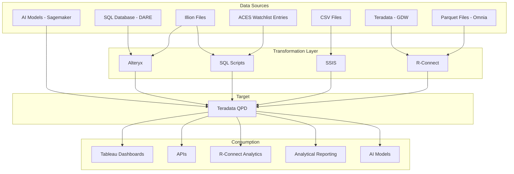
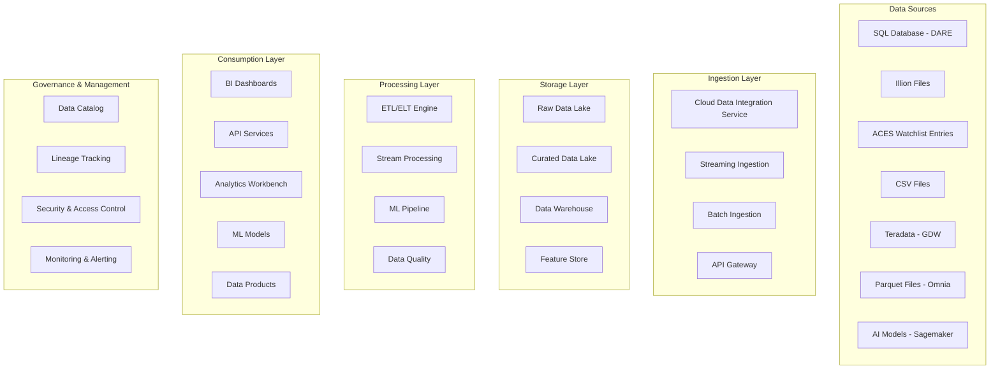

# QPD Future State Architecture: Gem Outline
## Snowflake-Based Data Platform Transformation

---

## Table of Contents

1. [Introduction and Executive Summary](#introduction-and-executive-summary)
   - 1.1 [Background](#11-background)
   - 1.2 [Purpose of this Document](#12-purpose-of-this-document)
   - 1.3 [Executive Summary](#13-executive-summary)
   - 1.4 [Current Challenges](#14-current-challenge)

2. [Current State Architecture Review](#2-current-state-architecture-review)
   - 2.1 [Current Architecture Diagram](#21-current-architecture-diagram)
   - 2.2 [Data Sources Analysis](#22-data-sources-analysis)
   - 2.3 [Target System (QPD)](#23-target-system-qpd)
   - 2.4 [Consumption Analysis](#24-consumption-analysis)
   - 2.5 [Current State Pain Points](#25-current-state-pain-points)

3. [Architecture Vision and Principles](#3-architecture-vision-and-principles)
   - 3.1 [Guiding Principles](#31-guiding-principles)

4. [Future State Architecture Diagram](#4-future-state-architecture-diagram)
   - 4.1 [Conceptual Architecture](#41-conceptual-architecture)
   - 4.2 [Detailed Architecture Components](#42-detailed-architecture-components)
     - 4.2.1 [Ingestion Layer (EL)](#421-ingestion-layer-el)
     - 4.2.2 [Storage Layer](#422-storage-layer)
     - 4.2.3 [Transformation Layer (T)](#423-transformation-layer-t)
     - 4.2.4 [Consumption Layer](#424-consumption-layer)
   - 4.3 [Detailed Component Mapping](#43-detailed-component-mapping)

5. [Security, Governance, and Operations](#5-security-governance-and-operations)
   - 5.1 [Security](#51-security)
   - 5.2 [Data Governance](#52-data-governance)
   - 5.3 [Operational Model (FinOps)](#53-operational-model-finops)

6. [Business Benefits and Conclusion](#6-business-benefits-and-conclusion)
   - 6.1 [Expected Benefits](#61-expected-benefits)
   - 6.2 [Next Steps](#62-next-steps)

7. [Use Case Scenarios and Architecture Application](#7-use-case-scenarios-and-architecture-application)
   - 7.1 [Smart Mini Data Load (DARE → Alteryx → QPD → Tableau)](#71-smart-mini-data-load-dare--alteryx--qpd--tableau)
   - 7.2 [Illion Bureau Data Load](#72-illion-bureau-data-load)
   - 7.3 [Direct Debit Monitoring Tool](#73-direct-debit-monitoring-tool)
   - 7.4 [Watchlist Integration](#74-watchlist-integration)
   - 7.5 [Cashflow Model Output](#75-cashflow-model-output)
   - 7.6 [Customer Value Management (CVM) Insights to Service Domain](#76-customer-value-management-cvm-insights-to-service-domain)
   - 7.7 [BB Data Quality Platform](#77-bb-data-quality-platform)

8. [Document Information](#document-information)

---

## Introduction and Executive Summary

### 1.1 Background

To align with our cloud-first strategy and simplify our data platforms, we are gradually transitioning away from legacy systems such as Teradata. While Teradata has served multiple teams effectively over the years, it has become increasingly expensive and less compatible with modern cloud-native architectures.

As an initial step, we successfully migrated Teradata to AWS. However, a significant portion of the ongoing cost is attributed to sandpit environments, particularly QPD sandpits, which are widely used for testing and analysis across teams. These environments consume substantial storage and compute resources, and many are either unmanaged or no longer actively used.

To address this, we are initiating a phased migration of QPD sandpit workloads to more efficient platforms such as Snowflake and AWS-native services. This transition is expected to reduce operational costs, enhance data security, and streamline platform governance.

The current QPD (Quantitative Portfolio Decisions) system architecture includes:

**Data Sources:**
- SQL Database (DARE)
- Illion Files
- ACES Watchlist Entries
- CSV Files
- Teradata (GDW)
- Parquet Files (Omnia)
- AI Models (Sagemaker)

**Transformation Tools:**
- Alteryx for data preparation and blending
- SQL Scripts for custom transformations
- SSIS for data integration
- R-Connect for statistical analysis and data movement

This fragmented approach, combined with the legacy Teradata infrastructure, has created significant challenges including high total cost of ownership (TCO), performance bottlenecks, scalability limitations, maintenance complexity, and limited support for modern analytics workloads.

### 1.2 Purpose of this Document

This document defines the target future state architecture for QPD, outlining the migration from the current Teradata-based system to a modern cloud data platform. It establishes the required platform capabilities, data flow architecture, and quantifiable business benefits. Additionally, this document translates and maps the use cases validated in the Proof of Concept (PoC) to the future state architecture, demonstrating how these scenarios will be supported in the target Snowflake environment. The document serves as a blueprint for stakeholders to understand the transformation scope, approach, and expected outcomes.

### 1.3 Executive Summary

The proposed solution involves migrating QPD to Snowflake Cloud Data Platform, implementing a modern ELT (Extract, Load, Transform) approach that leverages cloud-native capabilities. The transformation will retire legacy systems including Alteryx, SSIS, and R-Connect for core data movement, replacing them with Snowflake-native features, dbt for transformations, and Fivetran for data integration. This approach will deliver significant cost savings, improved performance, enhanced scalability, and enable self-service analytics capabilities.

### 1.4 Current Challenges

The existing architecture faces several critical challenges:

- **Data Accumulation**: Many sandpits contain years of historical data that users rely on for continuity. Snowflake's architecture requires a clear strategy for migrating this data while preserving analytical workflows
- **Cross-Domain Complexity**: Sandpit datasets often span multiple domains (e.g., Consumer Finance, Customer Service, Wealth). Snowflake's domain-aligned governance model necessitates careful segmentation and integration planning
- **Functional Dependency**: Sandpit workflows are tightly coupled with historical data. Migrating without this context risks disrupting business-critical insights and reporting
- **Data Ownership and Stewardship**: Teradata sandpits lack federated ownership. Snowflake's governance framework requires clearly defined data stewardship to support access controls, lineage, and accountability
- **Consumer Enablement**: Analytical consumers including CEE, Tableau users, and analysts expect seamless access to data in the new platform. Snowflake must support these consumption patterns without compromising performance or governance

---

## 2. Current State Architecture Review

### 2.1 Current Architecture Diagram

### 2.2 Data Sources Analysis

| **Data Source** | **Format** | **Transformation Tool** |
|-----------------|------------|-------------------------|
| SQL Database (DARE) | Relational | Alteryx |
| Illion Files | [Format] | Alteryx + SQL Scripts |
| ACES Watchlist Entries | [Format] | SQL Scripts |
| CSV Files | CSV | SSIS |
| Teradata (GDW) | Relational | R-Connect |
| Parquet Files (Omnia) | Parquet | R-Connect |
| AI Models (Sagemaker) | Model Outputs | Direct Load |

### 2.3 Target System (QPD)

QPD serves as an analytical sandpit built on Teradata technology, designed to facilitate a wide range of production reporting, analytics, and control functions. Numerous key processes, including NBCs and Model Score calculations, depend on the comprehensive and reliable data available within the QPD Sandpit environment.

### 2.4 Consumption Analysis

Current downstream consumers include:

- **Tableau Dashboards**
- **APIs**
- **R-Connect Analytics**
- **Analytical Reporting**
- **AI Models**

### 2.5 Current State Pain Points

<!-- - **Performance Issues**: Query performance bottlenecks and resource contention
- **Scalability Limitations**: Fixed infrastructure unable to handle growing data volumes and user demands
- **Maintenance Complexity**: Multiple disparate tools requiring specialized expertise and complex coordination
- **Cost Concerns**: High licensing costs, infrastructure overhead, and limited cost optimization capabilities
- **Technology Debt**: Legacy systems constraining innovation and preventing adoption of modern analytics capabilities
- **Data Quality Issues**: Inconsistent governance frameworks and quality controls across multiple transformation tools -->

- **Diverse Platforms**: Multiple platforms make it difficult to sustain a common skillset amongst staff
- **Coupled Compute and Storage**: Fixed infrastructure architecture limiting independent scaling and cost optimization
- **Technology Fragmentation**: Different technologies being used for ingestion and transformation creating operational complexity
- **Cross-Domain Data Access**: Data residing in different domains creates overhead to pull into QPD

---

## 3. Architecture Vision and Principles

### 3.1 Guiding Principles

- **Cloud-Native**: Prioritize fully managed, scalable cloud services that eliminate infrastructure management overhead
- **ELT First**: Favor Extract, Load, Transform approach leveraging cloud data warehouse compute power over traditional ETL
- **Decoupled Compute and Storage**: Ensure performance optimization and cost efficiency through independent scaling
- **Self-Service**: Enable easier data access and analytics capabilities for business users, analysts, and data scientists
- **Data Governance**: Incorporate security, data quality, and lineage tracking by design across all data flows
- **Scalability**: Design for elastic scalability to handle varying workloads and data volumes
- **Cost Efficiency**: Optimize for cost-effective operations with usage-based pricing models
- **Real-time Capabilities**: Support both real-time streaming and batch processing requirements
- **Platform Unification**: Consolidate disparate tools and systems into a unified Snowflake-based platform to streamline data ingestion, transformation, and analytics capabilities

---

## 4. Future State Architecture Diagram

### 4.1 Conceptual Architecture

### 4.2 Detailed Architecture Components

#### 4.2.1 Ingestion Layer (EL)

**Batch Ingestion:**
- **CDC for DARE**: Implement change data capture for real-time synchronization of transactional data
- **File Ingestion**: Automated ingestion pipelines for Illion files, CSV files, and Parquet files from Omnia
- **Database Replication**: Direct connectivity to Teradata GDW for historical data migration and ongoing synchronization

**Real-time Streaming:**
- **ACES Watchlist**: Real-time streaming ingestion for time-sensitive watchlist updates using Snowflake Streams
- **API Integration**: REST API endpoints for real-time data feeds from external systems

#### 4.2.2 Storage Layer

**Raw Data Zone (Bronze):**
- Snowflake stages for landing raw, unprocessed data in original formats
- Schema-on-read approach for maximum flexibility and data preservation
- Cost-effective storage with automated lifecycle management

**Curated Data Zone (Silver):**
- Cleansed and standardized data with enforced schema and quality rules
- Business rule applications and data enrichment processes
- Optimized for downstream consumption with improved query performance

**Data Warehouse (Gold):**
- Business-ready analytical data models optimized for specific use cases
- Dimensional modeling and aggregated datasets for reporting and analytics
- High-performance compute resources for complex analytical workloads

#### 4.2.3 Transformation Layer (T)

**ELT Tool/Framework:**
- **dbt (Data Build Tool)**: Primary transformation framework for SQL-based data modeling
- **Snowflake SQL**: Native stored procedures and functions for complex business logic
- **Python/Scala**: Custom transformations using Snowflake's native programming capabilities

**QPD Structure:**
- **Bronze/Silver/Gold Architecture**: Layered approach ensuring data quality progression
- **Data Vault Modeling**: Scalable and auditable data warehouse design for historical tracking
- **Dimensional Models**: Star schema design optimized for analytical queries and reporting

#### 4.2.4 Consumption Layer

**Tableau/Reporting:**
- Direct connectivity to Snowflake with native optimization and caching
- Self-service analytics capabilities with governed data access
- Real-time dashboard updates and interactive exploration

**APIs:**
- **Snowflake SQL API**: Direct database connectivity for application integration
- **REST API Gateway**: Service layer for external application access with proper authentication and rate limiting
- **GraphQL Endpoints**: Flexible data querying for modern application architectures

**AI Models/Data Science:**
- **Snowflake Notebooks**: Integrated Jupyter-style environment for data science workflows
- **Hex/External Notebooks**: Integration with external data science platforms
- **MLOps Pipeline**: Automated model training, validation, and deployment workflows
- **Feature Store**: Centralized repository for ML features with versioning and lineage

### 4.3 Detailed Component Mapping

| **Current Tool/System** | **Snowflake Capability** | **Migration Approach** |
|------------------------|---------------------------|------------------------|
| Alteryx | dbt + Snowflake SQL + Python | Workflow conversion and optimization |
| SSIS | Fivetran + Snowflake Connectors | ETL package migration to ELT patterns |
| R-Connect | Snowflake R Integration + Notebooks | R script modernization and cloud execution |
| Teradata QPD | Snowflake Data Warehouse | Direct migration with performance optimization |
| SQL Scripts | Snowflake SQL + Stored Procedures | Code conversion and cloud optimization |
| File Processing | Snowflake Stages + Tasks | Automated file ingestion and processing |

---

## 5. Security, Governance, and Operations

### 5.1 Security

**Access Control:**
- **Role-Based Access Control (RBAC)**: Hierarchical role assignments with principle of least privilege
- **Attribute-Based Access Control (ABAC)**: Dynamic access policies based on user attributes and context
- **Row-Level Security**: Fine-grained data access control at the row level
- **Column-Level Security**: Sensitive data masking and encryption at the column level

**Data Encryption:**
- **Encryption at Rest**: Automatic encryption of all data stored in Snowflake with customer-managed keys
- **Encryption in Transit**: TLS 1.2+ for all data movement and API communications
- **Key Management**: Integration with enterprise key management systems and rotation policies

**Network Isolation:**
- **Private Connectivity**: VPC peering and private endpoints for secure data movement
- **Network Policies**: IP whitelisting and geo-fencing for access control
- **Virtual Private Snowflake**: Dedicated compute resources for enhanced security isolation

### 5.2 Data Governance

**Metadata Management:**
- **Data Catalog**: Automated discovery and cataloging using Snowflake Information Schema
- **Business Glossary**: Centralized definitions and business context for data assets
- **Data Classification**: Automated sensitive data discovery and classification

**Data Quality:**
- **Quality Checks**: Automated data validation rules and quality scorecards
- **Data Profiling**: Continuous monitoring of data distribution and anomaly detection
- **Quality Metrics**: Business-defined KPIs for data quality measurement and reporting

**Lineage Tracking:**
- **End-to-End Lineage**: Complete traceability from source systems to consumption points
- **Impact Analysis**: Understanding of downstream effects for data model changes
- **Compliance Reporting**: Automated generation of lineage reports for regulatory requirements

### 5.3 Operational Model (FinOps)

**Monitoring:**
- **Performance Monitoring**: Real-time query performance and resource utilization tracking
- **Cost Monitoring**: Granular cost allocation and chargeback capabilities by department/project
- **Data Quality Monitoring**: Continuous validation of data freshness, completeness, and accuracy

**Cost Management/Optimization:**
- **Auto-Scaling**: Dynamic compute resource scaling based on workload demands
- **Resource Scheduling**: Automated warehouse suspension and resumption based on usage patterns
- **Cost Allocation**: Detailed cost tracking and optimization recommendations by business unit

**Performance Tuning:**
- **Query Optimization**: Automated query performance analysis and optimization recommendations
- **Clustering**: Intelligent data clustering for improved query performance
- **Caching**: Result set caching and materialized views for frequently accessed data

---

## 6. Business Benefits and Conclusion

### 6.1 Expected Benefits

**Quantifiable Benefits:**
- **60-70% TCO Reduction**: Elimination of Teradata licensing costs and infrastructure overhead
- **5x Faster Time-to-Market**: Accelerated development of new analytical models and reports
- **10x Improved Scalability**: Elastic scaling capabilities handling 10x current data volumes
- **50% Reduction in Data Pipeline Maintenance**: Automated data operations and self-healing capabilities
- **90% Improvement in Query Performance**: Cloud-native optimization and intelligent caching
- **Zero Infrastructure Management**: Fully managed service eliminating operational overhead

**Strategic Benefits:**
- **Enhanced Agility**: Rapid deployment of new analytics use cases and data products
- **Improved Data Quality**: Built-in governance and quality frameworks
- **Advanced Analytics Enablement**: Native support for machine learning and AI workloads
- **Self-Service Capabilities**: Empowered business users with direct data access
- **Regulatory Compliance**: Enhanced audit trails and compliance reporting capabilities
- **Future-Proof Architecture**: Cloud-native foundation supporting emerging technologies

### 6.2 Next Steps

**Immediate Actions (Next 30 Days):**
1. **Platform Proof-of-Concept**: Deploy Snowflake trial environment and validate core use cases
2. **Detailed Data Mapping**: Comprehensive analysis of current data flows and transformation logic
3. **Budget Request**: Finalize business case and secure funding approval for migration project
4. **Team Formation**: Assemble cross-functional migration team with necessary skills and expertise

**Short-term Milestones (3-6 Months):**
- Complete technical architecture design and tooling selection
- Establish development and testing environments
- Begin pilot migration with non-critical workloads
- Implement foundational security and governance frameworks

---

## 7. Use Case Scenarios and Architecture Application

### 7.1 Smart Mini Data Load (DARE → Alteryx → QPD → Tableau)

**Use Case:** Smart Mini Data Load used for merchant migration and mobile user analysis, this flow transforms DARE SQL Server data via Alteryx and loads it into QPD for Tableau dashboarding. It supports weekly refreshes and validation of transactional counts.

**Current State:**
- **Source:** DARE SQL Server tables
- **Tool:** Alteryx workflows
- **Target:** QPD tables
- **Output:** Tableau dashboards for merchant migration and mobile user analysis
- **Load Frequency:** Weekly

**Future State Architecture:**
- **Ingestion:** Fivetran connector for DARE SQL Server with automated CDC
- **Transformation:** dbt models replacing Alteryx workflows for data preparation
- **Storage:** Snowflake tables with optimized clustering for query performance
- **Consumption:** Tableau connected directly to Snowflake with live connectivity
- **Benefits:** Reduced processing time, automated data quality checks, real-time insights

### 7.2 Illion Bureau Data Load

**Use Case:** Monthly Credit Bureau Reporting - Monthly bureau files from Illion are ingested and transformed using SQL and Alteryx, then loaded into QPD for credit risk dashboards. This supports regulatory and financial insights with ~90K records per month.

**Current State:**
- **Source:** Illion files - External
- **Tool:** SQL + Alteryx
- **Target:** ILLION_TXN_DATA_LOAD in QPD
- **Output:** Tableau dashboards for bureau-level insights
- **Size Estimate:** ~79,985 to 89,023 records per month
- **Load Frequency:** Monthly

**Future State Architecture:**
- **Ingestion:** Snowflake External Stages with automated file detection via Snowpipe
- **Transformation:** dbt models for data cleansing and business rule application
- **Storage:** Snowflake tables with time-travel capabilities for audit compliance
- **Consumption:** Enhanced Tableau dashboards with real-time refresh capabilities
- **Benefits:** Automated processing, improved data lineage, reduced manual intervention

### 7.3 Direct Debit Monitoring Tool

**Use Case:** DDMT (Direct Debit Monitoring Tool) is a standalone internal tool used by frontline teams to monitor direct debit facility utilisation, identify breaches, and support annual reviews. It consumes data loaded into QPD tables via SSIS packages, which processes encrypted APCA names, CommBiz limits, and claims data from shared folders.

**Current State:**
- **Source:** Raw files (claims data, APCA names, DD limits) manually placed in shared folders
- **Tool:** SSIS package loads data into QPD tables
- **Target:** QPD tables used by DDMT tool
- **Output:** DDMT for monitoring and annual review support
- **Load Frequency:** Manual/periodic uploads

**Future State Architecture:**
- **Ingestion:** Snowflake External Stages with automated file processing via Tasks
- **Transformation:** dbt models for data validation and encryption handling
- **Storage:** Secure Snowflake tables with row-level security and audit logging
- **Consumption:** Modernized DDMT tool with direct Snowflake connectivity or API layer
- **Benefits:** Automated file processing, enhanced security, improved audit capabilities

### 7.4 Watchlist Integration

**Use Case:** The Watchlist Integration supports the Customer Experience Engine (CEE) by enabling conflict checks and risk classification workflows. The ACES Watchlist, a critical component of credit risk oversight, is manually loaded into QPD to support consolidated reporting and downstream analytics.

**Current State:**
- **Source:** ACES Watchlist entries manually curated by business units and submitted monthly
- **Tool:** Files received from ACES team, validated and manually loaded into QPD by BB Data Office
- **Target:** QPD tables for consolidated reporting
- **Output:** Monthly Watchlist Reports for credit risk teams and business units to monitor flagged borrowers, trigger escalations to Group Credit Structuring (GCS), and support regulatory and internal audit requirements
- **Load Frequency:** Weekly

**Future State Architecture:**
- **Ingestion:** Automated API integration with ACES system or secure file transfer to Snowflake stages
- **Transformation:** dbt models for data validation, conflict resolution, and business rule application
- **Storage:** Snowflake tables with secure access controls and complete audit trail
- **Consumption:** Real-time dashboards and automated alerting for risk teams, API integration with CEE
- **Benefits:** Reduced manual processing, real-time risk monitoring, enhanced compliance capabilities

### 7.5 Cashflow Model Output

**Use Case:** The CVM Cashflow Forecast initiative is part of the broader MEP (Model Execution Pipeline) framework. It aims to operationalise credit and debit cashflow forecasting models using AWS SageMaker, Glue ETL, and Teradata QPD. These forecasts are consumed by platforms like Bankers Workbench (BWB) to support customer engagement and advisory.

**Current State:**
- **Tables:** Final table for structured credit forecasts & Final table for structured debit forecasts
- **Tool:** QPD for table creation, testing, and structured storage; AWS SageMaker for model scoring and output generation; AWS Glue for ETL and writeback to Teradata; GitHub for managing config.yaml and container PRs
- **Output:** Structured cashflow forecasts with quantile predictions (10%, 50%, 90%) for credit and debit transactions
- **Enables:** Cashflow shortfall alerts, Predictive advisory & Integration into Bankers Workbench for customer engagement
- **Load Frequency:** Staging Tables loaded when new SageMaker outputs are available; Final Tables auto-refreshed post-staging via Glue ETL; ETL Runtime ~40 minutes per batch; Scoring Frequency: Weekly or model-triggered, aligned with retraining cycles

**Future State Architecture:**
- **ML Pipeline:** Snowflake native ML capabilities with Snowpark for model execution and scoring
- **Data Storage:** Snowflake tables with native support for semi-structured data and time-travel capabilities
- **Transformation:** dbt models for data processing and quantile calculations replacing Glue ETL
- **Integration:** Direct API connectivity to Bankers Workbench eliminating complex ETL processes
- **Benefits:** Simplified architecture, reduced latency, enhanced model monitoring, improved scalability

### 7.6 Customer Value Management (CVM) Insights to Service Domain

**Use Case:** CVM (Customer Value Management) delivers actionable insights such as payaway patterns, predicted needs, and customer engagement scores from QPD to the Service Domain (SD). These insights are consumed by downstream participants like Bankers Workbench (BWB) to support personalised customer engagement and AI model feedback loops.

**Current State:**
- **Source:** QPD tables in the BB Datamart
- **Tool:** API layer extracts data from QPD and pushes it into Aurora DB within the CBI Service Domain. Job status checks are in place to monitor successful delivery
- **Target:** Aurora DB in the CBI Service Domain, which feeds into the Banker Workbench (BWB) and other downstream systems
- **Output:** Top 20 CVM insights, historical engagement patterns, and payaway behaviour used by bankers to drive customer conversations and engagement strategies
- **Load Frequency:** Weekly refresh of CVM insights to ensure recency and relevance for customer interactions

**Future State Architecture:**
- **Data Sharing:** Snowflake secure data sharing capabilities eliminating complex API extractions
- **Real-time Processing:** Snowflake Streams for real-time insight generation and updates
- **Integration:** Direct Snowflake connectivity to Service Domain applications via native connectors
- **Analytics:** Enhanced CVM scoring models using Snowflake's native ML functions
- **Benefits:** Real-time insights, simplified data pipeline, improved customer experience, enhanced model feedback loops

### 7.7 BB Data Quality Platform

**Use Case:** Data Quality Tool aims to offer the following business outcomes for Business Banking: ability to assess data by data producers and data stewards using self-service functionality; expose data with issues for remediation to frontline, data producers and data stewards; track and monitor data quality in Omnia and GDW v2.

**Current State:**
- **Source:** GDW Sandpit (1 table), Omnia Sandpit (2 tables)
- **Tool:** Scoop (for data movement), SMTP Email Relay (for notifications), Tableau & R-Shiny Tool (for visualisation and remediation)
- **Target:** GDW Target Tables, Omnia Target Tables: XYZ
- **Output:** DQ Exception records with metadata and context, Email notifications to RMs and Data Stewards, Dashboards with RAG status, Exception counts & Drill-down capabilities, R-Shiny portal for remediation with row-level security
- **Load Frequency:** Daily

**Future State Architecture:**
- **Data Quality Framework:** Snowflake native data quality functions and Great Expectations integration
- **Monitoring:** Automated data quality scoring with Snowflake Tasks and alerting capabilities
- **Visualization:** Modern Tableau dashboards with real-time data quality metrics connected directly to Snowflake
- **Self-Service:** Snowflake's Information Schema and Account Usage views for data steward access
- **Benefits:** Automated quality monitoring, real-time exception detection, simplified remediation workflows, enhanced data governance

---

## Document Information

| **Attribute** | **Details** |
|---------------|-------------|
| **Document Title** | QPD Future State Architecture: Gem Outline |
| **Version** | 1.0 |
| **Date** | November 2024 |
| **Target Platform** | Snowflake Cloud Data Platform |
| **Migration Approach** | Phased ELT-First Architecture |

