# QPD Future State Architecture: Gem Outline
## Snowflake-Based Data Platform Transformation

---

## Table of Contents

1. [Introduction and Executive Summary](#introduction-and-executive-summary)
   - 1.1 [Background](#11-background)
   - 1.2 [Purpose of this Document](#12-purpose-of-this-document)
   - 1.3 [Executive Summary](#13-executive-summary)
   - 1.4 [Current Challenges](#14-current-challenge)

2. [Current State Architecture Review](#2-current-state-architecture-review)
   - 2.1 [Current Architecture Diagram](#21-current-architecture-diagram)
   - 2.2 [Data Sources Analysis](#22-data-sources-analysis)
   - 2.3 [Target System (QPD)](#23-target-system-qpd)
   - 2.4 [Consumption Analysis](#24-consumption-analysis)
   - 2.5 [Current State Pain Points](#25-current-state-pain-points)

3. [Guiding Principles](#3-guiding-principles)

4. [Future State Architecture Diagram](#4-future-state-architecture-diagram)
   - 4.1 [Conceptual Architecture](#41-conceptual-architecture)
   - 4.2 [Detailed Architecture Components](#42-detailed-architecture-components)
     - 4.2.1 [Storage Layer](#421-storage-layer)
     - 4.2.2 [Ingestion Layer (EL)](#422-ingestion-layer-el)
       - [DARE Data Source](#dare-data-source)
       - [Illion Data Source](#illion-data-source)
       - [ACES Data Source](#aces-data-source)
       - [GDW Data Source](#gdw-data-source)
       - [Omnia Data Source](#omnia-data-source)
       - [CSV Files Data Source](#csv-files-data-source)
       - [AI Models Data Source](#ai-models-data-source)
     - 4.2.3 [Transformation Layer (T)](#423-transformation-layer-t)
     - 4.2.4 [Consumption Layer](#424-consumption-layer)
     - 4.2.5 [Orchestration](#425-orchestration)
   - 4.3 [Detailed Component Mapping](#43-detailed-component-mapping)

5. [Security, Governance, and Operations](#5-security-governance-and-operations)
   - 5.1 [Data Governance](#51-data-governance)
   - 5.2 [Monitoring & Alerting Capabilities](#52-monitoring--alerting-capabilities)

6. [Use Case Scenarios and Architecture Application](#6-use-case-scenarios-and-architecture-application)
   - 6.1 [Smart Mini Data Load (DARE → Alteryx → QPD → Tableau)](#61-smart-mini-data-load-dare--alteryx--qpd--tableau)
   - 6.2 [Illion Bureau Data Load](#62-illion-bureau-data-load)
   - 6.3 [Direct Debit Monitoring Tool](#63-direct-debit-monitoring-tool)
   - 6.4 [Watchlist Integration](#64-watchlist-integration)
   - 6.5 [Cashflow Model Output](#65-cashflow-model-output)
   - 6.6 [Customer Value Management (CVM) Insights to Service Domain](#66-customer-value-management-cvm-insights-to-service-domain)
   - 6.7 [BB Data Quality Platform](#67-bb-data-quality-platform)

7. [Document Information](#document-information)

---

## Introduction and Executive Summary

### 1.1 Background

To align with our cloud-first strategy and simplify our data platforms, we are gradually transitioning away from legacy systems such as Teradata. While Teradata has served multiple teams effectively over the years, it has become increasingly expensive and less compatible with modern cloud-native architectures.

As an initial step, we successfully migrated Teradata to AWS. However, a significant portion of the ongoing cost is attributed to sandpit environments, particularly QPD sandpits, which are widely used for testing and analysis across teams. These environments consume substantial storage and compute resources, and many are either unmanaged or no longer actively used.

To address this, we are initiating a phased migration of QPD sandpit workloads to more efficient platforms such as Snowflake and AWS-native services. This transition is expected to reduce operational costs, enhance data security, and streamline platform governance.

The current QPD (Quantitative Portfolio Decisions) system architecture includes:

**Data Sources:**
- SQL Database (DARE)
- Illion Files
- ACES Watchlist Entries
- CSV Files
- Teradata (GDW)
- Parquet Files (Omnia)
- AI Models (Sagemaker)

**Transformation Tools:**
- Alteryx for data preparation and blending
- SQL Scripts for custom transformations
- SSIS for data integration
- R-Connect for statistical analysis and data movement

This fragmented approach, combined with the legacy Teradata infrastructure, has created significant challenges including high total cost of ownership (TCO), performance bottlenecks, scalability limitations, maintenance complexity, and limited support for modern analytics workloads.

### 1.2 Purpose of this Document

This document defines the target future state architecture for QPD, outlining the migration from the current Teradata-based system to a modern cloud data platform. It establishes the required platform capabilities, data flow architecture, and quantifiable business benefits. Additionally, this document translates and maps the use cases validated in the Proof of Concept (PoC) to the future state architecture, demonstrating how these scenarios will be supported in the target Snowflake environment. The document serves as a blueprint for stakeholders to understand the transformation scope, approach, and expected outcomes.

### 1.3 Executive Summary

The proposed solution involves migrating QPD to Snowflake Cloud Data Platform with a unified AWS Glue catalog Iceberg table architecture, implementing a modern ELT (Extract, Load, Transform) approach that leverages cloud-native capabilities. All data layers (Bronze, Silver, Gold) will utilize externally managed Iceberg tables on AWS Glue catalog, providing ACID compliance, schema evolution, time-travel capabilities, and multi-engine compatibility. The transformation will retire legacy systems including Alteryx, SSIS, and R-Connect for core data movement, replacing them with Snowflake-native features, dbt for transformations writing to Iceberg tables, and Fivetran for data integration. This approach will deliver significant cost savings, improved performance, enhanced scalability, cross-platform data sharing, and enable self-service analytics capabilities.

### 1.4 Current Challenges

The existing architecture faces several critical challenges:

- **Data Accumulation**: Many sandpits contain years of historical data that users rely on for continuity. Snowflake's architecture requires a clear strategy for migrating this data while preserving analytical workflows
- **Cross-Domain Complexity**: Sandpit datasets often span multiple domains (e.g., Consumer Finance, Customer Service, Wealth). Snowflake's domain-aligned governance model necessitates careful segmentation and integration planning
- **Functional Dependency**: Sandpit workflows are tightly coupled with historical data. Migrating without this context risks disrupting business-critical insights and reporting
- **Data Ownership and Stewardship**: Teradata sandpits lack federated ownership. Snowflake's governance framework requires clearly defined data stewardship to support access controls, lineage, and accountability
- **Consumer Enablement**: Analytical consumers including CEE, Tableau users, and analysts expect seamless access to data in the new platform. Snowflake must support these consumption patterns without compromising performance or governance

---

## 2. Current State Architecture Review

### 2.1 Current Architecture Diagram

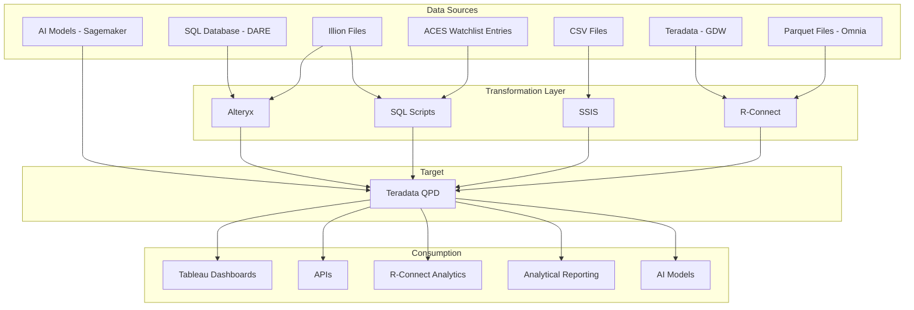

### 2.2 Data Sources Analysis

| **Data Source** | **Format** | **Transformation Tool** |
|-----------------|------------|-------------------------|
| SQL Database (DARE) | Relational | Alteryx |
| Illion Files | [Format] | Alteryx + SQL Scripts |
| ACES Watchlist Entries | [Format] | SQL Scripts |
| CSV Files | CSV | SSIS |
| Teradata (GDW) | Relational | R-Connect |
| Parquet Files (Omnia) | Parquet | R-Connect |
| AI Models (Sagemaker) | Model Outputs | Direct Load |

### 2.3 Target System (QPD)

QPD serves as an analytical sandpit built on Teradata technology, designed to facilitate a wide range of production reporting, analytics, and control functions. Numerous key processes, including NBCs and Model Score calculations, depend on the comprehensive and reliable data available within the QPD Sandpit environment.

### 2.4 Consumption Analysis

Current downstream consumers include:

- **Tableau Dashboards**
- **APIs**
- **R-Connect Analytics**
- **Analytical Reporting**
- **AI Models**

### 2.5 Current State Pain Points

<!-- - **Performance Issues**: Query performance bottlenecks and resource contention
- **Scalability Limitations**: Fixed infrastructure unable to handle growing data volumes and user demands
- **Maintenance Complexity**: Multiple disparate tools requiring specialized expertise and complex coordination
- **Cost Concerns**: High licensing costs, infrastructure overhead, and limited cost optimization capabilities
- **Technology Debt**: Legacy systems constraining innovation and preventing adoption of modern analytics capabilities
- **Data Quality Issues**: Inconsistent governance frameworks and quality controls across multiple transformation tools -->

- **Diverse Platforms**: Multiple platforms make it difficult to sustain a common skillset amongst staff
- **Coupled Compute and Storage**: Fixed infrastructure architecture limiting independent scaling and cost optimization
- **Technology Fragmentation**: Different technologies being used for ingestion and transformation creating operational complexity
- **Cross-Domain Data Access**: Data residing in different domains creates overhead to pull into QPD

---

## 3. Guiding Principles

- **Cloud-Native**: Prioritize fully managed, scalable cloud services that eliminate infrastructure management overhead
- **ELT First**: Favor Extract, Load, Transform approach leveraging cloud data warehouse compute power over traditional ETL
- **Decoupled Compute and Storage**: Ensure performance optimization and cost efficiency through independent scaling
- **Self-Service**: Enable easier data access and analytics capabilities for business users, analysts, and data scientists
- **Data Governance**: Incorporate security, data quality, and lineage tracking by design across all data flows
- **Scalability**: Design for elastic scalability to handle varying workloads and data volumes
- **Cost Efficiency**: Optimize for cost-effective operations with usage-based pricing models
- **Real-time Capabilities**: Support both real-time streaming and batch processing requirements
- **Platform Unification**: Consolidate disparate tools and systems into a unified Snowflake-based platform to streamline data ingestion, transformation, and analytics capabilities
- **CBA (CDAO) Alignment**: When multiple implementation options exist, recommendations are driven by alignment with CBA (CDAO) approved practices and standards. Key mandates include:
  - **Iceberg Architecture**: AWS Glue catalog externally managed Iceberg tables are mandatory across all data layers (Bronze, Silver, Gold) to ensure ACID compliance, schema evolution, and multi-engine compatibility
  - **Transformation Pattern**: dbt within Snowflake is the preferred transformation pattern, writing to Iceberg tables for consistency, version control, and maintainability

---

## 4. Future State Architecture Diagram

### 4.1 Conceptual Architecture

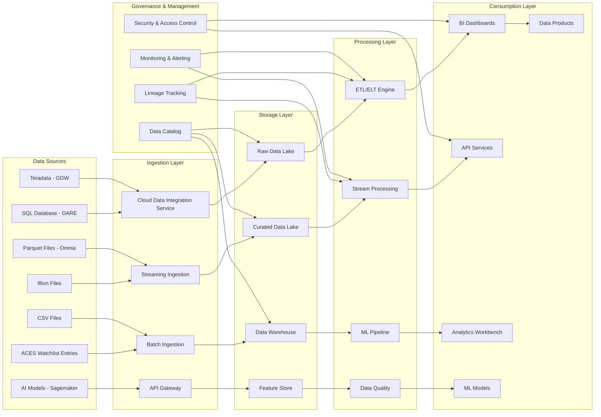

### 4.2 Detailed Architecture Components

#### 4.2.1 Storage Layer

The architecture implements a unified Glue catalog-based approach across all data layers:
1. **QPD Glue Catalog Database**: All data layers (Bronze, Silver, Gold) utilize AWS Glue catalog externally managed Iceberg tables
2. **Unified Architecture**: Consistent table format across all layers enabling seamless data lineage, ACID compliance, and cross-platform compatibility

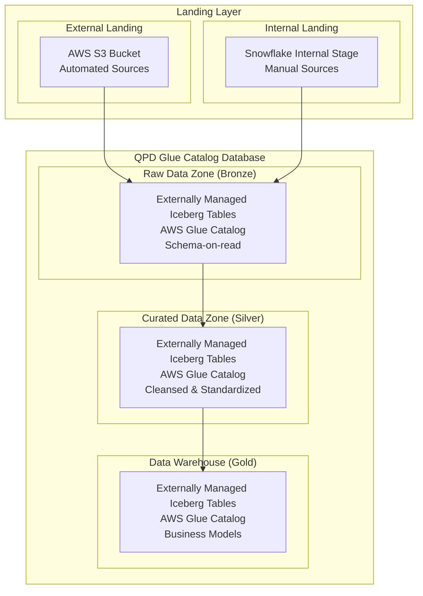

**Landing Layer:**
- **Purpose**: Landing zone for data sources to push data files to QPD for ingestion
- **Implementation**: Two-tier landing architecture supporting different data ingestion patterns
- **Storage Types**: 
  1. **External Landing (AWS S3 Bucket)**: For externally pushed files from automated data sources
  2. **Internal Landing (Snowflake Internal Stage)**: For manually submitted data files (e.g., ACES watchlist entries)
- Provides secure, scalable file storage with lifecycle management policies and flexible ingestion capabilities

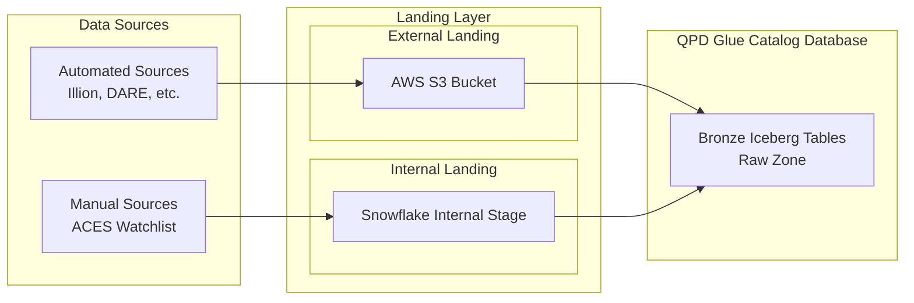

**Raw Data Zone (Bronze):**
- **Purpose**: Landing zone for raw, unprocessed data in original formats with schema-on-read approach for maximum flexibility and data preservation
- **Implementation**: Externally managed Iceberg tables in AWS Glue catalog that receive data from both Landing Layer sublayers via Snowflake external stages and internal stages. Data is loaded using COPY INTO commands targeting Iceberg table formats
- **Table Types**: Externally managed Iceberg tables on AWS Glue catalog
- **Benefits**: ACID compliance, time-travel capabilities, schema evolution, and cross-engine compatibility (Snowflake, Spark, Athena)
- Cost-effective storage with S3 lifecycle policies and Iceberg table maintenance operations

**Curated Data Zone (Silver):**
- **Purpose**: Cleansed and standardized data with enforced schema and quality rules, optimized for downstream consumption with improved query performance
- **Implementation**: Externally managed Iceberg tables within AWS Glue catalog for business rule applications and data enrichment processes. Transformations write to Iceberg tables using MERGE operations for upserts
- **Table Types**: Externally managed Iceberg tables on AWS Glue catalog
- **Benefits**: Partition evolution, hidden partitioning, and efficient incremental updates via Iceberg merge-on-read capabilities
- Supports complex transformations and data quality validations with full transaction support

**Data Warehouse (Gold):**
- **Purpose**: Business-ready analytical data models optimized for specific use cases with dimensional modeling and aggregated datasets for reporting and analytics
- **Implementation**: Externally managed Iceberg tables on AWS Glue catalog enabling external ecosystem integration and advanced analytics workflows
- **Table Types**: Externally managed Iceberg tables on AWS Glue catalog
- **Benefits**: Multi-engine query support, snapshot isolation for concurrent reads, and metadata-driven query optimization
- High-performance compute resources for complex analytical workloads and cross-platform data sharing

#### 4.2.2 Ingestion Layer (EL)

**CDAO Approved Ingestion Pattern:**

The approved ingestion pattern from CDAO follows a standardized approach: load files to be ingested into an AWS S3 bucket (external landing), then use Snowpipe with auto-ingest to automatically copy data into the target Iceberg table. This pattern ensures consistency, scalability, and automated data ingestion across all data sources.

The ingestion layer supports three different types of data ingestion requirements:
- **Manual**: User-driven data uploads requiring human intervention
- **Periodic**: Scheduled data ingestion on regular intervals (daily, weekly, monthly)
- **Real-time**: Immediate data availability without traditional ingestion processes

The selection of appropriate ingestion methodology for each data source depends on several key factors including the nature of the data source, the variety of data types it contains, and its specific periodicity requirements. Different sources require tailored approaches to ensure optimal performance, reliability, and alignment with business requirements.

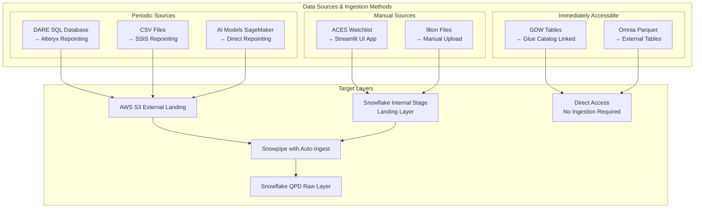

##### DARE Data Source
**Type**: Periodic

**Ingestion Options**:

**Option 1: Alteryx Repointing**

Repoint existing Alteryx workflows to write output to AWS S3 External Landing layer, where Snowpipe auto-ingest automatically loads data into Snowflake QPD Raw Iceberg tables.

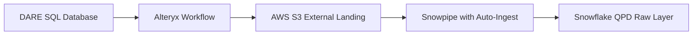

**Pros:**
- Minimal implementation time due to repointing existing workflows
- No learning curve required for teams already familiar with Alteryx

**Cons:**
- Doesn't address the challenge of multiple technologies in the target state
- Continues dependency on third-party tool licensing and maintenance

---

**Option 2: OpenFlow Integration**

Leverage OpenFlow (managed by Snowflake) to extract data from DARE and write to AWS S3 External Landing, with Snowpipe auto-ingest loading into Snowflake QPD Raw Iceberg tables.

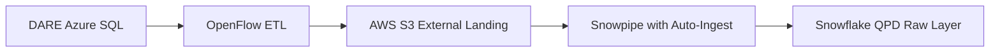

**Pros:**
- Minimizes the number of technologies in the target state (OpenFlow is managed by Snowflake)
- Consolidates data movement into Snowflake-native ecosystem

**Cons:**
- Requires learning curve (specifically Apache NiFi)
- Higher implementation time and cost
- Requires testing and validation

---

---

##### Illion Data Source
**Type**: Manual

**Implementation**: Manual file upload process for Illion bureau data files

Business users receive monthly Illion bureau data files and manually upload them through a designated interface (e.g., Streamlit application or secure file transfer). Files are placed into the Snowflake Internal Stage Landing Layer, where Snowpipe with auto-ingest detects the new files and automatically loads them into the Snowflake QPD Raw Iceberg Layer for subsequent processing.

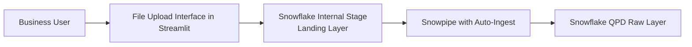

---

##### ACES Data Source
**Type**: Manual

**Implementation**: Streamlit application for user file uploads

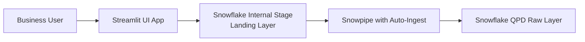

Upon file upload and submission through the Streamlit interface, files are automatically copied into the Snowflake Internal Stage in the landing layer. From there, Snowpipe with auto-ingest detects when a file has been added and automatically loads it into the Snowflake QPD Raw Iceberg Layer table for subsequent processing.

---

##### GDW Data Source
**Type**: Immediately accessible (no ingestion needed)

**Implementation**: As part of the greenfield initiative, GDW tables will be available as AWS Glue catalog linked externally managed Iceberg tables. QPD only needs to raise a request to access required tables. Per the HLSA design for greenfield, GDW externally managed Iceberg tables will be created in the requestor's database (QPD), pointing to the correct storage location in GDW.

---

##### Omnia Data Source
**Type**: Immediately accessible (no ingestion needed)

**Implementation**: As part of the greenfield initiative, Omnia tables (OTC parquet files) will be available as external tables pointing to their current AWS S3 location. QPD only needs to raise a request to access required tables.

---

##### CSV Files Data Source
**Type**: Periodic

**Ingestion Options**:

**Option 1: SSIS Repointing**

Repoint existing SSIS packages to write CSV file outputs to AWS S3 External Landing layer, where Snowpipe auto-ingest automatically loads data into Snowflake QPD Raw Iceberg tables.

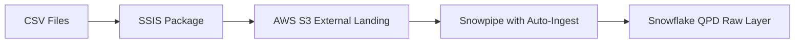

**Pros:**
- Minimal implementation time due to repointing existing packages
- No learning curve required for teams already familiar with SSIS

**Cons:**
- Doesn't address the challenge of multiple technologies in the target state
- Continues dependency on Windows-based infrastructure and SQL Server licensing

---

**Option 2: OpenFlow Integration**

Leverage OpenFlow (managed by Snowflake) to process and move CSV files to AWS S3 External Landing, with Snowpipe auto-ingest loading into Snowflake QPD Raw Iceberg tables.

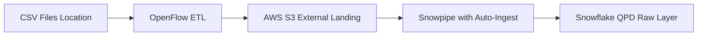

**Pros:**
- Minimizes the number of technologies in the target state (OpenFlow is managed by Snowflake)
- Consolidates data movement into Snowflake-native ecosystem

**Cons:**
- Requires learning curve (specifically Apache NiFi)
- Higher implementation time and cost
- Requires testing and validation

---

**Option 3: S3 External Landing Direct**

Configure source systems or file transfer processes to write CSV files directly to AWS S3 External Landing, with Snowpipe auto-ingest automatically loading into Snowflake QPD Raw Iceberg tables.

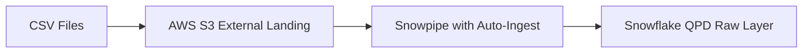

**Pros:**
- Minimizes the number of technologies in the target state
- Approved pattern by CDAO for cloud-native ingestion
- Simplest architecture with fewest components

**Cons:**
- Requires modification of source systems or file transfer processes
- Higher implementation time and cost
- Requires testing and validation

---

---

##### AI Models Data Source
**Type**: Periodic

**Implementation**: Repoint AWS SageMaker output to write to AWS S3 External Landing layer, where Snowpipe auto-ingest automatically loads model results into Snowflake QPD Raw Iceberg tables.

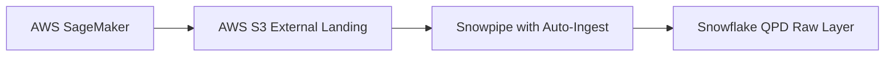

---

##### Ingestion Recommendations

This section provides strategic recommendations for implementing data ingestion patterns based on organizational priorities, technical complexity, and alignment with CDAO standards.

**DARE Data Source - Recommended Approach:**

- **Short-term (Phase 1)**: Option 1 (Alteryx Repointing) for rapid migration and minimal disruption, and to better align with CDAO approved patterns.
- **Long-term (Phase 2)**: Option 2 (OpenFlow Integration) to align with platform consolidation strategy and reduce technology sprawl, after getting the required approvals from CDAO / architecture teams.

**CSV Files Data Source - Recommended Approach:**

- **Short-term (Phase 1)**: Option 1 (SSIS Repointing) for rapid migration and minimal disruption
- **Medium-term (Phase 2)**: Option 3 (S3 External Landing Direct) as the preferred CDAO-approved pattern
- **Alternative**: Option 2 (OpenFlow Integration) if complex file processing/transformation is required before landing

**Implementation Strategy:**

The phased approach balances immediate migration needs with long-term architectural goals:

1. **Phase 1 (Quick Wins)**: Repoint existing tools (Alteryx, SSIS) to minimize disruption while adopting the CDAO-approved S3 + Snowpipe pattern
2. **Phase 2 (Consolidation)**: Transition to Snowflake-managed tools (OpenFlow) or direct S3 landing patterns to reduce technology sprawl
3. **Ongoing**: Continuously evaluate and retire legacy tools as teams build expertise with cloud-native patterns

#### 4.2.3 Transformation Layer (T)

## **Current State Transformation Analysis**

Based on discovery, the current transformation landscape can be categorized by complexity:

### **Transformation Complexity Matrix**

| **Tool** | **Data Source** | **Complexity** | **Transformation Types** | **Volume** |
|----------|----------------|----------------|-------------------------|------------|
| Alteryx | DARE, Illion | **Low-Medium** | Clean, cast, joins | Multiple workflows (1:1 mapping) |
| SQL Scripts | Illion Files | **Low** | Clean, cast, column selection | Limited scripts |
| SSIS | CSV Files (DDM) | **Low** | File movement, clean and dump | Few packages |
| BTEQ Scripts | Various | **Low-Medium** | Fastload/Multiload, staging → transform → target. Castings, remove columns, remove special characters, aggregations | Multiple scripts |
| R-Connect | GDW Sandpit (200 tables) | **High** | Complex joins, aggregations, scheduled jobs (daily/weekly/monthly) | ~200 jobs |

### **Key Observations:**
- **Simple Transformations**: Data cleansing, type casting, column selection, simple joins
- **Complex Transformations**: R-Connect GDW jobs with 200 tables and complex aggregations
- **No chaining**: Alteryx workflows are 1:1 (one file → one table), simplifying migration
- **Manual triggers**: Most Alteryx workflows are manually triggered, not automated
- **Staging pattern**: BTEQ follows a consistent staging → transformation → target pattern

---

## **Future State Architecture: Bronze → Silver → Gold Transformation Flow**

### **Conceptual Mapping**

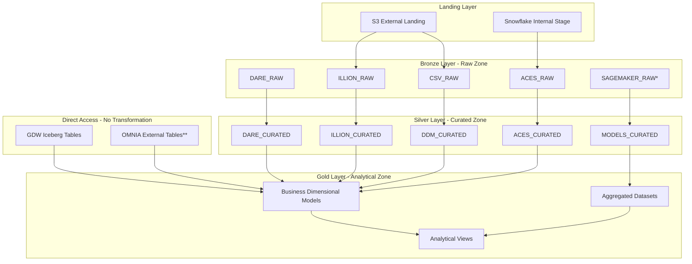

**Caveats:**
- *SAGEMAKER_RAW: Requires review and confirmation with BB technical team on integration approach
- **OMNIA External Tables: Pending finalization from CDAO on external table access patterns

---

## **Transformation Migration Options: Comparison**

### **Approach Overview**

| **Option** | **Description** | **Core Technology** | **Migration Speed** | **Long-term Maintainability** |
|------------|----------------|---------------------|---------------------|-------------------------------|
| **Option 1: SnowConvert AI** | Automated conversion of Teradata scripts to Snowflake stored procedures | Snowflake Stored Procedures | Fast (automated) | Medium |
| **Option 2: dbt** | Modern SQL-based transformation framework with version control and testing | dbt Models (SQL + YAML) | Moderate | High |

**SnowConvert AI Conversion Process:**
1. Automated code translation of BTEQ scripts and Teradata SQL to Snowflake stored procedures
2. Syntax mapping of Teradata-specific commands (FASTLOAD, MULTILOAD) to Snowflake equivalents (COPY INTO, MERGE)
3. Validation for syntax correctness and functional equivalence
4. Manual refinement for performance optimization

**dbt Development Process:**
1. Transformations written as SQL SELECT statements in `.sql` files
2. Automated dependency management using `ref()` function
3. Built-in testing framework via YAML configuration
4. Version control with Git for collaborative development
5. Auto-generated lineage and documentation

---

### **Tool-by-Tool Migration Mapping**

| **Current Tool** | **Current State** | **Option 1: SnowConvert AI** | **Option 2: dbt** | **Layer Mapping** |
|------------------|-------------------|------------------------------|-------------------|-------------------|
| **BTEQ Scripts** | **Tool**: BTEQ scripts; **Pattern**: Three-stage (Fastload/Multiload → staging transformations → target tables); **Transformations**: Casting, column removal, special character removal, aggregations; **Complexity**: Low to Medium | **Target**: Snowflake Stored Procedures; **Approach**: Automated conversion via SnowConvert AI; **Execution**: Called by Snowflake Tasks or external orchestrator | **Target**: dbt Models (Bronze/Silver/Gold); **Approach**: Rewrite BTEQ logic as SQL SELECT statements in layered dbt models; **Testing**: YAML-defined data quality tests; **Execution**: `dbt run` in dependency order | **Bronze**: Fastload/Multiload → `COPY INTO`; **Silver**: Staging transformations → cleansing/casting; **Gold**: Target tables → analytical models |
| **Alteryx Workflows** | **Tool**: Alteryx workflows; **Sources**: DARE, Illion Files; **Pattern**: 1:1 workflow (one source → one table); **Transformations**: Data cleansing (trim, remove nulls), type casting, simple joins; **Trigger**: Manual execution; **Complexity**: Low to Medium | **Target**: Snowflake Stored Procedures; **Approach**: Convert Alteryx workflow logic to SQL stored procedures; **Execution**: Triggered via Snowflake Tasks | **Target**: dbt Models (Bronze/Silver/Gold); **Approach**: Extract workflow logic and translate to SQL-based dbt models; **Testing**: Data quality tests on key columns; **Documentation**: Business logic documented in YAML | **Bronze**: Raw data via repointed Alteryx or Snowpipe; **Silver**: Cleansing, casting, joining; **Gold**: Aggregations and business calculations |
| **SQL Scripts** | **Tool**: Teradata SQL scripts; **Source**: Illion Files; **Transformations**: Clean, cast, column selection; **Execution**: Run directly in Teradata; **Complexity**: Low | **Target**: Snowflake Stored Procedures; **Approach**: Automated conversion via SnowConvert AI (direct SQL-to-SQL translation); **Execution**: Called via Snowflake Tasks or manual trigger | **Target**: dbt Models (Bronze/Silver); **Approach**: Direct translation to dbt models (minimal rewrite); **Testing**: Add data quality tests; **Benefits**: Natural fit for dbt | **Bronze**: Raw Illion data from external stages; **Silver**: Cleansing, type casting, column filtering |
| **SSIS Packages** | **Tool**: SSIS packages; **Source**: CSV files (DDM - Direct Debit Monitoring); **Transformations**: File movement from shared folders, basic data cleansing, direct load to QPD; **Complexity**: Low | **Target**: Snowflake Stored Procedures + Snowpipe; **Approach**: File movement replaced by S3 + Snowpipe; transformation logic manually converted to stored procedures (SnowConvert AI SSIS support TBD); **Execution**: Triggered automatically on file arrival | **Target**: dbt Models + Snowpipe; **Approach**: Snowpipe handles file loading; dbt incremental models replace transformation logic; **Testing**: Data quality validation post-transformation | **Bronze**: Raw CSV data via Snowpipe; **Silver**: Cleansing (decrypt APCA names, validate DD limits, format claims data) |
| **R-Connect (GDW 200 Jobs)** | **Tool**: R-Connect; **Source**: GDW Sandpit (200 tables); **Transformations**: Complex multi-table joins, advanced aggregations, scheduled jobs (daily/weekly/monthly); **Execution**: R-Connect orchestrates script execution, writes to Teradata QPD | **Target**: Python Stored Procedures (Snowpark) OR Posit; **Approach**: GDW accessible as Iceberg tables; standard data transformations manually converted to Python stored procedures (Snowpark); complex statistical analysis and modeling retained in R using Posit on Snowflake; **Execution**: Scheduled via Snowflake Tasks or Posit orchestration | **Target**: Not applicable for complex statistical workloads; dbt only suitable if jobs contain simple SQL-based transformations without advanced statistical analysis; **Approach**: Assessment required to determine job complexity and appropriate migration path | **Gold**: Analytical outputs, dimensional models, aggregated datasets |

---

### **Key Differentiators**

| **Criteria** | **SnowConvert AI** | **dbt** |
|--------------|-------------------|---------|
| **Best For** | Quick lift-and-shift, preserving existing logic | Modernization, long-term maintainability |
| **Version Control** | Stored procedures can be version controlled in GitHub | Native Git integration |
| **Testing** | Manual testing required | Built-in testing framework |
| **Documentation** | Requires separate documentation | Auto-generated lineage and docs |
| **Learning Curve** | Minimal (similar to existing patterns) | Moderate (new framework) |
| **Code Reusability** | Stored procedures can be used across worksheets | High (modular SQL models) |
| **Collaboration** | Stored procedures shareable via worksheets | Git-based collaborative workflows |
| **Data Quality** | Custom validation logic in procedures | Declarative YAML-based tests |

#### 4.2.4 Consumption Layer

| **Consumer** | **Consumption Methods** | **Recommended Method** |
|--------------|------------------------|------------------------|
| **Tableau/Reporting** | • Direct Snowflake connectivity with native optimization and caching • Self-service analytics capabilities with governed data access • Real-time dashboard updates and interactive exploration | Direct Snowflake connectivity querying Gold Iceberg tables with live connectivity and materialized views for performance optimization |
| **APIs** | • **Snowflake SQL API**: Direct database connectivity for application integration • **REST API Gateway**: Service layer for external application access with proper authentication and rate limiting • **GraphQL Endpoints**: Flexible data querying for modern application architectures | Snowflake SQL API for direct access to Gold Iceberg tables, with REST API Gateway for external applications requiring additional security controls |
| **AI Models/Data Science** | • **Snowflake Notebooks**: Integrated Jupyter-style environment for data science workflows • **Hex/External Notebooks**: Integration with external data science platforms • **MLOps Pipeline**: Automated model training, validation, and deployment workflows • **Feature Store**: Centralized repository for ML features with versioning and lineage | Snowflake Notebooks for integrated development, with Feature Store built on Gold Iceberg tables for model serving and MLOps pipelines for automated workflows |
| **Analytical Reporting** | • Direct SQL queries against Gold Iceberg tables • Scheduled report generation via Snowflake Tasks • Export capabilities to various formats (PDF, Excel, CSV) | Direct SQL queries with scheduled Tasks for automated report generation and distribution |
| **R-Connect Analytics** | • Snowflake R Integration for statistical analysis • Posit Workbench for collaborative R development • Direct table access via ODBC/JDBC connectors | Snowflake R Integration or Posit Workbench connecting directly to Gold Iceberg tables for advanced statistical analysis |

#### 4.2.5 Orchestration

**Snowflake Tasks:**
- Scheduled job execution for automated data pipeline operations
- Native task scheduling for data ingestion, transformation, and quality checks
- Task dependency management for complex workflow orchestration
- Automated retry mechanisms and error handling
- Resource optimization through intelligent task scheduling

### 4.3 Detailed Component Mapping

| **Current Tool/System** | **Snowflake Capability** | **Migration Approach** |
|------------------------|---------------------------|------------------------|
| Alteryx | dbt + Snowflake SQL + Python | Workflow conversion and optimization targeting Iceberg tables |
| SSIS | Fivetran + Snowflake Connectors | ETL package migration to ELT patterns writing to Iceberg tables |
| R-Connect | Snowflake R Integration + Notebooks | R script modernization with Iceberg table integration |
| Teradata QPD Tables | AWS Glue Catalog Iceberg Tables | Direct migration to externally managed Iceberg tables via Glue catalog |
| SQL Scripts | Snowflake SQL + Stored Procedures | Code conversion optimized for Iceberg table operations (MERGE, COPY INTO) |
| File Processing | Snowflake Stages + Tasks | Automated file ingestion to Iceberg tables via external stages |

**Architecture Notes:**
- All data layers (Bronze, Silver, Gold) utilize AWS Glue catalog externally managed Iceberg tables
- Iceberg format enables ACID transactions, time-travel, schema evolution, and multi-engine compatibility
- Snowflake queries Iceberg tables through Glue catalog integration providing unified metadata management

---

## 5. Security, Governance, and Operations

### 5.1 Data Governance

**Metadata Management:**
- **Data Catalog**: Unified metadata management through AWS Glue catalog integration with Snowflake
- **Iceberg Metadata**: Leverages Iceberg's built-in metadata tracking for table history, schema evolution, and partition information
- **Business Glossary**: Centralized definitions and business context for data assets
- **Data Classification**: Automated sensitive data discovery and classification across Iceberg tables

**Data Quality:**
- **Quality Checks**: Automated data validation rules and quality scorecards leveraging Iceberg's ACID properties
- **Data Profiling**: Continuous monitoring of data distribution and anomaly detection
- **Quality Metrics**: Business-defined KPIs for data quality measurement and reporting
- **Time-Travel Validation**: Iceberg snapshot isolation enables point-in-time data quality audits

**Lineage Tracking:**
- **End-to-End Lineage**: Complete traceability from source systems to consumption points across all Iceberg table versions
- **Impact Analysis**: Understanding of downstream effects for data model changes using Iceberg metadata
- **Compliance Reporting**: Automated generation of lineage reports for regulatory requirements
- **Cross-Engine Lineage**: Track data usage across Snowflake, Spark, Athena, and other engines accessing Iceberg tables

### 5.2 Monitoring & Alerting Capabilities

**Monitoring:**
- **Performance Monitoring**: Real-time query performance and resource utilization tracking
- **Cost Monitoring**: Granular cost allocation and chargeback capabilities by department/project
- **Data Quality Monitoring**: Continuous validation of data freshness, completeness, and accuracy

**Cost Management/Optimization:**
- **Auto-Scaling**: Dynamic compute resource scaling based on workload demands
- **Resource Scheduling**: Automated warehouse suspension and resumption based on usage patterns
- **Cost Allocation**: Detailed cost tracking and optimization recommendations by business unit

**Performance Tuning:**
- **Query Optimization**: Automated query performance analysis and optimization recommendations
- **Clustering**: Intelligent data clustering for improved query performance
- **Caching**: Result set caching and materialized views for frequently accessed data

---

## 6. Use Case Scenarios and Architecture Application

### 6.1 Smart Mini Data Load (DARE → Alteryx → QPD → Tableau)

**Use Case:** Smart Mini Data Load used for merchant migration and mobile user analysis, this flow transforms DARE SQL Server data via Alteryx and loads it into QPD for Tableau dashboarding. It supports weekly refreshes and validation of transactional counts.

**Current State:**
- **Source:** DARE SQL Server tables
- **Tool:** Alteryx workflows
- **Target:** QPD tables
- **Output:** Tableau dashboards for merchant migration and mobile user analysis
- **Load Frequency:** Weekly

**Future State Architecture:**
- **Ingestion:** Fivetran connector for DARE SQL Server with automated CDC writing to Iceberg tables
- **Transformation:** dbt models replacing Alteryx workflows, processing data through Bronze → Silver → Gold Iceberg table layers
- **Storage:** AWS Glue catalog externally managed Iceberg tables with optimized partitioning and ACID compliance
- **Consumption:** Tableau connected directly to Snowflake querying Iceberg tables with live connectivity
- **Benefits:** Reduced processing time, automated data quality checks, real-time insights, time-travel capabilities, and cross-engine compatibility

### 6.2 Illion Bureau Data Load

**Use Case:** Monthly Credit Bureau Reporting - Monthly bureau files from Illion are ingested and transformed using SQL and Alteryx, then loaded into QPD for credit risk dashboards. This supports regulatory and financial insights with ~90K records per month.

**Current State:**
- **Source:** Illion files - External
- **Tool:** SQL + Alteryx
- **Target:** ILLION_TXN_DATA_LOAD in QPD
- **Output:** Tableau dashboards for bureau-level insights
- **Size Estimate:** ~79,985 to 89,023 records per month
- **Load Frequency:** Monthly

**Future State Architecture:**
- **Ingestion:** Snowflake External Stages with automated file detection via Snowpipe writing to Bronze Iceberg tables
- **Transformation:** dbt models for data cleansing and business rule application across Silver and Gold Iceberg layers
- **Storage:** AWS Glue catalog externally managed Iceberg tables with time-travel and snapshot isolation for audit compliance
- **Consumption:** Enhanced Tableau dashboards with real-time refresh capabilities querying Gold Iceberg tables
- **Benefits:** Automated processing, improved data lineage, reduced manual intervention, ACID compliance, and multi-version concurrency control

### 6.3 Direct Debit Monitoring Tool

**Use Case:** DDMT (Direct Debit Monitoring Tool) is a standalone internal tool used by frontline teams to monitor direct debit facility utilisation, identify breaches, and support annual reviews. It consumes data loaded into QPD tables via SSIS packages, which processes encrypted APCA names, CommBiz limits, and claims data from shared folders.

**Current State:**
- **Source:** Raw files (claims data, APCA names, DD limits) manually placed in shared folders
- **Tool:** SSIS package loads data into QPD tables
- **Target:** QPD tables used by DDMT tool
- **Output:** DDMT for monitoring and annual review support
- **Load Frequency:** Manual/periodic uploads

**Future State Architecture:**
- **Ingestion:** Snowflake External Stages with automated file processing via Tasks writing to Bronze Iceberg tables
- **Transformation:** dbt models for data validation and encryption handling across Silver Iceberg layer
- **Storage:** Secure AWS Glue catalog Iceberg tables with row-level security, encryption, and audit logging via Iceberg snapshots
- **Consumption:** Modernized DDMT tool with direct Snowflake connectivity querying Gold Iceberg tables or API layer
- **Benefits:** Automated file processing, enhanced security, improved audit capabilities, immutable audit trail, and time-travel for compliance

### 6.4 Watchlist Integration

**Use Case:** The Watchlist Integration supports the Customer Experience Engine (CEE) by enabling conflict checks and risk classification workflows. The ACES Watchlist, a critical component of credit risk oversight, is manually loaded into QPD to support consolidated reporting and downstream analytics.

**Current State:**
- **Source:** ACES Watchlist entries manually curated by business units and submitted monthly
- **Tool:** Files received from ACES team, validated and manually loaded into QPD by BB Data Office
- **Target:** QPD tables for consolidated reporting
- **Output:** Monthly Watchlist Reports for credit risk teams and business units to monitor flagged borrowers, trigger escalations to Group Credit Structuring (GCS), and support regulatory and internal audit requirements
- **Load Frequency:** Weekly

**Future State Architecture:**
- **Ingestion:** Automated API integration with ACES system or secure file transfer to Snowflake Internal Stage writing to Bronze Iceberg tables
- **Transformation:** dbt models for data validation, conflict resolution, and business rule application across Silver and Gold Iceberg layers
- **Storage:** AWS Glue catalog Iceberg tables with secure access controls, complete audit trail via snapshots, and time-travel for regulatory review
- **Consumption:** Real-time dashboards and automated alerting for risk teams querying Gold Iceberg tables, API integration with CEE
- **Benefits:** Reduced manual processing, real-time risk monitoring, enhanced compliance capabilities, immutable audit history, and point-in-time regulatory reporting

### 6.5 Cashflow Model Output

**Use Case:** The CVM Cashflow Forecast initiative is part of the broader MEP (Model Execution Pipeline) framework. It aims to operationalise credit and debit cashflow forecasting models using AWS SageMaker, Glue ETL, and Teradata QPD. These forecasts are consumed by platforms like Bankers Workbench (BWB) to support customer engagement and advisory.

**Current State:**
- **Tables:** Final table for structured credit forecasts & Final table for structured debit forecasts
- **Tool:** QPD for table creation, testing, and structured storage; AWS SageMaker for model scoring and output generation; AWS Glue for ETL and writeback to Teradata; GitHub for managing config.yaml and container PRs
- **Output:** Structured cashflow forecasts with quantile predictions (10%, 50%, 90%) for credit and debit transactions
- **Enables:** Cashflow shortfall alerts, Predictive advisory & Integration into Bankers Workbench for customer engagement
- **Load Frequency:** Staging Tables loaded when new SageMaker outputs are available; Final Tables auto-refreshed post-staging via Glue ETL; ETL Runtime ~40 minutes per batch; Scoring Frequency: Weekly or model-triggered, aligned with retraining cycles

**Future State Architecture:**
- **ML Pipeline:** Snowflake native ML capabilities with Snowpark for model execution and scoring, writing results to Bronze Iceberg tables
- **Data Storage:** AWS Glue catalog Iceberg tables with native support for semi-structured data, ACID transactions, and time-travel capabilities
- **Transformation:** dbt models for data processing and quantile calculations replacing Glue ETL, processing through Silver and Gold Iceberg layers
- **Integration:** Direct API connectivity to Bankers Workbench querying Gold Iceberg tables, eliminating complex ETL processes
- **Benefits:** Simplified architecture, reduced latency, enhanced model monitoring, improved scalability, version control for model outputs, and multi-engine compatibility

### 6.6 Customer Value Management (CVM) Insights to Service Domain

**Use Case:** CVM (Customer Value Management) delivers actionable insights such as payaway patterns, predicted needs, and customer engagement scores from QPD to the Service Domain (SD). These insights are consumed by downstream participants like Bankers Workbench (BWB) to support personalised customer engagement and AI model feedback loops.

**Current State:**
- **Source:** QPD tables in the BB Datamart
- **Tool:** API layer extracts data from QPD and pushes it into Aurora DB within the CBI Service Domain. Job status checks are in place to monitor successful delivery
- **Target:** Aurora DB in the CBI Service Domain, which feeds into the Banker Workbench (BWB) and other downstream systems
- **Output:** Top 20 CVM insights, historical engagement patterns, and payaway behaviour used by bankers to drive customer conversations and engagement strategies
- **Load Frequency:** Weekly refresh of CVM insights to ensure recency and relevance for customer interactions

**Future State Architecture:**
- **Data Sharing:** Snowflake secure data sharing of Gold Iceberg tables eliminating complex API extractions
- **Real-time Processing:** Snowflake Streams on Iceberg tables for real-time insight generation and updates
- **Integration:** Direct Snowflake connectivity to Service Domain applications querying Iceberg tables via native connectors
- **Analytics:** Enhanced CVM scoring models using Snowflake's native ML functions writing to Iceberg tables
- **Benefits:** Real-time insights, simplified data pipeline, improved customer experience, enhanced model feedback loops, cross-platform compatibility, and immutable insight versioning

### 6.7 BB Data Quality Platform

**Use Case:** Data Quality Tool aims to offer the following business outcomes for Business Banking: ability to assess data by data producers and data stewards using self-service functionality; expose data with issues for remediation to frontline, data producers and data stewards; track and monitor data quality in Omnia and GDW v2.

**Current State:**
- **Source:** GDW Sandpit (1 table), Omnia Sandpit (2 tables)
- **Tool:** Scoop (for data movement), SMTP Email Relay (for notifications), Tableau & R-Shiny Tool (for visualisation and remediation)
- **Target:** GDW Target Tables, Omnia Target Tables: XYZ
- **Output:** DQ Exception records with metadata and context, Email notifications to RMs and Data Stewards, Dashboards with RAG status, Exception counts & Drill-down capabilities, R-Shiny portal for remediation with row-level security
- **Load Frequency:** Daily

**Future State Architecture:**
- **Data Quality Framework:** Snowflake native data quality functions and Great Expectations integration validating Iceberg table data
- **Monitoring:** Automated data quality scoring with Snowflake Tasks and alerting capabilities leveraging Iceberg snapshots for audit trails
- **Visualization:** Modern Tableau dashboards with real-time data quality metrics querying Gold Iceberg tables directly
- **Self-Service:** AWS Glue catalog metadata and Snowflake Information Schema for unified data steward access across all Iceberg tables
- **Benefits:** Automated quality monitoring, real-time exception detection, simplified remediation workflows, enhanced data governance, point-in-time quality validation, and cross-engine data quality checks

---
