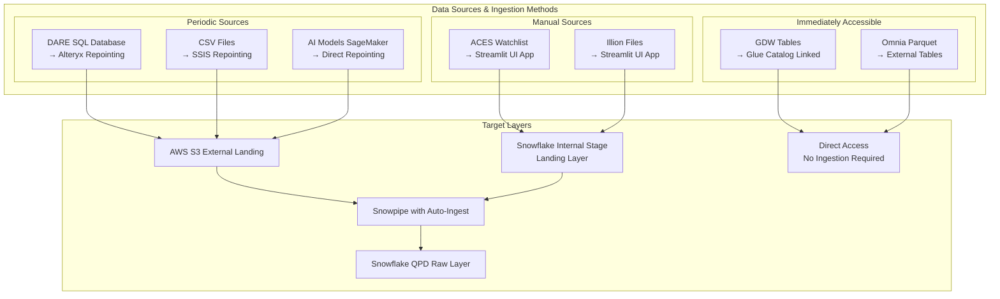
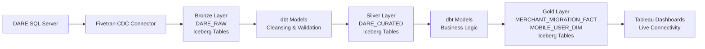
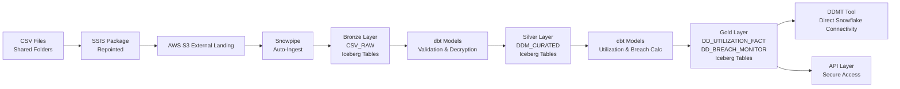
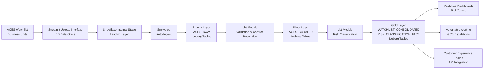
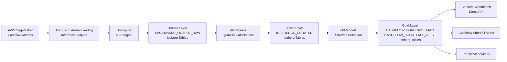
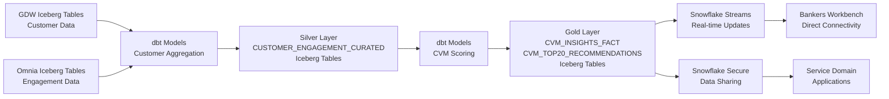

# QPD Future State Architecture: Gem Outline
## Snowflake-Based Data Platform Transformation

---

## Table of Contents

1. [Introduction and Executive Summary](#introduction-and-executive-summary)
   - 1.1 [Background](#11-background)
   - 1.2 [Purpose of this Document](#12-purpose-of-this-document)
   - 1.3 [Executive Summary](#13-executive-summary)
   - 1.4 [Current Challenges](#14-current-challenge)

2. [Current State Architecture Review](#2-current-state-architecture-review)
   - 2.1 [Current Architecture Diagram](#21-current-architecture-diagram)
   - 2.2 [Data Sources Analysis](#22-data-sources-analysis)
   - 2.3 [Target System (QPD)](#23-target-system-qpd)
   - 2.4 [Consumption Analysis](#24-consumption-analysis)
   - 2.5 [Current State Pain Points](#25-current-state-pain-points)

3. [Guiding Principles](#3-guiding-principles)

4. [Future State Architecture Diagram](#4-future-state-architecture-diagram)
   - 4.1 [Conceptual Architecture](#41-conceptual-architecture)
   - 4.2 [Detailed Architecture Components](#42-detailed-architecture-components)
     - 4.2.1 [Storage Layer](#421-storage-layer)
     - 4.2.2 [Ingestion Layer (EL)](#422-ingestion-layer-el)
       - [DARE Data Source](#dare-data-source)
       - [Illion Data Source](#illion-data-source)
       - [ACES Data Source](#aces-data-source)
       - [GDW Data Source](#gdw-data-source)
       - [Omnia Data Source](#omnia-data-source)
       - [CSV Files Data Source](#csv-files-data-source)
       - [AI Models Data Source](#ai-models-data-source)
       - [Ingestion Recommendations](#ingestion-recommendations)
       - [Migration Approach](#migration-approach)
     - 4.2.3 [Transformation Layer (T)](#423-transformation-layer-t---target-state)
       - 4.2.3.2 [Migration Approach](#4232-migration-approach)
     - 4.2.4 [Consumption Layer](#424-consumption-layer)
     - 4.2.5 [Orchestration](#425-orchestration)
   - 4.3 [Detailed Component Mapping](#43-detailed-component-mapping)

5. [Security, Governance, and Operations](#5-security-governance-and-operations)
   - 5.1 [Data Governance](#51-data-governance)
   - 5.2 [Monitoring & Alerting Capabilities](#52-monitoring--alerting-capabilities)

6. [Use Case Scenarios and Architecture Application](#6-use-case-scenarios-and-architecture-application)
   - 6.1 [Smart Mini Data Load (DARE → Alteryx → QPD → Tableau)](#61-smart-mini-data-load-dare--alteryx--qpd--tableau)
   - 6.2 [Illion Bureau Data Load](#62-illion-bureau-data-load)
   - 6.3 [Direct Debit Monitoring Tool](#63-direct-debit-monitoring-tool)
   - 6.4 [Watchlist Integration](#64-watchlist-integration)
   - 6.5 [Cashflow Model Output](#65-cashflow-model-output)
   - 6.6 [Customer Value Management (CVM) Insights to Service Domain](#66-customer-value-management-cvm-insights-to-service-domain)
   - 6.7 [BB Data Quality Platform](#67-bb-data-quality-platform)

7. [Document Information](#document-information)

---

## Introduction and Executive Summary

### 1.1 Background

To align with our cloud-first strategy and simplify our data platforms, we are gradually transitioning away from legacy systems such as Teradata. While Teradata has served multiple teams effectively over the years, it has become increasingly expensive and less compatible with modern cloud-native architectures.

As an initial step, we successfully migrated Teradata to AWS. However, a significant portion of the ongoing cost is attributed to sandpit environments, particularly QPD sandpits, which are widely used for testing and analysis across teams. These environments consume substantial storage and compute resources, and many are either unmanaged or no longer actively used.

To address this, we are initiating a phased migration of QPD sandpit workloads to more efficient platforms such as Snowflake and AWS-native services. This transition is expected to reduce operational costs, enhance data security, and streamline platform governance.

The current QPD (Quantitative Portfolio Decisions) system architecture includes:

**Data Sources:**
- SQL Database (DARE)
- Illion Files
- ACES Watchlist Entries
- CSV Files
- Teradata (GDW)
- Parquet Files (Omnia)
- AI Models (Sagemaker)

**Transformation Tools:**
- Alteryx for data preparation and blending
- SQL Scripts for custom transformations
- SSIS for data integration
- R-Connect for statistical analysis and data movement

This fragmented approach, combined with the legacy Teradata infrastructure, has created significant challenges including high total cost of ownership (TCO), performance bottlenecks, scalability limitations, maintenance complexity, and limited support for modern analytics workloads.

### 1.2 Purpose of this Document

This document defines the target future state architecture for QPD, outlining the migration from the current Teradata-based system to a modern cloud data platform. It establishes the required platform capabilities, data flow architecture, and quantifiable business benefits. Additionally, this document translates and maps the use cases validated in the Proof of Concept (PoC) to the future state architecture, demonstrating how these scenarios will be supported in the target Snowflake environment. The document serves as a blueprint for stakeholders to understand the transformation scope, approach, and expected outcomes.

### 1.3 Executive Summary

The proposed solution involves migrating QPD to Snowflake Cloud Data Platform with a unified AWS Glue catalog Iceberg table architecture, implementing a modern ELT (Extract, Load, Transform) approach that leverages cloud-native capabilities. All data layers (Bronze, Silver, Gold) will utilize externally managed Iceberg tables on AWS Glue catalog, providing ACID compliance, schema evolution, time-travel capabilities, and multi-engine compatibility. The transformation will retire legacy systems including Alteryx, SSIS, and R-Connect for core data movement, replacing them with Snowflake-native features, dbt for transformations writing to Iceberg tables, and Fivetran for data integration. This approach will deliver significant cost savings, improved performance, enhanced scalability, cross-platform data sharing, and enable self-service analytics capabilities.

### 1.4 Current Challenges

The existing architecture faces several critical challenges:

- **Data Accumulation**: Many sandpits contain years of historical data that users rely on for continuity. Snowflake's architecture requires a clear strategy for migrating this data while preserving analytical workflows
- **Cross-Domain Complexity**: Sandpit datasets often span multiple domains (e.g., Consumer Finance, Customer Service, Wealth). Snowflake's domain-aligned governance model necessitates careful segmentation and integration planning
- **Functional Dependency**: Sandpit workflows are tightly coupled with historical data. Migrating without this context risks disrupting business-critical insights and reporting
- **Data Ownership and Stewardship**: Teradata sandpits lack federated ownership. Snowflake's governance framework requires clearly defined data stewardship to support access controls, lineage, and accountability
- **Consumer Enablement**: Analytical consumers including CEE, Tableau users, and analysts expect seamless access to data in the new platform. Snowflake must support these consumption patterns without compromising performance or governance

---

## 2. Current State Architecture Review

### 2.1 Current Architecture Diagram


### 2.2 Data Sources Analysis

| **Data Source** | **Format** | **Transformation Tool** |
|-----------------|------------|-------------------------|
| SQL Database (DARE) | Relational | Alteryx |
| Illion Files | [Format] | Alteryx + SQL Scripts |
| ACES Watchlist Entries | [Format] | SQL Scripts |
| CSV Files | CSV | SSIS |
| Teradata (GDW) | Relational | R-Connect |
| Parquet Files (Omnia) | Parquet | R-Connect |
| AI Models (Sagemaker) | Model Outputs | Direct Load |

### 2.3 Target System (QPD)

QPD serves as an analytical sandpit built on Teradata technology, designed to facilitate a wide range of production reporting, analytics, and control functions. Numerous key processes, including NBCs and Model Score calculations, depend on the comprehensive and reliable data available within the QPD Sandpit environment.

### 2.4 Consumption Analysis

Current downstream consumers include:

- **Tableau Dashboards**
- **APIs**
- **R-Connect Analytics**
- **Analytical Reporting**
- **AI Models**

### 2.5 Current State Pain Points

<!-- - **Performance Issues**: Query performance bottlenecks and resource contention
- **Scalability Limitations**: Fixed infrastructure unable to handle growing data volumes and user demands
- **Maintenance Complexity**: Multiple disparate tools requiring specialized expertise and complex coordination
- **Cost Concerns**: High licensing costs, infrastructure overhead, and limited cost optimization capabilities
- **Technology Debt**: Legacy systems constraining innovation and preventing adoption of modern analytics capabilities
- **Data Quality Issues**: Inconsistent governance frameworks and quality controls across multiple transformation tools -->

- **Diverse Platforms**: Multiple platforms make it difficult to sustain a common skillset amongst staff
- **Coupled Compute and Storage**: Fixed infrastructure architecture limiting independent scaling and cost optimization
- **Technology Fragmentation**: Different technologies being used for ingestion and transformation creating operational complexity
- **Cross-Domain Data Access**: Data residing in different domains creates overhead to pull into QPD

---

## 3. Guiding Principles

- **Cloud-Native**: Prioritize fully managed, scalable cloud services that eliminate infrastructure management overhead
- **ELT First**: Favor Extract, Load, Transform approach leveraging cloud data warehouse compute power over traditional ETL
- **Decoupled Compute and Storage**: Ensure performance optimization and cost efficiency through independent scaling
- **Self-Service**: Enable easier data access and analytics capabilities for business users, analysts, and data scientists
- **Data Governance**: Incorporate security, data quality, and lineage tracking by design across all data flows
- **Scalability**: Design for elastic scalability to handle varying workloads and data volumes
- **Cost Efficiency**: Optimize for cost-effective operations with usage-based pricing models
- **Real-time Capabilities**: Support both real-time streaming and batch processing requirements
- **Platform Unification**: Consolidate disparate tools and systems into a unified Snowflake-based platform to streamline data ingestion, transformation, and analytics capabilities
- **CBA (CDAO) Alignment**: When multiple implementation options exist, recommendations are driven by alignment with CBA (CDAO) approved practices and standards. Key mandates include:
  - **Iceberg Architecture**: AWS Glue catalog externally managed Iceberg tables are mandatory across all data layers (Bronze, Silver, Gold) to ensure ACID compliance, schema evolution, and multi-engine compatibility
  - **Transformation Pattern**: dbt within Snowflake is the preferred transformation pattern, writing to Iceberg tables for consistency, version control, and maintainability

---

## 4. Future State Architecture Diagram

### 4.1 Conceptual Architecture


### 4.2 Detailed Architecture Components

#### 4.2.1 Storage Layer

The architecture implements a unified Glue catalog-based approach across all data layers:
1. **QPD Glue Catalog Database**: All data layers (Bronze, Silver, Gold) utilize AWS Glue catalog externally managed Iceberg tables
2. **Unified Architecture**: Consistent table format across all layers enabling seamless data lineage, ACID compliance, and cross-platform compatibility


**Landing Layer:**
- **Purpose**: Landing zone for data sources to push data files to QPD for ingestion
- **Implementation**: Two-tier landing architecture supporting different data ingestion patterns
- **Storage Types**: 
  1. **External Landing (AWS S3 Bucket)**: For externally pushed files from automated data sources
  2. **Internal Landing (Snowflake Internal Stage)**: For manually submitted data files (e.g., ACES watchlist entries)
- Provides secure, scalable file storage with lifecycle management policies and flexible ingestion capabilities
- While staging data into a Landing Layer is not an explicit technical requirement, this document recommends it as a **best practice** for the following reasons:

- **Advantages of Landing Layer:**
  - **Data Audit Trail**: Preserves original source files for compliance, troubleshooting, and data lineage verification
  - **Reprocessing Capability**: Enables reloading data into Bronze tables without re-extracting from source systems in case of failures or data quality issues
  - **Decoupling**: Separates data extraction from data loading, allowing ingestion processes to run independently of transformation processes
  - **Source System Protection**: Reduces load on source systems by minimizing repeated extractions
  - **Error Recovery**: Facilitates quick recovery from pipeline failures without impacting source systems
  - **Data Retention**: Supports flexible retention policies with S3 lifecycle rules (e.g., archive to Glacier for long-term storage)
  - **Performance**: Enables parallel processing and batch optimization strategies
  - **Cost Efficiency**: Leverages cost-effective S3 storage for staging before committing to Iceberg table storage
- **Alternative Approach:**
  - If the Business Banking team determines that staging data in the Landing Layer does not provide sufficient value for their specific use cases, the Landing Layer can be **removed** from the architecture. In this scenario, ingestion processes would be modified to write directly to target Snowflake Bronze Iceberg tables, simplifying the data flow while maintaining functionality. This decision should be made based on operational requirements, data governance needs, and cost-benefit analysis.


**Raw Data Zone (Bronze):**
- **Purpose**: Landing zone for raw, unprocessed data in original formats with schema-on-read approach for maximum flexibility and data preservation
- **Implementation**: Externally managed Iceberg tables in AWS Glue catalog that receive data from both Landing Layer sublayers via Snowflake external stages and internal stages. Data is loaded using COPY INTO commands targeting Iceberg table formats
- **Table Types**: Externally managed Iceberg tables on AWS Glue catalog
- **Benefits**: ACID compliance, time-travel capabilities, schema evolution, and cross-engine compatibility (Snowflake, Spark, Athena)
- Cost-effective storage with S3 lifecycle policies and Iceberg table maintenance operations

**Curated Data Zone (Silver):**
- **Purpose**: Cleansed and standardized data with enforced schema and quality rules, optimized for downstream consumption with improved query performance
- **Implementation**: Externally managed Iceberg tables within AWS Glue catalog for business rule applications and data enrichment processes. Transformations write to Iceberg tables using MERGE operations for upserts
- **Table Types**: Externally managed Iceberg tables on AWS Glue catalog
- **Benefits**: Partition evolution, hidden partitioning, and efficient incremental updates via Iceberg merge-on-read capabilities
- Supports complex transformations and data quality validations with full transaction support

**Data Warehouse (Gold):**
- **Purpose**: Business-ready analytical data models optimized for specific use cases with dimensional modeling and aggregated datasets for reporting and analytics
- **Implementation**: Externally managed Iceberg tables on AWS Glue catalog enabling external ecosystem integration and advanced analytics workflows
- **Table Types**: Externally managed Iceberg tables on AWS Glue catalog
- **Benefits**: Multi-engine query support, snapshot isolation for concurrent reads, and metadata-driven query optimization
- High-performance compute resources for complex analytical workloads and cross-platform data sharing

#### 4.2.2 Ingestion Layer (EL)

**CDAO Approved Ingestion Pattern:**

The approved ingestion pattern from CDAO follows a standardized approach: load files to be ingested into an AWS S3 bucket (external landing), then use Snowpipe with auto-ingest to automatically copy data into the target Iceberg table. This pattern ensures consistency, scalability, and automated data ingestion across all data sources.

The ingestion layer supports three different types of data ingestion requirements:
- **Manual**: User-driven data uploads requiring human intervention
- **Periodic**: Scheduled data ingestion on regular intervals (daily, weekly, monthly)
- **Real-time**: Immediate data availability without traditional ingestion processes

The selection of appropriate ingestion methodology for each data source depends on several key factors including the nature of the data source, the variety of data types it contains, and its specific periodicity requirements. Different sources require tailored approaches to ensure optimal performance, reliability, and alignment with business requirements.



##### DARE Data Source
**Type**: Periodic

**Ingestion Options**:

**Option 1: Alteryx Repointing**

Repoint existing Alteryx workflows to write output to AWS S3 External Landing layer, where Snowpipe auto-ingest automatically loads data into Snowflake QPD Raw Iceberg tables.


**Pros:**
- Minimal implementation time due to repointing existing workflows
- No learning curve required for teams already familiar with Alteryx

**Cons:**
- Doesn't address the challenge of multiple technologies in the target state
- Continues dependency on third-party tool licensing and maintenance

---

**Option 2: OpenFlow Integration**

Leverage OpenFlow (managed by Snowflake) to extract data from DARE and write to AWS S3 External Landing, with Snowpipe auto-ingest loading into Snowflake QPD Raw Iceberg tables.


**Pros:**
- Minimizes the number of technologies in the target state (OpenFlow is managed by Snowflake)
- Consolidates data movement into Snowflake-native ecosystem

**Cons:**
- Requires learning curve (specifically Apache NiFi)
- Higher implementation time and cost
- Requires testing and validation

---

##### Illion Data Source
**Type**: Manual

**Implementation**: Manual file upload process for Illion bureau data files

Business users receive monthly Illion bureau data files and manually upload them through a designated interface (e.g., Streamlit application or secure file transfer). Files are placed into the Snowflake Internal Stage Landing Layer, where Snowpipe with auto-ingest detects the new files and automatically loads them into the Snowflake QPD Raw Iceberg Layer for subsequent processing.


---

##### ACES Data Source
**Type**: Manual

**Implementation**: Streamlit application for user file uploads


Upon file upload and submission through the Streamlit interface, files are automatically copied into the Snowflake Internal Stage in the landing layer. From there, Snowpipe with auto-ingest detects when a file has been added and automatically loads it into the Snowflake QPD Raw Iceberg Layer table for subsequent processing.

---

##### GDW Data Source
**Type**: Immediately accessible (no ingestion needed)

**Implementation**: As part of the greenfield initiative, GDW tables will be available as AWS Glue catalog linked externally managed Iceberg tables. QPD only needs to raise a request to access required tables. Per the HLSA design for greenfield, GDW externally managed Iceberg tables will be created in the requestor's database (QPD), pointing to the correct storage location in GDW.

---

##### Omnia Data Source
**Type**: Immediately accessible (no ingestion needed)

**Implementation**: As part of the greenfield initiative, Omnia tables (OTC parquet files) will be available as external tables pointing to their current AWS S3 location. QPD only needs to raise a request to access required tables.

---

##### CSV Files Data Source
**Type**: Periodic

**Ingestion Options**:

**Option 1: SSIS Repointing**

Repoint existing SSIS packages to write CSV file outputs to AWS S3 External Landing layer, where Snowpipe auto-ingest automatically loads data into Snowflake QPD Raw Iceberg tables.


**Pros:**
- Minimal implementation time due to repointing existing packages
- No learning curve required for teams already familiar with SSIS

**Cons:**
- Doesn't address the challenge of multiple technologies in the target state
- Continues dependency on Windows-based infrastructure and SQL Server licensing

---

**Option 2: OpenFlow Integration**

Leverage OpenFlow (managed by Snowflake) to process and move CSV files to AWS S3 External Landing, with Snowpipe auto-ingest loading into Snowflake QPD Raw Iceberg tables.


**Pros:**
- Minimizes the number of technologies in the target state (OpenFlow is managed by Snowflake)
- Consolidates data movement into Snowflake-native ecosystem

**Cons:**
- Requires learning curve (specifically Apache NiFi)
- Higher implementation time and cost
- Requires testing and validation

---

**Option 3: S3 External Landing Direct**

Configure source systems or file transfer processes to write CSV files directly to AWS S3 External Landing, with Snowpipe auto-ingest automatically loading into Snowflake QPD Raw Iceberg tables.


**Pros:**
- Minimizes the number of technologies in the target state
- Approved pattern by CDAO for cloud-native ingestion
- Simplest architecture with fewest components

**Cons:**
- Requires modification of source systems or file transfer processes
- Higher implementation time and cost
- Requires testing and validation

---


##### AI Models Data Source
**Type**: Periodic

**Implementation**: Repoint AWS SageMaker output to write to AWS S3 External Landing layer, where Snowpipe auto-ingest automatically loads model results into Snowflake QPD Raw Iceberg tables.


---

##### Ingestion Recommendations

This section provides strategic recommendations for implementing data ingestion patterns based on organizational priorities, technical complexity, and alignment with CDAO standards.

| **Data Source** | **Options** | **Recommendation** | **Justification** |
|-----------------|-------------|-------------------|-------------------|
| **DARE Data Source** | • **Option 1**: Alteryx Repointing to AWS S3 → Snowpipe → Raw<br/>• **Option 2**: OpenFlow Integration to AWS S3 → Snowpipe → Raw | • **Short-term (Phase 1)**: Option 1 (Alteryx Repointing)<br/>• **Long-term (Phase 2)**: Option 2 (OpenFlow Integration) | • **Phase 1**: Minimal implementation time, no learning curve, aligns with CDAO-approved S3 + Snowpipe pattern<br/>• **Phase 2**: Consolidates into Snowflake-managed ecosystem, reduces technology sprawl, requires CDAO/architecture approval |
| **CSV Files Data Source** | • **Option 1**: SSIS Repointing to AWS S3 → Snowpipe → Raw<br/>• **Option 2**: OpenFlow Integration to AWS S3 → Snowpipe → Raw<br/>• **Option 3**: Direct S3 External Landing → Snowpipe → Raw | • **Short-term (Phase 1)**: Option 1 (SSIS Repointing)<br/>• **Medium-term (Phase 2)**: Option 3 (S3 External Landing Direct)<br/>• **Alternative**: Option 2 (OpenFlow) | • **Phase 1**: Minimal implementation time, no learning curve for existing teams<br/>• **Phase 2**: CDAO-approved pattern, simplest architecture, minimizes technology count<br/>• **Alternative**: Use when complex file processing/transformation is required before landing |
| **Illion Data Source** | • Manual file upload via Streamlit → Internal Stage → Snowpipe → Raw | • **Recommended**: Manual upload interface (Streamlit) | • Manual monthly bureau files require user-driven uploads<br/>• Snowpipe auto-ingest provides automation after upload |
| **ACES Data Source** | • Manual file upload via Streamlit → Internal Stage → Snowpipe → Raw | • **Recommended**: Streamlit application with Snowpipe | • Manual monthly watchlist curation requires user interface<br/>• Snowpipe ensures automated loading post-submission |
| **AI Models Data Source** | • SageMaker → AWS S3 → Snowpipe → Raw | • **Recommended**: Direct S3 write with Snowpipe | • Aligns with CDAO pattern<br/>• SageMaker natively writes to S3<br/>• Snowpipe provides automated ingestion |
| **GDW Data Source** | • Glue Catalog Linked Iceberg Tables (No ingestion) | • **Recommended**: Direct access via catalog linkage | • No ingestion required<br/>• Tables immediately accessible as externally managed Iceberg tables through Glue catalog |
| **Omnia Data Source** | • External Tables pointing to AWS S3 (No ingestion) | • **Recommended**: Direct access via external tables | • No ingestion required<br/>• OTC parquet files accessible directly from current AWS S3 location |

**Implementation Strategy:**

The phased approach balances immediate migration needs with long-term architectural goals:

1. **Phase 1 (Quick Wins)**: Repoint existing tools (Alteryx, SSIS) to minimize disruption while adopting the CDAO-approved S3 + Snowpipe pattern
2. **Phase 2 (Consolidation)**: Transition to Snowflake-managed tools (OpenFlow) or direct S3 landing patterns to reduce technology sprawl
3. **Ongoing**: Continuously evaluate and retire legacy tools as teams build expertise with cloud-native patterns

---

##### Migration Approach

The migration from current state ingestion patterns to the Snowflake target state follows a straightforward repointing approach. Most data sources require minimal migration effort, primarily involving configuration changes rather than code rewrites.

---

## **Migration Strategy Overview**

The ingestion migration approach is designed for minimal disruption with low complexity across all data sources. The table below summarizes the migration effort required for each data source:

| **Data Source** | **Migration Method** | **Complexity** | **Migration Effort** |
|-----------------|---------------------|----------------|---------------------|
| **DARE Data Source** | Configuration Repointing | Low | Manual configuration change to write to S3 bucket instead of Teradata |
| **CSV Files Data Source** | Configuration Repointing | Low | Manual configuration change to write to S3 bucket instead of Teradata |
| **Illion Data Source** | New Interface Development | Low-Medium | Build Streamlit UI for manual file uploads |
| **ACES Data Source** | New Interface Development | Low-Medium | Build Streamlit UI for manual file uploads |
| **AI Models Data Source** | Configuration Repointing | Low | Manual configuration change to write to S3 bucket instead of Teradata |
| **GDW Data Source** | No Migration Required | None | Tables readily available via Glue catalog linkage |
| **Omnia Data Source** | No Migration Required | None | Tables readily available via external table linkage |

---

## **Data Source-by-Data Source Migration Approach**

### **1. DARE Data Source**

**Migration Method**: Configuration Repointing (Alteryx)

**Steps**:
1. **Workflow Identification**: Identify all Alteryx workflows writing DARE data to Teradata
2. **Configuration Update**: Update Alteryx workflow output destinations to target AWS S3 bucket location
3. **Snowpipe Setup**: Configure Snowpipe with auto-ingest on the target S3 bucket
4. **Testing**: Validate data lands in S3 and automatically loads to Snowflake Raw Iceberg tables
5. **Cutover**: Switch production workflows to new S3 destination

**Complexity**: Low

**Migration Effort**: Minimal - only configuration changes required; no code rewrite necessary

---

### **2. CSV Files Data Source**

**Migration Method**: Configuration Repointing (SSIS)

**Steps**:
1. **Package Identification**: Identify all SSIS packages writing CSV data to Teradata
2. **Configuration Update**: Update SSIS package destinations to target AWS S3 bucket location
3. **Snowpipe Setup**: Configure Snowpipe with auto-ingest on the target S3 bucket
4. **Testing**: Validate data lands in S3 and automatically loads to Snowflake Raw Iceberg tables
5. **Cutover**: Switch production packages to new S3 destination

**Complexity**: Low

**Migration Effort**: Minimal - only configuration changes required; no code rewrite necessary

---

### **3. Illion Data Source**

**Migration Method**: New Interface Development (Streamlit)

**Steps**:
1. **Requirements Gathering**: Document manual file upload requirements with business users
2. **Streamlit Development**: Build Streamlit application with file upload interface
3. **Internal Stage Setup**: Configure Snowflake Internal Stage as landing zone
4. **Snowpipe Setup**: Configure Snowpipe with auto-ingest on Internal Stage
5. **User Training**: Train business users on new upload interface
6. **Go-Live**: Deploy Streamlit application and transition from legacy process

**Complexity**: Low to Medium

**Migration Effort**: Requires new interface development but no data migration

---

### **4. ACES Data Source**

**Migration Method**: New Interface Development (Streamlit)

**Steps**:
1. **Requirements Gathering**: Document watchlist file upload requirements with BB Data Office
2. **Streamlit Development**: Build Streamlit application with file upload and validation interface
3. **Internal Stage Setup**: Configure Snowflake Internal Stage as landing zone
4. **Snowpipe Setup**: Configure Snowpipe with auto-ingest on Internal Stage
5. **User Training**: Train BB Data Office team on new upload interface
6. **Go-Live**: Deploy Streamlit application and transition from manual loading process

**Complexity**: Low to Medium

**Migration Effort**: Requires new interface development but no data migration

---

### **5. AI Models Data Source**

**Migration Method**: Configuration Repointing (SageMaker)

**Steps**:
1. **Model Identification**: Identify all SageMaker models writing outputs to Teradata
2. **Configuration Update**: Update SageMaker output destinations to target AWS S3 bucket location
3. **Snowpipe Setup**: Configure Snowpipe with auto-ingest on the target S3 bucket
4. **Testing**: Validate model outputs land in S3 and automatically load to Snowflake Raw Iceberg tables
5. **Cutover**: Switch production models to new S3 destination

**Complexity**: Low

**Migration Effort**: Minimal - only configuration changes required; no code rewrite necessary

---

### **6. GDW Data Source**

**Migration Method**: No Migration Required

**Approach**: As part of the greenfield initiative, GDW tables will be readily available as AWS Glue catalog linked externally managed Iceberg tables. QPD only needs to raise a request to access required tables.

**Complexity**: None

**Migration Effort**: None - tables immediately accessible via catalog linkage

---

### **7. Omnia Data Source**

**Migration Method**: No Migration Required

**Approach**: As part of the greenfield initiative, Omnia tables (OTC parquet files) will be readily available as external tables pointing to their current AWS S3 location. QPD only needs to raise a request to access required tables.

**Complexity**: None

**Migration Effort**: None - tables immediately accessible via external table linkage

---


#### 4.2.3 Transformation Layer (T) - Target State

## **Current State Transformation Analysis**

Based on discovery, the current transformation landscape can be categorized by complexity:

### **Transformation Complexity Matrix**

| **Tool** | **Data Source** | **Complexity** | **Transformation Types** | **Volume** |
|----------|----------------|----------------|-------------------------|------------|
| Alteryx* | DARE, Illion | **Low-Medium** | Clean, cast, joins | Multiple workflows (1:1 mapping) |
| SQL Scripts | Illion Files | **Low** | Clean, cast, column selection | Limited scripts |
| SSIS* | CSV Files (DDM) | **Low** | File movement, clean and dump | Few packages |
| BTEQ Scripts | Various | **Low-Medium** | Fastload/Multiload, staging → transform → target. Castings, remove columns, remove special characters, aggregations | Multiple scripts |
| R-Connect | GDW, OMNIA | **Medium** | Data transformations, multi-table joins, aggregations, scheduled jobs (daily/weekly/monthly) | ~200 jobs |

*Note: Alteryx and SSIS has two distinct workflow types - **ingestion workflows** and **transformation workflows**. This analysis focuses solely on transformation workflows that process data post-ingestion.

### **Key Observations:**
- **Simple Transformations**: Data cleansing, type casting, column selection, simple joins
- **Complex Transformations**: R-Connect jobs with complex multi-table joins and aggregations
- **No chaining**: Alteryx workflows are 1:1 (one file → one table), simplifying migration
- **Manual triggers**: Most Alteryx workflows are manually triggered, not automated
- **Staging pattern**: BTEQ follows a consistent staging → transformation → target pattern
- **Alteryx & SSIS Repointing**: Alteryx & SSIS ingestion workflows will be repointed to an S3 bucket; existing transformation logic within those workflows will remain unchanged

---

## **Future State Architecture: Bronze → Silver → Gold Transformation Flow**

### **Conceptual Mapping**


**Caveats:**
- *SAGEMAKER_OUTPUT_RAW: SageMaker Studio inference output in table format (inference results + upstream data from SageMaker Studio)
- **OMNIA External Tables: Pending finalization from CDAO on external table access patterns

---

## **Target State Transformation Options**

The future state architecture provides two transformation technology options, each with distinct characteristics suited to different organizational needs:

### **Option 1: Snowflake Native**
**Technology**: Snowflake-native SQL and Python execution environment  
**Approach**: Transformations executed directly within Snowflake using native capabilities

**Components:**
- **SQL statements** (in stored procedures, tasks, or worksheets)
- **Python (Snowpark)** for complex logic
- **Snowflake Tasks** for orchestration
- **Streams** for CDC (Change Data Capture)

**Characteristics:**
- Fully integrated with Snowflake ecosystem
- Can be version controlled in GitHub
- Shareable across worksheets and users
- Custom data quality validation logic

### **Option 2: dbt (Data Build Tool)**
**Technology**: SQL-based transformation framework with Git-native version control  
**Approach**: Declarative transformation models with built-in testing and documentation

**Characteristics:**
- Modular SQL models with dependency management
- Native Git integration for version control
- Built-in testing framework (YAML-based)
- Auto-generated lineage and documentation
- Collaborative development workflows
- Declarative data quality tests

---

## **Tool-by-Tool Target State Mapping**

| **Current Tool** | **Current State** | **Target State Technology** |
|------------------|-------------------|----------------------------|
| **BTEQ Scripts** | Three-stage process: Fastload/Multiload → staging transformations → target tables; <br>**Complexity**: Low-Medium | **Option 1**: Snowflake SQL<br>**Option 2**: dbt Models |
| **Alteryx Workflows** | Post-ingestion transformation workflows; 1:1 pattern; <br>**Complexity**: Low-Medium | **Option 1**: Keep as is (Alteryx transformations unchanged, repointed to S3)<br>**Option 2**: Snowflake SQL<br>**Option 3**: dbt Models |
| **SQL Scripts** | Teradata SQL for Illion Files; Clean, cast, column selection; <br>**Complexity**: Low | **Option 1**: Snowflake SQL<br>**Option 2**: dbt Models |
| **SSIS Packages** | CSV file movement and basic cleansing for DDM; <br>**Complexity**: Low | **Option 1**: Keep as is (SSIS transformations unchanged, repointed to S3)<br>**Option 2**: Snowflake SQL<br>**Option 3**: dbt Models |
| **R-Connect Jobs** | Data transformations from GDW & OMNIA; Multi-table joins, aggregations; ~200 jobs; <br>**Complexity**: Medium | **Option 1**: Posit native app on Snowflake (transformations unchanged)<br>**Option 2**: Snowflake SQL/Python (Snowpark)<br>**Option 3**: dbt Models |

---

### **Target State Technology Comparison**

| **Criteria** | **Snowflake Native** | **dbt** |
|--------------|-------------------|---------|
| **Best For** | Teams familiar with SQL/Python; complex logic requiring Snowpark; direct Snowflake integration | Teams prioritizing collaboration, testing, and documentation; SQL-first approach with version control |
| **Version Control** | Can be version controlled in GitHub | Native Git integration |
| **Testing** | Custom validation logic in SQL/Python | Built-in testing framework (YAML-based) |
| **Documentation** | Requires separate documentation effort | Auto-generated lineage and documentation |
| **Learning Curve** | Minimal (familiar SQL/Python patterns) | Moderate (new framework and concepts) |
| **Code Reusability** | SQL/Python shareable across worksheets | High (modular SQL models with `ref()` function) |
| **Collaboration** | Shareable via worksheets; manual coordination | Git-based workflows (branches, PRs, code review) |
| **Data Quality** | Custom validation logic in code | Declarative YAML-based tests |
| **Orchestration** | Snowflake Tasks for scheduling | Snowflake Tasks trigger dbt runs; or dbt Cloud scheduler |
| **Dependency Management** | Manual tracking of dependencies | Automatic dependency resolution via `ref()` |

---

## **Transformation Recommendations**

This section provides strategic recommendations for implementing transformation patterns based on organizational priorities, technical complexity, and alignment with CDAO standards.

| **Transformation Tool** | **Options** | **Recommendation** | **Justification** |
|-------------------------|-------------|-------------------|-------------------|
| **BTEQ Scripts** | • **Option 1**: Snowflake SQL Stored Procedures<br/>• **Option 2**: dbt Models | • **Short-term (Phase 1)**: Snowflake SQL<br/>• **Long-term (Phase 2)**: dbt Models | • **Phase 1**: Minimal implementation time via SnowConvert AI automation, no learning curve, immediate migration capability<br/>• **Phase 2**: Aligns with CDAO standards (GDW POC pattern), native version control, testing, and collaboration through dbt framework |
| **Alteryx Workflows** | • **Option 1**: Keep as is (repointed to S3)<br/>• **Option 2**: Snowflake SQL<br/>• **Option 3**: dbt Models | • **Short-term (Phase 1)**: Keep as is (repointed to S3)<br/>• **Long-term (Phase 2)**: dbt Models | • **Phase 1**: Minimal implementation time, no learning curve, leverages existing Alteryx expertise<br/>• **Phase 2**: Consolidates into Snowflake-managed ecosystem, reduces technology sprawl, aligns with CDAO dbt standards |
| **SQL Scripts** | • **Option 1**: Snowflake SQL Stored Procedures<br/>• **Option 2**: dbt Models | • **Short-term (Phase 1)**: Snowflake SQL<br/>• **Long-term (Phase 2)**: dbt Models | • **Phase 1**: Minimal implementation time via SnowConvert AI automation, straightforward SQL-to-SQL migration<br/>• **Phase 2**: Aligns with CDAO standards, native version control, automated testing, and documentation through dbt |
| **SSIS Packages** | • **Option 1**: Keep as is (repointed to S3)<br/>• **Option 2**: Snowflake SQL<br/>• **Option 3**: dbt Models | • **Short-term (Phase 1)**: Keep as is (repointed to S3)<br/>• **Long-term (Phase 2)**: dbt Models | • **Phase 1**: Minimal implementation time, no learning curve for existing teams, maintains DDM file processing workflows<br/>• **Phase 2**: Consolidates into Snowflake-managed ecosystem, reduces technology sprawl, aligns with CDAO dbt standards |
| **R-Connect Jobs** | • **Option 1**: Posit native app on Snowflake<br/>• **Option 2**: Snowflake SQL/Python (Snowpark)<br/>• **Option 3**: dbt Models | • **Short-term (Phase 1)**: Snowflake SQL/Python<br/>• **Long-term (Phase 2)**: dbt Models | • **Phase 1**: Minimal implementation time, leverages native Snowflake capabilities for complex transformations and aggregations<br/>• **Phase 2**: Aligns with CDAO standards for standard SQL transformations; retain Posit (Option 1) for complex statistical logic requiring R |

**Implementation Strategy:**

The phased approach balances immediate migration needs with long-term architectural goals:

1. **Phase 1 (Quick Wins)**: Prioritize rapid migration using automated tools (SnowConvert AI for BTEQ/SQL), repoint existing tools (Alteryx, SSIS) to minimize disruption, and leverage Snowflake native capabilities (SQL/Python for R-Connect) to accelerate time-to-value
2. **Phase 2 (Modernize)**: Transition to dbt as the standard transformation framework to align with CDAO patterns, reduce technology sprawl, and adopt software engineering best practices (version control, testing, documentation, collaboration) across all transformation workflows
3. **Ongoing**: Continuously evaluate and retire legacy tools as teams build expertise with dbt and cloud-native patterns

---

#### 4.2.3.2 Migration Approach

The migration from current state transformation tools to the Snowflake target state follows a phased approach, with migration complexity varying by tool type.

---

## **Migration Strategy Overview**

The migration approach varies by tool type, with automation options available for most transformations. The table below summarizes available migration paths to either Snowflake Native or dbt target states:

| **Current Tool** | **Option 1: Repointing** | **Option 2: Snowflake Native** | **Option 3: dbt** |
|------------------|--------------------------|-------------------------------|-------------------|
| **BTEQ Scripts** | - | SnowConvert AI → SQL Stored Procedures | GDW POC Tooling* → dbt Models |
| **SQL Scripts** | - | SnowConvert AI → SQL Stored Procedures | GDW POC Tooling* → dbt Models |
| **SSIS Packages** | Repointing → S3 (transformations unchanged) | Manual Rewrite → Snowflake SQL/Python | SnowConvert AI → dbt Models |
| **Alteryx Workflows** | Repointing → S3 (transformations unchanged) | Manual Rewrite → Snowflake SQL/Python | Manual Rewrite → dbt Models |
| **R-Connect Jobs** | Posit → Native App on Snowflake (transformations unchanged) | Manual Rewrite → Snowflake SQL/Python (Snowpark) | Manual Rewrite → dbt Models |

**Notes:**
- ***GDW POC Tooling**: Automated conversion tool developed during Teradata GDW POC migration

---

## **Tool-by-Tool Migration Approach**

### **1. BTEQ Scripts**

#### **1.1 To Snowflake SQL Stored Procedures (SnowConvert AI)**

**Migration Method**: Automated conversion using SnowConvert AI

**Steps**:
1. **Preparation**: Inventory all BTEQ scripts and dependencies
2. **Conversion**: Run SnowConvert AI tool to generate Snowflake SQL Stored Procedures
3. **Review**: Validate converted stored procedures for correctness
4. **Testing**: Execute stored procedures against test data; compare results with Teradata
5. **Optimization**: Refine generated stored procedures for Snowflake best practices
6. **Deployment**: Migrate to Snowflake and schedule via Snowflake Tasks

**Complexity**: Low to Medium

#### **1.2 To dbt Models**

**Migration Method**: Automated conversion using GDW POC Tooling

**Steps**:
1. **Preparation**: Inventory all BTEQ scripts and dependencies
2. **Conversion**: Run GDW POC Tooling to generate dbt models
3. **Review**: Validate converted dbt models for correctness
4. **Testing**: Review auto-generated YAML-based data quality tests
5. **Documentation**: Review auto-generated model descriptions and field definitions
6. **Deployment**: Deploy to production via dbt or CI/CD pipeline

**Complexity**: Low to Medium

---

### **2. SQL Scripts**

#### **2.1 To Snowflake SQL Stored Procedures (SnowConvert AI)**

**Migration Method**: Automated conversion using SnowConvert AI

**Steps**:
1. **Conversion**: Direct Teradata SQL to Snowflake SQL Stored Procedures translation
2. **Validation**: Test converted stored procedures
3. **Deployment**: Schedule via Snowflake Tasks

**Complexity**: Low

#### **2.2 To dbt Models**

**Migration Method**: Automated conversion using GDW POC Tooling

**Steps**:
1. **Conversion**: Run GDW POC Tooling to generate dbt models from SQL scripts
2. **Review**: Validate converted dbt models for correctness
3. **Testing**: Review auto-generated YAML-based data quality tests
4. **Deployment**: Deploy to production via dbt or CI/CD pipeline

**Complexity**: Low

---

### **3. SSIS Packages**

#### **3.1 Repointing to S3**

**Migration Method**: Repointing (transformations remain in SSIS)

**Complexity**: Low

**Note**: SSIS transformation logic remains unchanged and continues to run within SSIS packages. Only the output destination changes from Teradata to S3 bucket.

#### **3.2 To Snowflake Native (Manual Rewrite)**

**Migration Method**: Manual conversion

**Steps**:
1. **Package Analysis**: Document SSIS transformation logic 
2. **Development**: Rewrite transformation logic as Snowflake SQL/Python
3. **Ingestion**: Configure Snowpipe for automated file loading from S3
4. **Testing**: Validate data quality post-transformation
5. **Deployment**: Trigger transformations automatically on file arrival

**Complexity**: Low to Medium

#### **3.3 To dbt Models (SnowConvert AI)**

**Migration Method**: Automated conversion using SnowConvert AI

**Steps**:
1. **Package Analysis**: Document SSIS transformation logic (file movement logic replaced by S3 + Snowpipe)
2. **Conversion**: Run SnowConvert AI tool to generate dbt models
3. **Ingestion**: Configure Snowpipe for automated file loading from S3
4. **Testing**: Validate data quality post-transformation
5. **Deployment**: Deploy to production via dbt or CI/CD pipeline

**Complexity**: Low to Medium

---

### **4. Alteryx Workflows**

#### **4.1 Repointing to S3**

**Migration Method**: Repointing (transformations remain in Alteryx)

**Complexity**: Low

**Note**: Alteryx transformation logic remains unchanged and continues to run within Alteryx workflows. Only the output destination changes from Teradata to S3 bucket.

#### **4.2 To Snowflake Native (Manual Rewrite)**

**Migration Method**: Manual conversion

**Steps**:
1. **Workflow Analysis**: Document Alteryx transformation logic (joins, aggregations, cleansing, calculations)
2. **Development**: Rewrite transformation logic as Snowflake SQL/Python
3. **Testing**: Validate data quality post-transformation
4. **Deployment**: Schedule via Snowflake Tasks

**Complexity**: Low to Medium

#### **4.3 To dbt Models (Manual Rewrite)**

**Migration Method**: Manual conversion

**Steps**:
1. **Workflow Analysis**: Document Alteryx transformation logic (joins, aggregations, cleansing, calculations)
2. **Development**: Rewrite transformation logic as dbt SQL models
3. **Testing**: Define YAML-based data quality tests
4. **Documentation**: Document model descriptions and field definitions
5. **Deployment**: Deploy to production via dbt or CI/CD pipeline

**Complexity**: Low to Medium

---

### **5. R-Connect Jobs**

#### **5.1 Posit Native App on Snowflake**

**Migration Method**: Repointing (transformations remain in R)

**Steps**:
1. **Job Assessment**: Analyze 200 R-Connect jobs to identify complex statistical logic requiring R
2. **Posit Setup**: Deploy Posit native app on Snowflake
3. **Migration**: Migrate R scripts to Posit environment
4. **Data Access**: Leverage GDW and OMNIA Iceberg/External tables (no data movement required)
5. **Testing**: Validate transformation outputs
6. **Deployment**: Schedule R jobs via Posit on Snowflake

**Complexity**: Low to Medium

**Note**: R-Connect transformation logic remains unchanged and continues to run in R environment. Best suited for jobs requiring complex statistical logic or R-specific libraries.

#### **5.2 To Snowflake Native (Manual Rewrite)**

**Migration Method**: Manual conversion

**Steps**:
1. **Job Assessment**: Analyze 200 R-Connect jobs to categorize complexity:
   - **Simple Transformations**: SQL-compatible joins and aggregations
   - **Complex Transformations**: Multi-step data processing logic
2. **Development**:
   - **Simple Jobs**: Convert to Snowflake SQL
   - **Complex Jobs**: Convert to Snowflake Python (Snowpark)
3. **Data Access**: Leverage GDW and OMNIA Iceberg/External tables (no data movement required)
4. **Testing**: Validate transformation outputs
5. **Deployment**: Schedule via Snowflake Tasks

**Complexity**: Medium to High (depends on job complexity)

**Note**: R-Connect jobs are transformation-focused without complex statistical analysis, making them suitable for Snowflake Native migration.

#### **5.3 To dbt Models (Manual Rewrite)**

**Migration Method**: Manual conversion

**Steps**:
1. **Job Assessment**: Analyze 200 R-Connect jobs to categorize complexity:
   - **Simple Transformations**: SQL-compatible joins and aggregations
   - **Complex Transformations**: Multi-step data processing logic requiring Python
2. **Development**:
   - **Simple Jobs**: Rewrite as dbt SQL models
   - **Complex Jobs**: Use dbt Python models (dbt-py)
3. **Data Access**: Leverage GDW and OMNIA Iceberg/External tables via dbt sources
4. **Testing**: Define YAML-based data quality tests
5. **Deployment**: Deploy to production via dbt or CI/CD pipeline

**Complexity**: Medium to High (depends on job complexity)

#### 4.2.4 Consumption Layer

| **Consumer** | **Consumption Methods** | **Recommended Method** |
|--------------|------------------------|------------------------|
| **Tableau/Reporting** | • Direct Snowflake connectivity with native optimization and caching<br/>• Self-service analytics capabilities with governed data access<br/>• Real-time dashboard updates and interactive exploration | Direct Snowflake connectivity querying Gold Iceberg tables with live connectivity and materialized views for performance optimization |
| **APIs** | • **Snowflake SQL API**: Direct database connectivity for application integration<br/>• **REST API Gateway**: Service layer for external application access with proper authentication and rate limiting<br/>• **GraphQL Endpoints**: Flexible data querying for modern application architectures | Snowflake SQL API for direct access to Gold Iceberg tables, with REST API Gateway for external applications requiring additional security controls |
| **AI Models/Data Science** | • **Snowflake Notebooks**: Integrated Jupyter-style environment for data science workflows<br/>• **Hex/External Notebooks**: Integration with external data science platforms<br/>• **MLOps Pipeline**: Automated model training, validation, and deployment workflows<br/>• **Feature Store**: Centralized repository for ML features with versioning and lineage | Snowflake Notebooks for integrated development, with Feature Store built on Gold Iceberg tables for model serving and MLOps pipelines for automated workflows |
| **Analytical Reporting** | • Direct SQL queries against Gold Iceberg tables<br/>• Scheduled report generation via Snowflake Tasks<br/>• Export capabilities to various formats (PDF, Excel, CSV) | Direct SQL queries with scheduled Tasks for automated report generation and distribution |
| **R-Connect Analytics** | • Snowflake R Integration for statistical analysis<br/>• Posit Workbench for collaborative R development<br/>• Direct table access via ODBC/JDBC connectors | Snowflake R Integration or Posit Workbench connecting directly to Gold Iceberg tables for advanced statistical analysis |

#### 4.2.5 Orchestration

**Snowflake Tasks:**
- Scheduled job execution for automated data pipeline operations
- Native task scheduling for data ingestion, transformation, and quality checks
- Task dependency management for complex workflow orchestration
- Automated retry mechanisms and error handling
- Resource optimization through intelligent task scheduling

### 4.3 Detailed Component Mapping

| **Current Tool/System** | **Snowflake Capability** | **Migration Approach** |
|------------------------|---------------------------|------------------------|
| Alteryx | dbt + Snowflake SQL + Python | Workflow conversion and optimization targeting Iceberg tables |
| SSIS | Fivetran + Snowflake Connectors | ETL package migration to ELT patterns writing to Iceberg tables |
| R-Connect | Snowflake R Integration + Notebooks | R script modernization with Iceberg table integration |
| Teradata QPD Tables | AWS Glue Catalog Iceberg Tables | Direct migration to externally managed Iceberg tables via Glue catalog |
| SQL Scripts | Snowflake SQL + Stored Procedures | Code conversion optimized for Iceberg table operations (MERGE, COPY INTO) |
| File Processing | Snowflake Stages + Tasks | Automated file ingestion to Iceberg tables via external stages |

**Architecture Notes:**
- All data layers (Bronze, Silver, Gold) utilize AWS Glue catalog externally managed Iceberg tables
- Iceberg format enables ACID transactions, time-travel, schema evolution, and multi-engine compatibility
- Snowflake queries Iceberg tables through Glue catalog integration providing unified metadata management

---

## 5. Security, Governance, and Operations

### 5.1 Data Governance

**Metadata Management:**
- **Data Catalog**: Unified metadata management through AWS Glue catalog integration with Snowflake
- **Iceberg Metadata**: Leverages Iceberg's built-in metadata tracking for table history, schema evolution, and partition information
- **Business Glossary**: Centralized definitions and business context for data assets
- **Data Classification**: Automated sensitive data discovery and classification across Iceberg tables

**Data Quality:**
- **Quality Checks**: Automated data validation rules and quality scorecards leveraging Iceberg's ACID properties
- **Data Profiling**: Continuous monitoring of data distribution and anomaly detection
- **Quality Metrics**: Business-defined KPIs for data quality measurement and reporting
- **Time-Travel Validation**: Iceberg snapshot isolation enables point-in-time data quality audits

**Lineage Tracking:**
- **End-to-End Lineage**: Complete traceability from source systems to consumption points across all Iceberg table versions
- **Impact Analysis**: Understanding of downstream effects for data model changes using Iceberg metadata
- **Compliance Reporting**: Automated generation of lineage reports for regulatory requirements
- **Cross-Engine Lineage**: Track data usage across Snowflake, Spark, Athena, and other engines accessing Iceberg tables

### 5.2 Monitoring & Alerting Capabilities

**Monitoring:**
- **Performance Monitoring**: Real-time query performance and resource utilization tracking
- **Cost Monitoring**: Granular cost allocation and chargeback capabilities by department/project
- **Data Quality Monitoring**: Continuous validation of data freshness, completeness, and accuracy

**Cost Management/Optimization:**
- **Auto-Scaling**: Dynamic compute resource scaling based on workload demands
- **Resource Scheduling**: Automated warehouse suspension and resumption based on usage patterns
- **Cost Allocation**: Detailed cost tracking and optimization recommendations by business unit

**Performance Tuning:**
- **Query Optimization**: Automated query performance analysis and optimization recommendations
- **Clustering**: Intelligent data clustering for improved query performance
- **Caching**: Result set caching and materialized views for frequently accessed data

---

## 6. Use Case Scenarios and Architecture Application

### 6.1 Smart Mini Data Load (DARE → Alteryx → QPD → Tableau)

**Use Case:** Smart Mini Data Load used for merchant migration and mobile user analysis, this flow transforms DARE SQL Server data via Alteryx and loads it into QPD for Tableau dashboarding. It supports weekly refreshes and validation of transactional counts.

**Current State:**
- **Source:** DARE SQL Server tables
- **Tool:** Alteryx workflows
- **Target:** QPD tables
- **Output:** Tableau dashboards for merchant migration and mobile user analysis
- **Load Frequency:** Weekly

**Future State:**

| **Component** | **Description** |
|---------------|-----------------|
| **Data Sources** | DARE SQL Server (merchant migration data, mobile user transactional data) |
| **Ingestion** | Fivetran connector for DARE SQL Server with automated CDC (Change Data Capture) |
| **Storage** | • **Bronze Layer**: Raw DARE data in AWS Glue catalog Iceberg tables<br/>• **Silver Layer**: Cleansed and validated transactional data in Iceberg tables<br/>• **Gold Layer**: Business-ready dimensional models for reporting in Iceberg tables |
| **Transformation** | dbt models replacing Alteryx workflows:<br/>• Bronze → Silver: Data cleansing, type casting, validation<br/>• Silver → Gold: Business logic, aggregations, dimensional modeling |
| **Target Tables** | • `DARE_RAW` (Bronze)<br/>• `DARE_CURATED` (Silver)<br/>• `MERCHANT_MIGRATION_FACT`, `MOBILE_USER_DIM` (Gold) |
| **Benefits** | • Reduced processing time with automated CDC<br/>• Automated data quality checks via dbt tests<br/>• Real-time insights with live Tableau connectivity<br/>• Time-travel capabilities for historical analysis<br/>• Cross-engine compatibility for multiple analytics tools<br/>• ACID compliance ensuring data consistency |

**Use Case Data Flow Diagram:**



### 6.2 Illion Bureau Data Load

**Use Case:** Monthly Credit Bureau Reporting - Monthly bureau files from Illion are ingested and transformed using SQL and Alteryx, then loaded into QPD for credit risk dashboards. This supports regulatory and financial insights with ~90K records per month.

**Current State:**
- **Source:** Illion files - External
- **Tool:** SQL + Alteryx
- **Target:** ILLION_TXN_DATA_LOAD in QPD
- **Output:** Tableau dashboards for bureau-level insights
- **Size Estimate:** ~79,985 to 89,023 records per month
- **Load Frequency:** Monthly

**Future State:**

| **Component** | **Description** |
|---------------|-----------------|
| **Data Sources** | Illion credit bureau files (monthly extracts, ~90K records per month) |
| **Ingestion** | Manual file upload via Streamlit interface → Snowflake Internal Stage → Snowpipe with auto-ingest |
| **Storage** | • **Bronze Layer**: Raw Illion bureau data in AWS Glue catalog Iceberg tables<br/>• **Silver Layer**: Cleansed and standardized credit bureau data in Iceberg tables<br/>• **Gold Layer**: Credit risk analytical models and aggregations in Iceberg tables |
| **Transformation** | dbt models replacing SQL + Alteryx:<br/>• Bronze → Silver: Data cleansing, validation, standardization<br/>• Silver → Gold: Credit risk calculations, bureau-level aggregations, regulatory reporting models |
| **Target Tables** | • `ILLION_RAW` (Bronze)<br/>• `ILLION_CURATED` (Silver)<br/>• `CREDIT_RISK_FACT`, `BUREAU_INSIGHTS_AGG` (Gold) |
| **Benefits** | • Automated processing with Snowpipe auto-ingest<br/>• Improved data lineage via Iceberg metadata<br/>• Reduced manual intervention through Streamlit interface<br/>• ACID compliance for regulatory requirements<br/>• Multi-version concurrency control<br/>• Time-travel and snapshot isolation for audit compliance<br/>• Point-in-time reporting for regulatory review |

**Use Case Data Flow Diagram:**



```mermaid
graph LR
    Source[Illion Bureau Files] --> Streamlit[Streamlit Upload Interface]
    Streamlit --> Internal[Snowflake Internal Stage<br/>Landing Layer]
    Internal --> Snowpipe[Snowpipe<br/>Auto-Ingest]
    Snowpipe --> Bronze[Bronze Layer<br/>ILLION_RAW<br/>Iceberg Tables]
    Bronze --> dbt_silver[dbt Models<br/>Cleansing & Standardization]
    dbt_silver --> Silver[Silver Layer<br/>ILLION_CURATED<br/>Iceberg Tables]
    Silver --> dbt_gold[dbt Models<br/>Credit Risk Calculations]
    dbt_gold --> Gold[Gold Layer<br/>CREDIT_RISK_FACT<br/>BUREAU_INSIGHTS_AGG<br/>Iceberg Tables]
    Gold --> Tableau[Tableau Dashboards<br/>Credit Risk Insights]
```

### 6.3 Direct Debit Monitoring Tool

**Use Case:** DDMT (Direct Debit Monitoring Tool) is a standalone internal tool used by frontline teams to monitor direct debit facility utilisation, identify breaches, and support annual reviews. It consumes data loaded into QPD tables via SSIS packages, which processes encrypted APCA names, CommBiz limits, and claims data from shared folders.

**Current State:**
- **Source:** Raw files (claims data, APCA names, DD limits) manually placed in shared folders
- **Tool:** SSIS package loads data into QPD tables
- **Target:** QPD tables used by DDMT tool
- **Output:** DDMT for monitoring and annual review support
- **Load Frequency:** Manual/periodic uploads

**Future State:**

| **Component** | **Description** |
|---------------|-----------------|
| **Data Sources** | CSV files from shared folders (claims data, encrypted APCA names, CommBiz DD limits) |
| **Ingestion** | SSIS repointing → AWS S3 External Landing → Snowpipe with auto-ingest |
| **Storage** | • **Bronze Layer**: Raw CSV data in AWS Glue catalog Iceberg tables<br/>• **Silver Layer**: Validated and decrypted APCA names, validated DD limits in Iceberg tables<br/>• **Gold Layer**: Business-ready direct debit monitoring datasets in Iceberg tables |
| **Transformation** | dbt models replacing SSIS transformation logic:<br/>• Bronze → Silver: Data validation, APCA name decryption, DD limit validation, claims data formatting<br/>• Silver → Gold: Direct debit utilization calculations, breach identification, annual review aggregations |
| **Target Tables** | • `CSV_RAW` (Bronze)<br/>• `DDM_CURATED` (Silver)<br/>• `DD_UTILIZATION_FACT`, `DD_BREACH_MONITOR` (Gold) |
| **Benefits** | • Automated file processing via Snowpipe<br/>• Enhanced security with row-level security and encryption<br/>• Improved audit capabilities via Iceberg snapshots<br/>• Immutable audit trail for compliance<br/>• Time-travel for historical breach analysis<br/>• Modernized DDMT tool with direct Snowflake connectivity<br/>• API layer option for secure data access |

**Use Case Data Flow Diagram:**



### 6.4 Watchlist Integration

**Use Case:** The Watchlist Integration supports the Customer Experience Engine (CEE) by enabling conflict checks and risk classification workflows. The ACES Watchlist, a critical component of credit risk oversight, is manually loaded into QPD to support consolidated reporting and downstream analytics.

**Current State:**
- **Source:** ACES Watchlist entries manually curated by business units and submitted monthly
- **Tool:** Files received from ACES team, validated and manually loaded into QPD by BB Data Office
- **Target:** QPD tables for consolidated reporting
- **Output:** Monthly Watchlist Reports for credit risk teams and business units to monitor flagged borrowers, trigger escalations to Group Credit Structuring (GCS), and support regulatory and internal audit requirements
- **Load Frequency:** Weekly

**Future State:**

| **Component** | **Description** |
|---------------|-----------------|
| **Data Sources** | ACES Watchlist entries (manually curated by business units, submitted weekly) |
| **Ingestion** | Manual file upload via Streamlit interface → Snowflake Internal Stage → Snowpipe with auto-ingest |
| **Storage** | • **Bronze Layer**: Raw ACES watchlist data in AWS Glue catalog Iceberg tables<br/>• **Silver Layer**: Validated watchlist with conflict resolution in Iceberg tables<br/>• **Gold Layer**: Consolidated watchlist reports and risk classification models in Iceberg tables |
| **Transformation** | dbt models for watchlist processing:<br/>• Bronze → Silver: Data validation, conflict resolution, duplicate checking, business rule application<br/>• Silver → Gold: Risk classification, borrower flagging logic, GCS escalation triggers, audit reporting |
| **Target Tables** | • `ACES_RAW` (Bronze)<br/>• `ACES_CURATED` (Silver)<br/>• `WATCHLIST_CONSOLIDATED`, `RISK_CLASSIFICATION_FACT` (Gold) |
| **Benefits** | • Reduced manual processing via Streamlit interface<br/>• Real-time risk monitoring with automated alerting<br/>• Enhanced compliance capabilities<br/>• Immutable audit history via Iceberg snapshots<br/>• Point-in-time regulatory reporting with time-travel<br/>• API integration with Customer Experience Engine (CEE)<br/>• Complete audit trail for regulatory review<br/>• Secure access controls on Iceberg tables |

**Use Case Data Flow Diagram:**



### 6.5 Cashflow Model Output

**Use Case:** The CVM Cashflow Forecast initiative is part of the broader MEP (Model Execution Pipeline) framework. It aims to operationalise credit and debit cashflow forecasting models using AWS SageMaker, Glue ETL, and Teradata QPD. These forecasts are consumed by platforms like Bankers Workbench (BWB) to support customer engagement and advisory.

**Current State:**
- **Tables:** Final table for structured credit forecasts & Final table for structured debit forecasts
- **Tool:** QPD for table creation, testing, and structured storage; AWS SageMaker for model scoring and output generation; AWS Glue for ETL and writeback to Teradata; GitHub for managing config.yaml and container PRs
- **Output:** Structured cashflow forecasts with quantile predictions (10%, 50%, 90%) for credit and debit transactions
- **Enables:** Cashflow shortfall alerts, Predictive advisory & Integration into Bankers Workbench for customer engagement
- **Load Frequency:** Staging Tables loaded when new SageMaker outputs are available; Final Tables auto-refreshed post-staging via Glue ETL; ETL Runtime ~40 minutes per batch; Scoring Frequency: Weekly or model-triggered, aligned with retraining cycles

**Future State:**

| **Component** | **Description** |
|---------------|-----------------|
| **Data Sources** | AWS SageMaker inference outputs (credit and debit cashflow forecast models with quantile predictions) |
| **Ingestion** | SageMaker output → AWS S3 External Landing → Snowpipe with auto-ingest |
| **Storage** | • **Bronze Layer**: Raw SageMaker inference results in AWS Glue catalog Iceberg tables<br/>• **Silver Layer**: Processed cashflow forecasts with quantile calculations in Iceberg tables<br/>• **Gold Layer**: Business-ready cashflow predictions and alerts in Iceberg tables |
| **Transformation** | dbt models replacing AWS Glue ETL:<br/>• Bronze → Silver: Data processing, quantile calculations (10%, 50%, 90%), forecast structuring<br/>• Silver → Gold: Cashflow shortfall detection, predictive advisory logic, BWB integration format |
| **Target Tables** | • `SAGEMAKER_OUTPUT_RAW` (Bronze)<br/>• `INFERENCE_CURATED` (Silver)<br/>• `CASHFLOW_FORECAST_FACT`, `CASHFLOW_SHORTFALL_ALERT` (Gold) |
| **Benefits** | • Simplified architecture eliminating complex Glue ETL<br/>• Reduced latency (~40 min → near real-time)<br/>• Enhanced model monitoring with Snowpark ML<br/>• Improved scalability with Snowflake compute<br/>• Version control for model outputs via Iceberg snapshots<br/>• Multi-engine compatibility for ML tools<br/>• Direct API connectivity to Bankers Workbench<br/>• Native support for semi-structured data<br/>• ACID transactions for model results |

**Use Case Data Flow Diagram:**



### 6.6 Customer Value Management (CVM) Insights to Service Domain

**Use Case:** CVM (Customer Value Management) delivers actionable insights such as payaway patterns, predicted needs, and customer engagement scores from QPD to the Service Domain (SD). These insights are consumed by downstream participants like Bankers Workbench (BWB) to support personalised customer engagement and AI model feedback loops.

**Current State:**
- **Source:** QPD tables in the BB Datamart
- **Tool:** API layer extracts data from QPD and pushes it into Aurora DB within the CBI Service Domain. Job status checks are in place to monitor successful delivery
- **Target:** Aurora DB in the CBI Service Domain, which feeds into the Banker Workbench (BWB) and other downstream systems
- **Output:** Top 20 CVM insights, historical engagement patterns, and payaway behaviour used by bankers to drive customer conversations and engagement strategies
- **Load Frequency:** Weekly refresh of CVM insights to ensure recency and relevance for customer interactions

**Future State:**

| **Component** | **Description** |
|---------------|-----------------|
| **Data Sources** | QPD analytical models (customer engagement data, payaway patterns, predicted needs from GDW/Omnia Iceberg tables) |
| **Ingestion** | Direct access to GDW and Omnia via AWS Glue catalog linked Iceberg tables (no ingestion required) |
| **Storage** | • **Bronze Layer**: Not applicable (direct access to source Iceberg tables)<br/>• **Silver Layer**: Curated customer engagement data in Iceberg tables<br/>• **Gold Layer**: CVM insights, Top 20 recommendations, engagement scores in Iceberg tables |
| **Transformation** | dbt models for CVM insight generation:<br/>• Silver: Customer data aggregation, engagement pattern analysis<br/>• Gold: CVM scoring models, Top 20 insight generation, payaway behavior analytics, engagement strategies |
| **Target Tables** | • `CUSTOMER_ENGAGEMENT_CURATED` (Silver)<br/>• `CVM_INSIGHTS_FACT`, `CVM_TOP20_RECOMMENDATIONS`, `ENGAGEMENT_SCORE` (Gold) |
| **Benefits** | • Real-time insights via Snowflake Streams on Iceberg tables<br/>• Simplified data pipeline eliminating complex API layer<br/>• Improved customer experience with live insights<br/>• Enhanced model feedback loops<br/>• Cross-platform compatibility<br/>• Immutable insight versioning via Iceberg snapshots<br/>• Snowflake secure data sharing to Service Domain<br/>• Direct Snowflake connectivity to BWB<br/>• Enhanced CVM scoring with Snowflake ML functions |

**Use Case Data Flow Diagram:**



### 6.7 BB Data Quality Platform

**Use Case:** Data Quality Tool aims to offer the following business outcomes for Business Banking: ability to assess data by data producers and data stewards using self-service functionality; expose data with issues for remediation to frontline, data producers and data stewards; track and monitor data quality in Omnia and GDW v2.

**Current State:**
- **Source:** GDW Sandpit (1 table), Omnia Sandpit (2 tables)
- **Tool:** Scoop (for data movement), SMTP Email Relay (for notifications), Tableau & R-Shiny Tool (for visualisation and remediation)
- **Target:** GDW Target Tables, Omnia Target Tables: XYZ
- **Output:** DQ Exception records with metadata and context, Email notifications to RMs and Data Stewards, Dashboards with RAG status, Exception counts & Drill-down capabilities, R-Shiny portal for remediation with row-level security
- **Load Frequency:** Daily

**Future State:**

| **Component** | **Description** |
|---------------|-----------------|
| **Data Sources** | GDW Iceberg tables (1 table) and Omnia Iceberg tables (2 tables) via AWS Glue catalog |
| **Ingestion** | Direct access to GDW and Omnia via AWS Glue catalog linked Iceberg tables (no ingestion required) |
| **Storage** | • **Bronze Layer**: Not applicable (direct access to source Iceberg tables)<br/>• **Silver Layer**: Data quality validation results and exception metadata in Iceberg tables<br/>• **Gold Layer**: DQ exception aggregations, RAG status summaries, remediation tracking in Iceberg tables |
| **Transformation** | dbt models with Great Expectations integration:<br/>• Silver: Data quality rule execution, exception detection, metadata capture<br/>• Gold: DQ scoring, RAG status calculation, exception aggregation, drill-down views, remediation workflow tracking |
| **Target Tables** | • `DQ_VALIDATION_RESULTS` (Silver)<br/>• `DQ_EXCEPTIONS_AGG`, `DQ_RAG_STATUS`, `DQ_REMEDIATION_TRACKER` (Gold) |
| **Benefits** | • Automated quality monitoring with Snowflake Tasks<br/>• Real-time exception detection via Snowflake Streams<br/>• Simplified remediation workflows with modern UI<br/>• Enhanced data governance across all Iceberg tables<br/>• Point-in-time quality validation via time-travel<br/>• Cross-engine data quality checks<br/>• Self-service access via AWS Glue catalog metadata<br/>• Unified data steward interface via Snowflake Information Schema<br/>• Audit trails via Iceberg snapshots<br/>• Streamlit portal replacing R-Shiny for remediation |

**Use Case Data Flow Diagram:**

```mermaid
graph LR
    GDW[GDW Iceberg Tables] --> DQ_Rules[dbt Models<br/>Great Expectations<br/>Quality Rules]
    Omnia[Omnia Iceberg Tables] --> DQ_Rules
    DQ_Rules --> Silver[Silver Layer<br/>DQ_VALIDATION_RESULTS<br/>Iceberg Tables]
    Silver --> dbt_gold[dbt Models<br/>DQ Scoring & Aggregation]
    dbt_gold --> Gold[Gold Layer<br/>DQ_EXCEPTIONS_AGG<br/>DQ_RAG_STATUS<br/>Iceberg Tables]
    Gold --> Tableau[Tableau Dashboards<br/>RAG Status & Drill-down]
    Gold --> Alerts[Email Alerts<br/>Data Stewards & RMs]
    Gold --> Streamlit[Streamlit Portal<br/>Remediation & Self-Service]
    Gold --> Tasks[Snowflake Tasks<br/>Automated Monitoring]
```

---
