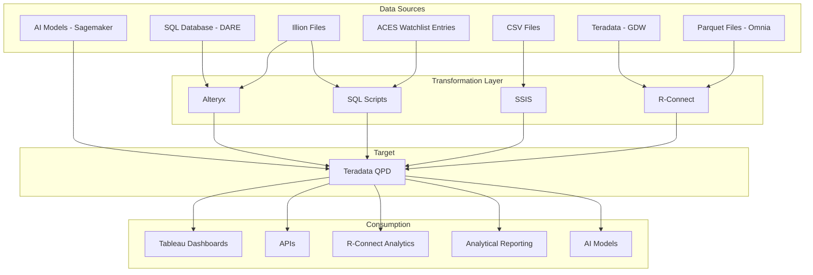
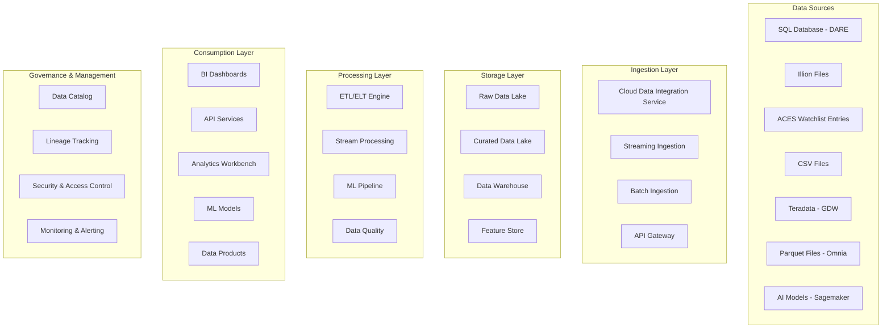
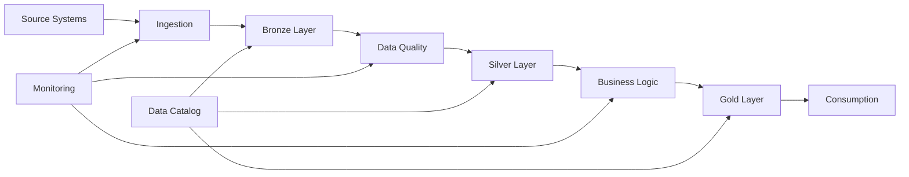
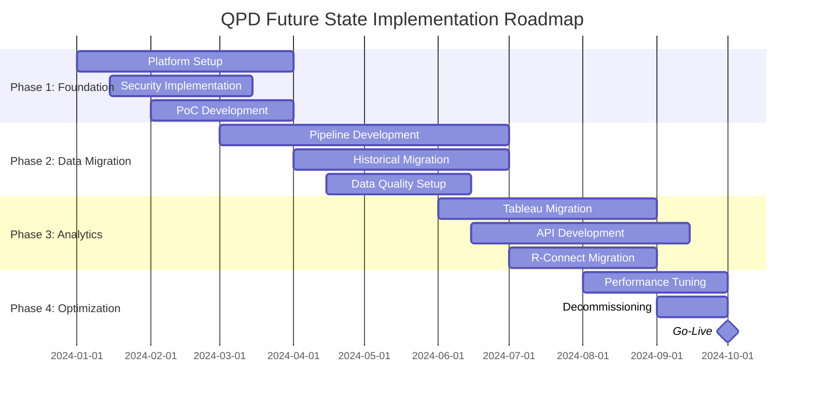

# QPD Future State Architecture Design
## From Teradata to Modern Cloud Data Platform

---

## Document Information

| **Attribute** | **Details** |
|---------------|-------------|
| **Document Title** | QPD Future State Architecture Design |
| **Version** | 1.0 |
| **Date** | [Date] |
| **Author(s)** | [Solution Architect Name] |
| **Stakeholders** | [List key stakeholders] |
| **Review Status** | [Draft/Under Review/Approved] |

---

## Table of Contents

1. [Executive Summary](#1-executive-summary)
2. [Current State Analysis](#2-current-state-analysis)
3. [Business Drivers & Requirements](#3-business-drivers--requirements)
4. [Future State Vision](#4-future-state-vision)
5. [Target Architecture Design](#5-target-architecture-design)
6. [Data Architecture](#6-data-architecture)
7. [Technology Stack](#7-technology-stack)
8. [Migration Strategy](#8-migration-strategy)
9. [Implementation Roadmap](#9-implementation-roadmap)
10. [Cost Analysis](#10-cost-analysis)
11. [Risk Assessment & Mitigation](#11-risk-assessment--mitigation)
12. [Governance & Operations](#12-governance--operations)
13. [Success Metrics & KPIs](#13-success-metrics--kpis)
14. [Appendices](#14-appendices)

---

## 1. Executive Summary

### 1.1 Business Context
- **Current Challenge**: [Describe limitations of current Teradata-based QPD system]
- **Strategic Objective**: [High-level business goals for modernization]

### 1.2 Recommended Solution
- **Target Platform**: [Cloud Data Platform - Snowflake/Azure Synapse/AWS Redshift/GCP BigQuery]
- **Architecture Approach**: [Modern data lakehouse/data mesh/centralized approach]

### 1.3 Key Success Factors
- [List 3-5 critical success factors]

---

## 2. Current State Analysis

### 2.1 Current Architecture Overview

### 2.2 Current Data Sources Analysis

| **Data Source** | **Format** | **Volume** | **Frequency** | **Transformation Tool** | **Criticality** | **Issues/Limitations** |
|-----------------|------------|------------|---------------|-------------------------|-----------------|------------------------|
| SQL Database (DARE) | Relational | [Size] | [Frequency] | Alteryx | [High/Medium/Low] | [List issues] |
| Illion Files | [Format] | [Size] | [Frequency] | Alteryx + SQL Scripts | [High/Medium/Low] | [List issues] |
| ACES Watchlist Entries | [Format] | [Size] | [Frequency] | SQL Scripts | [High/Medium/Low] | [List issues] |
| CSV Files | CSV | [Size] | [Frequency] | SSIS | [High/Medium/Low] | [List issues] |
| Teradata (GDW) | Relational | [Size] | [Frequency] | R-Connect | [High/Medium/Low] | [List issues] |
| Parquet Files (Omnia) | Parquet | [Size] | [Frequency] | R-Connect | [High/Medium/Low] | [List issues] |
| AI Models (Sagemaker) | Model Outputs | [Size] | [Frequency] | Direct Load | [High/Medium/Low] | [List issues] |

### 2.3 Current Consumption Analysis

| **Consumption Method** | **Use Case** | **Users** | **Performance Requirements** | **Current Issues** |
|------------------------|--------------|-----------|------------------------------|-------------------|
| Tableau Dashboards | [Description] | [Number] | [Requirements] | [Issues] |
| APIs | [Description] | [Number] | [Requirements] | [Issues] |
| R-Connect Analytics | [Description] | [Number] | [Requirements] | [Issues] |
| Analytical Reporting | [Description] | [Number] | [Requirements] | [Issues] |
| AI Models | [Description] | [Number] | [Requirements] | [Issues] |

### 2.4 Current State Pain Points
- **Performance Issues**: [List performance bottlenecks]
- **Scalability Limitations**: [Describe scaling challenges]
- **Maintenance Complexity**: [Operational challenges]
- **Cost Concerns**: [Current cost issues]
- **Technology Debt**: [Legacy system limitations]
- **Data Quality Issues**: [Quality and governance challenges]

---

## 3. Business Drivers & Requirements

### 3.1 Business Drivers
- **Cost Optimization**: [Specific cost reduction goals]
- **Performance Improvement**: [Performance targets]
- **Scalability**: [Growth requirements]
- **Innovation Enablement**: [New capabilities needed]
- **Compliance & Governance**: [Regulatory requirements]

### 3.2 Functional Requirements
- **Data Ingestion**: [Requirements for data ingestion]
- **Data Processing**: [Transformation and processing needs]
- **Data Storage**: [Storage requirements and retention policies]
- **Data Access**: [Access patterns and performance requirements]
- **Analytics & Reporting**: [Analytical capabilities needed]
- **API Services**: [API requirements and SLAs]

### 3.3 Non-Functional Requirements
- **Performance**: [Specific performance targets]
- **Scalability**: [Scale requirements]
- **Availability**: [Uptime requirements]
- **Security**: [Security and compliance requirements]
- **Disaster Recovery**: [RTO/RPO requirements]
- **Data Governance**: [Governance requirements]

---

## 4. Future State Vision

### 4.1 Vision Statement
[Describe the future state vision in 2-3 sentences]

### 4.2 Key Architectural Principles
- **Cloud-First**: [Leverage cloud-native services]
- **Scalability**: [Design for elastic scalability]
- **Cost Efficiency**: [Optimize for cost-effective operations]
- **Self-Service**: [Enable self-service analytics]
- **Data Governance**: [Built-in governance and lineage]
- **Real-time Capabilities**: [Support for real-time and batch processing]

### 4.3 Target Capabilities
- [List key capabilities that will be enabled]

---

## 5. Target Architecture Design

### 5.1 High-Level Architecture Overview

### 5.2 Detailed Architecture Components

#### 5.2.1 Ingestion Layer
- **Batch Ingestion**: [Technology choice and rationale]
- **Real-time Streaming**: [Technology choice and rationale]
- **API Integration**: [API gateway and management]
- **Data Connectors**: [Pre-built connectors and custom solutions]

#### 5.2.2 Storage Layer
- **Raw Data Zone**: [Landing zone for raw data]
- **Curated Data Zone**: [Cleansed and enriched data]
- **Data Warehouse**: [Structured data for analytics]
- **Feature Store**: [ML features repository]

#### 5.2.3 Processing Layer
- **ETL/ELT Engine**: [Data transformation capabilities]
- **Stream Processing**: [Real-time data processing]
- **Data Quality**: [Data validation and quality monitoring]
- **ML Pipeline**: [Model training and deployment]

#### 5.2.4 Consumption Layer
- **Business Intelligence**: [Self-service BI capabilities]
- **Analytics Workbench**: [Data science and exploration tools]
- **API Services**: [Data APIs and microservices]
- **Data Products**: [Productized data offerings]

#### 5.2.5 Governance & Management
- **Data Catalog**: [Metadata management and discovery]
- **Lineage Tracking**: [End-to-end data lineage]
- **Security**: [Authentication, authorization, encryption]
- **Monitoring**: [Performance and operational monitoring]

---

## 6. Data Architecture

### 6.1 Data Architecture Patterns
- **Data Lakehouse**: [Rationale for lakehouse approach]
- **Data Mesh**: [Federated data architecture considerations]
- **Lambda Architecture**: [Batch and stream processing]

### 6.2 Data Modeling Strategy
- **Dimensional Modeling**: [Star schema design for analytics]
- **Data Vault**: [Scalable data warehouse modeling]
- **One Big Table**: [Denormalized tables for performance]

### 6.3 Data Zones & Layers

#### 6.3.1 Bronze Layer (Raw Data)
- **Purpose**: [Store raw, unprocessed data]
- **Data Format**: [Parquet, Delta, etc.]
- **Retention**: [Data retention policies]
- **Schema**: [Schema-on-read approach]

#### 6.3.2 Silver Layer (Curated Data)
- **Purpose**: [Cleansed and enriched data]
- **Data Quality**: [Quality rules and validations]
- **Schema**: [Enforced schema standards]
- **Transformations**: [Business rule applications]

#### 6.3.3 Gold Layer (Business Data)
- **Purpose**: [Business-ready analytical data]
- **Data Models**: [Dimensional and aggregated models]
- **Performance**: [Optimized for query performance]
- **Access**: [Governed access to business users]

### 6.4 Data Pipeline Architecture

---

## 7. Technology Stack

### 7.1 Cloud Platform Selection

#### 7.1.1 Platform Comparison
| **Criteria** | **AWS** | **Azure** | **GCP** | **Recommendation** |
|--------------|---------|-----------|---------|-------------------|
| Data Warehouse | Redshift | Synapse | BigQuery | [Choice & Rationale] |
| Data Lake | S3 + Glue | ADLS + Synapse | GCS + Dataflow | [Choice & Rationale] |
| ETL/ELT | Glue/EMR | Data Factory | Dataflow | [Choice & Rationale] |
| Streaming | Kinesis | Event Hubs | Pub/Sub | [Choice & Rationale] |
| ML Platform | SageMaker | ML Studio | Vertex AI | [Choice & Rationale] |
| Cost | $$$ | $$$ | $$$ | [Cost Comparison] |

#### 7.1.2 Recommended Technology Stack

**Data Platform**:
- **Data Warehouse**: [Snowflake/Azure Synapse/Amazon Redshift/Google BigQuery]
- **Data Lake**: [Amazon S3/Azure Data Lake/Google Cloud Storage]
- **Compute Engine**: [Databricks/Azure Synapse Spark/Amazon EMR]

**Integration & ETL**:
- **Data Integration**: [Fivetran/Stitch/Azure Data Factory/AWS Glue]
- **ETL/ELT Tool**: [dbt/Databricks/Spark/Custom Python]
- **Streaming**: [Kafka/Azure Event Hubs/AWS Kinesis]

**Analytics & BI**:
- **Business Intelligence**: [Tableau/Power BI/Looker]
- **Data Science**: [Databricks/Jupyter/Azure ML/SageMaker]
- **APIs**: [FastAPI/Azure API Management/AWS API Gateway]

**Governance & Management**:
- **Data Catalog**: [Purview/AWS Glue Catalog/Google Cloud Data Catalog]
- **Monitoring**: [Datadog/New Relic/Azure Monitor/CloudWatch]
- **Security**: [Native cloud security services]

### 7.2 Migration from Current Tools

| **Current Tool** | **Target Tool** | **Migration Strategy** | **Effort** | **Risk** |
|------------------|-----------------|------------------------|------------|----------|
| Alteryx | [New ETL Tool] | [Migration approach] | [H/M/L] | [H/M/L] |
| SSIS | [New ETL Tool] | [Migration approach] | [H/M/L] | [H/M/L] |
| R-Connect | [New Tool] | [Migration approach] | [H/M/L] | [H/M/L] |
| Teradata QPD | [New Data Warehouse] | [Migration approach] | [H/M/L] | [H/M/L] |

---

## 8. Migration Strategy

### 8.1 Migration Approach
- **Phased Migration**: [Multi-phase approach with parallel running]
- **Big Bang**: [Complete cutover approach]
- **Hybrid**: [Combination of phased and big bang]

### 8.2 Migration Phases

#### Phase 1: Foundation Setup
- **Duration**: [Timeframe]
- **Scope**: [Infrastructure setup and core platform]
- **Deliverables**:
  - Cloud platform provisioning
  - Security framework implementation
  - Basic data ingestion pipelines
  - Proof of concept workloads

#### Phase 2: Data Migration
- **Duration**: [Timeframe]
- **Scope**: [Historical data migration and pipeline setup]
- **Deliverables**:
  - Historical data migration
  - Core data pipelines
  - Data quality frameworks
  - Initial reporting capabilities

#### Phase 3: Analytics Migration
- **Duration**: [Timeframe]
- **Scope**: [Analytics and reporting migration]
- **Deliverables**:
  - Tableau dashboard migration
  - API service migration
  - R-Connect functionality
  - Advanced analytics capabilities

#### Phase 4: Optimization & Decommissioning
- **Duration**: [Timeframe]
- **Scope**: [Performance optimization and legacy decommissioning]
- **Deliverables**:
  - Performance optimization
  - Cost optimization
  - Teradata QPD decommissioning
  - User training and adoption

### 8.3 Data Migration Strategy

#### 8.3.1 Historical Data Migration
- **Approach**: [Bulk transfer strategy]
- **Tools**: [Migration tools and utilities]
- **Validation**: [Data validation and reconciliation]
- **Timeline**: [Migration timeline and cutover plan]

#### 8.3.2 Incremental Data Migration
- **Change Data Capture**: [CDC implementation]
- **Real-time Replication**: [Streaming replication setup]
- **Consistency Checks**: [Data consistency validation]

### 8.4 Application Migration Strategy

#### 8.4.1 ETL Pipeline Migration
- **Alteryx Workflows**: [Migration approach for Alteryx]
- **SSIS Packages**: [Migration approach for SSIS]
- **SQL Scripts**: [Modernization approach]
- **R-Connect Scripts**: [Migration to new platform]

#### 8.4.2 Reporting Migration
- **Tableau Dashboards**: [Dashboard migration strategy]
- **APIs**: [API re-platforming approach]
- **Custom Reports**: [Report migration and modernization]

---

## 9. Implementation Roadmap

### 9.1 High-Level Timeline

### 9.2 Detailed Implementation Plan

#### 9.2.1 Phase 1: Foundation Setup (Months 1-3)
| **Week** | **Activities** | **Deliverables** | **Resources** |
|----------|----------------|------------------|---------------|
| 1-2 | Cloud platform setup | Infrastructure provisioning | [Team members] |
| 3-4 | Security framework | Identity and access management | [Team members] |
| 5-8 | Data ingestion setup | Basic ingestion pipelines | [Team members] |
| 9-12 | PoC development | Working proof of concept | [Team members] |

#### 9.2.2 Phase 2: Data Migration (Months 4-7)
[Detailed week-by-week breakdown]

#### 9.2.3 Phase 3: Analytics Migration (Months 6-9)
[Detailed week-by-week breakdown]

#### 9.2.4 Phase 4: Optimization & Go-Live (Months 8-10)
[Detailed week-by-week breakdown]

### 9.3 Critical Path Analysis
- **Critical Dependencies**: [List critical dependencies]
- **Risk Mitigation**: [Strategies to address critical path risks]
- **Contingency Plans**: [Alternative approaches if delays occur]

---

## 10. Cost Analysis

### 10.1 Current State Costs (Annual)
| **Component** | **Current Cost** | **Notes** |
|---------------|------------------|-----------|
| Teradata Licensing | $[Amount] | [Details] |
| Infrastructure | $[Amount] | [Details] |
| Maintenance & Support | $[Amount] | [Details] |
| Operations & Personnel | $[Amount] | [Details] |
| **Total Current State** | **$[Total]** | |

### 10.2 Future State Costs (Annual)
| **Component** | **Year 1** | **Year 2** | **Year 3** | **Steady State** |
|---------------|------------|------------|------------|------------------|
| Cloud Platform | $[Amount] | $[Amount] | $[Amount] | $[Amount] |
| Data Warehouse | $[Amount] | $[Amount] | $[Amount] | $[Amount] |
| ETL/Processing | $[Amount] | $[Amount] | $[Amount] | $[Amount] |
| BI & Analytics Tools | $[Amount] | $[Amount] | $[Amount] | $[Amount] |
| Operations & Personnel | $[Amount] | $[Amount] | $[Amount] | $[Amount] |
| **Total Future State** | **$[Total]** | **$[Total]** | **$[Total]** | **$[Total]** |

### 10.3 Implementation Costs
| **Phase** | **Cost** | **Details** |
|-----------|----------|-------------|
| Phase 1: Foundation | $[Amount] | [Breakdown] |
| Phase 2: Data Migration | $[Amount] | [Breakdown] |
| Phase 3: Analytics Migration | $[Amount] | [Breakdown] |
| Phase 4: Optimization | $[Amount] | [Breakdown] |
| **Total Implementation** | **$[Total]** | |

### 10.4 ROI Analysis
| **Metric** | **Value** | **Calculation** |
|------------|-----------|-----------------|
| Total Cost Savings (3-year) | $[Amount] | [Current costs - Future costs] |
| Implementation Cost | $[Amount] | [Total project cost] |
| Net Benefits (3-year) | $[Amount] | [Savings - Implementation cost] |
| ROI Percentage | [%] | [Net benefits / Implementation cost] |
| Payback Period | [Months] | [Break-even analysis] |

---

## 11. Risk Assessment & Mitigation

### 11.1 Technical Risks
| **Risk** | **Probability** | **Impact** | **Mitigation Strategy** | **Owner** |
|----------|-----------------|------------|-------------------------|-----------|
| Data Migration Issues | [H/M/L] | [H/M/L] | [Mitigation approach] | [Owner] |
| Performance Degradation | [H/M/L] | [H/M/L] | [Mitigation approach] | [Owner] |
| Integration Challenges | [H/M/L] | [H/M/L] | [Mitigation approach] | [Owner] |
| Security Vulnerabilities | [H/M/L] | [H/M/L] | [Mitigation approach] | [Owner] |

### 11.2 Business Risks
| **Risk** | **Probability** | **Impact** | **Mitigation Strategy** | **Owner** |
|----------|-----------------|------------|-------------------------|-----------|
| User Adoption Issues | [H/M/L] | [H/M/L] | [Mitigation approach] | [Owner] |
| Business Disruption | [H/M/L] | [H/M/L] | [Mitigation approach] | [Owner] |
| Budget Overrun | [H/M/L] | [H/M/L] | [Mitigation approach] | [Owner] |
| Timeline Delays | [H/M/L] | [H/M/L] | [Mitigation approach] | [Owner] |

### 11.3 Operational Risks
| **Risk** | **Probability** | **Impact** | **Mitigation Strategy** | **Owner** |
|----------|-----------------|------------|-------------------------|-----------|
| Skill Gap | [H/M/L] | [H/M/L] | [Training and hiring plan] | [Owner] |
| Vendor Lock-in | [H/M/L] | [H/M/L] | [Multi-cloud strategy] | [Owner] |
| Compliance Issues | [H/M/L] | [H/M/L] | [Compliance framework] | [Owner] |

---

## 12. Governance & Operations

### 12.1 Data Governance Framework
- **Data Ownership**: [Data stewardship model]
- **Data Quality**: [Quality metrics and monitoring]
- **Data Security**: [Classification and access controls]
- **Data Lineage**: [Lineage tracking and documentation]
- **Metadata Management**: [Catalog and discovery]

### 12.2 Operational Model
- **DevOps Practices**: [CI/CD pipeline implementation]
- **Monitoring & Alerting**: [Operational monitoring strategy]
- **Incident Management**: [Issue resolution processes]
- **Capacity Management**: [Resource scaling and optimization]
- **Backup & Recovery**: [Data protection strategy]

### 12.3 Support Model
- **L1 Support**: [First level support responsibilities]
- **L2 Support**: [Second level support responsibilities]
- **L3 Support**: [Expert level support responsibilities]
- **Escalation Procedures**: [Issue escalation framework]

### 12.4 Change Management
- **User Training**: [Training program for end users]
- **Communication Plan**: [Stakeholder communication strategy]
- **Adoption Strategy**: [User adoption and change management]
- **Feedback Loop**: [Continuous improvement process]

---

## 13. Success Metrics & KPIs

### 13.1 Technical KPIs
| **Metric** | **Current State** | **Target** | **Measurement Method** |
|------------|-------------------|------------|------------------------|
| Query Performance | [Current] | [Target] | [How to measure] |
| Data Availability | [Current] | [Target] | [How to measure] |
| Pipeline Reliability | [Current] | [Target] | [How to measure] |
| Data Quality Score | [Current] | [Target] | [How to measure] |

### 13.2 Business KPIs
| **Metric** | **Current State** | **Target** | **Measurement Method** |
|------------|-------------------|------------|------------------------|
| Time to Insight | [Current] | [Target] | [How to measure] |
| User Satisfaction | [Current] | [Target] | [How to measure] |
| Cost per Query | [Current] | [Target] | [How to measure] |
| Report Generation Time | [Current] | [Target] | [How to measure] |

### 13.3 Operational KPIs
| **Metric** | **Current State** | **Target** | **Measurement Method** |
|------------|-------------------|------------|------------------------|
| System Uptime | [Current] | [Target] | [How to measure] |
| Mean Time to Resolution | [Current] | [Target] | [How to measure] |
| Deployment Frequency | [Current] | [Target] | [How to measure] |
| Change Failure Rate | [Current] | [Target] | [How to measure] |

---

## 14. Appendices

### Appendix A: Current State Detailed Analysis
- **Data Source Inventory**: [Detailed catalog of all data sources]
- **Current ETL Processes**: [Documentation of existing processes]
- **Performance Baselines**: [Current performance metrics]
- **Cost Breakdown**: [Detailed current cost analysis]

### Appendix B: Technical Specifications
- **Infrastructure Requirements**: [Detailed infrastructure specs]
- **Network Architecture**: [Network design and requirements]
- **Security Architecture**: [Detailed security design]
- **Integration Patterns**: [API and integration specifications]

### Appendix C: Migration Runbooks
- **Data Migration Procedures**: [Step-by-step migration guides]
- **Testing Procedures**: [Testing protocols and checklists]
- **Rollback Procedures**: [Emergency rollback plans]
- **Go-Live Checklist**: [Pre-flight checklist for go-live]

### Appendix D: Vendor Evaluations
- **Technology Vendor Assessments**: [Detailed vendor comparisons]
- **Proof of Concept Results**: [PoC findings and recommendations]
- **Reference Architectures**: [Industry best practices and patterns]

### Appendix E: Training Materials
- **User Training Curriculum**: [Training program outline]
- **Technical Documentation**: [System documentation templates]
- **Runbook Templates**: [Operational procedure templates]

---

## Document History

| **Version** | **Date** | **Author** | **Changes** |
|-------------|----------|------------|-------------|
| 0.1 | [Date] | [Author] | Initial draft |
| 1.0 | [Date] | [Author] | Complete first version |

---

## Approvals

| **Role** | **Name** | **Date** | **Signature** |
|----------|----------|----------|---------------|
| Solution Architect | [Name] | [Date] | [Signature] |
| Technical Lead | [Name] | [Date] | [Signature] |
| Business Stakeholder | [Name] | [Date] | [Signature] |
| IT Leadership | [Name] | [Date] | [Signature] |
