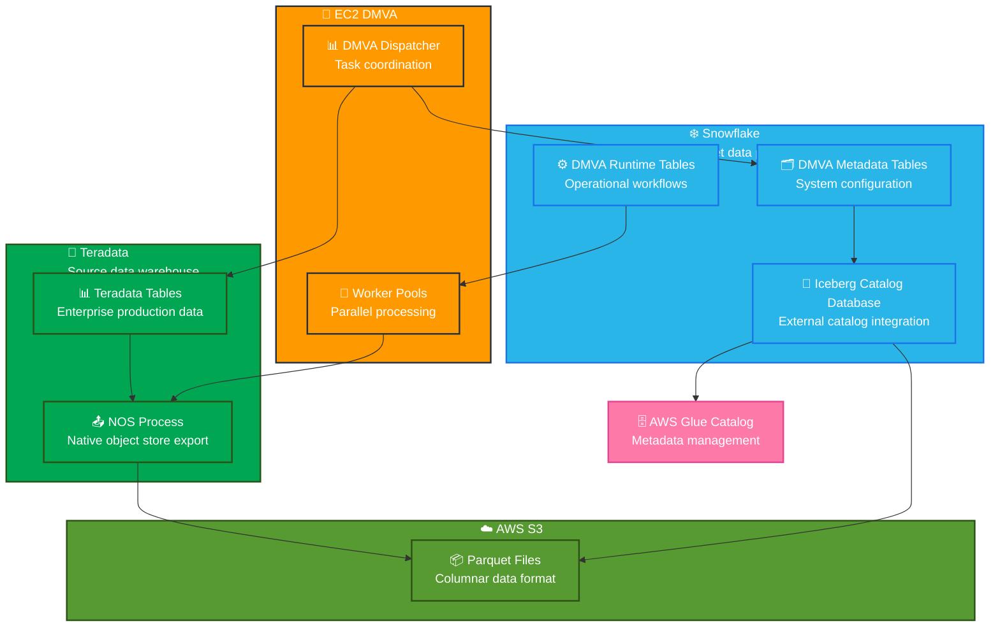

# DMVA Architecture & Capabilities Documentation

## System Overview

**DMVA (Data Migration Validation & Automation)** is an enterprise-grade data migration framework that orchestrates large-scale data movement from source systems (Teradata, or other enterprise data warehouses) to Snowflake, with comprehensive validation and monitoring capabilities. The framework creates Glue-managed Iceberg tables natively integrated with Snowflake.

---

## Architecture Flow Diagram

### Mermaid Architecture Diagram

---

## Prerequisites

- **EC2 Instance**: Hosts the DMVA dispatcher and worker processes that orchestrate the entire migration workflow. A t2.2xlarge instance (8 vCPUs, 32 GB RAM) with approximately 100 GB of EBS storage is recommended as a starting point, with more storage required based on data volume
- **Snowflake Schema**: Dedicated schema to store DMVA metadata tables and operational data, housing system configuration, task orchestration data, validation results, and runtime operational workflows

---

## Capabilities

### Metadata Configuration and Discovery

**Configuration**
- **Source System Connections**: Flexible configuration of source system connection details with support for multiple database types, authentication methods, and connection pooling options
- **Replication Scope Management**: Granular control over migration scope including database-level, schema-level, and table-level inclusion/exclusion rules with pattern matching and filtering capabilities
- **Migration Parameters**: Configurable data extraction parameters, partition strategies, and parallel processing settings

**Dynamic Metadata Sourcing**
- **Structural Metadata Extraction**: Automated discovery and cataloging of database schemas, table definitions, column metadata, data types, constraints, and indexes
- **Table Inventory**: Real-time cataloging of tables, views, primary keys, and foreign key relationships
- **Delta Processing**: Handles incremental metadata updates and new objects during migration cycles

**Snow Convert for DDL Conversion**
- **Schema Transformation**: Snowflake's Snow Convert utility can be used to deterministically transform source database table structures to Snowflake-native tables or Iceberg tables, providing automated DDL conversion and schema mapping

### Data Extraction and Storage

**NOS (Native Object Store) Integration**
- **Direct Export**: Leverages Teradata's Native Object Store functionality to export data directly to S3 without intermediate storage
- **Parquet Format**: Data is extracted into Parquet format, providing optimal columnar storage for efficient ingestion into Snowflake
- **Partitioned Extraction**: Intelligent partitioning of large tables for optimal performance and parallel processing
- **Error Handling**: Robust retry mechanisms and error recovery for failed extraction processes

**Snowflake Integration via Catalog-Linked Databases**
- **Glue-Managed Iceberg Tables**: Creates AWS Glue-managed Iceberg tables natively accessible through Snowflake
- **External Catalog Integration**: Seamless integration between Snowflake and AWS Glue catalog for metadata management
- **Direct Data Access**: Tables accessible directly in Snowflake through catalog-linked database connections

### Data Validation and Quality Assurance

**Data Validation Types**
- **Row Count Validation**: Compares total row counts between source and target tables at both table and partition levels
- **Checksum Validation**: Generates and compares checksums using configurable hash functions (MD5 by default) for data integrity verification
- **Column-Level Measures**: Calculates and compares statistical measures including:
  - Null counts per column
  - Distinct counts per column (optional)
  - Min/max values for numeric and date columns (optional)
  - Sum values for numeric columns (optional)
- **Partition-Based Validation**: Supports validation at partition level using various partitioning strategies:
  - Whole table validation (default for smaller tables)
  - Integer-based partitioning (modulus on numeric columns)
  - Date-based partitioning (by month, year, etc.)
  - Substring-based partitioning (for character columns)

**Validation Flexibility**
- **Configurable Checksum Methods**: Tables can use different partitioning strategies based on their structure and size
- **Validate-Only Mode**: Tables can be marked for validation-only without migration for pre-migrated data
- **Selective Column Validation**: Ability to include/exclude specific columns from validation measures
- **Custom Filters**: Support for source and target filters to handle data transformation scenarios

### Monitoring and Reporting

**Migration Progress Reporting**
- **Data Volume Tracking**: Real-time monitoring of data volumes replicated, including table-by-table progress
- **Success Rate Metrics**: Comprehensive reporting on migration success rates, failed transfers, and retry statistics
- **Performance Analytics**: Throughput metrics, processing times, and resource utilization tracking
- **Validation Results**: Detailed reporting on validation outcomes, including checksum verification results and data quality scores

---

*This document provides a comprehensive overview of DMVA's architecture and capabilities. For implementation details and configuration guides, refer to the technical documentation in the `/documentation` directory.*
