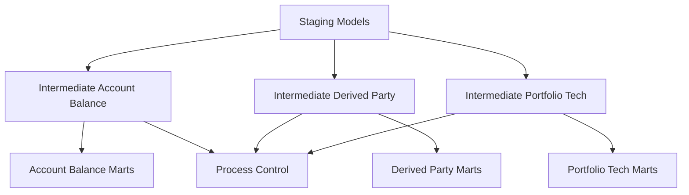

# GDW1 BTEQ Migration to DBT

## Overview

This DBT project migrates legacy Teradata BTEQ scripts to a modern, cloud-native data transformation framework using Snowflake and DBT. The project follows the established DCF (Data Control Framework) patterns while adapting BTEQ processes to DBT best practices.

## Project Structure

```
├── dbt_project.yml          # Main project configuration
├── profiles.yml             # Connection profiles  
├── packages.yml             # Package dependencies
├── README.md               # This file
├── macros/                 # Custom macros and DCF framework
│   └── dcf/
│       ├── logging.sql     # GDW1 DCF logging macros
│       └── common.sql      # Utility and helper macros
├── models/                 # Data models organized by layer
│   ├── staging/           # Raw data preparation
│   ├── intermediate/      # Business logic processing
│   │   ├── account_balance/
│   │   ├── derived_account_party/
│   │   ├── portfolio_technical/
│   │   └── process_control/
│   └── marts/             # Final production tables
│       ├── account_balance/
│       ├── derived_account_party/
│       └── portfolio_technical/
├── seeds/                 # Reference data
├── analyses/              # Ad-hoc analyses
└── target/               # Compiled SQL output
```

## Original BTEQ Files Migrated

### Account Balance Processing (12 files)
- `ACCT_BALN_BKDT_*` series
- Balance calculations, adjustments, and data management
- Converted to: `int_acct_baln_*` and `mart_acct_baln_*` models

### Derived Account Party Processing (11 files)  
- `DERV_ACCT_PATY_*` series
- Complex data derivation and party relationship processing
- Converted to: `int_derv_acct_paty_*` models

### Portfolio Technical Processing (13 files)
- `prtf_tech_*` series  
- Portfolio and technical account processing
- Converted to: `int_*_reconciliation` and related models

### Stored Procedure Utilities (4 files)
- `sp_*` series
- Key generation and commit procedures
- Converted to: Process control models with post-hooks

### Data Loading Scripts (2 files)
- `BTEQ_SAP_EDO_WKLY_LOAD.sql` - Complex SAP EDO weekly loading
- `BTEQ_TAX_INSS_MNLY_LOAD.sql` - Tax insurance monthly loading
- Converted to: Complex intermediate models with CTEs

## Key Migration Patterns

### 1. BTEQ Commands → DBT Configuration
**Original BTEQ:**
```sql
.RUN FILE=%%BTEQ_LOGON_SCRIPT%%
.IF ERRORCODE <> 0 THEN .GOTO EXITERR
.SET QUIET OFF
```

**DBT Equivalent:**
```yaml
config:
  materialized: table
  pre_hook: "{{ register_gdw1_process_instance(...) }}"
  post_hook: "{{ update_gdw1_process_status(...) }}"
```

### 2. Variable References
**Original BTEQ:**
```sql
INSERT INTO %%CAD_PROD_DATA%%.TABLE_NAME
```

**DBT Equivalent:**
```sql
INSERT INTO {{ bteq_var('CAD_PROD_DATA') }}.TABLE_NAME
```

### 3. Volatile Tables → CTEs/Temp Tables
**Original BTEQ:**
```sql
CREATE MULTISET VOLATILE TABLE temp_table AS
SELECT * FROM source_table
WITH DATA PRIMARY INDEX(column_name);
```

**DBT Equivalent:**
```sql
WITH temp_table AS (
    SELECT * FROM source_table
)
```

### 4. File Operations → Stages
**Original BTEQ:**
```sql
.IMPORT VARTEXT FILE=/path/to/file.txt
.EXPORT DATA FILE=/path/to/output.txt
```

**DBT Equivalent:**
```sql
-- Via macros and post-hooks
{{ copy_from_stage('path/to/file.txt', 'target_table') }}
{{ copy_to_stage('source_table', 'path/to/output.txt') }}
```

## DCF Framework Integration

### Logging Macros
- `log_gdw1_exec_msg()` - Process execution logging
- `register_gdw1_process_instance()` - Process registration
- `update_gdw1_process_status()` - Status updates
- `gdw1_audit_columns()` - Standard audit columns

### Stream Configuration
- `GDW1_ACCT_BALN_PROCESSING` - Account balance workflows
- `GDW1_DERV_ACCT_PATY_PROCESSING` - Derived party workflows  
- `GDW1_PRTF_TECH_PROCESSING` - Portfolio technical workflows

### Configuration Helpers
- `intermediate_model_config()` - Standard intermediate model setup
- `marts_model_config()` - Standard marts model setup
- `bteq_var()` - BTEQ variable mapping

## Setup and Installation

### 1. Environment Setup
```bash
# Install DBT
pip install dbt-snowflake

# Clone and navigate to project
cd /path/to/GDW1/DBT

# Install dependencies
dbt deps
```

### 2. Environment Variables
Set the following environment variables for Snowflake connection:
```bash
export SNOWFLAKE_ACCOUNT=your_account
export SNOWFLAKE_USER=your_user
export SNOWFLAKE_PASSWORD=your_password
export SNOWFLAKE_ROLE=GDW1_DBT_ROLE
export SNOWFLAKE_DATABASE=PSUND_MIGR_DCF
export SNOWFLAKE_WAREHOUSE=GDW1_WH
export SNOWFLAKE_SCHEMA=P_D_DCF_001_STD_0
```

### 3. Snowflake Preparation
```sql
-- Create required databases
CREATE DATABASE PSUND_MIGR_DCF;
CREATE DATABASE PSUND_MIGR_CLD;

-- Create schemas
CREATE SCHEMA PSUND_MIGR_DCF.P_D_DCF_001_STD_0;
CREATE SCHEMA PSUND_MIGR_DCF.P_V_STG_001_STD_0;
CREATE SCHEMA PSUND_MIGR_CLD.P_D_GDW_001_STD_0;

-- Create file stage for operations
CREATE STAGE GDW1_FILE_STAGE;

-- Create DCF logging tables (if not already present)
-- See models/setup/ for DDL scripts
```

### 4. Initial Testing
```bash
# Test connection
dbt debug

# Compile models
dbt compile

# Run staging models only
dbt run --select staging

# Run all intermediate models
dbt run --select intermediate

# Run full pipeline
dbt run
```

## Model Dependencies



## Data Quality and Testing

### Built-in Tests
- Not null constraints on key fields
- Unique key validation
- Referential integrity checks
- Data freshness monitoring

### Custom Tests
- Balance validation (positive/negative rules)
- Date range consistency
- Cross-system reconciliation
- Process completion validation

### Running Tests
```bash
# Run all tests
dbt test

# Run tests for specific models
dbt test --select account_balance

# Run tests with store_failures
dbt test --store-failures
```

## Monitoring and Operations

### DCF Logging Tables
- `DCF_T_EXEC_LOG` - Execution message logging
- `DCF_T_PRCS_INST` - Process instance tracking

### Key Metrics
- Model execution time
- Record counts and data volumes
- Error rates and failure patterns
- Data quality scores

### Operational Commands
```bash
# Run specific functional area
dbt run --select account_balance
dbt run --select derived_account_party
dbt run --select portfolio_technical

# Run with full refresh
dbt run --full-refresh

# Run for specific date
dbt run --vars '{"business_date": "2024-01-15"}'
```

## Migration Benefits

### Immediate Benefits
- **No BTEQ Dependency** - Eliminated Teradata BTEQ client requirements
- **Cloud-Native** - Runs natively in Snowflake cloud environment
- **Version Control** - Full Git integration and change tracking
- **Modern SQL** - Converted to standard SQL with DBT enhancements

### Long-term Benefits
- **Scalability** - Leverage Snowflake's elastic compute
- **Maintainability** - Easier to maintain and enhance
- **Integration** - Better integration with modern data stack
- **Testing** - Built-in data quality and testing framework
- **Documentation** - Self-documenting with lineage tracking

## Troubleshooting

### Common Issues

#### Connection Issues
```bash
# Test connection
dbt debug

# Check profiles
cat ~/.dbt/profiles.yml
```

#### Model Compilation Issues
```bash
# Check for syntax errors
dbt compile --select problematic_model

# View compiled SQL
cat target/compiled/GDW1_BTEQ_Migration/models/...
```

#### Runtime Issues
```bash
# Check model logs
dbt run --select failing_model --debug

# Check DCF logs in Snowflake
SELECT * FROM DCF_T_EXEC_LOG 
WHERE PRCS_NAME = 'problematic_process'
ORDER BY CREATED_TS DESC;
```

## Support and Maintenance

### Documentation
- **DBT Docs**: Run `dbt docs generate && dbt docs serve`
- **Model Lineage**: Available in DBT docs interface
- **Source Documentation**: In model YAML files

### Team Contacts
- **Data Engineering Team**: Primary support for DBT framework
- **GDW1 Business Team**: Domain expertise for business logic
- **DCF Framework Team**: Support for logging and process control

---

**Migration Status**: ✅ Complete - Ready for Testing and Production Deployment
**DBT Version**: 1.6+
**Snowflake Compatibility**: All current versions
**Last Updated**: Current Date 