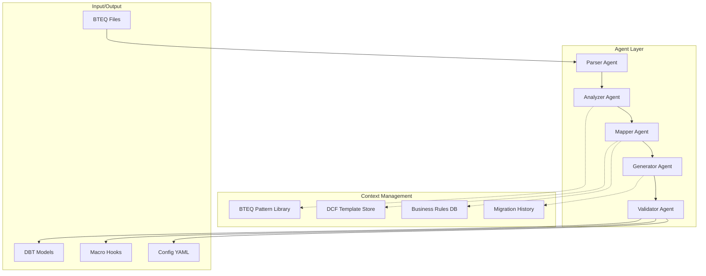
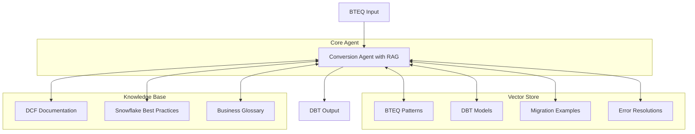
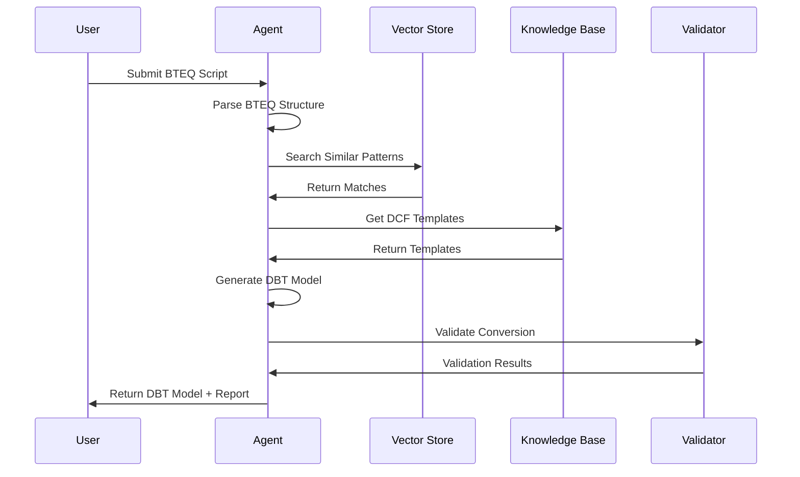

# BTEQ to DCF Agentic Conversion Design Approach

## Executive Summary

This document outlines the design approach for an agentic solution that converts Teradata BTEQ scripts to Snowflake DBT models using the DBT Control Framework (DCF). The solution leverages AI agents with advanced prompt engineering and context management to automate the migration process while maintaining business logic integrity and optimizing for Snowflake performance.

## Table of Contents
1. [Problem Statement](#problem-statement)
2. [Solution Overview](#solution-overview)
3. [Design Options](#design-options)
4. [Architecture Details](#architecture-details)
5. [Implementation Strategy](#implementation-strategy)
6. [Prompt Engineering](#prompt-engineering)
7. [Validation Framework](#validation-framework)
8. [Roadmap](#roadmap)

## Problem Statement

### Current Challenges
- Manual conversion of BTEQ scripts to DBT is time-consuming and error-prone
- Complex BTEQ patterns require deep understanding of both Teradata and Snowflake
- Business logic must be preserved while optimizing for Snowflake architecture
- DCF framework requires specific patterns for incremental processing, error handling, and audit trails

### Requirements
- Automated conversion with high accuracy
- Preservation of business logic and data lineage
- Optimization for Snowflake performance characteristics
- Compliance with DCF patterns and best practices
- Comprehensive documentation and testing

## Solution Overview

The agentic solution employs AI-powered agents to analyze BTEQ scripts, understand their patterns, and generate equivalent DBT models with appropriate DCF configurations. The system uses advanced context management and retrieval-augmented generation (RAG) to ensure accurate conversions.

## Design Options

### Option 1: Multi-Agent Pipeline Architecture

A sophisticated pipeline with specialized agents for each conversion phase:



#### Agent Specifications

1. **Parser Agent**: Extracts structured components from BTEQ scripts
2. **Analyzer Agent**: Classifies patterns and determines DCF strategy
3. **Mapper Agent**: Maps BTEQ logic to DCF/DBT components
4. **Generator Agent**: Creates production-ready DBT code
5. **Validator Agent**: Ensures quality and compliance

### Option 2: RAG-Enhanced Single Agent Architecture (Recommended for MVP)

A unified agent with retrieval-augmented generation for context-aware conversion:



## Architecture Details

### Core Components

#### 1. BTEQ Pattern Recognition

The system identifies common BTEQ patterns:

```yaml
patterns:
  simple_insert:
    indicators:
      - "INSERT INTO"
      - "SELECT FROM"
      - "No complex joins"
    dcf_mapping: "standard_insert"
    
  delta_processing:
    indicators:
      - "MERGE INTO"
      - "DELETE/INSERT pattern"
      - "Effective dating"
    dcf_mapping: "incremental_dcf_ibrg"
    
  batch_orchestration:
    indicators:
      - "SP_GET_PROS_KEY"
      - "Multiple steps"
      - "File operations"
    dcf_mapping: "complex_workflow"
```

#### 2. DCF Pattern Mapping

Maps BTEQ operations to DCF materializations:

| BTEQ Pattern | DCF Materialization | Key Features |
|--------------|-------------------|--------------|
| Simple INSERT | table | Full replacement |
| MERGE with deltas | incremental_dcf_ibrg | Delta upsert with value comparison |
| Append only | insert_append_dcf_ibrg | Insert-only pattern |
| Complex multi-step | Custom macro + incremental | Pre/post hooks for orchestration |

#### 3. Context Management

##### Vector Store Schema
```python
{
    "id": "unique_identifier",
    "pattern_type": "insert|update|merge|complex",
    "bteq_snippet": "original BTEQ code",
    "dbt_conversion": "converted DBT code",
    "dcf_pattern": "incremental|full_apply|insert_append",
    "tags": ["effective_dating", "delta_processing", "multi_step"],
    "performance_notes": "optimization tips",
    "common_issues": ["list of known issues"],
    "embedding": "vector representation"
}
```

##### Business Rules Engine
```yaml
business_rules:
  effective_dating:
    - "EFFT_D <= current_date <= EXPY_D"
    - "Handle 9999-12-31 as open-ended"
    
  audit_columns:
    - "Preserve PROCESS_NAME on updates"
    - "Set UPDATE_PROCESS_NAME from source"
    
  error_handling:
    - "Map ERRORCODE to DCF exceptions"
    - "Implement retry logic for transient failures"
```

### Conversion Process Flow



## Implementation Strategy

### Phase 1: MVP Development (Weeks 1-4)
- Implement RAG-enhanced single agent architecture
- Build initial vector store with 50-100 common BTEQ patterns
- Create basic UI for upload and conversion
- Include manual review and editing capabilities

### Phase 2: Enhancement (Weeks 5-8)
- Expand vector store with production conversions
- Add automated testing and validation
- Implement feedback loop for continuous improvement
- Add batch processing capabilities

### Phase 3: Advanced Features (Weeks 9-12)
- Migrate to multi-agent architecture for complex scenarios
- Add real-time collaboration features
- Implement automated optimization suggestions
- Create conversion confidence scoring

## Prompt Engineering

### 1. Chain-of-Thought Prompting

```python
cot_prompt = """
Let's convert this BTEQ script step by step:

Step 1: Identify the main SQL operation
- What is the primary DML operation?
- Are there multiple steps?
- What tables are involved?

Step 2: Extract key business logic
- What are the join conditions?
- Are there effective date filters?
- What transformations are applied?

Step 3: Map to DCF pattern
- Is this a full replacement or incremental?
- Do we need delta detection?
- What are the unique keys?

Step 4: Generate DBT model structure
- Create the config block
- Write the main SQL
- Add CTEs for clarity

Step 5: Add appropriate hooks and configuration
- Pre-hooks for validation
- Post-hooks for logging
- Error handling
"""
```

### 2. Few-Shot Learning Examples

```python
few_shot_examples = [
    {
        "description": "Simple Insert Pattern",
        "bteq": """
            INSERT INTO %%CAD_PROD_DATA%%.ACCT_BALN_BKDT
            SELECT * FROM %%DDSTG%%.ACCT_BALN_BKDT_STG2;
        """,
        "dbt": """
            {{ config(
                materialized='table',
                database=var('prod_database'),
                schema=var('prod_schema')
            ) }}
            
            SELECT * FROM {{ ref('acct_baln_bkdt_stg2') }}
        """
    },
    {
        "description": "Merge with Effective Dating",
        "bteq": """
            MERGE INTO target_table AS t
            USING source_table AS s
            ON t.key = s.key
            WHEN MATCHED AND s.delta_action = 'D' THEN DELETE
            WHEN MATCHED THEN UPDATE SET ...
            WHEN NOT MATCHED THEN INSERT ...
        """,
        "dbt": """
            {{ config(
                materialized='incremental_dcf_ibrg',
                unique_key=['key'],
                merge_exclude_columns=['PROCESS_NAME'],
                delta_upsert_patterns=['TX_327_01']
            ) }}
            
            SELECT * FROM {{ ref('source_table') }}
            WHERE delta_action IN ('I', 'U', 'D')
        """
    }
]
```

### 3. Role-Based Prompting

```python
role_based_prompt = """
You are acting as three experts working together:

1. **BTEQ Expert**: 
   - Understand Teradata-specific syntax and behavior
   - Identify BTEQ commands vs SQL statements
   - Recognize parameter substitution patterns

2. **DBT Architect**: 
   - Design optimal DBT model structure
   - Choose appropriate materializations
   - Structure CTEs and transformations

3. **Snowflake Optimizer**: 
   - Ensure efficient Snowflake query patterns
   - Add clustering recommendations
   - Optimize for micro-partitions

Collaborate to convert this BTEQ script, considering all perspectives.
"""
```

## Validation Framework

### Automated Validation Checks

```python
class ConversionValidator:
    def validate_conversion(self, bteq_original, dbt_generated):
        return {
            "syntax_valid": self.validate_dbt_syntax(dbt_generated),
            "logic_preserved": self.compare_business_logic(bteq_original, dbt_generated),
            "performance_optimized": self.check_optimizations(dbt_generated),
            "dcf_compliant": self.verify_dcf_patterns(dbt_generated),
            "documentation_complete": self.check_documentation(dbt_generated),
            "test_coverage": self.verify_test_coverage(dbt_generated)
        }
    
    def validate_dbt_syntax(self, dbt_model):
        # Check Jinja syntax
        # Validate SQL structure
        # Verify macro calls
        pass
    
    def compare_business_logic(self, bteq, dbt):
        # Extract core logic from both
        # Compare transformations
        # Verify data flow
        pass
```

### Quality Metrics

| Metric | Target | Measurement |
|--------|--------|-------------|
| Syntax Accuracy | 100% | Automated parser validation |
| Logic Preservation | 95%+ | Semantic comparison |
| Performance | +20% | Query execution time |
| DCF Compliance | 100% | Pattern matching |
| Documentation | 90%+ | Coverage analysis |

## Roadmap

### Milestone 1: Foundation (Month 1)
- [ ] Set up development environment
- [ ] Build core agent architecture
- [ ] Create initial vector store
- [ ] Develop basic UI

### Milestone 2: Core Features (Month 2)
- [ ] Implement pattern recognition
- [ ] Build DCF mapping logic
- [ ] Add validation framework
- [ ] Create test suite

### Milestone 3: Production Ready (Month 3)
- [ ] Scale vector store
- [ ] Add batch processing
- [ ] Implement monitoring
- [ ] Deploy to production

### Future Enhancements
- Multi-agent architecture for complex workflows
- Real-time collaboration features
- Advanced optimization recommendations
- Integration with CI/CD pipelines

## Appendix

### A. Common BTEQ to DCF Mappings

| BTEQ Command | DCF Equivalent |
|--------------|----------------|
| `.IF ERRORCODE` | Pre/post hook with exception handling |
| `.IMPORT` | Source configuration + staging model |
| `.EXPORT` | Post-hook with external stage |
| `COLLECT STATS` | Post-hook optimization |
| `SP_GET_PROS_KEY` | `register_process_instance` macro |

### B. DCF Macro Library

Key macros for BTEQ conversion:
- `validate_single_open_business_date`: Ensures single active date
- `log_dcf_exec_msg`: Logging and monitoring
- `register_process_instance`: Process registration
- `update_process_status`: Status management

### C. Performance Optimization Guidelines

1. **Clustering Keys**: Add for large tables with date-based queries
2. **Micro-partition Pruning**: Use appropriate filters early
3. **Result Caching**: Enable for frequently accessed models
4. **Incremental Processing**: Use DCF incremental patterns for large datasets

---

*This document is a living artifact and will be updated as the solution evolves.*
