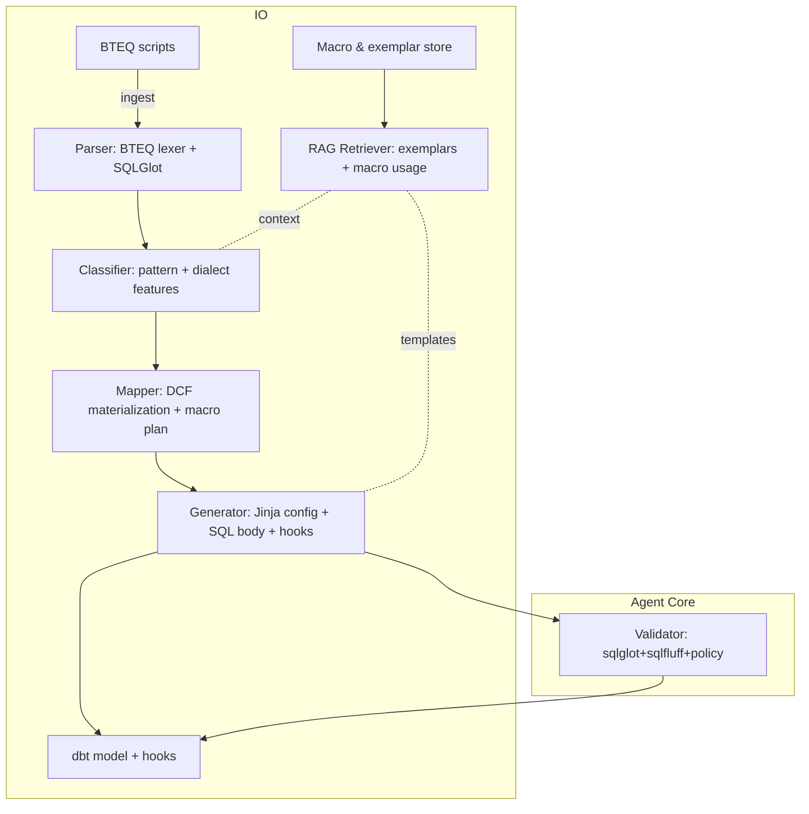

# Technical Design: Agentic Conversion of Teradata BTEQ to dbt (DCF)

## 1. Scope and Goals

- Convert BTEQ scripts under `current_state/bteq_sql/` into dbt models inside `gdw1_xfm_frmw/` using DCF macros.
- Preserve business logic; move control flow (error handling, process keys, IO) into dbt `pre_hook`/`post_hook`.
- Produce maintainable SQL (CTEs, explicit column lists, explicit joins) and consistent dbt configs.
- MVP focuses on INSERT/SELECT, MERGE/delta, multi-step transformations with effective-dating; stored-proc orchestration is mapped to DCF macros.

## 2. Architecture Overview

We implement a RAG-enhanced agent that performs parse → classify → map → generate → validate. For MVP we use a single agent with strong internal modularity. The design allows a drop-in upgrade to a multi-agent graph for scale.



## 3. Framework and Stack Choices

- Agent Orchestration: LangChain + LangGraph
  - Deterministic state machine, easy to refactor to multi-agent nodes.
- LLM: OpenAI GPT-4o-mini (or Azure equivalent) for generation/classification; configurable.
- Embeddings: `text-embedding-3-large` (cloud) or `all-MiniLM-L6-v2` (local) via SentenceTransformers.
- Vector Store: Chroma (local, file-backed) for MVP; pluggable to LanceDB/Weaviate.
- Query Parsing/Transpile: SQLGlot (Teradata → Snowflake) with custom AST transforms.
- Linting/Validation: SQLFluff (snowflake dialect), sqlglot parse/roundtrip, custom policy checks.
- Templates: Jinja2 for dbt model `config`, hooks, and SQL scaffolding.
- Types/Config: Pydantic models for internal contracts.
- CLI/Runner: Python 3.11 CLI (`bteq2dbt`) with subcommands: `analyze`, `convert`, `validate`.

## 4. Agents and Responsibilities

### 4.1 MVP: Single Agent (modular internal services)
- Parser Service
  - Tokenize BTEQ: extract SQL blocks vs control commands (`.IF`, `.GOTO`, `.OS`, `.RUN`, `COLLECT STATS`, labels).
  - Resolve BTEQ variables/placeholders (e.g., `%%FOO%%`) into dbt `var()` or `source()/ref()` via mapping rules.
  - Parse SQL blocks with SQLGlot using `read='teradata'` to ASTs.
- Classifier Service
  - Pattern classification: `simple_insert`, `insert_append`, `full_apply_scd2`, `incremental_delta_merge`, `orchestration_only`.
  - Heuristics + embedding similarity against exemplar library.
- Mapper Service
  - Choose materialization: `insert_append_dcf_ibrg`, `full_apply_dcf`, `incremental_dcf_ibrg`.
  - Determine `unique_key`, `partitioning` hints, `merge_exclude_columns`, delta predicates.
  - Plan hooks: `check_dcf_dependencies`, `register_process_instance`, `log_dcf_exec_msg`, `update_process_status`.
- Generator Service
  - Apply SQLGlot AST transforms (Teradata → Snowflake), normalize identifiers, functions, date arithmetic.
  - Emit dbt model with config + CTE-structured SQL.
  - Inject `pre_hook`/`post_hook` arrays based on mapper plan.
- Validator Service
  - Fast parse with SQLGlot `read='snowflake'` on generated SQL body.
  - Lint with SQLFluff (ensure explicit columns, no `SELECT *` unless allowed, no DDL).
  - Policy checks: allowed macros only, required hooks present, banned constructs absent.

### 4.2 Production Extension: Multi-Agent Graph (optional)
- Parser/Classifier Agent → Mapper Agent → Generator Agent → Validator Agent.
- Supervisor node handles retries, fallback to LLM-only transform if SQLGlot fails, and confidence scoring.

## 5. Prescriptive Query Parsing with SQLGlot

We will use SQLGlot to parse Teradata SQL blocks and transpile to Snowflake with custom transforms. BTEQ control statements are parsed by a lightweight lexer (regex/Lark) into a structured control-flow IR.

### 5.1 Transform Strategy (examples)
- Functions: `NVL` → `COALESCE`, `ZEROIFNULL` → `IFF(col IS NULL, 0, col)`, `DATE` literals normalized.
- Date math: `ADD_MONTHS`, `DATE +/- INTEGER` mapped to Snowflake-equivalents.
- Sampling/Top: `TOP n` preserved (Snowflake supports) or re-expressed via `QUALIFY`/`ROW_NUMBER` when needed.
- Qualify: Teradata `QUALIFY` is supported by Snowflake; preserve logic but normalize window specs.
- Casting: normalize `CAST(... AS TYPE)` to Snowflake types; avoid legacy `INTEGER(date)` idioms.

### 5.2 Pseudocode
```python
from typing import List
import sqlglot
from sqlglot import parse_one, exp

class TeradataToSnowflake(exp.Transformation):
    def transform(self, node: exp.Expression) -> exp.Expression:
        # Example: NVL(x, y) -> COALESCE(x, y)
        if isinstance(node, exp.Function) and node.name.upper() == "NVL":
            return exp.Coalesce(this=node.expressions[0], expressions=node.expressions[1:])
        # Add more rewrites (ZEROIFNULL, ADD_MONTHS, DATE literals, etc.)
        return self.transform_children(node)

def transpile_teradata_to_snowflake(sql_text: str) -> str:
    tree = parse_one(sql_text, read="teradata")
    tree = TeradataToSnowflake().transform(tree)  # custom rules
    return tree.sql(dialect="snowflake")
```

### 5.3 Why SQLGlot
- Deterministic AST-based rewrites reduce hallucinations and ensure correctness.
- Cross-dialect support (Teradata, Snowflake) with robust parser.
- Easy to unit test and round-trip.

## 6. BTEQ Control-Flow Mapping to DCF

- `.IF ERRORCODE` / `.GOTO` / labels → dbt `pre_hook`/`post_hook` macros with clear status updates.
- `.IMPORT`/`.EXPORT`/`.OS` filesystem interactions → replaced by selecting `BUSINESS_DATE` from DCF control tables and using Snowflake stages when needed (out of scope for MVP).
- Stored procedures (`SP_GET_PROS_KEY`, etc.) → `register_process_instance`, `log_dcf_exec_msg`, `update_process_status` macros.
- `COLLECT STATS` → omitted in Snowflake.

## 7. RAG Knowledge Base

- Storage: Chroma collections with the following schema:
```json
{
  "id": "<uuid>",
  "pattern_type": "simple_insert|full_apply_scd2|incremental_delta_merge|orchestration_only",
  "bteq_snippet": "...",
  "dbt_model_snippet": "...",
  "dcf_pattern": "insert_append_dcf_ibrg|full_apply_dcf|incremental_dcf_ibrg",
  "notes": "performance/edge cases",
  "tags": ["effective_dating", "delta", "union_all"],
  "score": 0.0
}
```
- Retrieval: top-k (k=5) exemplars + macro usage cheatsheet to condition the generator.

## 8. dbt Model Emission Contract

- One model file per BTEQ script (unless orchestration-only → may be skipped or become a `macro`).
- Always include config with database/schema via `var()` and appropriate materialization.
- Use explicit column lists; CTEs preferred; no temporary tables (beyond CTEs).
- Hooks must include:
  - `pre_hook`: `check_dcf_dependencies`, `register_process_instance`
  - `post_hook`: `log_dcf_exec_msg`, `update_process_status`

Example scaffold:
```sql
{{ config(
  materialized='insert_append_dcf_ibrg',
  database=var('intermediate_database'),
  schema=var('intermediate_schema'),
  tags=['acct_baln_bkdt','insert_append'],
  pre_hook=[
    "{{ check_dcf_dependencies('BV_PDS_TRAN') }}",
    "{{ register_process_instance(this.name, 'BV_PDS_TRAN') }}"
  ],
  post_hook=[
    "{{ log_dcf_exec_msg(process_name=this.name, stream_name='BV_PDS_TRAN', message_type=10, message_text='Completed') }}",
    "{{ update_process_status(this.name, 'BV_PDS_TRAN', 'COMPLETED') }}"
  ]
) }}

with src as (
  select /* explicit columns */
    col1, col2, col3
  from {{ source('staging','ACCT_BALN_BKDT_STG2') }}
)
select * from src
```

## 9. Data Type and Semantics Guidance (read-time)

- Avoid schema DDL changes; keep to query semantics.
- Null semantics: prefer `COALESCE`, `IFF` for conditional numeric substitutions.
- Date boundaries: normalize open-ended to `'9999-12-31'` when required.
- Case sensitivity: normalize identifiers; avoid quoted identifiers unless needed.

## 10. Validation & Testing

- Unit tests
  - SQLGlot transforms: input Teradata SQL → expected Snowflake SQL (golden tests).
  - BTEQ lexer: control statements parsed into IR correctly.
- Policy tests
  - No forbidden macros/OS commands; required hooks present.
- Linting: SQLFluff Snowflake rules; ban `SELECT *` unless whitelisted.
- E2E: pick 5 scripts (one per pattern) and assert dbt `compile` passes; spot-check row counts with sampled data.

## 11. CLI and Dev Workflow

- Commands
  - `bteq2dbt analyze <path>`: print detected pattern, risks, required macros.
  - `bteq2dbt convert <file>`: write model to `gdw1_xfm_frmw/models/...`.
  - `bteq2dbt validate <file>`: run parsing + lint + policy checks.
- Config
  - YAML for source/schema mappings and stream names.
  - Environment via dbt `profiles.yml` variables.

## 12. Risks and Mitigations

- Teradata idiosyncrasies (e.g., format/interval arithmetic): expand SQLGlot rules; add failing cases as tests.
- Hidden business logic in control flow: ensure hooks capture intent; add manual review stage early.
- Dialect drift: lock SQLGlot version; document supported constructs.

## 13. Roadmap

- MVP (2–4 weeks): single agent + SQLGlot + exemplar RAG + CLI + tests.
- Phase 2: multi-agent LangGraph, confidence scoring, automatic diff-to-exemplar suggestions.
- Phase 3: batch conversion, telemetry, CI integration for dbt compile/lint.
