# BCFINSG Stream - Plan Balance Segment Master Load

## 📋 Stream Overview

**BCFINSG** is a daily financial data stream that processes Plan Balance Segment Master data for the GDW1 migration from Teradata to Snowflake. This stream implements comprehensive header validation, business date management, and produces Iceberg cloud tables for analytical workloads.

**Stream Type:** DAILY  
**Business Domain:** FINANCE  
**Target Table:** `PDSRCCS.PLAN_BALN_SEGM_MSTR`  
**Materialization:** Iceberg Cloud Table (`ibrg_cld_table`)

---

## 🏗️ Implementation Architecture

### Stream Configuration
```yaml
Stream ID: 1490
Stream Name: BCFINSG
Stream Type: DAILY (Frequency Code: 1)
Max Cycles/Day: 1
Multiple Cycles: False
Business Domain: FINANCE
DBT Tag: tag:stream_bcfinsg
Target Schema: PDSRCCS
Target Table: PLAN_BALN_SEGM_MSTR
```

### Model Structure
```
models/
├── intermediate/
│   └── int_bcfinsg_error_check.sql     # Data validation & error detection
└── marts/
    └── plan_baln_segm_mstr.sql         # Final Iceberg cloud table
```

---

## 🔍 Header Validation Implementation

### EBCDIC File Processing
BCFINSG processes EBCDIC files that are parsed by an upstream file processor. The header validation system works with the parsed results stored in `DCF_T_IGSN_FRMW_HDR_CTRL`.

### Header Metadata Structure
```json
{
  "file_metadata": {
    "header_records": [
      {
        "BCF_DT_CURR_PROC": 20250709,  // Processing date (YYYYMMDD)
        "feed_name": "BCFINSG",
        "record_count": 1500,
        "file_size": 2048576
      }
    ]
  }
}
```

### Validation Process Flow
1. **File Discovery:** Files identified in `DISCOVERED` status
2. **Date Extraction:** Extract `BCF_DT_CURR_PROC` from header metadata
3. **Format Validation:** Ensure 8-digit date format (YYYYMMDD)
4. **Business Date Comparison:** Compare against active stream business date
5. **Future Date Check:** Reject files with future processing dates
6. **Status Update:** Set appropriate status (`VALIDATED`/`REJECTED`/`DATE_MISMATCH`)
7. **Audit Logging:** Log all validation steps to `DCF_T_EXEC_LOG`

### Header Validation Rules
```sql
-- Date format validation
BCF_DT_CURR_PROC ~ '^[0-9]{8}$'

-- Future date protection  
TRY_TO_DATE(BCF_DT_CURR_PROC, 'YYYYMMDD') <= CURRENT_DATE()

-- Business date matching
BCF_DT_CURR_PROC = FORMAT(stream_business_date, 'YYYYMMDD')
```

---

## 📊 Date Type Conversions

### Input Date Formats
- **Header Date:** `BCF_DT_CURR_PROC` as INTEGER (20250709)
- **Stream Business Date:** DATE type (2025-07-09)
- **Processing Timestamps:** TIMESTAMP_NTZ for audit trail

### Conversion Logic
```sql
-- Header date to standard date
TRY_TO_DATE(BCF_DT_CURR_PROC::STRING, 'YYYYMMDD') as header_date

-- Stream business date to header format  
TO_CHAR(stream_business_date, 'YYYYMMDD')::INTEGER as expected_header_date

-- Timestamp conversions for logging
CURRENT_TIMESTAMP() as processing_timestamp
```

### Date Validation Examples
```sql
-- Valid date conversion
BCF_DT_CURR_PROC: 20250709 → 2025-07-09 ✅

-- Invalid date format
BCF_DT_CURR_PROC: 2025709 → REJECTED (7 digits) ❌

-- Future date rejection
BCF_DT_CURR_PROC: 20251231 → REJECTED (future date) ❌
```

---

## 🔄 Process Flow Implementation

### Pre-hook Validation Sequence
```yaml
pre_hook:
  1. validate_single_open_business_date('BCFINSG')  # Ensure exactly one active business date
  2. validate_header('BCFINSG')                     # Header validation against business date
  3. register_process_instance('BCFINSG_ERROR_VALIDATION', 'BCFINSG')  # Process registration
  4. err_tbl_reset('BCFINSG', 'BCFINSG_ERROR_VALIDATION')  # Error table cleanup
```

### Model Execution Flow
```
Intermediate Model (int_bcfinsg_error_check)
├── Data Quality Checks
├── Business Rule Validation  
├── Error Record Capture → XFM_ERR_DTL
└── Clean Data Preparation

Final Model (plan_baln_segm_mstr)
├── Clean Data Transformation
├── Business Logic Application
├── Iceberg Cloud Table Creation
└── 99 Records → PDSRCCS.PLAN_BALN_SEGM_MSTR
```

### Post-hook Completion
```yaml
post_hook:
  1. check_error_and_end_prcs('BCFINSG', 'BCFINSG_ERROR_VALIDATION')  # Validation completion
  2. register_process_instance('BCFINSG_XFM_LOAD', 'BCFINSG')  # Final process registration  
  3. check_error_and_end_prcs('BCFINSG', 'BCFINSG_XFM_LOAD')  # Final completion
```

---

## 📊 Process Flow Diagrams

### Process Flow Diagram - BCFINSG Processing Capabilities

```mermaid
flowchart TD
    A[📁 EBCDIC File Processing] --> B[📋 Header Validation]
    B --> C{Header Valid?}
    C -->|✅ Yes| D[📊 Load to Staging Tables]
    C -->|❌ No| E[🚨 Header Error Handling]
    
    D --> F[🔄 Data Quality & Transformation]
    F --> G{Quality Passed?}
    G -->|✅ Yes| H[📤 Truncated Load to Target Tables]
    G -->|❌ No| I[🚨 Data Quality Error Handling]
    
    H --> J[✅ Process Complete]
    
    E --> K[📝 Error Detail Table]
    I --> K
    K --> L[🚨 Error Notification]
    
    style A fill:#4A90E2
    style B fill:#7B68EE
    style D fill:#50C878
    style F fill:#FF8C00
    style H fill:#32CD32
    style J fill:#228B22
    style K fill:#DC143C
    style E fill:#FF6B6B
    style I fill:#FF6B6B
    style L fill:#B22222
```



### Data Flow Diagram - BCFINSG Table-Level Processing

```mermaid
flowchart TD
    subgraph "📥 Input Source"
        A1[📄 EBCDIC Files<br/>@istg_gdw1_ebcdic_pqrt]
    end
    
    subgraph "📦 Staging Layer"
        B1[📁 Parquet Data<br/>BCFINSG_STAGING]
        B2[📋 JSON Headers<br/>Header Metadata]
    end
    
    subgraph "📊 Header Control"
        A2[📋 Header Control Table<br/>DCF_T_IGSN_FRMW_HDR_CTRL]
    end
    
    subgraph "🎯 Target Tables"
        C1[🏢 psundaram.gdw1_0801.BCFINSG<br/>Snowflake Standard]
        C2[☁️ ps_cld_rw.stg.BCFINSG<br/>Iceberg Cloud Table]
    end
    
    subgraph "⚙️ Processing Layer"
        D1[🔍 int_bcfinsg_error_check<br/>Intermediate Model]
    end
    
    subgraph "📊 Final Mart"
        E1[📈 PDSRCCS.PLAN_BALN_SEGM_MSTR<br/>Final Balance Segment Model]
    end
    
    subgraph "🔄 DCF Framework Tables"
        F1[📊 Stream Business Date<br/>DCF_T_STRM_BUS_DT]
        F2[⚙️ Process Instance<br/>DCF_T_PRCS_INST]
        F3[📝 Execution Log<br/>DCF_T_EXEC_LOG]
    end
    
    subgraph "❌ Error Handling"
        G1[🚨 XFM_ERR_DTL<br/>Error Detail Table]
    end
    
    %% EBCDIC processing splits into staging outputs
    A1 --> B1
    A1 --> B2
    
    %% Staging routing
    B1 --> C1
    B1 --> C2
    B2 --> A2
    
    %% Intermediate processing reads from target tables
    C1 --> D1
    C2 --> D1
    D1 --> E1
    
    %% DCF Framework updates
    A2 -.-> F1
    D1 -.-> F2
    D1 -.-> F3
    
    %% Error handling
    A2 -.-> G1
    D1 -.-> G1
    
    style A1 fill:#4A90E2
    style B1 fill:#FF8C00
    style B2 fill:#FF8C00
    style A2 fill:#7B68EE
    style C1 fill:#32CD32
    style C2 fill:#32CD32
    style D1 fill:#9370DB
    style E1 fill:#228B22
    style F1 fill:#20B2AA
    style F2 fill:#20B2AA
    style F3 fill:#20B2AA
    style G1 fill:#DC143C
```



---

## 🚨 Error Handling & Validation

### Error Categories
1. **Header Validation Errors:**
   - Date format invalid
   - Future date detected
   - Date mismatch with stream
   - Missing header metadata

2. **Business Validation Errors:**
   - No active business date
   - Multiple active business dates
   - Stream state conflicts

3. **Data Quality Errors:**
   - Invalid data formats
   - Business rule violations
   - Referential integrity issues

### Error Table Structure (`XFM_ERR_DTL`)
```sql
CREATE TABLE XFM_ERR_DTL (
    STRM_NM VARCHAR(50),           -- Stream name (BCFINSG)
    PRCS_NM VARCHAR(100),          -- Process name  
    PRCS_DT DATE,                  -- Processing date
    ERR_CD VARCHAR(10),            -- Error code
    ERR_DESC VARCHAR(4000),        -- Error description
    ERR_DTL VARCHAR(4000),         -- Error details
    CREATED_TS TIMESTAMP_NTZ       -- Error timestamp
);
```

### Failure Scenarios & Handling

#### No Active Business Date
```
❌ BUSINESS DATE VALIDATION FAILED: No open business dates found for stream 'BCFINSG'
→ Action: Start stream with start_stream_op
→ DCF Log: MESSAGE_TYPE 11 (Error)
```

#### Header Date Mismatch  
```
❌ Header Validation Failed: Processing date mismatch - file: 20250815, active business date: 20250709
→ Action: Fix file date or stream business date
→ Status: DATE_MISMATCH in DCF_T_IGSN_FRMW_HDR_CTRL
```

#### Future Date Rejection
```
❌ Header Validation Failed: Future processing date not allowed: 20251231
→ Action: Correct file processing date
→ Status: REJECTED in DCF_T_IGSN_FRMW_HDR_CTRL
```

---

## 📊 DCF Framework Integration

### Stream Instance Tracking (`DCF_T_STRM_BUS_DT`)
```sql
-- Active BCFINSG stream
STRM_NAME: BCFINSG
BUS_DT: 2025-07-09
PROCESSING_FLAG: 1 (RUNNING)
STREAM_STATUS: RUNNING
BUSINESS_DATE_CYCLE_NUM: 1
```

### Process Instance Tracking (`DCF_T_PRCS_INST`)
```sql
-- BCFINSG error validation process
PRCS_NAME: BCFINSG_ERROR_VALIDATION
STRM_NAME: BCFINSG  
PRCS_STATUS: COMPLETED
PRCS_START_TS: 2025-08-10 11:46:56
PRCS_END_TS: 2025-08-10 11:47:00

-- BCFINSG transformation load process
PRCS_NAME: BCFINSG_XFM_LOAD
STRM_NAME: BCFINSG
PRCS_STATUS: COMPLETED  
PRCS_START_TS: 2025-08-10 11:47:06
PRCS_END_TS: 2025-08-10 11:47:17
```

### Execution Log Tracking (`DCF_T_EXEC_LOG`)
```sql
-- Header validation success
MESSAGE_TYPE: 10 (Info)
PRCS_NAME: HEADER_VALIDATION
MESSAGE_TEXT: Header validation completed successfully for stream BCFINSG: 1 of 1 files validated

-- Process completion
MESSAGE_TYPE: 10 (Info)  
PRCS_NAME: BCFINSG_ERROR_VALIDATION
MESSAGE_TEXT: Process completed successfully with no errors
```

### Header Control Tracking (`DCF_T_IGSN_FRMW_HDR_CTRL`)
```sql
-- Successful validation
HEADER_TRACKER_ID: 1
FEED_NM: BCFINSG
PROCESSING_STATUS: VALIDATED
EXTRACTED_PROCESSING_DT: 20250709
EXPECTED_PROCESSING_DT: 20250709
PROCESSING_MSG: Processing date validation successful: 20250709 matches active business date
```

---

## 🎯 Stream-Specific Operations

### BCFINSG Stream Commands
```bash
# Check BCFINSG stream status
dbt run-operation get_stream_status_op --args '{stream_name: "BCFINSG"}'

# Start BCFINSG processing for specific date
dbt run-operation start_stream_op --args '{stream_name: "BCFINSG", business_date: "2025-07-09"}'

# Run BCFINSG models
dbt run --select tag:stream_bcfinsg

# Test BCFINSG header validation
dbt run-operation header_validation_op --args '{stream_name: "BCFINSG"}'

# End BCFINSG processing
dbt run-operation end_stream_op --args '{stream_name: "BCFINSG"}'
```

### BCFINSG Monitoring Queries
```sql
-- Check BCFINSG stream status
SELECT STRM_NAME, BUS_DT, PROCESSING_FLAG, STREAM_STATUS, INST_TS
FROM PSUND_MIGR_DCF.P_D_DCF_001_STD_0.DCF_T_STRM_BUS_DT 
WHERE STRM_NAME = 'BCFINSG' 
ORDER BY BUS_DT DESC;

-- Check BCFINSG header validation status
SELECT PROCESSING_STATUS, EXTRACTED_PROCESSING_DT, EXPECTED_PROCESSING_DT, PROCESSING_MSG
FROM PSUND_MIGR_DCF.P_D_DCF_001_STD_0.DCF_T_IGSN_FRMW_HDR_CTRL 
WHERE STREAM_NAME = 'BCFINSG';

-- Check BCFINSG execution logs
SELECT MESSAGE_TYPE, PRCS_NAME, MESSAGE_TEXT, CREATED_TS
FROM PSUND_MIGR_DCF.P_D_DCF_001_STD_0.DCF_T_EXEC_LOG 
WHERE STRM_NAME = 'BCFINSG' 
ORDER BY CREATED_TS DESC 
LIMIT 10;
```

---

## 📈 Performance & Optimization

### Iceberg Cloud Table Benefits
- **Time Travel:** Point-in-time data recovery and analysis
- **Schema Evolution:** Non-breaking schema changes
- **Clustering:** Automatic data organization for query performance  
- **Compression:** Advanced compression reducing storage costs
- **Versioning:** Complete table history and rollback capabilities

### Processing Metrics
```yaml
Typical Processing Times:
  - Header Validation: ~3-5 seconds
  - Intermediate Model: ~12-15 seconds  
  - Final Model: ~15-18 seconds
  - Total Workflow: ~30-40 seconds

Record Volumes:
  - Error Check Model: 1 record (validation summary)
  - Final Model: ~99 records (business data)
  - Error Records: 0 (successful processing)
```

### Optimization Strategies
- **Incremental Processing:** Date-based incremental for large datasets
- **Partition Pruning:** Date-based partitioning for query optimization
- **Clustering Keys:** Optimize Iceberg table clustering on key dimensions
- **Error Early Exit:** Fail-fast validation prevents unnecessary processing

---

## 🧪 Testing Scenarios

### Happy Path Testing
```bash
# 1. Start stream for 2025-07-09
dbt run-operation start_stream_op --args '{stream_name: "BCFINSG", business_date: "2025-07-09"}'

# 2. Set header with matching date (20250709)
UPDATE DCF_T_IGSN_FRMW_HDR_CTRL 
SET PROCESSING_STATUS = 'DISCOVERED', 
    HEADER_METADATA = '{"file_metadata":{"header_records":[{"BCF_DT_CURR_PROC":20250709}]}}'

# 3. Run stream - should succeed
dbt run --select tag:stream_bcfinsg
# ✅ Result: PASS=2 WARN=0 ERROR=0
```

### Failure Path Testing

#### Date Mismatch Test
```bash
# Set header with wrong date (20250815 vs stream 20250709)
UPDATE DCF_T_IGSN_FRMW_HDR_CTRL 
SET PROCESSING_STATUS = 'DISCOVERED',
    HEADER_METADATA = '{"file_metadata":{"header_records":[{"BCF_DT_CURR_PROC":20250815}]}}'

# Run stream - should fail
dbt run --select tag:stream_bcfinsg
# ❌ Result: Header Validation Failed - Future processing date not allowed: 20250815
```

#### No Active Business Date Test
```bash
# No active streams
dbt run --select tag:stream_bcfinsg
# ❌ Result: BUSINESS DATE VALIDATION FAILED: No open business dates found
```

---

## 🔧 Configuration Details

### Model Configuration (`int_bcfinsg_error_check.sql`)
```yaml
config:
  materialized: 'table'
  tags: ['stream_bcfinsg', 'process_bcfinsg_error_validation', 'intermediate_layer', 'data_quality']
  pre_hook:
    - "{{ validate_single_open_business_date('BCFINSG') }}"
    - "{{ validate_header('BCFINSG') }}"  
    - "{{ register_process_instance('BCFINSG_ERROR_VALIDATION', 'BCFINSG') }}"
    - "{{ err_tbl_reset('BCFINSG', 'BCFINSG_ERROR_VALIDATION') }}"
  post_hook:
    - "{{ check_error_and_end_prcs('BCFINSG', 'BCFINSG_ERROR_VALIDATION') }}"
```

### Model Configuration (`plan_baln_segm_mstr.sql`)
```yaml
config:
  materialized: 'ibrg_cld_table'
  tags: ['stream_bcfinsg', 'process_bcfinsg_xfm_load', 'marts_layer']
  database: 'ps_cld_rw'
  schema: 'PDSRCCS'
  pre_hook:
    - "{{ register_process_instance('BCFINSG_XFM_LOAD', 'BCFINSG') }}"
  post_hook:
    - "{{ check_error_and_end_prcs('BCFINSG', 'BCFINSG_XFM_LOAD') }}"
```

---

## 📚 Related Documentation

- **General Framework:** [`README.md`](/README.md) - GDW1 DBT capabilities overview
- **Testing Documentation:** [`_ops_test_results.md`](/_ops_test_results.md) - Comprehensive testing results
- **DCF Framework:** DCF table schemas and operational procedures
- **Iceberg Tables:** Snowflake Iceberg cloud table documentation

---

## 🛠️ Troubleshooting

### Common Issues

#### Header Validation Failures
```
Issue: "No files found in DISCOVERED status"
Solution: Check if files are already processed (VALIDATED status) or need to be reset

Issue: "Future processing date not allowed"
Solution: Verify file processing date is not in the future

Issue: "Processing date mismatch"  
Solution: Ensure file date matches stream business date
```

#### Stream State Issues
```
Issue: "No open business dates found"
Solution: Start stream with start_stream_op

Issue: "Multiple open business dates detected"
Solution: Close conflicting streams or reset stream state
```

### Recovery Procedures
```bash
# Reset header status for reprocessing
UPDATE DCF_T_IGSN_FRMW_HDR_CTRL 
SET PROCESSING_STATUS = 'DISCOVERED' 
WHERE HEADER_TRACKER_ID = X;

# Reset stream state if needed
dbt run-operation reset_stream_op --args '{stream_name: "BCFINSG", business_date: "YYYY-MM-DD"}'
```

---

**Stream Version:** 1.0  
**Last Updated:** August 2025  
**Maintainer:** GDW1 Migration Team  
**Status:** Production Ready
