# CCODS DataStage ETL Analysis

## Architecture Overview

**Key Insight**: The CCODS ETL process uses a **two-tier architecture** with SequenceJobs as orchestrators triggering ParallelJobs for data processing. This ensures clear separation of control flow from data manipulation.

### **Job Type Architecture**

| **Job Type** | **Purpose** | **Examples** | **Count** |
|--------------|-------------|--------------|-----------|
| **SequenceJob** | Orchestration and workflow control | SQ10, SQ20, SQ40, SQ60, SQ70, SQ80 | 6 |
| **ParallelJob** | Data processing and transformation | ValidateBcFinsg, XfmPlanBalnSegmMstr, LdBCFINSG | 5 |
| **ServerJob** | Support operations | RunStreamStart | 1 |

### **Processing Phases**

| **Phase** | **Jobs** | **Purpose** | **Key Activities** |
|-----------|----------|-------------|-------------------|
| **10 - Preprocessing** | SQ10 + RunStreamStart | System initialization | Parameter setup, stream management |
| **20 - Validation** | SQ20 + ValidateBcFinsg | Data quality | File validation, date checks |
| **40 - Transformation** | SQ40 + XfmPlanBalnSegmMstr | Business logic | EBCDIC conversion, complex transformations |
| **60 - Loading** | SQ60 + LdBCFINSG + GDWUtil | Data loading | Bulk loading, metadata processing |
| **70 - Error Processing** | SQ70 + CCODSLdErr | Error management | Error consolidation and logging |
| **80 - Postprocessing** | SQ80 | Cleanup | File archival, process finalization |

## 🌊 Complete Data Flow Architecture

### **Data Flow Diagram**

This comprehensive diagram shows the complete data flow through the BCFINSG ETL system, including source files, control tables (read/write), processing jobs, and target tables.

```mermaid
flowchart TD
    %% Source Files
    subgraph "📁 Source Files"
        SF1["BCFINSG_C#_YYYYMMDD.DLY<br/>📄 Daily Credit Card Financial Data"]
        SF2["Control Files<br/>📄 Header/Metadata Files"]
        SF3["Parameter Files<br/>📄 CCODS.param"]
    end

    %% Control Tables (Read)
    subgraph "📖 Control Tables (Read)"
        CR1["RUN_STRM<br/>📋 Stream Configuration"]
        CR2["RUN_STRM_OCCR<br/>📋 Stream Occurrence Tracking"]
        CR3["UTIL_PROS_ISAC<br/>📋 Process Status (Read)"]
        CR4["System Parameters<br/>📋 Environment Configuration"]
    end

    %% ETL Processing Layer
    subgraph "⚙️ ETL Processing Jobs"
        direction TB
        P1["SQ10: RunStreamStart<br/>🚀 Initialize Stream"]
        P2["SQ20: ValidateBcFinsg<br/>✅ File & Date Validation"]
        P3["SQ40: XfmPlanBalnSegmMstr<br/>🔄 Data Transformation"]
        P4["SQ60: LdBCFINSGPlanBalnSegmMstr<br/>📥 Data Loading"]
        P5["SQ60: GDWUtilProcessMetaDataFL<br/>📊 Metadata Processing"]
        P6["SQ70: CCODSLdErr<br/>❌ Error Processing"]
        
        P1 --> P2 --> P3 --> P4
        P4 --> P5
        P4 --> P6
        P2 --> P6
        P3 --> P6
    end

    %% Target Business Tables
    subgraph "🎯 Target Business Tables"
        T1["PLAN_BALN_SEGM_MSTR<br/>💰 Plan Balance Segment Master"]
        T2["Intermediate Files<br/>📄 Transformation Staging"]
    end

    %% Control Tables (Write)
    subgraph "📝 Control Tables (Write)"
        CW1["UTIL_PROS_ISAC<br/>📊 Process Metadata & Row Counts"]
        CW2["UTIL_TRSF_EROR_RQM3<br/>❌ Error Logging & Tracking"]
        CW3["RUN_STRM_OCCR<br/>🔄 Stream Occurrence Updates"]
        CW4["FastLoad Reports<br/>📈 Performance Statistics"]
    end

    %% Data Flow Connections
    SF1 --> P2
    SF2 --> P2
    SF3 --> P1
    
    CR1 --> P1
    CR2 --> P1
    CR3 --> P1
    CR4 --> P1

    P2 --> P3
    P3 --> T2
    T2 --> P4
    P4 --> T1
    
    P1 --> CW3
    P4 --> CW1
    P5 --> CW1
    P2 --> CW2
    P3 --> CW2
    P4 --> CW2
    P6 --> CW2
    P4 --> CW4

    %% Styling
    classDef sourceFile fill:#e8f5e8,stroke:#4caf50,stroke-width:2px,color:#000000
    classDef controlRead fill:#e3f2fd,stroke:#2196f3,stroke-width:2px,color:#000000
    classDef processing fill:#fff3e0,stroke:#ff9800,stroke-width:3px,color:#000000,font-weight:bold
    classDef targetTable fill:#f3e5f5,stroke:#9c27b0,stroke-width:2px,color:#000000
    classDef controlWrite fill:#ffebee,stroke:#f44336,stroke-width:2px,color:#000000

    class SF1,SF2,SF3 sourceFile
    class CR1,CR2,CR3,CR4 controlRead
    class P1,P2,P3,P4,P5,P6 processing
    class T1,T2 targetTable
    class CW1,CW2,CW3,CW4 controlWrite
```

### **Job Orchestration & Dependencies**

This diagram shows the orchestration pattern where SequenceJobs trigger and control ParallelJobs:

### **Technical Architecture**

### **Database Integration**
| **Database** | **Purpose** | **Key Tables** | **Access Pattern** |
|--------------|-------------|----------------|--------------------|
| **Oracle** | Process control and audit | UTIL_PROS_ISAC, UTIL_TRSF_EROR_RQM3 | Read/Write |
| **Teradata** | Business data and metadata | PLAN_BALN_SEGM_MSTR, RUN_STRM_OCCR | Read/Write |
| **File System** | Data staging and archival | BCFINSG files, intermediate files | Read/Write |

## Component Summary

### **Key Data Flow Patterns**
1. **Source → Validation → Transformation → Loading**: BCFINSG files processed through sequential jobs
2. **Control Read → Process → Control Write**: Configuration tables guide processing and track results  
3. **Error Handling**: Comprehensive error capture and logging across all stages
4. **Metadata Tracking**: Process execution statistics and audit trail maintenance

### **Client Dependency Mapping**

This table, provided by the client, outlines the precise trigger relationships between the sequence jobs and the parallel jobs they orchestrate.

| Category | Type | Job | Operation | Dependency Type | Dependency Name | Status |
| :--- | :--- | :--- | :--- | :--- | :--- | :--- |
| CCODS | SequenceJob | `SQ10COMMONPreprocess` | TRIGGERS | ServerJob | `RunStreamStart` | Found |
| CCODS | SequenceJob | `SQ20BCFINSGValidateFiles` | TRIGGERS | ParallelJob | `ValidateBcFinsg` | Found |
| CCODS | SequenceJob | `SQ40BCFINSGXfmPlanBalnSegmMstr`| TRIGGERS | ParallelJob | `XfmPlanBalnSegmMstrFromBCFINSG`| Found |
| CCODS | SequenceJob | `SQ60BCFINSGLdPlnBalSegMstr` | TRIGGERS | ParallelJob | `GDWUtilProcessMetaDataFL` | Found |
| CCODS | SequenceJob | `SQ60BCFINSGLdPlnBalSegMstr` | TRIGGERS | ParallelJob | `LdBCFINSGPlanBalnSegmMstr` | Found |
| CCODS | SequenceJob | `SQ70COMMONLdErr` | TRIGGERS | ParallelJob | `CCODSLdErr` | Found |
| CCODS | SequenceJob | `SQ80COMMONPostprocess` | *(No dependency listed)* | - | - | - |

---

## Technical Infrastructure

### **🔧 DataStage Environment**
- **Version**: IBM InfoSphere DataStage 11.7
- **Server**: `DSENG11PROD.BILOADS.CBA` 
- **Instance**: `CCODS_PROD`
- **Target Database**: Teradata (`dev.teradata.gdw.cba`)

### **📊 Key Technologies**
- **TeradataConnectorPX**: Primary database connectivity
- **PxSequentialFile**: File processing  
- **CTransformerStage**: Data transformations
- **FastLoad**: High-performance data loading

---

## Analysis Summary

The CCODS DataStage project represents a mature, enterprise-grade ETL solution with:

- **12 specialized DataStage jobs** organized in sequential processing phases (SQ10→SQ80)
- **Two-tier architecture**: SequenceJobs orchestrate ParallelJobs for clear separation of control and data processing  
- **Comprehensive error handling** with dedicated error processing jobs and audit logging
- **Teradata FastLoad optimization** for high-volume data loading performance
- **Extensive parameterization** enabling flexible deployment across environments

---

## 🔗 Detailed Job Analysis

For comprehensive analysis of individual DataStage jobs, see:
**[BCFINSG Job-Specific Documentation](BCFINSG/job_specific_detailed/)**

---

**Source**: Analysis based on CCODS.xml (56,896 lines) from DataStage project export  
**Documentation Status**: ✅ Complete technical analysis  
**Migration Target**: dbt + DCF framework on Snowflake
