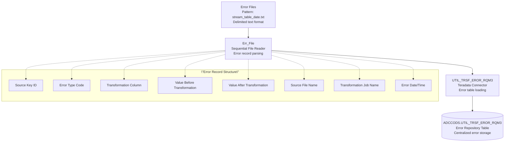

# CCODSLdErr - DataStage Job Analysis

## Overview

`CCODSLdErr` is a **specialized error loading parallel job** in the CCODS ETL pipeline that loads captured error records from transformation processes into the centralized error repository table. This job represents the error consolidation component that ensures all data quality issues and processing errors are systematically recorded for analysis, reporting, and remediation.

**Job Type**: DataStage Parallel Job  \n**Version**: 56.0.0  \n**Last Modified**: 2020-11-25 18:51:47  \n**File Size**: 816 lines (43KB)  \n**Category**: Error Management and Data Quality  

## Business Purpose

This job implements the **\"centralized error repository loading\"** pattern:

1. **Error Consolidation**: Loads error records from various transformation processes
2. **Data Quality Tracking**: Maintains comprehensive error history for quality analysis
3. **Audit Compliance**: Provides complete error audit trail for regulatory requirements
4. **Issue Analysis**: Enables systematic analysis of data quality patterns and trends
5. **Process Improvement**: Supports identification and resolution of recurring issues
6. **Operational Monitoring**: Provides error metrics for ETL process monitoring

## Architecture Diagram



## Parameters

### **Core Processing Parameters**
| Parameter | Default | Description |
|-----------|---------|-------------|
| `pRUN_STRM_C` | `BCCOMP` | Stream code identifier |
| `pRUN_STRM_PROS_D` | `20100827` | Processing date (YYYYMMDD) |
| `pcERR_TABLE` | `UTIL_TRSF_EROR_RQM3` | Error table name |
| `pcTABLE_NAME` | `CO_MSTR` | Source table name for reference |

### **Database Connection Parameters**
| Parameter | Default | Description |
|-----------|---------|-------------|
| `pODS_SERVER` | `dev.teradata.gdw.cba` | Teradata server |
| `pODS_LOAD_DB` | `ADCCODS` | Target database |
| `pODS_LOAD_USER` | `prabhaba` | Database username |
| `pODS_LOAD_PASSWD` | (Encrypted) | Database password |

### **Directory Structure**
| Parameter | Default | Description |
|-----------|---------|-------------|
| `pINPROCESS` | `/cba_app/CCODS/UAT/inprocess` | Error files directory |
| `pOUTBOUND` | `/cba_app/CCODS/UAT/outbound` | Output files directory |

## Data Flow Analysis

### **1. Source Stage: Err_File**
- **File Format**: Delimited text files (.txt)
- **File Pattern**: `{pRUN_STRM_C}_{pcERR_TABLE}_{pcTABLE_NAME}_{pRUN_STRM_PROS_D}.txt`
- **Example**: `/cba_app/CCODS/UAT/inprocess/BCCOMP_UTIL_TRSF_EROR_RQM3_CO_MSTR_20100827.txt`
- **Processing Mode**: Sequential reading with error continuation
- **Error Handling**: Continue on rejects to maximize error record capture

**Error File Characteristics**:
```
File Pattern: {stream}_{error_table}_{source_table}_{date}.txt
Content: Transformation and validation error records
Format: Delimited text (standardized error record structure)
Source: Generated by transformation jobs during error capture
Purpose: Centralized collection of all data quality issues
```

### **2. Target Stage: UTIL_TRSF_EROR_RQM3**
- **Database**: Teradata ADCCODS
- **Table**: `UTIL_TRSF_EROR_RQM3`
- **Loading Method**: Teradata Parallel Connector
- **Write Mode**: Insert (append error records)
- **Primary Key**: Composite key including source key and error sequence

## Error Record Structure

### **Core Error Fields**
| Field Name | Data Type | Purpose |
|------------|-----------|---------|
| `SRCE_KEY_I` | VARCHAR(30) | Source record identifier |
| `EROR_TYPE_C` | VARCHAR(10) | Error classification code |
| `TRSF_COLM_M` | VARCHAR(50) | Column that failed transformation |
| `VALU_CHNG_BFOR_X` | VARCHAR(255) | Original value before transformation |
| `VALU_CHNG_AFTR_X` | VARCHAR(255) | Attempted value after transformation |
| `SRCE_FILE_M` | VARCHAR(100) | Source file name |
| `TRSF_X` | VARCHAR(100) | Transformation job name |
| `EROR_SEQN_I` | INTEGER | Error sequence number |

### **Audit and Tracking Fields**
| Field Name | Data Type | Purpose |
|------------|-----------|---------|
| `SRCE_EFFT_D` | DATE | Source effective date |
| `TRSF_TABL_M` | VARCHAR(50) | Target table name |
| `PROS_D` | DATE | Processing date |
| `PROS_I` | INTEGER | Process instance ID |

## Error Categories and Classifications

### **Error Type Codes**
- **INVALID_DATE**: Date format or range validation failures
- **INVALID_NUMERIC**: Numeric conversion or range errors
- **MISSING_REQUIRED**: Required field null or empty validation
- **BUSINESS_RULE**: Business logic validation failures
- **FORMAT_ERROR**: Data format validation issues
- **CONSTRAINT_VIOLATION**: Database constraint violations
- **CONVERSION_ERROR**: Data type conversion failures

### **Error Processing Logic**
```sql
-- Error record generation pattern from transformation jobs
WHEN transformation_fails THEN
    INSERT INTO error_stream (
        source_key = original_record.primary_key,
        error_type = error_classification,
        failed_column = column_name,
        original_value = source_value,
        attempted_value = transformation_result,
        source_file = input_filename,
        transformation_job = job_name,
        error_date = current_date
    )
```

## Performance Characteristics

### **Error Loading Optimization**
- **Sequential Processing**: Optimized for error record volumes (typically smaller)
- **Append Operations**: Insert-only operations for maintaining error history
- **Minimal Transformation**: Direct loading without complex business logic
- **Progress Reporting**: Real-time status for error loading monitoring

### **Data Quality Framework**
- **Complete Error Capture**: Ensures no error records are lost
- **Error Categorization**: Systematic classification for analysis
- **Historical Tracking**: Maintains complete error history over time
- **Audit Compliance**: Full audit trail for regulatory requirements

## Business Logic

### **Error Consolidation Strategy**
1. **Multi-Source Collection**: Aggregates errors from all transformation processes
2. **Standardized Format**: Consistent error record structure across all sources
3. **Temporal Tracking**: Maintains error occurrence timing for trend analysis
4. **Source Attribution**: Clear linkage between errors and originating processes

### **Data Quality Insights**
- **Error Pattern Analysis**: Identifies recurring data quality issues
- **Source Quality Assessment**: Evaluates data quality by source system
- **Transformation Impact**: Measures transformation success rates
- **Trend Analysis**: Tracks data quality improvements over time

## Integration Points

### **Upstream Dependencies**
- All transformation jobs that generate error records
- File delivery from transformation error outputs
- Consistent error record format across all error producers

### **Downstream Dependencies**
- Data quality reporting and dashboard systems
- Error analysis and remediation processes
- Business users who analyze and fix data quality issues

### **Error Sources**
- `XfmPlanBalnSegmMstrFromBCFINSG` - Main transformation job errors
- Other transformation jobs in the CCODS pipeline
- Validation processes that identify data quality issues

## Dependencies

### **File System**
- Read access to inprocess directory for error files
- Error file availability from upstream transformation processes
- Consistent error file format and naming conventions

### **Database Systems**
- **Teradata**: Target database for error table
- **Error Table Schema**: UTIL_TRSF_EROR_RQM3 table structure
- **Database Permissions**: Insert permissions for error loading

### **External Systems**
- **Transformation Jobs**: Source of error records
- **Monitoring Systems**: Error alerting and tracking
- **Business Users**: Error analysis and remediation processes

