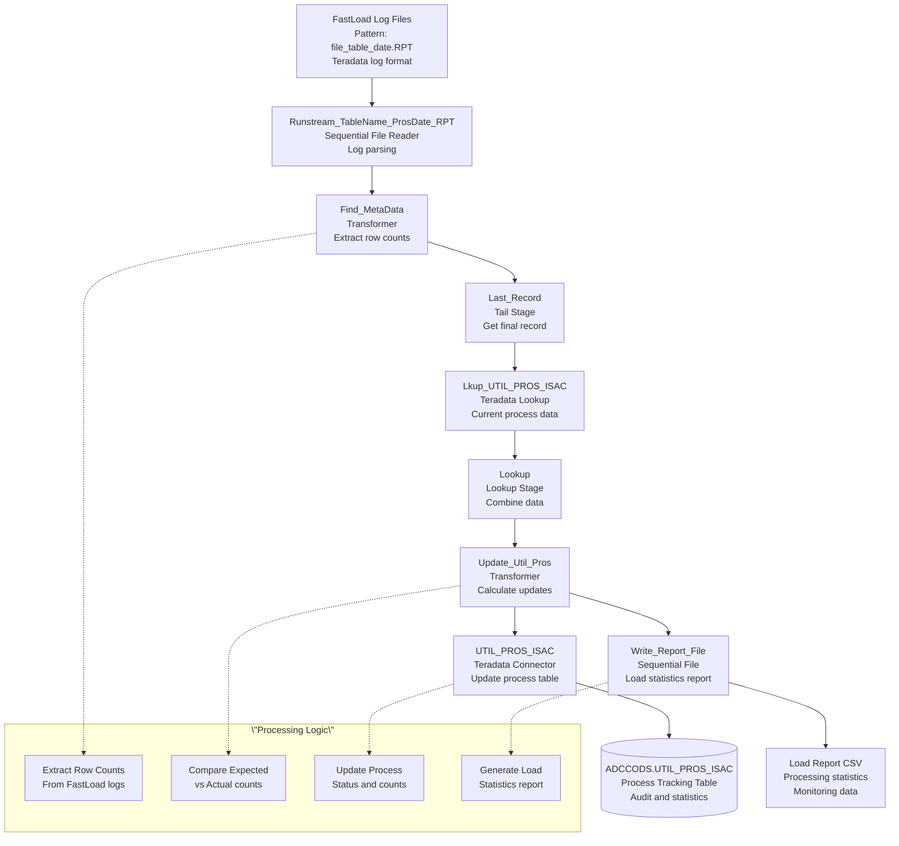

# GDWUtilProcessMetaDataFL - DataStage Job Analysis

## Overview

`GDWUtilProcessMetaDataFL` is a **comprehensive metadata and audit tracking parallel job** in the CCODS ETL pipeline that processes FastLoad log files to extract row counts, updates process tracking tables with load statistics, and generates detailed processing reports. This job represents the data quality assurance and audit component that ensures complete visibility into ETL process execution and data completeness validation.

**Job Type**: DataStage Parallel Job  \n**Version**: 56.0.0  \n**Last Modified**: 2020-04-21 16:03:04  \n**File Size**: 3,652 lines (359KB)  \n**Category**: Metadata Processing and Audit Tracking  

## Business Purpose

This job implements the **\"comprehensive ETL metadata and audit tracking\"** pattern:

1. **FastLoad Log Processing**: Extracts row counts and statistics from Teradata FastLoad logs
2. **Process Tracking Updates**: Updates UTIL_PROS_ISAC table with actual load counts
3. **Data Completeness Verification**: Compares expected vs actual record counts
4. **Load Statistics Reporting**: Generates detailed load reports for monitoring
5. **Audit Trail Maintenance**: Maintains complete audit trail for regulatory compliance
6. **Process Quality Assurance**: Validates data loading completeness and accuracy
7. **Operational Monitoring**: Provides metrics for ETL process monitoring and alerting

## Architecture Diagram



## Parameters

### **Core Processing Parameters**
| Parameter | Default | Description |
|-----------|---------|-------------|
| `pRUN_STRM_C` | `MASTER` | Stream code identifier |
| `pRUN_STRM_PROS_D` | `20100824` | Processing date (YYYYMMDD) |
| `pcTABLE_NAME` | `co_mstr` | Target table name |
| `pODS_BATCH_ID` | `1002` | Batch identifier for processing |
| `pODS_PROS_ID` | `9999999` | Process instance ID |

### **Database Connection Parameters**
| Parameter | Default | Description |
|-----------|---------|-------------|
| `pODS_SERVER` | `dev.teradata.gdw.cba` | Teradata server |
| `pODS_LOAD_DB` | `ADCCODS` | Target database |
| `pODS_LOAD_USER` | `iskapasr` | Database username |
| `pODS_LOAD_PASSWD` | (Encrypted) | Database password |

### **File Management Parameters**
| Parameter | Default | Description |
|-----------|---------|-------------|
| `pTEMP` | `/cba_app/CCODS/UAT/temp/` | Temporary files directory |
| `pcFILE_NAME` | Dynamic | FastLoad log file name pattern |

## Data Flow Analysis

### **1. Source Stage: Runstream_TableName_ProsDate_RPT**
- **File Format**: Teradata FastLoad log files (.RPT)
- **File Pattern**: `{pcFILE_NAME}_{pcTABLE_NAME}_{pRUN_STRM_PROS_D}.RPT`
- **Example**: `/cba_app/CCODS/UAT/temp/BCFINSG_CA_PLAN_BALN_SEGM_MSTR_20100824.RPT`
- **Content**: FastLoad execution statistics, row counts, timing information
- **Processing**: Sequential reading with progress reporting

**FastLoad Log Characteristics**:
```
File Pattern: {stream_file}_{table}_{date}.RPT
Content: Teradata FastLoad execution statistics
Format: Structured log format with key metrics
Source: Generated by Teradata FastLoad utility
Purpose: Extract actual load counts and performance metrics
```

### **2. Transformation Stage: Find_MetaData**
- **Purpose**: Parses FastLoad log to extract key metrics
- **Logic**: Custom transformation to find row count information
- **Variables**: Incremental row count tracking and metadata extraction
- **Output**: Structured metadata records with processing statistics

**Key Extraction Logic**:
```python
# Pseudo-code for metadata extraction
for log_line in fastload_log:
    if "records loaded" in log_line:
        actual_row_count = extract_count(log_line)
    if "load time" in log_line:
        load_duration = extract_time(log_line)
    if "error count" in log_line:
        error_count = extract_count(log_line)
```

### **3. Aggregation Stage: Last_Record (Tail)**
- **Purpose**: Gets the final summary record from the parsed log data
- **Function**: Ensures only the last/summary record is processed
- **Output**: Single record with complete load statistics

### **4. Lookup Stage: Lkup_UTIL_PROS_ISAC & Lookup**
- **Purpose**: Retrieves current process tracking information
- **SQL Logic**: Joins with existing UTIL_PROS_ISAC records
- **Key Fields**: Batch ID, Process ID, Table Name matching
- **Function**: Combines actual counts with expected counts

### **5. Update Transformation: Update_Util_Pros**
- **Purpose**: Calculates final metrics and prepares updates
- **Business Logic**: Compares expected vs actual counts
- **Validation**: Identifies discrepancies and data quality issues
- **Output**: Both database updates and report records

### **6. Target Stages**

#### **a) UTIL_PROS_ISAC (Database Update)**
- **Database**: Teradata ADCCODS
- **Table**: `UTIL_PROS_ISAC`
- **Operation**: UPDATE with actual load counts and status
- **Key Fields**: Process tracking and audit information

#### **b) Write_Report_File (Report Generation)**
- **File Format**: CSV format for easy consumption
- **File Pattern**: `{pcTABLE_NAME}_{pRUN_STRM_PROS_D}_RPT.csv`
- **Content**: Detailed load statistics and validation results

## Process Tracking Table Structure

### **UTIL_PROS_ISAC Key Fields**
| Field Name | Purpose | Update Logic |
|------------|---------|--------------|
| `PROS_I` | Process Instance ID | Identifies specific process run |
| `BTCH_KEY_I` | Batch Key ID | Links to batch processing |
| `SRCE_LOAD_CNT` | Source Load Count | Expected record count |
| `TRGT_LOAD_CNT` | Target Load Count | Actual loaded count (updated) |
| `PROS_STUS_C` | Process Status Code | Success/Failure status |
| `PROS_END_S` | Process End Timestamp | Completion time |

### **Update Logic**
```sql
UPDATE UTIL_PROS_ISAC 
SET TRGT_LOAD_CNT = actual_count_from_fastload_log,
    PROS_STUS_C = CASE 
        WHEN actual_count = expected_count THEN 'SUCCESS'
        WHEN actual_count != expected_count THEN 'VARIANCE'
        ELSE 'ERROR'
    END,
    PROS_END_S = CURRENT_TIMESTAMP
WHERE PROS_I = process_id 
  AND BTCH_KEY_I = batch_id
```

## Business Logic

### **Metadata Processing Workflow**
1. **Log Parsing**: Extracts row counts from Teradata FastLoad logs
2. **Count Validation**: Compares actual vs expected record counts
3. **Status Updates**: Updates process status based on validation results
4. **Report Generation**: Creates detailed statistics for monitoring
5. **Audit Trail**: Maintains complete processing history

### **Data Quality Validation**
- **Completeness Check**: Verifies all expected records were loaded
- **Count Reconciliation**: Identifies data loss or duplication
- **Load Performance**: Tracks loading efficiency and timing
- **Error Detection**: Captures and reports any load failures

### **Process Status Codes**
- **SUCCESS**: Expected count matches actual count exactly
- **VARIANCE**: Count mismatch within acceptable tolerance
- **ERROR**: Significant count discrepancy or load failure
- **INCOMPLETE**: Process did not complete successfully

## Report Structure

### **Load Statistics CSV Format**
```csv
ProcessDate,TableName,SourceFileName,ExpectedCount,ActualCount,LoadDuration,Status,VariancePct
20100824,PLAN_BALN_SEGM_MSTR,BCFINSG_CA_20100824.DLY,2500000,2500000,00:15:30,SUCCESS,0.00
20100824,CO_MSTR,BCCOMP_20100824.DLY,1800000,1799950,00:12:45,VARIANCE,0.003
```

### **Report Metrics**
- **ProcessDate**: Date of processing run
- **TableName**: Target table name
- **SourceFileName**: Source file processed
- **ExpectedCount**: Expected record count from source
- **ActualCount**: Actual records loaded per FastLoad log
- **LoadDuration**: Time taken for loading process
- **Status**: Load validation status
- **VariancePct**: Percentage variance from expected count

## Performance Characteristics

### **Metadata Processing Optimization**
- **Log Parsing Efficiency**: Optimized reading of large FastLoad logs
- **Lookup Performance**: Efficient lookup against process tracking table
- **Update Optimization**: Bulk updates to minimize database round trips
- **Report Generation**: Streamlined CSV generation for monitoring systems

### **Audit and Compliance Features**
- **Complete Lineage**: Full tracking from source to target
- **Temporal Tracking**: Timestamped process execution history
- **Exception Handling**: Detailed error capture and reporting
- **Reconciliation**: Systematic count validation and variance analysis
