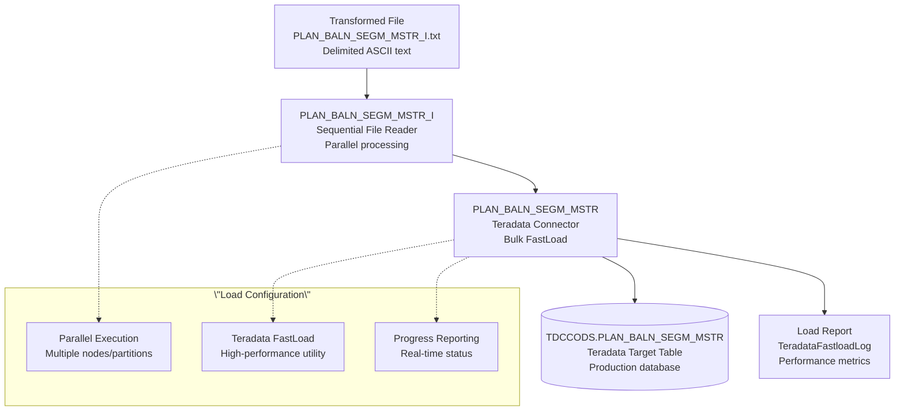

# LdBCFINSGPlanBalnSegmMstr - DataStage Job Analysis

## Overview

`LdBCFINSGPlanBalnSegmMstr` is a **high-performance bulk loading parallel job** in the CCODS ETL pipeline that loads transformed BCFINSG data from delimited text files into the target Teradata table `PLAN_BALN_SEGM_MSTR`. This job represents the final data loading phase using optimized Teradata FastLoad capabilities for maximum throughput.

**Job Type**: DataStage Parallel Job  \n**Version**: 56.0.0  \n**Last Modified**: 2020-11-25 18:49:59  \n**File Size**: 4,401 lines (245KB)  \n**Category**: High-Performance Data Loading  

## Business Purpose

This job implements the **\"optimized bulk data loading\"** pattern:

1. **High-Volume Loading**: Efficiently loads large volumes of transformed credit card data
2. **Teradata Optimization**: Leverages Teradata parallel processing and FastLoad utilities
3. **Performance Monitoring**: Generates detailed load statistics and reports
4. **Data Integrity**: Ensures complete and accurate data transfer to target system
5. **Operational Reporting**: Provides load metrics for monitoring and troubleshooting

## Architecture Diagram



## Parameters

### **Core Processing Parameters**
| Parameter | Default | Description |
|-----------|---------|-------------|
| `pRUN_STRM_C` | `BCFINSG` | Stream code identifier |
| `pRUN_STRM_PROS_D` | `20100824` | Processing date (YYYYMMDD) |
| `pcFILENAME` | `BCFINSG_CA` | Source file name pattern |
| `pcTABLE_NAME` | `PLAN_BALN_SEGM_MSTR` | Target table name |
| `pODS_PROS_ID` | `123` | Process ID for tracking |

### **Database Connection Parameters**
| Parameter | Default | Description |
|-----------|---------|-------------|
| `pODS_SERVER` | `dev.teradata.gdw.cba` | Teradata server |
| `pODS_LOAD_DB` | `ADCCODS` | Target database |
| `pODS_LOAD_USER` | `iskapasr` | Database username |
| `pODS_LOAD_PASSWD` | (Encrypted) | Database password |

### **Directory Structure**
| Parameter | Default | Description |
|-----------|---------|-------------|
| `pINBOUND` | `/cba_app/CCODS/UAT/inbound` | Source files directory |
| `pINPROCESS` | `/cba_app/CCODS/UAT/inprocess` | Processing files directory |
| `pTEMP` | `/cba_app/CCODS/UAT/temp` | Temporary files directory |
| `pOUTBOUND` | `/cba_app/CCODS/UAT/outbound` | Output files directory |

### **Performance Parameters**
| Parameter | Default | Description |
|-----------|---------|-------------|
| `pTD_SESSION_PER_PLAYER` | `1` | Teradata sessions per player |
| `pTD_SESSMAX` | `4` | Maximum Teradata sessions |
| `pTD_SYNC_TIMEOUT` | `300` | Synchronization timeout (seconds) |

## Data Flow Analysis

### **1. Source Stage: PLAN_BALN_SEGM_MSTR_I**
- **File Format**: Delimited ASCII text file (.txt)
- **File Location**: `{pINPROCESS}/{pcFILENAME}_{pcTABLE_NAME}_{pRUN_STRM_PROS_D}_I.txt`
- **Example**: `/cba_app/CCODS/UAT/inprocess/BCFINSG_CA_PLAN_BALN_SEGM_MSTR_20100824_I.txt`
- **Processing Mode**: Parallel reading with progress reporting
- **Error Handling**: Continue on rejects to maximize throughput

**Input File Characteristics**:
```
File Pattern: {stream}_{table}_{date}_I.txt
Content: Transformed credit card plan balance data
Format: Delimited text (comma/pipe separated)
Size: High volume (potentially millions of records)
Source: Output from XfmPlanBalnSegmMstrFromBCFINSG transformation
```

### **2. Target Stage: PLAN_BALN_SEGM_MSTR**
- **Database**: Teradata TDCCODS
- **Table**: `PLAN_BALN_SEGM_MSTR`
- **Loading Method**: Teradata Parallel Connector with FastLoad optimization
- **Write Mode**: Bulk insert (high-performance loading)
- **Session Management**: Optimized connection pooling

**Target Table Structure**:
The job maps to a comprehensive table structure with multiple columns including:
- **Corporate Identifier**: `CORP_IDNN` (Primary key component)
- **Account Information**: Account numbers, plan IDs
- **Date Fields**: Multiple processed date columns from transformation
- **Financial Data**: Balance amounts, payment information
- **Status Fields**: Account status, plan status indicators
- **Audit Fields**: Processing timestamps, source tracking

### **3. Performance Optimization**

#### **Teradata FastLoad Integration**
```bash
# Post-job reporting
AfterSubr: DSU.TeradataFastloadLog\
  {pTEMP}/{pcFILENAME}_{pcTABLE_NAME}_{pRUN_STRM_PROS_D}.RPT
```

**Load Report Generated**:
- **Load Statistics**: Records processed, load rate, duration
- **Performance Metrics**: Throughput, session utilization
- **Error Summary**: Any load errors or warnings
- **Resource Usage**: CPU, memory, network utilization

#### **Parallel Processing Design**
- **Partitioned Reading**: Source file read in parallel partitions
- **Parallel Loading**: Multiple Teradata sessions for concurrent loading
- **Pipeline Optimization**: Overlapped reading and loading operations
- **Memory Management**: Streaming approach to handle large files

## Performance Characteristics

### **Loading Optimization**
- **Teradata FastLoad**: Optimized bulk loading utility for maximum throughput
- **Parallel Sessions**: Multiple database connections for concurrent loading
- **Partitioned Processing**: Data distributed across multiple processing nodes
- **Streaming Pipeline**: Continuous data flow from source to target

### **Scalability Features**
- **Volume Handling**: Designed for millions of records per load
- **Resource Utilization**: Efficient CPU and memory usage patterns
- **Network Optimization**: Minimized network round trips
- **Session Management**: Optimal database connection utilization

### **Monitoring and Reporting**
- **Real-time Progress**: Live status updates during load execution
- **Performance Metrics**: Detailed load statistics and timing
- **Error Tracking**: Comprehensive error reporting and handling
- **Audit Trail**: Complete load history for compliance

## Load Statistics and Reporting

### **TeradataFastloadLog Report Format**
```
Load Report: BCFINSG_CA_PLAN_BALN_SEGM_MSTR_20100824.RPT
================================================================
Job Name: LdBCFINSGPlanBalnSegmMstr
Start Time: 2024-01-15 08:30:00
End Time: 2024-01-15 08:45:30
Duration: 00:15:30

Source File: BCFINSG_CA_PLAN_BALN_SEGM_MSTR_20100824_I.txt
Target Table: TDCCODS.PLAN_BALN_SEGM_MSTR

Records Statistics:
- Input Records: 2,500,000
- Loaded Records: 2,500,000
- Rejected Records: 0
- Load Rate: 2,700 records/second

Performance Metrics:
- Sessions Used: 4
- Average CPU: 65%
- Peak Memory: 2.1 GB
- Network I/O: 1.2 GB

Status: SUCCESS
================================================================
```

### **Key Performance Indicators**
- **Throughput**: Records per second loaded
- **Success Rate**: Percentage of successful record loads
- **Resource Efficiency**: CPU and memory utilization
- **Session Utilization**: Database connection effectiveness
- **Error Rate**: Percentage of rejected or failed records

## Error Handling and Data Quality

### **Load Validation**
- **Schema Validation**: Ensures data matches target table structure
- **Data Type Validation**: Confirms correct data type conversions
- **Constraint Validation**: Checks primary key and referential integrity
- **Volume Validation**: Verifies expected record counts

### **Error Recovery**
- **Continue on Rejects**: Maximizes successful loads despite individual record issues
- **Error Logging**: Detailed logging of any load failures
- **Restart Capability**: Ability to restart failed loads from checkpoint
- **Rollback Support**: Clean rollback on critical failures

## Dependencies

### **File System**
- Read access to inprocess directory for transformed files
- Write access to temp directory for load reports
- Sufficient disk space for large file processing

### **Database Systems**
- **Teradata**: Target database with appropriate schemas and permissions
- **FastLoad Utility**: Teradata FastLoad utility availability
- **Connection Pooling**: Optimized database connection management

### **External Systems**
- **Transformation Jobs**: Upstream transformation providing source files
- **Monitoring Systems**: Load statistics and performance tracking
- **Scheduling Systems**: Integration with job scheduling frameworks

### **Performance Requirements**
- **Network Bandwidth**: High-speed connection to Teradata database
- **Disk I/O**: Fast storage for large file reading operations
- **Memory**: Sufficient RAM for parallel processing operations

