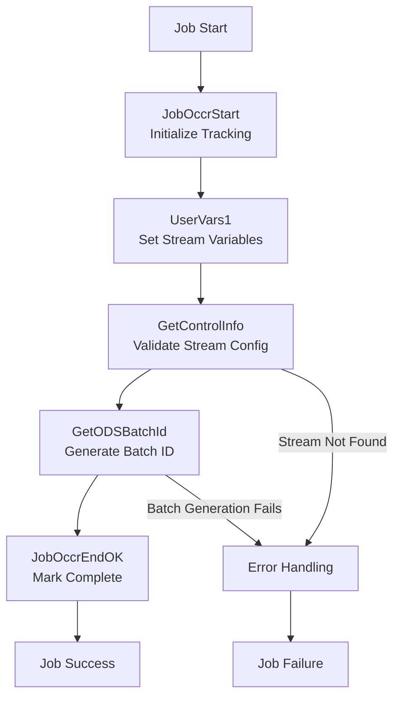
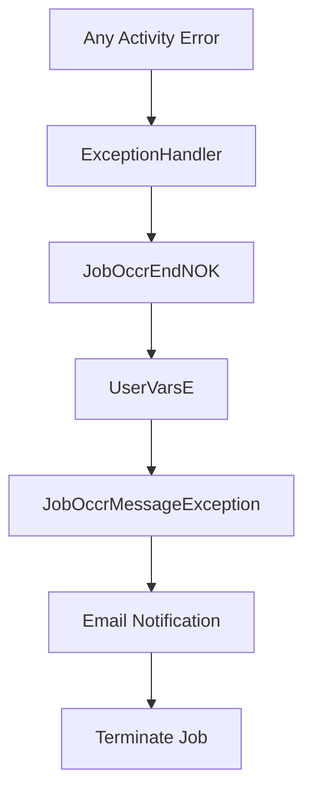
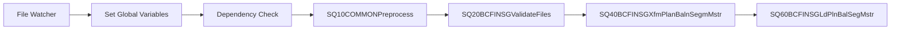

# SQ10COMMONPreprocess - DataStage Job Analysis

## Overview

`SQ10COMMONPreprocess` is the **primary initialization and preprocessing sequence job** in the CCODS ETL pipeline. It serves as the **foundation orchestrator** that validates the environment, initializes process tracking, generates batch identifiers, and triggers the actual stream processing workflow.

**Job Type**: DataStage Sequence Job  
**Version**: 56.0.0  
**Last Modified**: 2020-04-21 15:55:18  
**Category**: \Jobs\CCODS\00 Sequences  

## Business Purpose

This job implements the **"preprocessing and initialization"** pattern for ETL orchestration:

1. **Environment Validation**: Ensures the stream is valid and system is ready
2. **Process Initialization**: Creates tracking records for monitoring and auditing
3. **Batch Management**: Generates unique identifiers for process correlation
4. **Context Preparation**: Establishes all necessary parameters and environment for downstream processing
5. **Error Management**: Comprehensive error handling and notification framework

## Execution Flow

### **Key Actions**
- **Initialize Tracking**: Create job occurrence record for monitoring and audit
- **Set Variables**: Configure stream code from job invocation for dynamic processing  
- **Validate Stream**: Confirm stream exists in control database before proceeding
- **Generate Batch ID**: Create unique identifier for end-to-end process correlation
- **Complete Successfully**: Update tracking record with success status

### **Step Flow**



### **Step Details**

**1. JobOccrStart - Initialize Tracking**
- **Database**: Oracle Control Database (`GRIDDEV`)
- **Action**: `INSERT` into `UTIL_PROS_ISAC` table 
- **Purpose**: Creates a new tracking record for this specific preprocessing job execution
- **Data Written**: Stream ID, process date, start timestamp, initial status ('STARTED'), job name
- **Why**: Establishes monitoring foundation and enables restart/recovery capabilities

**2. UserVars1 - Set Stream Variables**  
- **Database**: DataStage Engine (in-memory)
- **Action**: Variable assignment (no database I/O)
- **Purpose**: Sets `RunStreamCode = DSJobInvocationId` (e.g., "BCFINSG")
- **Why**: This variable controls which downstream stream processing will be triggered

**3. GetControlInfo - Validate Stream Config**
- **Database**: Oracle Control Database (`GRIDDEV`)
- **Action**: `SELECT SYST_C FROM RUN_STRM WHERE RUN_STRM_C = 'BCFINSG'`
- **Table Read**: `RUN_STRM` (stream configuration master table)
- **Purpose**: Validates the stream exists and retrieves source system code
- **Why**: Prevents invalid streams from proceeding and provides system context for batch ID generation

**4. GetODSBatchId - Generate Batch ID**
- **Database**: Teradata ODS Database (`APCCODS`)
- **Action**: Executes batch ID generation routine (likely `INSERT` into batch tracking table)
- **Purpose**: Creates unique identifier combining source system + stream + date + time
- **Data Used**: Source system (from step 3), stream code, processing date, job start time
- **Why**: Enables end-to-end correlation across all related processing activities in the data warehouse

**5. JobOccrEndOK - Mark Complete**
- **Database**: Oracle Control Database (`GRIDDEV`) 
- **Action**: `UPDATE UTIL_PROS_ISAC SET PROCESS_STATUS='C', PROCESS_END_TIME=CURRENT_TIMESTAMP`
- **Purpose**: Updates the tracking record with completion status and end timestamp
- **Important**: This marks the **preprocessing job** as complete, NOT the actual data processing
- **Why**: The SQ10 job only prepares the environment - actual stream processing happens in subsequent jobs

### **Table Roles Explained**

**`UTIL_PROS_ISAC` (Oracle Control Database)**
- **Role**: Process occurrence tracking and audit trail
- **Purpose**: Monitors execution of all DataStage jobs across the entire CCODS system
- **Key Fields**: Stream ID, process date, start/end times, status, error messages, record counts
- **Usage**: Operations monitoring, performance analysis, failure investigation, restart logic

**`RUN_STRM` (Oracle Control Database)**  
- **Role**: Stream configuration master table
- **Purpose**: Defines all available streams and their properties
- **Key Fields**: Stream code, system code, description, processing rules, target tables
- **Usage**: Stream validation, system routing, configuration management

### **Activity Flow**

| **Sequence** | **Activity** | **Routine** | **Purpose** |
|--------------|--------------|-------------|-------------|
| 1 | `JobOccrStart` | `DSU.JobOccrStart` | Initialize job occurrence tracking |
| 2 | `UserVars1` | Built-in | Set RunStreamCode from job invocation |
| 3 | `GetControlInfo` | `DSU.OracleSqlplus` | Validate stream in control table |
| 4 | `GetODSBatchId` | `DSU.GetODSBatchId` | Generate unique batch identifier |
| 5 | `JobOccrEndOK` | `DSU.JobOccrEnd` | Finalize with success status |

## Parameters

### **Database Connection Parameters**
```yaml
# Control Database (Oracle)
pCTL_DATABASE: "GRIDDEV"                    # Control database name
pCTL_USER: "CCODS_CTL_UAT_OWNER"           # Control database user
pCTL_PASSWD: "[ENCRYPTED]"                  # Control database password

# ODS Processing Database (Teradata)
pODS_SERVER: "dev.teradata.gdw.cba"        # Teradata server
pODS_PROC_DB: "APCCODS"                     # ODS processing database
pODS_PROC_USER: "prabhaba"                  # ODS processing user
pODS_PROC_PASSWD: "[ENCRYPTED]"             # ODS processing password
pODS_LOAD_USER: "prabhaba"                  # ODS loading user
```

### **Stream Processing Parameters**
```yaml
# Core Stream Parameters
pRUN_STRM_C: "BCCOMP"                       # Stream code (BCFINSG, BCMASTER, etc.)
pRUN_STRM_PROS_D: "[RUNTIME]"               # Processing date (YYYYMMDD)
pcTABLE_NAME: "CAHD_MSTR"                   # Target table name
```

### **File System Parameters**
```yaml
# Directory Paths
pTEMP: "/cba_app/CCODS/UAT/temp"           # Temporary directory
pSCRIPTS: "/cba_app/CCODS/UAT/scripts"     # Scripts directory
```

### **Notification Parameters**
```yaml
# Email Configuration
pSMTP_SERVER: "10.31.39.156"               # SMTP server IP
pSEND_MAIL: "DataStage@CCODS_UAT"          # Sender email address
pRECEIVE_MAIL: "balaji.prabhakar@cba.com.au" # Recipient email
```

## Core Activities Analysis

### **1. JobOccrStart Routine**
```sql
-- Purpose: Initialize job occurrence tracking
-- Routine: DSU.JobOccrStart
-- Function: Creates record in UTIL_PROS_ISAC table

PARAMETERS:
  aRunStream: DSJobInvocationId              -- Stream identifier (e.g., "BCFINSG")
  aRunStreamProcessDate: pRUN_STRM_PROS_D    -- Processing date
  aDatabase: pCTL_DATABASE                   -- Control database
  aUserid: pCTL_USER                         -- Database user
  aPassword: pCTL_PASSWD                     -- Database password

BUSINESS LOGIC:
  - Inserts tracking record with job start details
  - Establishes process monitoring foundation
  - Enables restart/recovery capabilities
```

### **2. UserVars1 Activity**
```javascript
// Purpose: Set stream processing variables
// Type: User Variables Activity

RunStreamCode = DSJobInvocationId   // Stream name from job invocation
```

### **3. GetControlInfo Routine**
```sql
-- Purpose: Validate stream configuration
-- Routine: DSU.OracleSqlplus
-- Function: Executes control table lookup

SQL QUERY:
  SELECT SYST_C 
  FROM RUN_STRM RS 
  WHERE RS.RUN_STRM_C = '${RunStreamCode}';

PARAMETERS:
  aDatabase: pCTL_DATABASE
  aUserid: pCTL_USER  
  aPassword: pCTL_PASSWD
  aSQL: [Dynamic SQL with RunStreamCode]
  aFieldDelimiter: ','
  aoResult: 0 (output parameter)

BUSINESS LOGIC:
  - Validates that the stream exists in RUN_STRM control table
  - Returns SYST_C value for downstream processing
  - Ensures only valid streams can proceed
```

### **4. GetODSBatchId Routine**
```sql
-- Purpose: Generate unique batch identifier
-- Routine: DSU.GetODSBatchId
-- Function: Creates ODS_BATCH_ID for process tracking

PARAMETERS:
  aServer: pODS_SERVER                       -- "dev.teradata.gdw.cba"
  aDatabase: pODS_PROC_DB                    -- "APCCODS"
  aUser: pODS_PROC_USER                      -- "prabhaba"
  aPassword: pODS_PROC_PASSWD                -- [encrypted]
  aSourceSystem: Field(GetControlInfo.aoResult,',',1)  -- From control lookup
  aSourceSubSystem: pRUN_STRM_C              -- Stream identifier
  aBatchDate: pRUN_STRM_PROS_D               -- Processing date
  aBatchTime: Change(DSJobStartTime,':','')  -- Job start time (formatted)
  aTempDir: pTEMP                            -- Temporary directory
  aoBatchId: 0                               -- OUTPUT: Generated batch ID

BUSINESS LOGIC:
  - Generates unique ODS batch identifier
  - Combines source system, stream, date, and time
  - Provides correlation ID for all related processing
  - Enables end-to-end tracking across systems
```

### **5. JobOccrEndOK Routine**
```sql
-- Purpose: Finalize job occurrence with success
-- Routine: DSU.JobOccrEnd
-- Function: Updates UTIL_PROS_ISAC with completion status

PARAMETERS:
  aStatus: 'C'                               -- Status: Complete
  aRunStream: DSJobInvocationId              -- Stream identifier
  aRunStreamProcessDate: pRUN_STRM_PROS_D    -- Processing date
  aDatabase: pCTL_DATABASE                   -- Control database
  aUserid: pCTL_USER                         -- Database user
  aPassword: pCTL_PASSWD                     -- Database password

BUSINESS LOGIC:
  - Updates process tracking record with success status
  - Records completion timestamp
  - Enables monitoring and reporting
  - Provides audit trail
```

## Error Handling Framework

### **Exception Flow**


### **Error Handling Activities**

#### **ExceptionHandler**
- **Type**: Exception Handler Activity
- **Trigger**: Any unhandled error in the sequence
- **Action**: Initiates error handling workflow

#### **JobOccrEndNOK**
```sql
-- Purpose: Record job failure
-- Routine: DSU.JobOccrEnd
-- Status: 'A' (Aborted)

PARAMETERS:
  aStatus: 'A'                    -- Status: Aborted
  aRunStream: DSJobInvocationId
  aRunStreamProcessDate: pRUN_STRM_PROS_D
  aDatabase: pCTL_DATABASE
  aUserid: pCTL_USER
  aPassword: pCTL_PASSWD
```

#### **UserVarsE (Error Variables)**
```javascript
// Sets error-specific variables for notification
JobName = DSJobName + "." + DSJobInvocationId
JobOccrMessage = 'DataStage job has failed in activity ' + ExceptionHandler.$ErrSource + '.'
```

#### **JobOccrMessageException**
```sql
-- Purpose: Log error message to control tables
-- Routine: DSU.JobOccrMessage
-- Severity: 'I' (Information)

PARAMETERS:
  aMessageText: UserVarsE.JobOccrMessage
  aSeverity: 'I'
  aDatabase: pCTL_DATABASE
  aUserid: pCTL_USER
  aPassword: pCTL_PASSWD
```

#### **Email Notification**
```yaml
# Purpose: Send failure notification
# Type: Mail Activity

SERVER: ${pSMTP_SERVER}                    # 10.31.39.156
TO: ${pRECEIVE_MAIL}                       # balaji.prabhakar@cba.com.au
FROM: ${pSEND_MAIL}                       # DataStage@CCODS_UAT
SUBJECT: "DataStage job ${JobName} has failed in activity ${ErrSource}"
BODY: "This is an automatically generated email from DataStage. Do not reply."
INCLUDE_REPORTS: Yes                       # Includes job execution reports
```

## Process Tracking and Metadata

### **UTIL_PROS_ISAC Table Updates**
```sql
-- Job Start Record
INSERT INTO UTIL_PROS_ISAC (
    RUN_STREAM_ID,           -- DSJobInvocationId
    RUN_STREAM_PROCESS_DATE, -- pRUN_STRM_PROS_D
    ODS_BATCH_ID,           -- Generated batch ID
    PROCESS_START_TIME,      -- Job start timestamp
    PROCESS_STATUS,          -- 'STARTED'
    JOB_NAME,               -- 'SQ10COMMONPreprocess'
    CREATED_BY_USER,        -- pCTL_USER
    SYSTEM_CODE,            -- From GetControlInfo result
    SOURCE_SYSTEM,          -- From GetControlInfo result
    SOURCE_SUBSYSTEM        -- pRUN_STRM_C
);

-- Job End Record (Success)
UPDATE UTIL_PROS_ISAC 
SET PROCESS_STATUS = 'COMPLETED',
    PROCESS_END_TIME = CURRENT_TIMESTAMP,
    RECORDS_PROCESSED = [from downstream jobs]
WHERE RUN_STREAM_ID = DSJobInvocationId
  AND RUN_STREAM_PROCESS_DATE = pRUN_STRM_PROS_D;

-- Job End Record (Failure)  
UPDATE UTIL_PROS_ISAC
SET PROCESS_STATUS = 'ABORTED',
    PROCESS_END_TIME = CURRENT_TIMESTAMP,
    ERROR_MESSAGE = [error details]
WHERE RUN_STREAM_ID = DSJobInvocationId
  AND RUN_STREAM_PROCESS_DATE = pRUN_STRM_PROS_D;
```

## Stream-Specific Behavior

### **Stream Code Mapping**
| **pRUN_STRM_C** | **Purpose** | **Target Processing** |
|-----------------|-------------|----------------------|
| `BCFINSG` | Plan Balance Segment Master | PLAN_BALN_SEGM_MSTR |
| `BCMASTER` | Card Master Data | CAHD_MST1 |
| `BCCOMP` | Complementary Processing | Various tables |
| `SEG01` | Segment 1 Auxiliary | CAHD_MSTR_AUX_1 |
| `SEG02` | Segment 2 Auxiliary | CAHD_MSTR_AUX_2 |
| `SEG03` | Segment 3 Auxiliary | CAHD_MSTR_AUX_3 |
| `SEG04` | Segment 4 Auxiliary | CAHD_MSTR_AUX_4 |

### **Stream Processing Preparation**
```bash
# SQ10COMMONPreprocess prepares the environment for stream processing:
# - Validates stream configuration exists
# - Generates unique batch identifiers
# - Establishes process tracking records
# - Sets up all necessary context for downstream jobs
```

## Dependencies

### **Job Dependencies**
```yaml
ROUTINES:
  - DSU.JobOccrEnd          # Job occurrence management
  - DSU.JobOccrMessage      # Message logging
  - DSU.OracleSqlplus       # Oracle SQL execution
  - DSU.GetODSBatchId       # Batch ID generation
  - DSU.JobOccrStart        # Job occurrence initialization

JOBS:
  - [Downstream stream processing jobs]

BUILT_IN_FUNCTIONS:
  - DSSendMail             # Email notification
```

### **Database Dependencies**
```yaml
CONTROL_DATABASE: # Oracle (GRIDDEV)
  - RUN_STRM table         # Stream configuration
  - UTIL_PROS_ISAC table   # Process tracking
  - Other control tables

ODS_DATABASE: # Teradata (APCCODS)  
  - Batch ID management
  - Process synchronization
```

## Configuration Files Integration

### **CCODS.param Integration**
This job reads configuration from the master `CCODS.param` file:
```bash
# Key parameter mappings:
pCTL_DATABASE=${CTL_DATABASE}
pCTL_USER=${CTL_USER}
pODS_SERVER=${ODS_SERVER}
pRUN_STRM_C=${STREAM_NAME}    # Set by calling script
pRUN_STRM_PROS_D=${PROC_DATE} # Set by calling script
```

### **Environment-Specific Overrides**
```yaml
# UAT Environment
pCTL_DATABASE: "GRIDDEV"
pODS_SERVER: "dev.teradata.gdw.cba" 
pRECEIVE_MAIL: "balaji.prabhakar@cba.com.au"

# PROD Environment (would be different)
pCTL_DATABASE: "GRIDPROD"
pODS_SERVER: "prod.teradata.gdw.cba"
pRECEIVE_MAIL: "ccods_support@cba.com.au"
```

## Integration with Autosys

### **Typical Autosys Workflow**


### **Autosys Commands**
```bash
# Trigger SQ10COMMONPreprocess
sendevent -E FORCE_STARTJOB -J au_cba_ccods_sq10_preprocess

# Monitor execution
autorep -j au_cba_ccods_sq10_preprocess -d

# Check dependencies
autorep -j au_cba_ccods_sq10_preprocess -d -p
```

## Performance Characteristics

### **Execution Time**
- **Typical Duration**: 2-5 minutes
- **Peak Duration**: 10-15 minutes (during heavy load)
- **Critical Path**: GetODSBatchId routine (database intensive)

### **Resource Usage**
- **Memory**: Low (primarily control operations)
- **CPU**: Low (mostly database calls)
- **I/O**: Low (minimal file operations)
- **Network**: Medium (multiple database connections)

### **Bottlenecks**
1. **Database Connectivity**: Control database response time
2. **Batch ID Generation**: Teradata ODS database performance
3. **Control Table Validation**: RUN_STRM table query performance

## Monitoring and Alerting

### **Success Indicators**
```sql
-- Check successful completion
SELECT * FROM UTIL_PROS_ISAC
WHERE JOB_NAME = 'SQ10COMMONPreprocess'
  AND PROCESS_STATUS = 'COMPLETED'
  AND RUN_STREAM_PROCESS_DATE = '20241201';
```

### **Failure Detection**
```sql
-- Check for failures
SELECT * FROM UTIL_PROS_ISAC  
WHERE JOB_NAME = 'SQ10COMMONPreprocess'
  AND PROCESS_STATUS = 'ABORTED'
  AND RUN_STREAM_PROCESS_DATE = '20241201';
```

### **Performance Monitoring**
```sql
-- Check execution duration
SELECT RUN_STREAM_ID,
       PROCESS_START_TIME,
       PROCESS_END_TIME,
       TIMESTAMPDIFF(MINUTE, PROCESS_START_TIME, PROCESS_END_TIME) as DURATION_MINUTES
FROM UTIL_PROS_ISAC
WHERE JOB_NAME = 'SQ10COMMONPreprocess'
  AND RUN_STREAM_PROCESS_DATE = '20241201';
```

## Troubleshooting Guide

### **Common Issues**

#### **1. Database Connection Failures**
```bash
# Symptoms
Error: "Error calling DSAttachJob() - Database connection failed"

# Resolution
- Verify pCTL_DATABASE, pCTL_USER, pCTL_PASSWD parameters
- Check database connectivity from DataStage server
- Validate encrypted password is not corrupted
- Confirm user has necessary privileges
```

#### **2. Stream Validation Failures**
```bash
# Symptoms  
Error: "GetControlInfo routine failed - Stream not found"

# Resolution
- Verify pRUN_STRM_C parameter value
- Check RUN_STRM table contains the stream code
- Ensure SYST_C column has valid data
- Validate control database is accessible
```

#### **3. Batch ID Generation Failures**
```bash
# Symptoms
Error: "GetODSBatchId routine failed - Unable to generate batch ID"

# Resolution
- Check Teradata ODS database connectivity
- Verify pODS_SERVER, pODS_PROC_DB parameters
- Ensure pODS_PROC_USER has INSERT privileges
- Check temporary directory pTEMP is writable
```

#### **4. Process Completion Issues**
```bash
# Symptoms
Error: "Process tracking update failed"

# Resolution
- Check UTIL_PROS_ISAC table permissions
- Verify control database connectivity
- Ensure unique constraint violations are handled
- Validate occurrence record creation was successful
```

### **Diagnostic Queries**
```sql
-- Check recent job executions
SELECT * FROM UTIL_PROS_ISAC
WHERE JOB_NAME LIKE '%SQ10%'
  AND PROCESS_START_TIME >= CURRENT_DATE - 7
ORDER BY PROCESS_START_TIME DESC;

-- Find failed executions
SELECT * FROM UTIL_PROS_ISAC
WHERE JOB_NAME = 'SQ10COMMONPreprocess'
  AND PROCESS_STATUS = 'ABORTED'
  AND PROCESS_START_TIME >= CURRENT_DATE - 30;

-- Check batch ID generation
SELECT DISTINCT ODS_BATCH_ID, COUNT(*)
FROM UTIL_PROS_ISAC  
WHERE RUN_STREAM_PROCESS_DATE = '20241201'
GROUP BY ODS_BATCH_ID;
```

