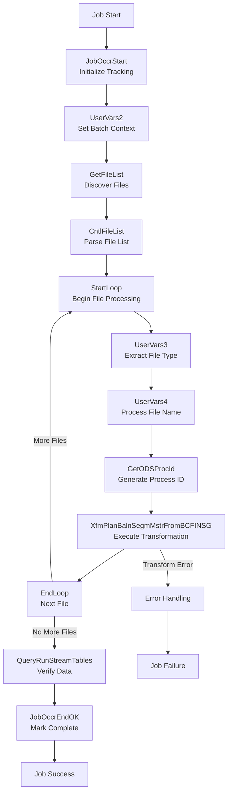

# SQ40BCFINSGXfmPlanBalnSegmMstr - DataStage Job Analysis

## Overview

`SQ40BCFINSGXfmPlanBalnSegmMstr` is a **transformation orchestration sequence job** in the CCODS ETL pipeline that processes validated BCFINSG files to transform and load data into the `PLAN_BALN_SEGM_MSTR` table. This job represents the core data transformation phase where raw BCFINSG files are converted into the target data model.

**Job Type**: DataStage Sequence Job  
**Version**: 56.0.0  
**Last Modified**: 2020-04-21 15:56:25  
**Category**: \\Jobs\\CCODS\\40 Transform  

## Business Purpose

This job implements the **"file-based transformation orchestration"** pattern:

1. **File Processing**: Processes validated BCFINSG files from inprocess directory
2. **Transformation Orchestration**: Calls parallel transformation job for each file
3. **Loop-Based Processing**: Handles multiple files systematically
4. **Process Tracking**: Maintains comprehensive audit trail
5. **Error Management**: Robust error handling with notifications
6. **Database Integration**: Loads transformed data to Teradata target tables

## Execution Flow

### **Key Actions**
- **Initialize Tracking**: Create job occurrence record and establish batch processing context
- **Discover Validated Files**: Scan inprocess directory for validated BCFINSG files ready for transformation
- **Process Each File**: Loop through files with unique process ID generation for tracking
- **Execute Transformation**: Call parallel transformation job to convert EBCDIC to target format
- **Verify Data Quality**: Validate transformation results and loaded record counts
- **Complete Process**: Update tracking with success metrics and finalize audit trail

### **Step Flow**



### **Step Details**

**1. JobOccrStart - Initialize Transformation Tracking**
- **Database**: Oracle Control Database (`GRIDDEV`)
- **Action**: `INSERT` into `UTIL_PROS_ISAC` table
- **Purpose**: Creates tracking record for transformation orchestration process
- **Data Written**: Stream ID, process date, job name, start timestamp, batch context
- **Why**: Establishes audit foundation for transformation process monitoring and recovery

**2. UserVars2 - Set Batch Processing Context**
- **Database**: DataStage Engine (in-memory variables)
- **Action**: Variable assignments for `SourceCode` and `BatchId` from parameters
- **Purpose**: Establishes processing context for source system identification and batch correlation
- **Variables Set**: Source system code, ODS batch identifier, processing date
- **Why**: Enables proper data lineage tracking across transformation and loading phases

**3. GetFileList - Discover Validated Files**
- **Database**: File System (inprocess directory)
- **Action**: `ls -m BCFINSG_C*_date.DLY` command execution in inprocess directory
- **Purpose**: Discovers validated BCFINSG files ready for transformation processing
- **File Source**: Files moved by SQ20BCFINSGValidateFiles after successful validation
- **Why**: Ensures only validated files proceed to transformation, maintaining data quality

**4. CntlFileList - Parse File Collection**
- **Database**: DataStage Engine (in-memory parsing)
- **Action**: String parsing of file list output into individual file entries
- **Purpose**: Prepares file collection for systematic loop-based processing
- **Processing Logic**: Comma-separated parsing with file validation
- **Why**: Enables structured iteration through multiple files for transformation

**5. UserVars3 + UserVars4 - Extract File Processing Context**
- **Database**: DataStage Engine (in-memory string processing)
- **Action**: File name parsing and character trimming for system compatibility
- **Purpose**: Extracts file type and processing metadata from file names
- **Processing**: Counter-based file type extraction + 10-character name trimming
- **Why**: Ensures proper file classification and system compatibility for downstream processing

**6. GetODSProcId - Generate Transformation Process ID**
- **Database**: Teradata ODS Database (`APCCODS`)
- **Action**: Executes process ID generation routine with file-specific parameters
- **Purpose**: Creates unique process identifier for detailed transformation tracking
- **ID Components**: Source system, file type, processing date, sequence number
- **Why**: Enables granular tracking of individual file transformations for audit and troubleshooting

**7. XfmPlanBalnSegmMstrFromBCFINSG - Execute Core Transformation**
- **Database**: File System + Teradata Target Database
- **Action**: Calls parallel transformation job to process EBCDIC file and load target table
- **Purpose**: Converts raw BCFINSG EBCDIC data into `PLAN_BALN_SEGM_MSTR` table format
- **Transformation**: EBCDIC → ASCII conversion, business rule application, data type transformation
- **Why**: Delivers business data in target format ready for enterprise consumption

**8. QueryRunStreamTables - Verify Transformation Results**
- **Database**: Teradata Target Database (`APCCODS`)
- **Action**: `SELECT COUNT(*)` queries to validate loaded record counts
- **Purpose**: Verifies transformation completeness and data integrity
- **Validation Logic**: Compares expected vs actual record counts, validates data quality
- **Why**: Ensures transformation success before marking process complete

**9. JobOccrEndOK - Mark Transformation Complete**
- **Database**: Oracle Control Database (`GRIDDEV`)
- **Action**: `UPDATE UTIL_PROS_ISAC` with completion status and metrics
- **Purpose**: Finalizes transformation tracking with success status and performance data
- **Metrics Captured**: Files processed, records transformed, processing duration
- **Why**: Completes audit trail and provides operational metrics for process monitoring

### **Table Roles Explained**

**`PLAN_BALN_SEGM_MSTR` (Teradata Target Database)**
- **Role**: Primary target table for transformed balance segment master data
- **Purpose**: Stores business-ready data converted from EBCDIC BCFINSG files
- **Key Fields**: Account numbers, plan identifiers, balance amounts, segment codes
- **Usage**: Business reporting, analytics, regulatory reporting, downstream data marts

**`UTIL_PROS_ISAC` (Oracle Control Database)**
- **Role**: Transformation process tracking and audit trail
- **Purpose**: Monitors execution of transformation orchestration with detailed metrics
- **Key Fields**: Process IDs, start/end times, file counts, record counts, error details
- **Usage**: Operations monitoring, performance analysis, SLA compliance, restart logic

**File System Processing Directories**
- **`/inprocess/`**: Validated files ready for transformation (source)
- **`/outbound/`**: Transformed files ready for loading (destination)
- **`/archive/`**: Processed files for audit retention

### **Critical Transformation Context**

**Important Note**: The completion of `SQ40BCFINSGXfmPlanBalnSegmMstr` marks the **successful transformation of raw data to business format**. This represents:
- Complete conversion of EBCDIC files to target table format
- All business rules and data transformations applied successfully
- Data quality validation confirming transformation accuracy
- Files ready for final loading phase (SQ60) to deliver data to business users
- Critical milestone in end-to-end data processing pipeline

## Architecture

### **High-Level Flow**
```
JobOccrStart → UserVars2 → GetFileList → CntlFileList → 
StartLoop → [For Each File] → UserVars3 → UserVars4 → 
GetODSProcId → XfmPlanBalnSegmMstrFromBCFINSG → EndLoop → 
QueryRunStreamTables → JobOccrEndOK
```

### **Error Flow**
```
Any Failure → ExceptionHandler → JobOccrEndNOK → 
JobOccrMessageException → Notify → Terminate
```

## Parameters

### **Core Processing Parameters**
| Parameter | Default | Description |
|-----------|---------|-------------|
| `pFILENAME` | `BCFINSG_C*` | File pattern to process |
| `pRUN_STRM_C` | `BCFINSG` | Stream code identifier |
| `pRUN_STRM_PROS_D` | `20100824` | Processing date (YYYYMMDD) |
| `pcTABLE_NAME` | `PLAN_BALN_SEGM_MSTR` | Target table name |
| `pcERR_TABLE` | `UTIL_TRSF_EROR_RQM3` | Error table name |

### **Database Connection Parameters**
| Parameter | Default | Description |
|-----------|---------|-------------|
| `pODS_SERVER` | `dev.teradata.gdw.cba` | Teradata server |
| `pODS_PROC_DB` | `TPCCODS` | Processing database |
| `pODS_LOAD_DB` | `TDCCODS` | Target database |
| `pODS_LOAD_USER` | `prabhaba` | Database username |
| `pODS_LOAD_PASSWD` | (Encrypted) | Database password |

### **Control Database Parameters**
| Parameter | Default | Description |
|-----------|---------|-------------|
| `pCTL_DATABASE` | `GRIDDEV` | Control database name |
| `pCTL_USER` | `CCODS_DEV_CTL_OWNER` | Control database username |
| `pCTL_PASSWD` | (Encrypted) | Control database password |

### **Directory Structure**
| Parameter | Default | Description |
|-----------|---------|-------------|
| `pINBOUND` | `/cba_app/CCODS/DEV/inbound/` | Source files directory |
| `pINPROCESS` | `/cba_app/CCODS/DEV/inprocess` | Validated files directory |
| `pOUTBOUND` | `/cba_app/CCODS/DEV/outbound/` | Output files directory |
| `pARCHIVE_OUTBOUND` | `/cba_app/CCODS/DEV/archive/outbound/` | Archive directory |
| `pTEMP` | `/cba_app/CCODS/DEV/temp` | Temporary files directory |

### **Notification Parameters**
| Parameter | Default | Description |
|-----------|---------|-------------|
| `pSMTP_SERVER` | `10.31.39.156` | SMTP server IP |
| `pSEND_MAIL` | `DataStage@CCODS_DEV` | From email address |
| `pRECEIVE_MAIL` | `Balaji.Prabhakar@cba.com.au` | To email address |

## Detailed Process Flow

### **1. Initialization**
- **JobOccrStart**: Creates process occurrence tracking record
- **UserVars2**: Sets up source code and batch ID variables
  ```bash
  SourceCode = pRUN_STRM_C  # "BCFINSG"
  BatchId = pODS_BATCH_ID   # From upstream process
  ```

### **2. File Discovery**
- **GetFileList**: Scans inprocess directory for files
  ```bash
  cd /cba_app/CCODS/DEV/inprocess
  ls -m BCFINSG_C*_20100824.DLY
  ```
- **CntlFileList**: Converts file list to delimited format for loop processing

### **3. File Processing Loop**
For each file found:
- **UserVars3**: Extracts file type from loop counter
- **UserVars4**: Trims filename to first 10 characters for processing
- **GetODSProcId**: Generates unique process ID for tracking

### **4. Transformation Execution**
- **XfmPlanBalnSegmMstrFromBCFINSG**: Main parallel transformation job
  - Reads BCFINSG file data
  - Applies business transformations
  - Loads data to `PLAN_BALN_SEGM_MSTR` table
  - Returns job status and user status

### **5. Loop Management**
- **EndLoop**: Continues processing until all files are handled
- **Loop Back**: Returns to StartLoop for next file

### **6. Verification and Completion**
- **QueryRunStreamTables**: Verifies data was loaded successfully
- **JobOccrEndOK**: Updates occurrence status to 'C' (Complete)

## Error Handling

### **Transformation Job Monitoring**
The sequence monitors the `XfmPlanBalnSegmMstrFromBCFINSG` job status:
- **$JobStatus**: Overall job execution status
- **$UserStatus**: Business logic execution status
- **$JobName**: Name of the transformation job for tracking

### **Exception Flow**
1. **ExceptionHandler**: Captures any activity failure
2. **JobOccrEndNOK**: Updates occurrence status to 'A' (Aborted)
3. **JobOccrMessageException**: Logs detailed exception information
4. **Notify**: Sends email notification with failure details
5. **Terminate**: Stops sequence execution

### **Email Notification Details**
```
To: Balaji.Prabhakar@cba.com.au
From: DataStage@CCODS_DEV
Subject: DataStage job {JobName} has failed in activity {ActivityName}
Body: This is an automatically generated email from DataStage. Do not reply.
Includes: Job reports attached
```

## Business Logic

### **File Processing Strategy**
1. **Sequential File Processing**: Files processed one at a time to maintain order
2. **File Type Extraction**: Extracts file identifier for process tracking
3. **Process ID Generation**: Creates unique identifier for each file processing
4. **Status Monitoring**: Tracks transformation job execution status

### **Data Quality Approach**
- **Pre-validated Files**: Only processes files that passed validation
- **Error Table**: Captures transformation errors in `UTIL_TRSF_EROR_RQM3`
- **Status Tracking**: Comprehensive monitoring of each transformation step
- **Data Verification**: Post-load verification via `QueryRunStreamTables`

### **Error Handling and Data Quality**

The `XfmPlanBalnSegmMstrFromBCFINSG` transformation job implements comprehensive error handling to capture and log data quality issues during EBCDIC-to-target conversion. All transformation errors are captured in the `UTIL_TRSF_EROR_RQM3` table for analysis and remediation.

#### **Error Table Structure: UTIL_TRSF_EROR_RQM3**

**Table Purpose**: Captures detailed information about records that fail transformation validation during EBCDIC data processing.

| Column Name | Data Type | Null | Description | Example Value |
|-------------|-----------|------|-------------|---------------|
| `SRCE_KEY_I` | STRING | NOT NULL | Unique source record identifier | `ACC123456789_PLAN001_1001` |
| `CONV_M` | STRING | NOT NULL | Conversion/transformation name | `BCFINSG_XFORM` |
| `CONV_MAP_RULE_M` | STRING | | Specific conversion rule that failed | `DATE_VALIDATION` |
| `TRSF_TABL_M` | STRING | | Target table being transformed to | `PLAN_BALN_SEGM_MSTR` |
| `SRCE_EFFT_D` | DATE | NOT NULL | Source effective/processing date | `2024-12-08` |
| `VALU_CHNG_BFOR_X` | STRING | | Original value before transformation | `20241399` (invalid date) |
| `VALU_CHNG_AFTR_X` | STRING | | Attempted/converted value | `ERROR` |
| `TRSF_X` | STRING | | Transformation job name | `XfmPlanBalnSegmMstrFromBCFINSG` |
| `TRSF_COLM_M` | STRING | | Column that failed transformation | `BCF_DT_FIRST_TRANS` |
| `EROR_SEQN_I` | DECIMAL(10,0) | | Error sequence number | `1` |
| `SRCE_FILE_M` | STRING | | Source file name | `BCFINSG_CA_20241208.DLY` |
| `PROS_KEY_EFFT_I` | DECIMAL(10,0) | | Process key effective | `12345` |
| `TRSF_KEY_I` | STRING | | Transformation key identifier | `TRSF_ACC123456789_PLAN001_1001` |

#### **Error Capture Examples**

**Example 1: Date Conversion Error**
```sql
-- Record with invalid date in BCF_DT_FIRST_TRANS field
INSERT INTO UTIL_TRSF_EROR_RQM3 VALUES (
    'ACC987654321_PLAN567_1205',        -- SRCE_KEY_I
    'BCFINSG_XFORM',                    -- CONV_M
    'DATE_VALIDATION',                  -- CONV_MAP_RULE_M
    'PLAN_BALN_SEGM_MSTR',             -- TRSF_TABL_M
    '2024-12-08',                       -- SRCE_EFFT_D
    '20241399',                         -- VALU_CHNG_BFOR_X (invalid month)
    'ERROR',                            -- VALU_CHNG_AFTR_X
    'XfmPlanBalnSegmMstrFromBCFINSG',   -- TRSF_X
    'BCF_DT_FIRST_TRANS',              -- TRSF_COLM_M
    1,                                  -- EROR_SEQN_I
    'BCFINSG_CA_20241208.DLY',         -- SRCE_FILE_M
    12345,                              -- PROS_KEY_EFFT_I
    'TRSF_ACC987654321_PLAN567_1205'   -- TRSF_KEY_I
);
```

**Example 2: Numeric Conversion Error**
```sql
-- Record with invalid numeric value in balance field
INSERT INTO UTIL_TRSF_EROR_RQM3 VALUES (
    'ACC555666777_PLAN888_1450',        -- SRCE_KEY_I
    'BCFINSG_XFORM',                    -- CONV_M
    'NUMERIC_VALIDATION',               -- CONV_MAP_RULE_M
    'PLAN_BALN_SEGM_MSTR',             -- TRSF_TABL_M
    '2024-12-08',                       -- SRCE_EFFT_D
    'INVALID_AMOUNT',                   -- VALU_CHNG_BFOR_X
    'ERROR',                            -- VALU_CHNG_AFTR_X
    'XfmPlanBalnSegmMstrFromBCFINSG',   -- TRSF_X
    'BCF_OPENING_BALANCE',              -- TRSF_COLM_M
    2,                                  -- EROR_SEQN_I
    'BCFINSG_CA_20241208.DLY',         -- SRCE_FILE_M
    12345,                              -- PROS_KEY_EFFT_I
    'TRSF_ACC555666777_PLAN888_1450'   -- TRSF_KEY_I
);
```

#### **Error Processing Flow**

1. **Error Detection**: During transformation, DataStage validates each field according to business rules
2. **Error Routing**: Records failing validation are routed to the error output link
3. **Error Logging**: Failed records are inserted into `UTIL_TRSF_EROR_RQM3` with detailed context
4. **Error Analysis**: Operations teams can query the error table to identify and resolve data quality issues
5. **Error Remediation**: Source systems can be notified to correct upstream data issues

#### **Common Error Types Captured**

| Error Type | Description | Example Field | Typical Cause |
|------------|-------------|---------------|---------------|
| **Date Validation** | Invalid date format or value | `BCF_DT_FIRST_TRANS` | EBCDIC date corruption, invalid packed decimal |
| **Numeric Conversion** | Invalid numeric values | `BCF_OPENING_BALANCE` | Non-numeric characters in COMP-3 fields |
| **Length Validation** | Field length exceeds target | `BCF_ACCOUNT_NO1` | Data expansion during EBCDIC conversion |
| **Range Validation** | Values outside business rules | `BCF_PLAN_SEQ` | Invalid plan sequence numbers |
| **Mandatory Field** | Required fields are null/empty | `BCF_CORP` | Missing key business identifiers |

#### **Error Table Usage Patterns**

**Daily Error Analysis Query:**
```sql
SELECT 
    SRCE_EFFT_D,
    TRSF_COLM_M,
    COUNT(*) as error_count,
    COUNT(DISTINCT SRCE_FILE_M) as affected_files
FROM UTIL_TRSF_EROR_RQM3 
WHERE SRCE_EFFT_D = '2024-12-08'
  AND TRSF_X = 'XfmPlanBalnSegmMstrFromBCFINSG'
GROUP BY SRCE_EFFT_D, TRSF_COLM_M
ORDER BY error_count DESC;
```

**File-Level Error Summary:**
```sql
SELECT 
    SRCE_FILE_M,
    COUNT(*) as total_errors,
    COUNT(DISTINCT TRSF_COLM_M) as affected_columns,
    MIN(VALU_CHNG_BFOR_X) as sample_error_value
FROM UTIL_TRSF_EROR_RQM3
WHERE SRCE_EFFT_D = '2024-12-08'
GROUP BY SRCE_FILE_M;
```

This error handling approach ensures **complete audit trail** of data quality issues and enables **proactive data quality management** across the BCFINSG transformation pipeline.

### **Performance Considerations**
- **File-by-File Processing**: Ensures memory efficiency for large files
- **Process ID Management**: Enables parallel processing tracking
- **Error Isolation**: File-level error handling prevents total failure

## Integration Points

### **Upstream Dependencies**
- `SQ20BCFINSGValidateFiles` - Provides validated files in inprocess directory
- File delivery systems - Must deliver properly formatted BCFINSG files

### **Downstream Dependencies**
- `SQ60BCFINSGLdPlnBalSegMstr` - Next job in sequence for loading
- Target table `PLAN_BALN_SEGM_MSTR` - Primary output destination

### **Called Jobs**
- `XfmPlanBalnSegmMstrFromBCFINSG` - Main transformation parallel job
- Various utility routines:
  - `DSU.JobOccrStart` / `DSU.JobOccrEnd` - Process tracking
  - `DSU.QueryRunStreamTables` - Data verification
  - `DSU.GetODSProcId` - Process ID generation

### **Database Tables**
- **Source**: BCFINSG files (EBCDIC format)
- **Target**: `PLAN_BALN_SEGM_MSTR` (Teradata)
- **Error**: `UTIL_TRSF_EROR_RQM3` (Error logging)
- **Control**: `UTIL_PROS_ISAC` (Process tracking)

## Dependencies

### **File System**
- Read access to inprocess directory for validated files
- Write access to outbound and archive directories
- Temporary directory access for processing

### **Database Systems**
- **Teradata**: Target database for PLAN_BALN_SEGM_MSTR table
- **Control Database**: Process tracking and metadata
- **Error Database**: Transformation error logging

### **External Systems**
- **Email System**: SMTP server for failure notifications
- **File Delivery**: Upstream systems providing BCFINSG files
- **Monitoring**: Process tracking systems