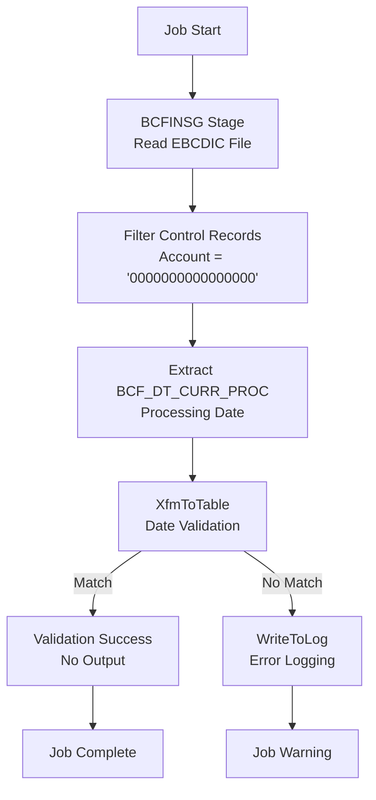

# ValidateBcFinsg - DataStage Job Analysis

## Overview

`ValidateBcFinsg` is a **critical data validation parallel job** in the CCODS ETL pipeline that validates BCFINSG (Balance Control File - Financial Services Group) files by checking the processing date embedded in the file against the expected ETL processing date. This is a core data quality control that ensures only files with the correct processing date are allowed through the pipeline.

**Job Type**: DataStage Parallel Job  
**Version**: 56.0.0  
**Last Modified**: 2020-04-21 15:59:28  
**Category**: Data Validation  

## Business Purpose

This job implements the **"temporal data quality validation"** pattern:

1. **Date Integrity Check**: Validates that file processing date matches ETL processing date
2. **Control Record Validation**: Reads specific control records to extract processing date
3. **EBCDIC File Processing**: Handles legacy mainframe file formats
4. **Validation Logging**: Records validation failures for audit and troubleshooting

## Execution Flow

### **Key Actions**
- **Read EBCDIC File**: Load BCFINSG mainframe file with complex flat file reader
- **Filter Control Records**: Extract records with account number '0000000000000000' (control records)
- **Extract Date**: Read BCF_DT_CURR_PROC field containing file's processing date
- **Validate Date**: Compare file processing date against expected ETL processing date
- **Log Errors**: Record any validation failures for audit and troubleshooting

### **Step Flow**



### **Step Details**

**1. BCFINSG Stage - Read EBCDIC File**
- **Database**: File System (EBCDIC format)
- **Action**: `READ` from complex flat file with COBOL copybook structure
- **Purpose**: Loads BCFINSG mainframe file containing balance segment control data
- **File Read**: EBCDIC binary file with fixed-length records (750 bytes each)
- **Why**: Accesses control records embedded in mainframe files to validate processing date integrity

**2. Filter Control Records - Extract Specific Records**
- **Database**: DataStage Engine (in-memory filtering)
- **Action**: `WHERE BCF_ACCOUNT_NO = '0000000000000000'` (filter expression)
- **Purpose**: Isolates control records that contain file-level metadata including processing date
- **Data Filtered**: Only control records (account number = all zeros) contain processing date
- **Why**: Control records hold file metadata while data records contain business transactions

**3. Extract BCF_DT_CURR_PROC - Get Processing Date**
- **Database**: DataStage Engine (in-memory field extraction)
- **Action**: Field mapping `BCF_DT_CURR_PROC` → `ProcessingDateFromFile`
- **Purpose**: Extracts the processing date (YYYYMMDD format) embedded in the control record
- **Data Format**: DECIMAL(9,0) field containing date as integer (e.g., 20241201)
- **Why**: File's processing date must match ETL's expected processing date for data integrity

**4. XfmToTable - Date Validation Logic**
- **Database**: DataStage Engine (in-memory transformation)
- **Action**: Comparison logic `IF ProcessingDateFromFile = pRUN_STRM_PROS_D THEN 'Y' ELSE 'N'`
- **Purpose**: Validates that file's embedded date matches ETL processing parameter
- **Business Rule**: Strict temporal validation prevents processing wrong-date files
- **Why**: Ensures data lineage integrity and prevents temporal data quality issues

**5. WriteToLog - Error Recording**
- **Database**: File System (error log files)
- **Action**: `WRITE` error message when validation fails
- **Purpose**: Records validation failures with detailed error messages for audit trail
- **Data Written**: File name, expected date, actual date, validation timestamp
- **Why**: Provides audit trail for data quality issues and troubleshooting failed validations

### **Critical Validation Logic**

## **🎯 Single Validation Purpose: Date-Only Control Record Check**

### **📋 What Gets Validated**

**Primary Validation**: Processing date integrity check - **ONLY Control Records**, NOT all rows

**1. Date Validation Scope:**
- **ONLY Control Records**: Filter `BCF_ACCOUNT_NO = '0000000000000000'` 
- **Business Data Records**: Completely ignored for validation
- **Single Field Focus**: Only `BCF_DT_CURR_PROC` field validated

**2. Date Field Extraction:**
```sql
-- Core validation logic
BCF_DT_CURR_PROC[3,8] = pRUN_STRM_PROS_D

-- Field Details:
-- BCF_DT_CURR_PROC: DECIMAL(9,0) - format CYYDDDCCC
-- Extraction: [3,8] = YYMMDD portion  
-- Parameter: pRUN_STRM_PROS_D = YYYYMMDD format
-- Comparison: YYMMDD from file vs YYYYMMDD parameter
```

### **🔍 Detailed Validation Scope**

| **Validation Aspect** | **Details** | **Status** |
|----------------------|-------------|------------|
| **Records Validated** | Control records only (account = '0000000000000000') | ✅ **Validated** |
| **Business Data Records** | All transaction/balance records | ❌ **NOT Validated** |
| **Field Validated** | `BCF_DT_CURR_PROC` - processing date field only | ✅ **Validated** |
| **Other Fields** | Corporation, plan ID, account numbers, balances | ❌ **NOT Validated** |
| **Business Rules** | Balance calculations, account validity | ❌ **NOT Validated** |
| **Data Quality** | Nulls, duplicates, referential integrity | ❌ **NOT Validated** |
| **Record Counts** | File completeness checks | ❌ **NOT Validated** |
| **Field Formats** | Data types, lengths, ranges | ❌ **NOT Validated** |

### **⚙️ Technical Validation Process**

**Stage Variable Logic**:
```sql
-- DataStage Expression
svDateValidation = IF FrmSrc.BCF_DT_CURR_PROC[3,8] = pRUN_STRM_PROS_D THEN 'Y' ELSE 'N'

-- Practical Example:
-- File Control Record: BCF_DT_CURR_PROC = 120241201 (CYYDDDCCC format)
-- Extract [3,8]: "241201" (YYMMDD portion)
-- Parameter: pRUN_STRM_PROS_D = "20241201" (YYYYMMDD)
-- Comparison: "241201" vs "20241201" → Logic needs century handling
-- Result: svDateValidation = 'Y' (validation passes)
```

**Validation Outcomes**:
- **Success**: File processing date matches ETL date → Job completes successfully
- **Failure**: Date mismatch detected → Error logged, job completes with warnings
- **System Error**: File read failure → Job fails with exception

### **🚫 What is NOT Validated**

**Important**: This is a **very narrow, specific validation** - essentially a **"temporal data gate"**

- ❌ **Business data records** (actual balance/transaction data)
- ❌ **Field-level validation** (data types, formats, ranges)  
- ❌ **Business rules** (balance calculations, account validity)
- ❌ **Record counts** (file completeness)
- ❌ **Data quality** (nulls, duplicates, referential integrity)
- ❌ **Cross-field validation** (plan ID consistency, corporate codes)
- ❌ **Reference data validation** (valid account numbers, plan codes)

### **🎯 Key Business Purpose**

**Think of it as**: *"Is this the right file for today's processing date?"* rather than *"Is the data in this file valid?"*

**Business Value**:
1. **Temporal Data Integrity**: Prevents processing files from wrong business dates
2. **Operational Safety**: Catches file delivery timing issues early  
3. **Audit Compliance**: Provides clear validation trail
4. **Error Prevention**: Stops downstream processing of incorrect data

## Parameters

### **Core Parameters**
| Parameter | Default | Description |
|-----------|---------|-------------|
| `pINBOUND` | `/cba_app/CCODS/UAT/inbound` | Source directory for BCFINSG files |
| `pINPUTFILE` | `bcfinsg_c*` | Input file pattern |
| `pINPROCESS` | `/cba_app/CCODS/UAT/inprocess` | Target directory for validated files |
| `pOUTPUTFILE` | `bcfinsg_c*` | Output file pattern |
| `pRUN_STRM_PROS_D` | `20100824` | Expected processing date (YYYYMMDD) |

## File Format Analysis

### **EBCDIC Binary File Structure**
- **Charset**: EBCDIC
- **Data Format**: Binary
- **Record Type**: Fixed length (F)
- **Byte Order**: Native endian
- **Record Structure**: COBOL copybook format

### **Key Fields in Control Record**
| Field | Type | Length | Description |
|-------|------|--------|-------------|
| `BCF_CORP_0` | CHAR | 2 | Corporation code |
| `BCF_ACCOUNT_NO_0` | CHAR | 16 | Account number (filter: '0000000000000000') |
| `BCF_PLAN_ID_0` | CHAR | 6 | Plan identifier |
| `BCF_PLAN_SEQ_0` | DECIMAL | 3,0 | Plan sequence |
| `BCF_DT_CURR_PROC` | DECIMAL | 9,0 | **Current processing date** |
| `BCF_DT_NEXT_PROC` | DECIMAL | 9,0 | Next processing date |
| `FILLER6` | CHAR | 718 | Padding/filler |

## Validation Logic

### **Core Business Rule**
```sql
-- DataStage Expression
IF FrmSrc.BCF_DT_CURR_PROC [3,8] = pRUN_STRM_PROS_D THEN 'Y' ELSE 'N'

-- Business Logic
- Extract positions 3-8 from BCF_DT_CURR_PROC field (YYYYMMDD format)
- Compare with parameter pRUN_STRM_PROS_D
- If match: File is valid for processing
- If no match: File has wrong processing date - reject with warning
```

### **Stage Variable Logic**
- **svDateValidation**: 
  - `'Y'` = Validation passed (dates match)
  - `'N'` = Validation failed (dates don't match)

### **Output Constraint**
```sql
svDateValidation = 'N'
```
- Only failed validations are sent to the WriteToLog container
- Successful validations produce no output (job completes successfully)

## Error Handling

### **Validation Failure Process**
1. **Date Mismatch Detected**: `BCF_DT_CURR_PROC[3,8] ≠ pRUN_STRM_PROS_D`
2. **Stage Variable Set**: `svDateValidation = 'N'`
3. **Constraint Triggered**: Record sent to WriteToLog
4. **Error Message**: `"Process Date in File doesnt match with the ETL Processing date"`
5. **Message Severity**: `"Warning"`
6. **Job Status**: Completes with warning (allows manual review)

### **Success Path**
1. **Date Match**: `BCF_DT_CURR_PROC[3,8] = pRUN_STRM_PROS_D`
2. **Stage Variable Set**: `svDateValidation = 'Y'`
3. **No Output**: No records sent to WriteToLog
4. **Job Status**: Completes successfully

## Integration Points

### **Upstream Dependencies**
- `SQ20BCFINSGValidateFiles` - Calls this job for each BCFINSG file
- File delivery systems - Must deliver files with correct embedded processing dates

### **Downstream Impact**
- **Success**: Allows file to proceed to transformation stages
- **Failure**: File processing halts, requires manual intervention
- **Logging**: Validation results captured for audit and monitoring

### **File Processing Flow**
```
Inbound Directory → ValidateBcFinsg → 
  ├─ Success: Move to Inprocess Directory
  └─ Failure: Move to Reject Directory (handled by calling sequence)
```

## Technical Deep Dive

### **COBOL Copybook Integration**
- Uses `COBOL FD\BCFINSG_Copy_All\BCF_DATE_CONTROL_RECORD` table definition
- Handles complex EBCDIC to ASCII conversion
- Preserves mainframe numeric formats (packed decimal)

### **Control Record Selection**
```sql
-- Predicate Filter
BCF_ACCOUNT_NO_0 = '0000000000000000'
```
- Only processes control records (not data records)
- Control records contain processing date metadata
- Efficient processing by filtering at source stage

### **Date Format Handling**
```
File Format: BCF_DT_CURR_PROC = CYYDDDCCC (9 digits)
             C = Century, YY = Year, DDD = Day of Year, CCC = ??? 
             
Extraction: [3,8] = YYMMDD portion
Parameter: pRUN_STRM_PROS_D = YYYYMMDD

Comparison: YYMMDD from file vs YYYYMMDD parameter
```

### **Key Transformation Summary**

| **DataStage Operation** | **Business Logic** | **Purpose** |
|------------------------|-------------------|-------------|
| Read EBCDIC File | Load mainframe binary file (750-byte records) | Access control records with processing date |
| Filter Control Records | `WHERE BCF_ACCOUNT_NO = '0000000000000000'` | Isolate metadata records from business data |
| Extract Processing Date | `BCF_DT_CURR_PROC[3,8]` → YYMMDD format | Get file's embedded processing date |
| Date Comparison | Compare file date vs ETL parameter | Validate temporal data integrity |
| Error Logging | Log validation failures with details | Provide audit trail for date mismatches |


## Dependencies

### **File System**
- Access to EBCDIC files in inbound directory
- COBOL copybook definition for record structure
- File naming convention compliance

### **External Systems**
- Mainframe file delivery systems with embedded processing dates
- Shared container `WriteToLog` for error logging
- Control database for process tracking

### **Data Dependencies**
- Correct processing date parameter (`pRUN_STRM_PROS_D`)
- Properly formatted BCFINSG files with control records
- EBCDIC to ASCII conversion capabilities

