# XfmPlanBalnSegmMstrFromBCFINSG - DataStage Job Analysis

## Overview

`XfmPlanBalnSegmMstrFromBCFINSG` is the **core data transformation parallel job** in the CCODS ETL pipeline that processes BCFINSG (Balance Control File - Financial Services Group) EBCDIC mainframe files and transforms them into the `PLAN_BALN_SEGM_MSTR` target structure. This job represents the heart of the business data transformation, converting raw mainframe data into analytics-ready format.

**Job Type**: DataStage Parallel Job  \n**Version**: 56.0.0  \n**Last Modified**: 2020-04-21 16:02:33  \n**File Size**: 25,383 lines (1.4MB)  \n**Category**: Core Data Transformation  

## Business Purpose

This job implements the **\"mainframe-to-analytics data transformation\"** pattern:

1. **EBCDIC File Processing**: Reads binary mainframe files using COBOL copybook structure
2. **Basic Date Conversions**: Converts EBCDIC dates to string format with minimal validation
3. **Simple Data Validation**: Only validates date conversion success/failure
4. **Minimal Business Logic**: No complex business rules, only basic data transformation
5. **Target Format Generation**: Creates delimited output files for downstream processing
6. **Error Segregation**: Routes date conversion failures to error table

## Architecture Diagram

```mermaid
graph TD
    SOURCE[BCFINSG EBCDIC File<br/>COBOL BCF_DETAIL_RECORD<br/>Binary/Fixed-width] --> READER[BCFINSG Stage<br/>Complex Flat File Reader<br/>EBCDIC→ASCII conversion]
    
    READER --> TRANSFORMER[XfmToTable Transformer<br/>Complex Business Logic<br/>18+ output links]
    
    TRANSFORMER --> FUNNEL[FUNNEL Stage<br/>Consolidate data streams]
    
    FUNNEL --> TARGET[PLAN_BALN_SEGM_MSTR_I<br/>Sequential File Output<br/>Delimited text format]
    
    TRANSFORMER --> ERRORS[UTIL_TRSF_EROR_RQM3<br/>Error Records Output<br/>Data quality issues]
    
    subgraph \"Date Transformation Links\"
        TRANSFORMER --> BcfDtSpcTrmsEd[Special Terms End Date]
        TRANSFORMER --> BcfDtIntDefr[Interest Deferred Date]
        TRANSFORMER --> BcfDtPymtDefr[Payment Deferred Date]
        TRANSFORMER --> BcfDtFrstTrns[First Transaction Date]
        TRANSFORMER --> BcfDtPaidOff[Paid Off Date]
        TRANSFORMER --> BcfDtLstPymt[Last Payment Date]
        TRANSFORMER --> BcfDtLstMaint[Last Maintenance Date]
        TRANSFORMER --> BcfPlanDueDt[Plan Due Date]
        TRANSFORMER --> BcfDtEndIntrstFree[End Interest Free Date]
        TRANSFORMER --> BcfDtMigrate[Migration Date]
        TRANSFORMER --> BcfFlLstInstallmntDt[Last Installment Date]
        TRANSFORMER --> BcfSchedPayoffDt[Scheduled Payoff Date]
        TRANSFORMER --> BcfActualPayoffDt[Actual Payoff Date]
        TRANSFORMER --> BcfDtInstallTermChg[Install Term Change Date]
        TRANSFORMER --> BcfDtInstallPaid[Install Paid Date]
        TRANSFORMER --> BcfProjectedPayoffDt[Projected Payoff Date]
        TRANSFORMER --> BcfDisputeOldDt[Dispute Old Date]
    end
    
    BcfDtSpcTrmsEd --> FUNNEL
    BcfDtIntDefr --> FUNNEL
    BcfDtPymtDefr --> FUNNEL
    BcfDtFrstTrns --> FUNNEL
    BcfDtPaidOff --> FUNNEL
    BcfDtLstPymt --> FUNNEL
    BcfDtLstMaint --> FUNNEL
    BcfPlanDueDt --> FUNNEL
    BcfDtEndIntrstFree --> FUNNEL
    BcfDtMigrate --> FUNNEL
    BcfFlLstInstallmntDt --> FUNNEL
    BcfSchedPayoffDt --> FUNNEL
    BcfActualPayoffDt --> FUNNEL
    BcfDtInstallTermChg --> FUNNEL
    BcfDtInstallPaid --> FUNNEL
    BcfProjectedPayoffDt --> FUNNEL
    BcfDisputeOldDt --> FUNNEL


```



## Parameters

### **Core Processing Parameters**
| Parameter | Default | Description |
|-----------|---------|-------------|
| `pRUN_STRM_C` | `BCFINSG` | Stream code identifier |
| `pRUN_STRM_PROS_D` | `20100824` | Processing date (YYYYMMDD) |
| `pcFILENAME` | `BCFINSG_CA` | Input file name pattern |
| `pcTABLE_NAME` | `PLAN_BALN_SEGM_MSTR` | Target table name |
| `pcERR_TABLE` | `UTIL_TRSF_EROR_RQM3` | Error table name |
| `pODS_PROS_ID` | `123` | Process ID for tracking |

### **Directory Structure**
| Parameter | Default | Description |
|-----------|---------|-------------|
| `pINPROCESS` | `/cba_app/CCODS/UAT/inprocess` | Input files directory |
| `pTEMP` | `/cba_app/CCODS/UAT/temp` | Temporary files directory |
| `pOUTBOUND` | `/cba_app/CCODS/UAT/outbound` | Output files directory |

## Data Flow Analysis

### **1. Source Stage: BCFINSG**
- **File Format**: EBCDIC binary fixed-width records
- **COBOL Copybook**: `BCF_DETAIL_RECORD` from `BCFINSG_Copy_Test`
- **Encoding**: EBCDIC to ASCII conversion with binary data handling
- **Record Type**: Fixed Block (FB) with native endian byte order
- **Error Handling**: Continue on rejects with progress reporting

**Input File Pattern**:
```
{pINPROCESS}/{pcFILENAME}_{pRUN_STRM_PROS_D}.DLY
Example: /cba_app/CCODS/UAT/inprocess/BCFINSG_CA_20100824.DLY
```

### **2. Transformation Stage: XfmToTable**
The core transformer implements complex business logic with **18 output links** for different date transformations:

#### **Date Transformation Links**
Each date field has its own output link with specific transformation logic:

1. **BcfDtSpcTrmsEd** - Special Terms End Date processing
2. **BcfDtIntDefr** - Interest Deferred Date validation
3. **BcfDtPymtDefr** - Payment Deferred Date conversion
4. **BcfDtFrstTrns** - First Transaction Date formatting
5. **BcfDtPaidOff** - Account Paid Off Date logic
6. **BcfDtLstPymt** - Last Payment Date processing
7. **BcfDtLstMaint** - Last Maintenance Date handling
8. **BcfPlanDueDt** - Plan Due Date calculations
9. **BcfDtEndIntrstFree** - End of Interest Free Period
10. **BcfDtMigrate** - Account Migration Date
11. **BcfFlLstInstallmntDt** - Last Installment Date
12. **BcfSchedPayoffDt** - Scheduled Payoff Date
13. **BcfActualPayoffDt** - Actual Payoff Date
14. **BcfDtInstallTermChg** - Installment Term Change Date
15. **BcfDtInstallPaid** - Installment Paid Date
16. **BcfProjectedPayoffDt** - Projected Payoff Date
17. **BcfDisputeOldDt** - Dispute Resolution Date
18. **ToTable** - Main data transformation
19. **ToErr** - Error records routing

#### **Key Transformation Logic**
```sql
-- Date conversion pattern (example)
StringToDate(BCF_DT_CURR_PROC, \"%yyyy%mm%dd\")

-- Null handling for optional dates
If IsNull(BCF_DT_SPEC_TRMS_ED) Then SetNull() 
Else StringToDate(BCF_DT_SPEC_TRMS_ED, \"%yyyy%mm%dd\")

-- Error capture for invalid dates
If IsValidDate(source_field) Then convert_date(source_field) 
Else route_to_error(source_field)
```

### **3. Aggregation Stage: FUNNEL**
- **Purpose**: Consolidates all date transformation outputs into single stream
- **Function**: Union of 18 different date processing streams
- **Output**: Unified record structure for target loading

### **4. Target Stage: PLAN_BALN_SEGM_MSTR_I**
- **File Format**: Delimited text file (.txt)
- **Output Location**: `{pOUTBOUND}/{pcTABLE_NAME}_{pRUN_STRM_PROS_D}_I.txt`
- **Compression**: gzip compressed (.gz)
- **Purpose**: Analytics-ready format for downstream loading

### **5. Error Stage: UTIL_TRSF_EROR_RQM3**
- **Purpose**: Captures data quality issues and transformation errors
- **Error Types**: Date conversion errors, validation failures, format issues
- **Structure**: Standardized error record format with context information

## Business Logic Patterns

### **1. Date Processing Strategy (ACTUAL DataStage Logic)**
The job implements basic date conversion with minimal validation:

```sql
-- DataStage actual date transformation pattern
converted_string = format_ebcdic_to_string(ebcdic_date);  -- e.g., "2024-12-08"

IF is_valid("date", converted_string) THEN
    output_date = date_from_string(converted_string);  -- Send to target table
ELSE
    route_to_error(ebcdic_date, "1111-11-11", "Invalid record due to date");
END
```

### **2. Credit Card Lifecycle Dates**
- **First Transaction**: Account activation tracking
- **Last Payment**: Payment history analysis
- **Due Dates**: Payment scheduling and collection
- **Payoff Dates**: Account closure and settlement
- **Interest Periods**: Interest calculation boundaries
- **Dispute Dates**: Customer service and resolution tracking

### **3. Data Quality Rules (ACTUAL DataStage Implementation)**
- **ONLY Date Conversion Validation**: Checks if EBCDIC integer can be converted to valid date
- **NO Range Validation**: DataStage does not check date ranges or business constraints
- **NO Sequence Validation**: DataStage does not validate date ordering or relationships
- **Simple Pass/Fail**: Either converts successfully or routes to error table

### **4. Error Handling Strategy (ACTUAL DataStage Implementation)**
```sql
-- DataStage ONLY captures date conversion errors with these fixed values:
ERROR_RECORD = {
    SRCE_FILE_M: "BCFINSG",
    TRSF_COLM_M: specific_date_field_name,  -- e.g., "BCF_DT_FIRST_TRANS"
    VALU_CHNG_BFOR_X: original_ebcdic_value,
    VALU_CHNG_AFTR_X: "1111-11-11",  -- Fixed error marker
    TRSF_X: "XfmPlanBalnSegmMstrFromBCFINSG",
    CONV_MAP_RULE_M: "Invalid record due to date",  -- Only error type
    SRCE_EFFT_D: processing_date
}
```

## Performance Characteristics

### **EBCDIC Processing Optimization**
- **Binary Data Handling**: Native endian processing for performance
- **COBOL Integration**: Direct copybook interpretation
- **Character Set Conversion**: Optimized EBCDIC to ASCII translation
- **Memory Management**: Streaming processing for large files

### **Parallel Processing Design**
- **Multiple Output Links**: Parallel date transformation processing
- **Pipeline Optimization**: Overlapped execution of transformation stages
- **Memory Efficiency**: Record-by-record processing to minimize memory usage
- **Error Isolation**: Separate error stream to avoid pipeline blocking

## Data Quality Framework (ACTUAL DataStage Implementation)

### **Validation Rules (What DataStage Actually Does)**
1. **ONLY Date Conversion Validation**: Uses `is_valid("date", converted_string)` 
2. **EBCDIC Null Handling**: Treats `'000000000.'` as valid null
3. **NO Business Rules**: No range, sequence, or relationship validation
4. **NO Character Validation**: Beyond basic date conversion
5. **NO Complex Logic**: Simple pass/fail conversion only

### **Error Categories (Single Type Only)**
- **"Invalid record due to date"**: The ONLY error type DataStage generates
  - All date conversion failures use this same message
  - No error classification or categorization
  - Fixed error marker value: `"1111-11-11"`
  - No distinction between different error causes

## ⚠️ **IMPORTANT: Documentation vs Reality**

**What was documented/expected vs what DataStage actually implements:**

| **Aspect** | **Documentation Claims** | **DataStage Reality** |
|------------|-------------------------|----------------------|
| **Business Rules** | Complex credit card business logic | None - only basic date conversion |
| **Date Validation** | Range, sequence, format validation | Only `is_valid("date")` check |
| **Error Classification** | Multiple error types and categories | Single type: "Invalid record due to date" |
| **Data Quality** | Comprehensive validation framework | Pass/fail date conversion only |
| **Error Values** | Contextual error information | Fixed marker: "1111-11-11" |
| **Validation Scope** | 18+ validation rules | 1 validation rule: date conversion |

**Key Takeaway**: The DataStage implementation is much simpler than originally documented. It performs only basic EBCDIC-to-date conversion with minimal error handling. No sophisticated business rules, data quality scoring, or complex validation logic exists in the actual implementation.

## **ACTUAL DataStage Job Implementation (From XML Analysis)**

### **Job Architecture (Real Implementation)**

**4 Main Stages:**
1. **BCFINSG** - Complex Flat File (CFF) stage reading EBCDIC binary files
2. **XfmToTable** - Transformer stage with 18 output links for date processing
3. **FUNNEL** - Aggregation stage consolidating all outputs
4. **PLAN_BALN_SEGM_MSTR_I** - Sequential file output stage (delimited text)
5. **UTIL_TRSF_EROR_RQM3** - Error records output stage

### **Data Flow (Real Implementation)**
```
EBCDIC Binary File → CFF Reader → Transformer (18 outputs) → Funnel → Delimited Text File
                                      ↓
                                 Error Records → UTIL_TRSF_EROR_RQM3
```

### **Transformation Logic (Real Implementation)**

**Date Conversion Pattern (18+ date fields):**
```c
// Stage Variable: Convert EBCDIC packed decimal to string
svTransformBcfDtFirstTrans = "YYYY-MM-DD";  // Format conversion

// Validation: Simple is_valid check
if (is_valid("date", svTransformBcfDtFirstTrans)) {
    // SUCCESS: Send to target file
    ToTable.DATE_FRST_TRAN = date_from_string(svTransformBcfDtFirstTrans);
} else {
    // ERROR: Route to error file with fixed values
    BcfDtFrstTrns.CONV_MAP_RULE_M = "Invalid record due to date";
    BcfDtFrstTrns.VALU_CHNG_AFTR_X = "1111-11-11";  // Fixed error marker
}
```

**Field Processing (Real Implementation):**
- ✅ **Direct field mapping**: Most fields copied directly with TRIM
- ✅ **Simple null handling**: Basic null checks for optional fields
- ✅ **EBCDIC to ASCII**: Character field conversion only
- ✅ **Date conversion**: Only validation is successful date conversion
- ❌ **No range validation**: No business rule validation
- ❌ **No cross-field validation**: No relationship checks
- ❌ **No data quality scoring**: Simple pass/fail only

### **Output Files (Real Implementation)**

**Target Output:**
- **File**: `PLAN_BALN_SEGM_MSTR_YYYYMMDD_I.txt.gz`
- **Format**: Delimited text (pipe-separated)
- **Compression**: gzip compressed
- **Location**: `/outbound/` directory

**Error Output:**
- **File**: Error records to `UTIL_TRSF_EROR_RQM3` table/file
- **Error Type**: Only "Invalid record due to date"
- **Error Value**: Fixed "1111-11-11" marker
- **Scope**: Only date conversion failures

### **Key Implementation Facts**

**What XfmPlanBalnSegmMstrFromBCFINSG Actually Does:**
- ✅ **EBCDIC to delimited file conversion**
- ✅ **18+ date field conversion with error routing**
- ✅ **Basic field mapping and trimming**
- ✅ **Simple null value handling**
- ✅ **Fixed error message generation**

**What it Does NOT Do:**
- ❌ **No business rule validation**
- ❌ **No data quality scoring**
- ❌ **No range or sequence validation**
- ❌ **No complex error categorization**
- ❌ **No credit card business logic**

**File Processing:**
- **Input**: EBCDIC binary file with COBOL copybook structure
- **Output**: Pipe-delimited text file ready for Teradata loading
- **Purpose**: File format conversion with minimal validation
