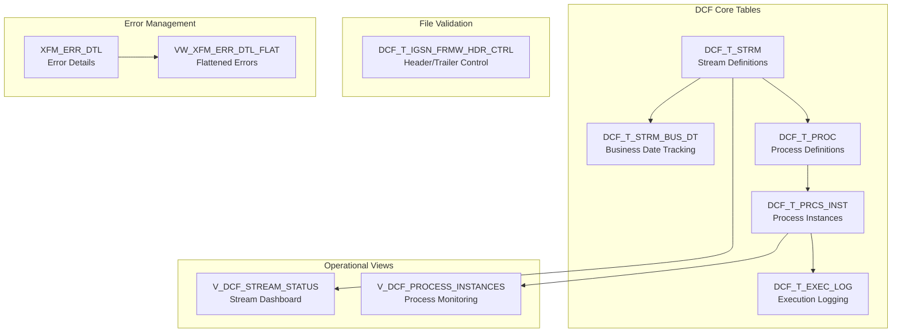

# DCF Schema Definitions - Deployment Guide

## 📋 Overview

This directory contains DDL scripts for the **DCF (Data Control Framework)** that supports the GDW1 DataStage-to-dbt migration project.

## 🎯 Quick Start - Single Script Deployment

### **Recommended Approach: Use Consolidated Script**

```bash
# Deploy all DCF infrastructure with one command
snowsql -c pupad_svc -f schema_definitions/dcf_ddl.sql
```

**✅ This is the preferred method** - deploys all DCF tables, views, and infrastructure in proper dependency order.

---

## 📁 File Descriptions

### 🎯 **Primary Deployment Script**

| File | Purpose | Status |
|------|---------|--------|
| **`dcf_ddl.sql`** | **🌟 Consolidated DCF deployment script** | **✅ RECOMMENDED** |

**Components Included:**
- ✅ Core DCF tables (streams, processes, logging)
- ✅ IGSN header framework (file validation)
- ✅ Error management tables
- ✅ Process instance tracking
- ✅ Operational views and permissions

### 📚 **Individual Component Scripts**

| File | Purpose | Status |
|------|---------|--------|
| `dcf_schema_init.sql` | Core DCF stream and business date tables | ⚠️ LEGACY |
| `dcf_process_table.sql` | Process configuration and instance tracking | ⚠️ LEGACY |
| `igsn_frmw_schema_init.sql` | Header/trailer validation framework | ⚠️ LEGACY |
| `xfm_err_dtl_ddl.sql` | Transformation error management | ⚠️ LEGACY |

**Note:** Individual scripts are maintained for reference but `dcf_ddl.sql` should be used for deployment.

### 📖 **Reference Scripts**

| File | Purpose |
|------|---------|
| `util_funcs.sql` | UDF functions for date validation |
| `td_table_ddl.sql` | Teradata target table structures |
| `csel4_CSE_CPL_BUS_APP.sql` | CSEL4 source table structure |

---

## 🚀 Deployment Instructions

### **Prerequisites**

1. **Snowcli configured** with `pupad_svc` connection
2. **Appropriate permissions** on target database/schema
3. **dbt variables** properly configured in `dbt_project.yml`:
   ```yaml
   vars:
     dcf_database: 'psund_migr_dcf'
     dcf_schema: 'p_d_dcf_001_std_0'
   ```

### **Deployment Steps**

#### **Option 1: Direct Snowflake Deployment (Recommended)**

```bash
# Single command deployment
snowsql -c pupad_svc -f schema_definitions/dcf_ddl.sql
```

#### **Option 2: Via dbt (if dbt template rendering needed)**

```bash
# Compile the script first (renders dbt variables)
dbt compile
# Then deploy the rendered version
# (Note: Rendered scripts would be in target/compiled/)
```

### **Verification**

After deployment, verify all objects were created:

```sql
-- Check table creation
SELECT TABLE_NAME, TABLE_TYPE 
FROM INFORMATION_SCHEMA.TABLES 
WHERE TABLE_SCHEMA = 'P_D_DCF_001_STD_0'
  AND TABLE_NAME LIKE 'DCF_%' OR TABLE_NAME = 'XFM_ERR_DTL'
ORDER BY TABLE_NAME;

-- Check view creation  
SELECT TABLE_NAME as VIEW_NAME
FROM INFORMATION_SCHEMA.VIEWS 
WHERE TABLE_SCHEMA = 'P_D_DCF_001_STD_0'
  AND TABLE_NAME LIKE 'V_%' OR TABLE_NAME LIKE 'VW_%'
ORDER BY TABLE_NAME;
```

---

## 📊 **DCF Framework Architecture**

### **Core Components**



### **Key Tables**

| Table | Purpose | Key Fields |
|-------|---------|------------|
| `DCF_T_STRM` | Stream definitions | `STRM_ID`, `STRM_NAME`, `STRM_STATUS` |
| `DCF_T_STRM_BUS_DT` | Business date tracking | `STRM_ID`, `BUS_DT`, `PROCESSING_FLAG` |
| `DCF_T_PROC` | Process configurations | `PROC_ID`, `STRM_ID`, `PROC_NAME` |
| `DCF_T_PRCS_INST` | Process instances | `PRCS_INST_ID`, `PRCS_NAME`, `PRCS_STATUS` |
| `DCF_T_EXEC_LOG` | Execution logging | `LOG_ID`, `STRM_NAME`, `MSG_TYPE` |
| `DCF_T_IGSN_FRMW_HDR_CTRL` | Header validation | `HEADER_TRACKER_ID`, `FEED_NM`, `PROCESSING_STATUS` |
| `XFM_ERR_DTL` | Error management | `ERR_ID`, `STRM_NM`, `ERR_DTLS_JSON` |

---

## 🔧 **Environment Configuration**

### **Development Environment**
```bash
# Use development database
export DBT_DCF_DATABASE="dev_migr_dcf"
export DBT_DCF_SCHEMA="p_d_dcf_001_dev_0"
```

### **Production Environment**
```bash
# Use production database
export DBT_DCF_DATABASE="psund_migr_dcf"
export DBT_DCF_SCHEMA="p_d_dcf_001_std_0"
```

---

## 🆘 **Troubleshooting**

### **Common Issues**

1. **Permission Denied**
   ```sql
   -- Grant necessary permissions
   GRANT USAGE ON DATABASE psund_migr_dcf TO ROLE <your_role>;
   GRANT USAGE ON SCHEMA p_d_dcf_001_std_0 TO ROLE <your_role>;
   ```

2. **Object Already Exists**
   - The script uses `CREATE OR REPLACE` and `CREATE IF NOT EXISTS` for idempotency
   - Safe to re-run multiple times

3. **dbt Variable Not Found**
   - Ensure `dbt_project.yml` has proper variable definitions
   - Check variable names match exactly

### **Support**

For issues with DCF framework deployment:
1. Check the verification queries in `dcf_ddl.sql`
2. Review dbt logs for template rendering errors
3. Verify Snowflake connection and permissions

---

**Generated:** January 2025  
**Framework:** DCF (Data Control Framework)  
**Project:** GDW1 DataStage to dbt Migration
