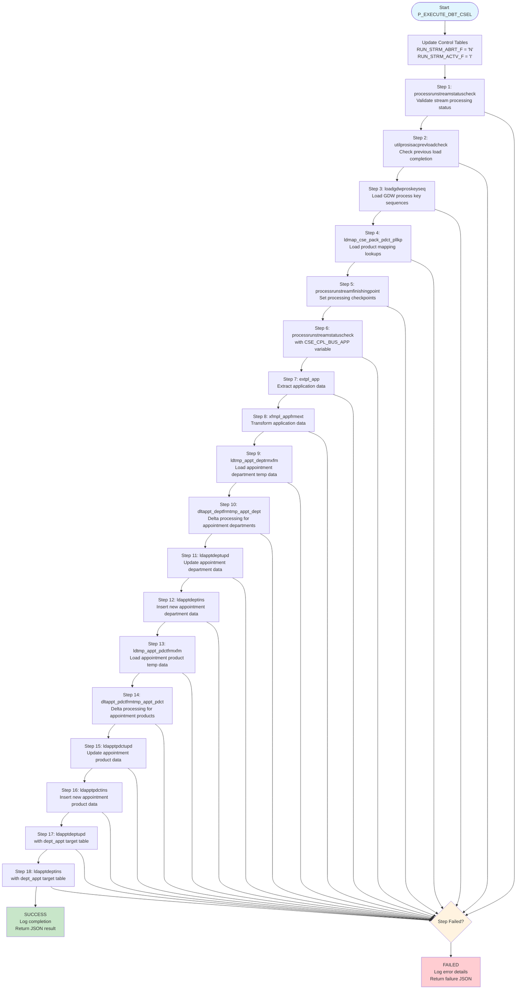
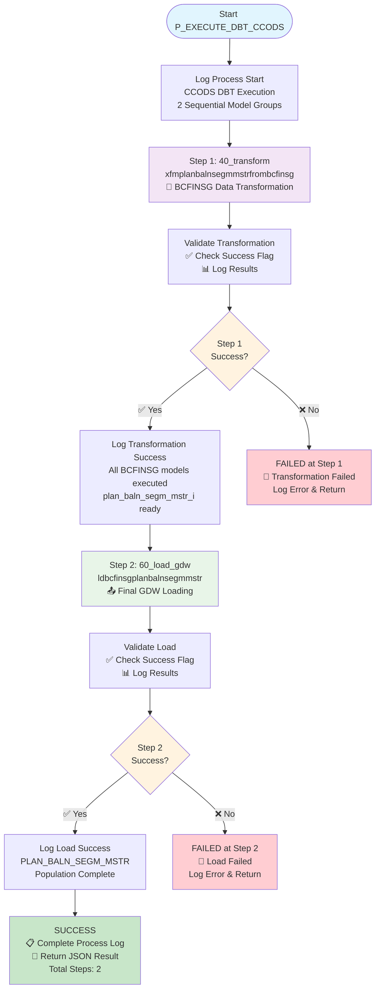
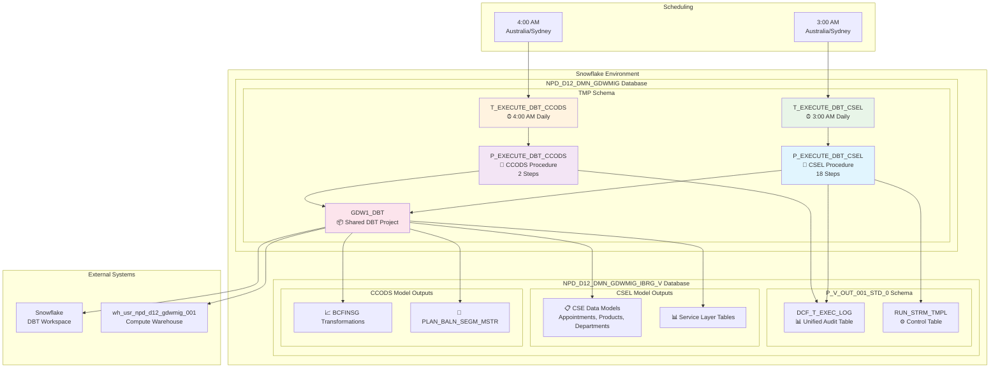
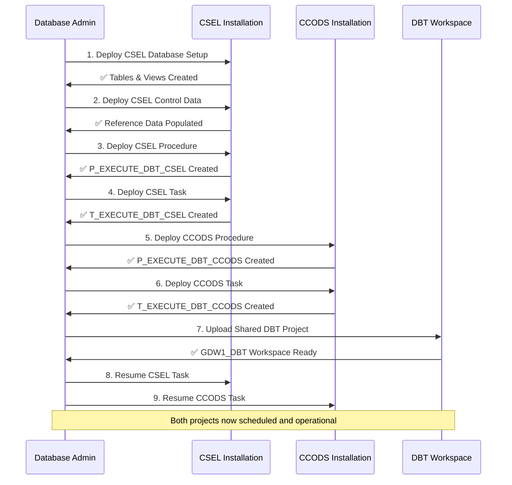
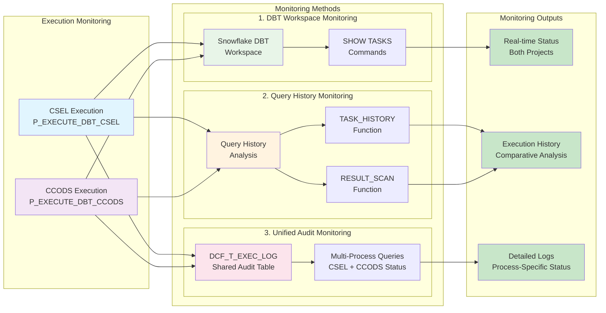

# CSEL & CCODS DBT Projects - Snowflake Deployment Guide

## Overview

This repository contains two complementary data pipeline projects implemented using DBT (Data Build Tool) and deployed within Snowflake:

- **CSEL (Commonwealth Bank Service Layer)**: Processes customer service data, appointments, products, and department information through 18 sequential transformations
- **CCODS (Commonwealth Bank Operations Data System)**: Processes BCFINSG data and populates the PLAN_BALN_SEGM_MSTR table through 2 sequential model groups

Both projects share the same Snowflake infrastructure and deployment framework while serving different business domains.

---

## 🏗️ **CSEL Project**

### Project Structure

```
CSEL/
├── DBT Project/                        # Shared DBT project directory (same as CCODS)
│   ├── models/
│   │   ├── cse_dataload/               # Core data loading models
│   │   │   ├── 02processkey/           # Process key generation
│   │   │   ├── 04MappingLookupSets/    # Mapping and lookup tables
│   │   │   ├── 08extraction/           # Data extraction models
│   │   │   ├── 12MappingTransformation/ # Data transformations
│   │   │   ├── 14loadtotemp/           # Temporary table loading
│   │   │   ├── 16transformdelta/       # Delta transformations
│   │   │   ├── 18loadtogdw/           # Final GDW loading
│   │   │   └── 24processmetadata/      # Process metadata management
│   │   └── appt_pdct/                  # Appointment product models
│   ├── dbt_project.yml                # DBT project configuration
│   └── profiles.yml                   # Connection profiles
├── NPW DBT - Pre-Installation Scripts/ # Deployment scripts
│   ├── CSEL01-Pre-Installation Script.sql      # Database setup and table creation
│   ├── CSEL02-Installing NPW DBT - Control Data.sql # Control data population
│   ├── CSEL04-Execute_DBT_Procedure.sql # Main execution procedure
│   └── CSEL05-Task_Execute_DBT_CSEL.sql # Orchestration task
└── README.md                          # This file
```

### CSEL Execution Framework

**Procedure**: `NPD_D12_DMN_GDWMIG.TMP.P_EXECUTE_DBT_CSEL()`  
**Task**: `NPD_D12_DMN_GDWMIG.TMP.T_EXECUTE_DBT_CSEL`  
**Schedule**: Daily at 3:00 AM Australia/Sydney

#### CSEL Execution Flow (18 Steps)



---

## 🏗️ **CCODS Project**

### Project Structure

```
CCODS/
├── DBT Project/                       # Shared DBT project directory (same as CSEL)
│   ├── models/
│   │   ├── ccods/                      # CCODS-specific models
│   │   │   ├── 40_transform/           # Data transformation layer
│   │   │   │   └── xfmplanbalnsegmmstrfrombcfinsg/ # BCFINSG transformations
│   │   │   └── 60_load_gdw/           # GDW loading layer
│   │   │       └── ldbcfinsgplanbalnsegmmstr/      # Final table loading
│   │   ├── cse_dataload/              # Shared CSE data loading models
│   │   └── appt_pdct/                 # Shared appointment product models
│   ├── dbt_project.yml               # DBT project configuration
│   └── profiles.yml                  # Connection profiles
├── Pre-Installation Scripts/          # Deployment scripts
│   ├── CCODS02-Execute_DBT_CCODS_Procedure.sql # Main execution procedure
│   └── CCODS03-Task_Execute_DBT_CCODS.sql      # Orchestration task
├── Analysis & Debug Files/           # Troubleshooting resources
│   ├── Debug_Data_Flow_Tracing.sql  # Data lineage tracing
│   ├── Process_Key_Fix_Analysis.sql # Process key debugging
│   └── Corrected_DEPT_APPT_MERGE.sql # MERGE statement fixes
└── README.md                        # This file
```

### CCODS Execution Framework

**Procedure**: `NPD_D12_DMN_GDWMIG.TMP.P_EXECUTE_DBT_CCODS()`  
**Task**: `NPD_D12_DMN_GDWMIG.TMP.T_EXECUTE_DBT_CCODS`  
**Schedule**: Daily at 4:00 AM Australia/Sydney (1 hour after CSEL)

#### CCODS Execution Flow (2 Steps)



#### CCODS Model Details

**Step 1: Data Transformation (40_transform)**
- **Path**: `models/ccods/40_transform/xfmplanbalnsegmmstrfrombcfinsg/`
- **Purpose**: Transform raw BCFINSG data into structured format
- **Output**: Prepared data for plan balance segment master processing
- **Key Models**: 
  - `bcfinsg__xfmplanbalnsegmmstrfrombcfinsg.sql` (root data extraction)
  - Data validation and cleansing transformations

**Step 2: GDW Loading (60_load_gdw)**
- **Path**: `models/ccods/60_load_gdw/ldbcfinsgplanbalnsegmmstr/`
- **Purpose**: Load transformed data into final GDW table
- **Target Table**: `PLAN_BALN_SEGM_MSTR`
- **Output**: Populated production table ready for consumption

---

## 🏛️ **Shared Infrastructure**

### Snowflake Database Structure



### Deployment Configuration

- **Primary Database**: `NPD_D12_DMN_GDWMIG`
- **Schema**: `TMP`
- **Shared DBT Project**: `GDW1_DBT`
- **Models Database**: `NPD_D12_DMN_GDWMIG_IBRG_V`
- **Compute Warehouse**: `wh_usr_npd_d12_gdwmig_001`

---

## 📋 **Pre-Installation Scripts**

### CSEL Pre-Installation

1. **CSEL01-Pre-Installation Script.sql**
   - Creates required database objects and tables
   - Sets up views for APPT_DEPT, APPT_PDCT, and other core entities
   - Creates UTIL_PROS_ISAC and control tables
   - Initializes sample data structures for testing

2. **CSEL02-Installing NPW DBT - Control Data.sql**
   - Populates control tables with required reference data
   - Inserts stream template entries for CSE processes
   - Sets up ETL processing dates and stream configurations
   - Creates sample step occurrence data for validation

3. **CSEL04-Execute_DBT_Procedure.sql**
   - Creates `P_EXECUTE_DBT_CSEL()` stored procedure
   - Implements 18-step sequential execution logic
   - Comprehensive error handling and logging

4. **CSEL05-Task_Execute_DBT_CSEL.sql**
   - Creates `T_EXECUTE_DBT_CSEL` scheduled task
   - Daily execution at 3:00 AM Australia/Sydney
   - Prevents overlapping executions

### CCODS Pre-Installation

1. **CCODS02-Execute_DBT_CCODS_Procedure.sql**
   - Creates `P_EXECUTE_DBT_CCODS()` stored procedure
   - Implements 2-step sequential execution logic
   - Focused on BCFINSG data processing

2. **CCODS03-Task_Execute_DBT_CCODS.sql**
   - Creates `T_EXECUTE_DBT_CCODS` scheduled task
   - Daily execution at 4:00 AM Australia/Sydney (after CSEL)
   - Prevents overlapping executions

### Installation Order



---

## 📊 **Monitoring and Troubleshooting**

### Unified Monitoring Methods



### Monitoring Queries

#### A. Task Status Monitoring
```sql
-- Monitor both CSEL and CCODS tasks
SHOW TASKS LIKE '%EXECUTE_DBT%' IN SCHEMA NPD_D12_DMN_GDWMIG.TMP;
```

#### B. Execution History Monitoring
```sql
-- Monitor both task execution histories
SELECT 
    TASK_NAME,
    QUERY_ID, 
    STATE, 
    QUERY_START_TIME, 
    QUERY_END_TIME,
    TOTAL_ELAPSED_TIME,
    ERROR_CODE,
    ERROR_MESSAGE
FROM TABLE(NPD_D12_DMN_GDWMIG.INFORMATION_SCHEMA.TASK_HISTORY()) A
WHERE TASK_NAME IN ('T_EXECUTE_DBT_CSEL', 'T_EXECUTE_DBT_CCODS')
  AND SCHEMA_NAME = 'TMP'
ORDER BY A.QUERY_START_TIME DESC;
```

#### C. Unified Audit Monitoring
```sql
-- Monitor recent executions for both processes
SELECT 
    PRCS_NAME,
    STRM_NAME,
    STEP_STATUS,
    MESSAGE_TYPE,
    MESSAGE_TEXT,
    CREATED_TS,
    SESSION_ID,
    WAREHOUSE_NAME
FROM NPD_D12_DMN_GDWMIG_IBRG_V.P_V_OUT_001_STD_0.DCF_T_EXEC_LOG
WHERE PRCS_NAME IN ('P_EXECUTE_DBT_CSEL', 'P_EXECUTE_DBT_CCODS')
ORDER BY CREATED_TS DESC;

-- Monitor failed executions for both processes
SELECT 
    PRCS_NAME,
    STRM_NAME,
    STEP_STATUS,
    MESSAGE_TEXT,
    CREATED_TS
FROM NPD_D12_DMN_GDWMIG_IBRG_V.P_V_OUT_001_STD_0.DCF_T_EXEC_LOG
WHERE PRCS_NAME IN ('P_EXECUTE_DBT_CSEL', 'P_EXECUTE_DBT_CCODS')
  AND STEP_STATUS = 'FAILED'
ORDER BY CREATED_TS DESC;
```

#### D. Process Comparison Dashboard
```sql
-- Compare execution patterns between CSEL and CCODS
SELECT 
    PRCS_NAME,
    DATE(CREATED_TS) as EXECUTION_DATE,
    COUNT(*) as TOTAL_STEPS,
    SUM(CASE WHEN STEP_STATUS = 'COMPLETED' THEN 1 ELSE 0 END) as SUCCESSFUL_STEPS,
    SUM(CASE WHEN STEP_STATUS = 'FAILED' THEN 1 ELSE 0 END) as FAILED_STEPS,
    MIN(CREATED_TS) as START_TIME,
    MAX(CREATED_TS) as END_TIME,
    DATEDIFF('minute', MIN(CREATED_TS), MAX(CREATED_TS)) as DURATION_MINUTES
FROM NPD_D12_DMN_GDWMIG_IBRG_V.P_V_OUT_001_STD_0.DCF_T_EXEC_LOG
WHERE PRCS_NAME IN ('P_EXECUTE_DBT_CSEL', 'P_EXECUTE_DBT_CCODS')
  AND CREATED_TS >= CURRENT_DATE - 7  -- Last 7 days
GROUP BY PRCS_NAME, DATE(CREATED_TS)
ORDER BY EXECUTION_DATE DESC, PRCS_NAME;
```

---

## 🔧 **Maintenance and Operations**

### Manual Execution

#### CSEL Manual Execution
```sql
CALL NPD_D12_DMN_GDWMIG.TMP.P_EXECUTE_DBT_CSEL();
```

#### CCODS Manual Execution
```sql
CALL NPD_D12_DMN_GDWMIG.TMP.P_EXECUTE_DBT_CCODS();
```

### Task Management

#### Suspend Tasks
```sql
-- Suspend CSEL task
ALTER TASK NPD_D12_DMN_GDWMIG.TMP.T_EXECUTE_DBT_CSEL SUSPEND;

-- Suspend CCODS task
ALTER TASK NPD_D12_DMN_GDWMIG.TMP.T_EXECUTE_DBT_CCODS SUSPEND;
```

#### Resume Tasks
```sql
-- Resume CSEL task
ALTER TASK NPD_D12_DMN_GDWMIG.TMP.T_EXECUTE_DBT_CSEL RESUME;

-- Resume CCODS task
ALTER TASK NPD_D12_DMN_GDWMIG.TMP.T_EXECUTE_DBT_CCODS RESUME;
```

#### Modify Schedules
```sql
-- Modify CSEL schedule
ALTER TASK NPD_D12_DMN_GDWMIG.TMP.T_EXECUTE_DBT_CSEL 
SET SCHEDULE = 'USING CRON 0 2 * * * Australia/Sydney';

-- Modify CCODS schedule  
ALTER TASK NPD_D12_DMN_GDWMIG.TMP.T_EXECUTE_DBT_CCODS 
SET SCHEDULE = 'USING CRON 0 5 * * * Australia/Sydney';
```

---

## 🚨 **Troubleshooting Guide**

### Common Issues

#### CSEL-Specific Issues
1. **Step Failure in 18-step process**: Check `DCF_T_EXEC_LOG` for specific step details
2. **CSE_CPL_BUS_APP data issues**: Validate source data quality and stream status
3. **Appointment/Department data inconsistencies**: Review transformation logic in steps 7-18

#### CCODS-Specific Issues
1. **BCFINSG transformation failure**: Check Step 1 logs for data validation errors
2. **PLAN_BALN_SEGM_MSTR load failure**: Review Step 2 for target table issues
3. **Data reconciliation problems**: Use provided debug scripts for analysis

#### Shared Infrastructure Issues
1. **Task Not Running**: Verify task status and warehouse availability
2. **DBT Model Errors**: Review individual model logs in DBT workspace
3. **Permission Issues**: Ensure proper database and schema access rights
4. **Resource Contention**: Monitor warehouse usage during peak execution times

### Debug Resources

The CCODS project includes specialized debugging tools:
- `Debug_Data_Flow_Tracing.sql`: Trace data lineage through transformations
- `Process_Key_Fix_Analysis.sql`: Analyze and fix process key generation issues
- `Corrected_DEPT_APPT_MERGE.sql`: Reference for proper temporal table MERGE logic

---

## 📈 **Performance Optimization**

### Execution Timing
- **CSEL**: 3:00 AM (18 steps)
- **CCODS**: 4:00 AM (2 steps)
- **Gap**: 1-hour buffer prevents resource conflicts

### Resource Management
- **Shared Warehouse**: `wh_usr_npd_d12_gdwmig_001`
- **Overlap Prevention**: Both tasks configured with `ALLOW_OVERLAPPING_EXECUTION = FALSE`
- **Sequential Execution**: CCODS starts after CSEL completion window


