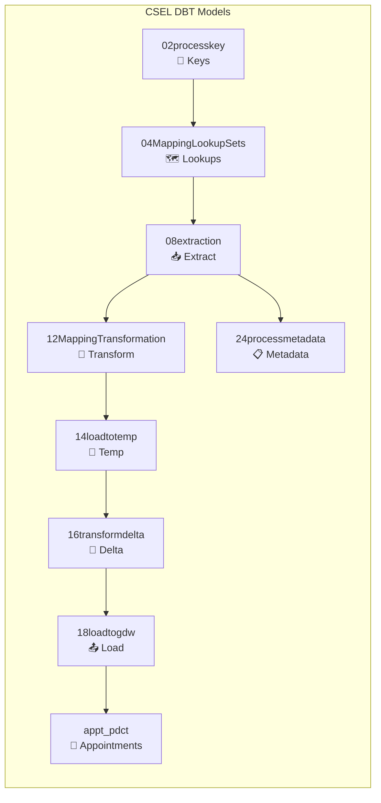

# CSEL DBT Project - Modified Version

This is the modified version of the CSEL (Commonwealth Bank Service Layer) DBT project configured for Snowflake deployment.

## Project Overview

## Key Configuration

- **Project Name**: `np_projects_commbank_sf_dbt`
- **Target Database**: `NPD_D12_DMN_GDWMIG_IBRG_V`
- **Materialization**: Views (default)
- **Execution**: Via Snowflake stored procedure `P_EXECUTE_DBT_CSEL`

## Model Categories

| Directory | Purpose | Description |
|-----------|---------|-------------|
| `02processkey` | 🔑 Keys | Process key generation and management |
| `04MappingLookupSets` | 🗺️ Lookups | Mapping tables and lookup sets |
| `08extraction` | 📥 Extract | Data extraction from source systems |
| `12MappingTransformation` | 🔄 Transform | Data transformation and business rules |
| `14loadtotemp` | 📝 Temp | Load data to temporary staging tables |
| `16transformdelta` | 🔺 Delta | Delta processing and change capture |
| `18loadtogdw` | 📤 Load | Final load to GDW target tables |
| `24processmetadata` | 📋 Metadata | Process metadata and control logic |
| `appt_pdct` | 📅 Appointments | Appointment and product specific models |

## Deployment

This project is deployed via:
1. **Snowflake Workspace**: `NPD_D12_DMN_GDWMIG.TMP.GDW1_DBT`
2. **Stored Procedure**: `NPD_D12_DMN_GDWMIG.TMP.P_EXECUTE_DBT_CSEL()`
3. **Scheduled Task**: `NPD_D12_DMN_GDWMIG.TMP.T_EXECUTE_DBT_CSEL`

## Usage

The models are executed sequentially through the stored procedure. Do not run individual models directly unless for development/testing purposes.

### Resources:
- [Main CSEL Documentation](../README.md)
- [DBT Documentation](https://docs.getdbt.com/docs/introduction)
- [Snowflake DBT Integration](https://docs.snowflake.com/en/user-guide/dbt)
