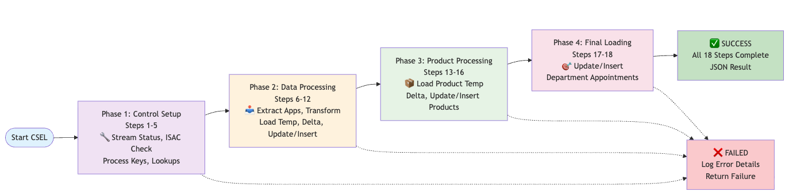
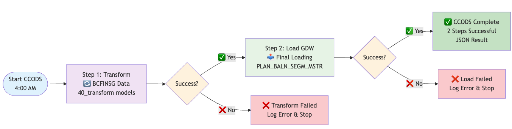
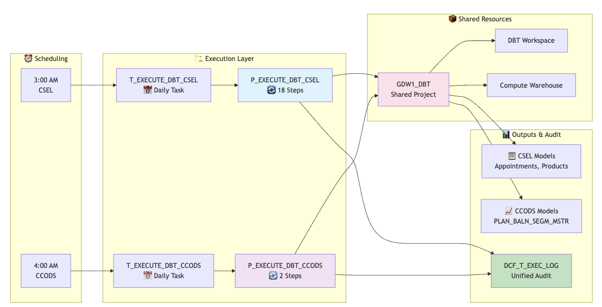
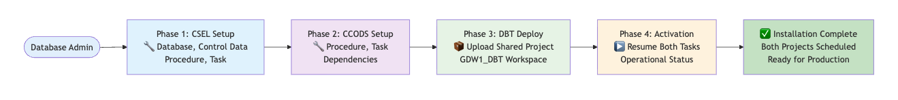

# CSEL & CCODS DBT Projects - Static Images Version

## Overview

This repository contains two complementary data pipeline projects implemented using DBT (Data Build Tool) and deployed within Snowflake:

- **CSEL (Commonwealth Bank Service Layer)**: Processes customer service data, appointments, products, and department information through 18 sequential transformations
- **CCODS (Commonwealth Bank Operations Data System)**: Processes BCFINSG data and populates the PLAN_BALN_SEGM_MSTR table through 2 sequential model groups

Both projects share the same Snowflake infrastructure and deployment framework while serving different business domains.

---

## 🏗️ **CSEL Project**

### CSEL Execution Flow (18 Steps)



*The CSEL process executes 18 sequential steps starting at 3:00 AM Australia/Sydney, including control setup, data processing, product processing, and final loading phases.*

**Key Phases:**
- **Steps 1-5**: Control Setup (Stream Status, ISAC Check, Process Keys, Lookups, Finishing Point)
- **Steps 6-12**: Data Processing (Extract, Transform, Load to Temp, Delta Processing, Update/Insert)
- **Steps 13-16**: Product Processing (Load Product Temp, Delta, Update, Insert)
- **Steps 17-18**: Final Loading (Update/Insert Department Appointment Data)

---

## 🏗️ **CCODS Project**

### CCODS Execution Flow (2 Steps)



*The CCODS process executes 2 sequential steps starting at 4:00 AM Australia/Sydney, one hour after CSEL completion.*

**Process Steps:**
- **Step 1**: Transform BCFINSG Data (`models/ccods/40_transform/`)
- **Step 2**: Load to GDW (`models/ccods/60_load_gdw/`) → Populates `PLAN_BALN_SEGM_MSTR`

---

## 🏛️ **Shared Infrastructure**

### Snowflake Database Structure



*Complete Snowflake environment showing both databases, schemas, procedures, tasks, and external systems.*

**Key Components:**
- **NPD_D12_DMN_GDWMIG Database** (TMP Schema)
  - Procedures: `P_EXECUTE_DBT_CSEL`, `P_EXECUTE_DBT_CCODS`
  - Tasks: `T_EXECUTE_DBT_CSEL` (3:00 AM), `T_EXECUTE_DBT_CCODS` (4:00 AM)
  - Shared Project: `GDW1_DBT`

- **NPD_D12_DMN_GDWMIG_IBRG_V Database** (P_V_OUT_001_STD_0 Schema)
  - Audit: `DCF_T_EXEC_LOG` (Unified audit for both processes)
  - Control: `RUN_STRM_TMPL` (Stream management)
  - Model Outputs: CSEL and CCODS generated tables/views

- **External Systems**
  - Snowflake DBT Workspace
  - Compute Warehouse: `wh_usr_npd_d12_gdwmig_001`

---

## 📊 **Monitoring and Troubleshooting**

### Monitoring Methods


*Comprehensive monitoring approach covering execution processes, monitoring methods, and output types.*

**Monitoring Layers:**

1. **DBT Workspace Monitoring**
   - Real-time task status via `SHOW TASKS` commands
   - Direct workspace visibility

2. **Query History Monitoring**
   - `TASK_HISTORY()` function for execution history
   - `RESULT_SCAN()` function for detailed results
   - Historical analysis and trends

3. **Unified Audit Monitoring**
   - `DCF_T_EXEC_LOG` table for both CSEL and CCODS
   - Multi-process status queries
   - Detailed process-specific logging

---

## 🔧 **Installation Sequence**

### Installation Flow



*Step-by-step installation process from database setup through operational deployment.*

**Installation Steps:**

1. **CSEL Database Setup** → ✅ Tables & Views Created
2. **CSEL Control Data** → ✅ Reference Data Populated  
3. **CSEL Procedure** → ✅ P_EXECUTE_DBT_CSEL Created
4. **CSEL Task** → ✅ T_EXECUTE_DBT_CSEL Created
5. **CCODS Procedure** → ✅ P_EXECUTE_DBT_CCODS Created
6. **CCODS Task** → ✅ T_EXECUTE_DBT_CCODS Created
7. **Shared DBT Project** → ✅ GDW1_DBT Workspace Ready
8. **Resume CSEL Task** → ✅ Operational
9. **Resume CCODS Task** → ✅ Both Projects Operational

---

## 📁 **Image Files**

All diagram images are stored in the `images/` directory:

```
images/
├── csel_execution_flow.png          # CSEL 18-step process flow
├── ccods_execution_flow.png         # CCODS 2-step process flow  
├── snowflake_infrastructure.png     # Complete infrastructure diagram
├── monitoring_methods.png           # Monitoring approach overview
├── installation_sequence.png        # Step-by-step installation
├── csel_execution_flow.svg          # Vector version (scalable)
├── ccods_execution_flow.svg         # Vector version (scalable)
├── snowflake_infrastructure.svg     # Vector version (scalable)
├── monitoring_methods.svg           # Vector version (scalable)
└── installation_sequence.svg        # Vector version (scalable)
```

## 🎨 **Creating Static Images**

To create these static images:

1. **From Draw.io**: 
   - Open the XML files in `../diagrams/`
   - Export as PNG (raster) or SVG (vector)
   - Save to `images/` directory

2. **From Graphviz**:
   ```bash
   dot -Tpng execution_flow.dot -o images/execution_flow.png
   dot -Tsvg execution_flow.dot -o images/execution_flow.svg
   ```

3. **From PlantUML**:
   - Use online PlantUML server
   - Export as PNG or SVG
   - Download to `images/` directory

4. **From Mermaid**:
   - Use Mermaid Live Editor (https://mermaid.live/)
   - Export as PNG or SVG
   - Save to `images/` directory

---

## 💡 **Benefits of Static Images**

- **Universal Compatibility**: Works in all Git viewers, documentation systems
- **Professional Appearance**: High-quality visuals for presentations
- **Fast Loading**: No rendering required, immediate display
- **Offline Access**: Available without internet connection
- **Print Friendly**: Suitable for printed documentation

## ⚠️ **Considerations**

- **File Size**: PNG files can be large, use SVG when possible
- **Version Control**: Binary files don't show diffs effectively
- **Maintenance**: Manual updates required when processes change
- **Accessibility**: Include alt text for screen readers

---

*This README demonstrates static image integration with comprehensive fallback documentation. Images provide immediate visual clarity while maintaining universal compatibility.* 