# CSEL DBT Project - Snowflake Deployment Guide

## Overview

The CSEL (Commonwealth Bank Service Layer) project is a data pipeline implemented using DBT (Data Build Tool) and deployed within Snowflake. This project processes customer service data, appointments, products, and department information through a series of sequential transformations.

## Project Structure

```
CSEL/
├── NPW DBT Project - Modified/          # Main DBT project directory
│   ├── models/
│   │   ├── cse_dataload/               # Core data loading models
│   │   │   ├── 02processkey/           # Process key generation
│   │   │   ├── 04MappingLookupSets/    # Mapping and lookup tables
│   │   │   ├── 08extraction/           # Data extraction models
│   │   │   ├── 12MappingTransformation/ # Data transformations
│   │   │   ├── 14loadtotemp/           # Temporary table loading
│   │   │   ├── 16transformdelta/       # Delta transformations
│   │   │   ├── 18loadtogdw/           # Final GDW loading
│   │   │   └── 24processmetadata/      # Process metadata management
│   │   └── appt_pdct/                  # Appointment product models
│   ├── dbt_project.yml                # DBT project configuration
│   └── profiles.yml                   # Connection profiles
├── NPW DBT - Pre-Installation Scripts/ # Deployment scripts
│   ├── NPW04-Execute_DBT_Procedure.sql # Main execution procedure
│   └── NPW05-Task_Execute_DBT_CSEL.sql # Orchestration task
└── README.md                          # This file
```

## Deployment Architecture

### 1. Snowflake Database Structure


- **Primary Database**: `NPD_D12_DMN_GDWMIG`
- **Schema**: `TMP`
- **DBT Project Name**: `GDW1_DBT`
- **Models Database**: `NPD_D12_DMN_GDWMIG_IBRG_V` (materialized views and tables)

### 2. DBT Project Deployment

The DBT project is deployed to Snowflake Workspaces using the following configuration:

```yaml
# From dbt_project.yml
name: 'np_projects_commbank_sf_dbt'
profile: 'np_projects_commbank_sf_dbt'
models:
  np_projects_commbank_sf_dbt:
    +materialized: view
    +database: NPD_D12_DMN_GDWMIG_IBRG_V
```

#### Deployment Steps:
1. Upload the `NPW DBT Project - Modified` directory to Snowflake Workspaces
2. Configure the DBT project to use the `NPD_D12_DMN_GDWMIG.TMP.GDW1_DBT` workspace
3. Deploy the pre-installation scripts to create the execution infrastructure

## Execution Framework

### 3. Main Execution Procedure

**Location**: `NPW04-Execute_DBT_Procedure.sql`  
**Procedure Name**: `NPD_D12_DMN_GDWMIG.TMP.P_EXECUTE_DBT_CSEL()`

This stored procedure orchestrates the execution of 18 sequential DBT model steps:


#### Execution Steps:
1. **processrunstreamstatuscheck** - Validates stream processing status
2. **utilprosisacprevloadcheck** - Checks previous load completion
3. **loadgdwproskeyseq** - Loads GDW process key sequences
4. **ldmap_cse_pack_pdct_pllkp** - Loads product mapping lookups
5. **processrunstreamfinishingpoint** - Sets processing checkpoints
6. **processrunstreamstatuscheck** (with CSE_CPL_BUS_APP variable)
7. **extpl_app** - Extracts application data
8. **xfmpl_appfrmext** - Transforms application data from extraction
9. **ldtmp_appt_deptrmxfm** - Loads appointment department temp data
10. **dltappt_deptfrmtmp_appt_dept** - Delta processing for appointment departments
11. **ldapptdeptupd** - Updates appointment department data
12. **ldapptdeptins** - Inserts new appointment department data
13. **ldtmp_appt_pdctfrmxfm** - Loads appointment product temp data
14. **dltappt_pdctfrmtmp_appt_pdct** - Delta processing for appointment products
15. **ldapptpdctupd** - Updates appointment product data
16. **ldapptpdctins** - Inserts new appointment product data
17. **ldapptdeptupd** (with dept_appt target table)
18. **ldapptdeptins** (with dept_appt target table)

#### Key Features:
- **Error Handling**: Each step includes comprehensive error handling with detailed logging
- **Progress Tracking**: JSON-based result tracking with step-by-step status
- **Rollback Capability**: Failed steps prevent further execution and log detailed error information
- **Flexible Execution**: Some steps include dynamic variables for different target tables

### 4. Task Orchestration

**Location**: `NPW05-Task_Execute_DBT_CSEL.sql`  
**Task Name**: `NPD_D12_DMN_GDWMIG.TMP.T_EXECUTE_DBT_CSEL`

#### Task Configuration:
```sql
CREATE OR REPLACE TASK NPD_D12_DMN_GDWMIG.TMP.T_EXECUTE_DBT_CSEL
    WAREHOUSE = wh_usr_npd_d12_gdwmig_001
    SCHEDULE = 'USING CRON 0 3 * * * Australia/Sydney'
    ALLOW_OVERLAPPING_EXECUTION = FALSE
AS
    CALL NPD_D12_DMN_GDWMIG.TMP.P_EXECUTE_DBT_CSEL();
```

- **Schedule**: Daily execution at 3:00 AM Australia/Sydney timezone
- **Warehouse**: Dedicated warehouse for consistent resource allocation
- **Overlap Prevention**: Ensures only one instance runs at a time

## Monitoring and Troubleshooting

### 5. Monitoring Methods


#### A. DBT Project Monitoring
Monitor execution directly from the Snowflake DBT Workspace:
```sql
-- View active DBT executions
SHOW TASKS IN SCHEMA NPD_D12_DMN_GDWMIG.TMP;
```

#### B. Query History Monitoring
```sql
-- Monitor task execution history
SELECT QUERY_ID, STATE, QUERY_START_TIME, *
FROM TABLE(NPD_D12_DMN_GDWMIG.INFORMATION_SCHEMA.TASK_HISTORY(
    TASK_NAME => 'T_EXECUTE_DBT_CSEL'
)) A
WHERE SCHEMA_NAME = 'TMP'
ORDER BY A.QUERY_START_TIME DESC;

-- View specific execution results
SELECT * FROM TABLE(RESULT_SCAN('<QUERY_ID>'));
```

#### C. Audit Table Monitoring
**Primary Logging Table**: `NPD_D12_DMN_GDWMIG_IBRG_V.P_V_OUT_001_STD_0.DCF_T_EXEC_LOG`

```sql
-- Monitor recent executions
SELECT 
    PRCS_NAME,
    STRM_NAME,
    STEP_STATUS,
    MESSAGE_TYPE,
    MESSAGE_TEXT,
    CREATED_TS,
    SESSION_ID,
    WAREHOUSE_NAME
FROM NPD_D12_DMN_GDWMIG_IBRG_V.P_V_OUT_001_STD_0.DCF_T_EXEC_LOG
WHERE PRCS_NAME = 'P_EXECUTE_DBT_CSEL'
ORDER BY CREATED_TS DESC;

-- Monitor failed executions
SELECT *
FROM NPD_D12_DMN_GDWMIG_IBRG_V.P_V_OUT_001_STD_0.DCF_T_EXEC_LOG
WHERE PRCS_NAME = 'P_EXECUTE_DBT_CSEL'
  AND STEP_STATUS = 'FAILED'
ORDER BY CREATED_TS DESC;
```

### 6. Execution Results

The procedure returns a JSON object containing:
- `total_steps`: Number of completed steps
- `final_status`: SUCCESS, FAILED, or EXCEPTION
- `completed_at`: Timestamp of completion (for successful runs)
- `failed_at_step`: Step number where failure occurred (for failed runs)
- `steps`: Array of individual step results with timestamps and status

#### Example Success Result:
```json
{
  "total_steps": 18,
  "final_status": "SUCCESS",
  "completed_at": "2024-01-15 03:45:32.123",
  "steps": [...]
}
```

#### Example Failure Result:
```json
{
  "total_steps": 7,
  "final_status": "FAILED",
  "failed_at_step": 7,
  "steps": [...]
}
```

## Maintenance and Operations

### 7. Manual Execution
To manually execute the procedure:
```sql
CALL NPD_D12_DMN_GDWMIG.TMP.P_EXECUTE_DBT_CSEL();
```

### 8. Task Management
```sql
-- Suspend the task
ALTER TASK NPD_D12_DMN_GDWMIG.TMP.T_EXECUTE_DBT_CSEL SUSPEND;

-- Resume the task
ALTER TASK NPD_D12_DMN_GDWMIG.TMP.T_EXECUTE_DBT_CSEL RESUME;

-- Modify task schedule
ALTER TASK NPD_D12_DMN_GDWMIG.TMP.T_EXECUTE_DBT_CSEL 
SET SCHEDULE = 'USING CRON 0 4 * * * Australia/Sydney';
```

### 9. Control Tables
The procedure updates control tables to manage stream processing:
```sql
-- Stream control update (executed at procedure start)
UPDATE NPD_D12_DMN_GDWMIG_IBRG_V.P_V_OUT_001_STD_0.RUN_STRM_TMPL 
SET RUN_STRM_ABRT_F = 'N', RUN_STRM_ACTV_F = 'I' 
WHERE RUN_STRM_C IN ('CSE_L4_PRE_PROC','CSE_CPL_BUS_APP') 
  AND SYST_C = 'CSEL4';
```

## Database Structure & Model Relationships

The following diagram shows the database structure and relationships between different components:

```mermaid
graph TB
    subgraph "Database Structure"
        subgraph "NPD_D12_DMN_GDWMIG"
            subgraph "TMP Schema"
                PROC2[P_EXECUTE_DBT_CSEL<br/>Stored Procedure]
                TASK2[T_EXECUTE_DBT_CSEL<br/>Scheduled Task]
                DBT2[GDW1_DBT<br/>DBT Project]
            end
        end
        
        subgraph "NPD_D12_DMN_GDWMIG_IBRG_V"
            subgraph "P_V_OUT_001_STD_0"
                LOG2[DCF_T_EXEC_LOG<br/>📊 Audit Logs]
                CTRL2[RUN_STRM_TMPL<br/>⚙️ Control Table]
            end
            
            subgraph "Model Outputs"
                PROC_KEY[02processkey<br/>🔑 Process Keys]
                MAPPING[04MappingLookupSets<br/>🗺️ Lookups]
                EXTRACT[08extraction<br/>📥 Data Extraction]
                TRANSFORM[12MappingTransformation<br/>🔄 Transformations]
                TEMP[14loadtotemp<br/>📝 Temp Tables]
                DELTA[16transformdelta<br/>🔺 Delta Processing]
                LOAD[18loadtogdw<br/>📤 Final Load]
                META[24processmetadata<br/>📋 Metadata]
                APPT[appt_pdct<br/>📅 Appointments]
            end
        end
    end
    
    TASK2 --> PROC2
    PROC2 --> DBT2
    PROC2 --> LOG2
    PROC2 --> CTRL2
    
    DBT2 --> PROC_KEY
    DBT2 --> MAPPING
    DBT2 --> EXTRACT
    DBT2 --> TRANSFORM
    DBT2 --> TEMP
    DBT2 --> DELTA
    DBT2 --> LOAD
    DBT2 --> META
    DBT2 --> APPT
    
    style PROC2 fill:#e1f5fe
    style TASK2 fill:#f3e5f5
    style DBT2 fill:#e8f5e8
    style LOG2 fill:#fff3e0
    style CTRL2 fill:#fce4ec
```



## Troubleshooting Guide

### Common Issues:
1. **Step Failure**: Check the `DCF_T_EXEC_LOG` table for detailed error messages
2. **Task Not Running**: Verify task status with `SHOW TASKS` and check warehouse availability
3. **DBT Model Errors**: Review individual model logs in the DBT workspace
4. **Permission Issues**: Ensure proper database and schema access rights

### Support Contacts:
- **Database Team**: For Snowflake infrastructure issues
- **ETL Team**: For data processing and transformation issues
- **Business Team**: For data validation and business logic questions

---

*Last Updated: [Current Date]*
*Version: 1.0*

