# FRAUMD Warehouses: Usage Analysis & Optimization Guide

## 🧭 Quick Navigation
- [📋 Overview](#overview)
- [📚 Definitions](#definitions)
  - [Warehouse Type Definitions](#warehouse-type-definitions)
  - [Query Sizing Band Definitions](#query-sizing-band-definitions)
- [🏗️ Current State Setup](#current-state-setup)
- [📊 Findings](#findings)
- [🎯 Recommendations](#recommendations)
- [🌳 Warehouse Selection Guidelines](#warehouse-selection-guidelines)
- [📋 Appendix](#appendix)

---

## 📋 Overview

This comprehensive analysis examines the usage patterns, performance characteristics, and cost efficiency of four FRAUMD warehouses over the past two months. The primary objective is to identify optimization opportunities, resolve configuration mismatches, and provide actionable recommendations for improving warehouse utilization and reducing operational costs.

**Key Objectives:**
- **Identify Misconfigurations:** Detect warehouses running inappropriate workloads for their size and type
- **Optimize Cost Efficiency:** Recommend right-sizing and workload redistribution strategies
- **Improve Performance:** Eliminate bottlenecks and enhance query execution patterns
- **Establish Best Practices:** Provide decision frameworks for future warehouse selection and management

**Analysis Scope:**
- **Analysis Period:** Last 2 months  
- **Warehouses Analyzed:** 4 FRAUMD warehouses

---

## 📚 Definitions

### Warehouse Type Definitions

| **Warehouse Type** | **Purpose** | **Compute Characteristics** | **Best For** | **Memory Options** |
|-------------------|-------------|------------------------------|--------------|-------------------|
| **Standard** | General-purpose SQL operations (SELECT, INSERT, UPDATE, CTAS) | Balanced CPU and memory allocation | Traditional data analytics, ETL operations, reporting | Standard allocation |
| **High Memory** | Memory-intensive operations requiring large working sets | Enhanced memory allocation (2x standard memory) | Complex joins, large aggregations, analytical functions | 2x standard memory |
| **Snowpark-Optimized (SOW)** | Custom code execution (Python, Java, Scala) | Specialized for User-Defined Functions (UDFs) and stored procedures | Machine learning, data science, custom algorithms | SOW_MEMORY_16X (16x allocation) or Standard SOW |

### Query Sizing Band Definitions

**Query Size Classification:**

| **Classification** | **Data Volume Scanned** | **Description** |
|-------------------|-------------------------|-----------------|
| **Small Queries** | < 1GB | Lightweight operations, ideal for small warehouses |
| **Large Queries** | ≥ 1GB | Data-intensive operations, require appropriately sized warehouses |

**Detailed Sizing Bands:**

| **Size Band** | **Full Name** | **Data Volume Range** | **Typical Use Cases** |
|---------------|---------------|----------------------|----------------------|
| **XS** | Extra Small | < 1GB | Metadata queries, small lookups, simple SELECT statements |
| **S** | Small | 1-20GB | Standard reporting, moderate joins, filtered analytics |
| **M** | Medium | 20-50GB | Complex analytics, multi-table joins, aggregations |
| **L** | Large | 50-100GB | Large-scale ETL, comprehensive reporting, data processing |
| **XL** | Extra Large | 100-250GB | Heavy analytics, large data transformations, ML feature engineering |
| **2XL** | Double Extra Large | > 250GB | Massive data processing, full table scans, enterprise-wide analytics |

*These bands help identify workload patterns and determine optimal warehouse sizing for different query types.*

---

## 🏗️ Current State Setup

*Source: `Fraud-Warehouse Setup Info.csv`*

| **Warehouse** | **Size** | **Type** | **Max Clusters** | **Auto-Suspend** | **Created** |
|---------------|----------|----------|------------------|-------------------|-------------|
| **LABMLFRD_003 (2XL SOW)** | 2X-Large | **SOW_MEMORY_16X** | 1 | 600s | 2025-01-31 |
| **FRAUMD_001 (XL STD)** | X-Large | Standard | 2 | 300s | 2023-11-08 |
| **LABMLFRD_002 (XL SOW)** | X-Large | **SOW_MEMORY_16X** | 2 | 30s | 2024-07-22 |
| **LABMLFRD_001 (XS STD)** | X-Small | Standard | 2 | 30s | 2024-05-27 |

### Current Concurrency Patterns
*Source: `PS ACCOUNT REVIEW - AVG RUNNING 4 WHS.csv`*

| **Warehouse** | **Avg Running** | **Queue %** | **>=75% Cost Jobs** | **Peak Concurrency** |
|---------------|-----------------|-------------|--------------------|--------------------|
| **LABMLFRD_003 (2XL SOW)** | 1.00 | 8.22% | 97.39% | Always Active |
| **FRAUMD_001 (XL STD)** | 0.18 | 0.98% | 87.45% | Low Concurrency |
| **LABMLFRD_002 (XL SOW)** | 0.25 | 12.69% | 97.52% | Low-Medium |
| **LABMLFRD_001 (XS STD)** | 0.11 | 0.15% | 99.79% | Very Low |

### Current Usage Patterns
*Source: `CBA CDL PROD - warehouse_utilisation.csv`*

| **Warehouse** | **Size** | **Query Count** | **Credits Used** | **Large Queries %** | **Small Queries %** |
|---------------|----------|-----------------|------------------|--------------------|--------------------|
| **LABMLFRD_003 (2XL SOW)** | 2X-Large | 2,998 | 9,274 | 40% | 60% |
| **FRAUMD_001 (XL STD)** | X-Large | 5,057 | 2,855 | 38% | 62% |
| **LABMLFRD_002 (XL SOW)** | X-Large | 2,219 | 1,158 | 23% | 77% |
| **LABMLFRD_001 (XS STD)** | X-Small | 624 | 20 | 9% | 91% |

---

## 📊 Findings

### Detailed Sizing Distribution Heat Map
*Source: `CBA CDL PROD - warehouse_utilisation.csv`*



```mermaid
%%{init: {'theme':'base', 'themeVariables': { 'primaryColor': '#ff6b6b', 'primaryTextColor': '#fff', 'primaryBorderColor': '#7C0000', 'lineColor': '#F8B229', 'secondaryColor': '#006100', 'tertiaryColor': '#fff'}}}%%
flowchart TB
    subgraph "🔥 Query Size Distribution Heat Map"
        subgraph "LABMLFRD_003 (2XL SOW)"
            L003_XS["🔴 XS: 60%<br/>ALARMING"]
            L003_S["🟡 S: 19%<br/>High"]
            L003_M["🟢 M: 4%<br/>Normal"]
            L003_L["🟢 L: 2%<br/>Normal"]
            L003_XL["🟡 XL: 3%<br/>Medium"]
            L003_2XL["🔴 2XL: 11%<br/>CRITICAL"]
        end
        
        subgraph "FRAUMD_001 (XL STD)"
            F001_XS["🟡 XS: 62%<br/>High"]
            F001_S["🟢 S: 25%<br/>Good"]
            F001_M["🟢 M: 4%<br/>Normal"]
            F001_L["🟢 L: 2%<br/>Normal"]
            F001_XL["🟢 XL: 2%<br/>Low"]
            F001_2XL["🟡 2XL: 6%<br/>Medium"]
        end
        
        subgraph "LABMLFRD_002 (XL SOW)"
            L002_XS["🔴 XS: 77%<br/>CRITICAL"]
            L002_S["🟡 S: 16%<br/>High"]
            L002_M["🟡 M: 1%<br/>UNDERUTILIZED"]
            L002_L["🔴 L: 1%<br/>SEVERELY LOW"]
            L002_XL["🔴 XL: 1%<br/>SEVERELY LOW"]
            L002_2XL["🟡 2XL: 4%<br/>UNDERUTILIZED"]
        end
        
        subgraph "LABMLFRD_001 (XS STD)"
            L001_XS["🟢 XS: 91%<br/>Perfect"]
            L001_S["🟢 S: 8%<br/>Good"]
            L001_M["🟢 M: 0%<br/>None"]
            L001_L["🟢 L: 0%<br/>None"]
            L001_XL["🟢 XL: 0%<br/>None"]
            L001_2XL["🟢 2XL: 0%<br/>None"]
        end
    end
    
    classDef critical fill:#ff6b6b,stroke:#d63031,stroke-width:3px,color:#fff
    classDef warning fill:#ffeaa7,stroke:#fdcb6e,stroke-width:2px,color:#000
    classDef good fill:#00b894,stroke:#00a085,stroke-width:2px,color:#fff
    
    class L003_XS,L003_2XL,L002_XS,L002_L,L002_XL critical
    class L003_S,L003_XL,F001_XS,F001_2XL,L002_S,L002_M,L002_2XL warning
    class L003_M,L003_L,F001_S,F001_M,F001_L,F001_XL,L001_XS,L001_S,L001_M,L001_L,L001_XL,L001_2XL good
```

**🚨 Heat Map Legend:**
- 🔴 **CRITICAL/ALARMING** (60%+ small queries on X-Large+ warehouses, OR <5% large queries on high-capacity warehouses)
- 🟡 **WARNING/HIGH** (40-60% small queries on large warehouses, OR underutilized capacity for warehouse type)  
- 🟢 **GOOD** (Acceptable distribution for warehouse size and type)

**📊 Raw Distribution Table:**

| **Warehouse** | **XS (<1GB)** | **S (1-20GB)** | **M (20-50GB)** | **L (50-100GB)** | **XL (100-250GB)** | **2XL (>250GB)** |
|---------------|---------------|----------------|-----------------|------------------|-------------------|------------------|
| **LABMLFRD_003 (2XL SOW)** | 🔴 60% | 🟡 19% | 🟢 4% | 🟢 2% | 🟡 3% | 🔴 11% |
| **FRAUMD_001 (XL STD)** | 🟡 62% | 🟢 25% | 🟢 4% | 🟢 2% | 🟢 2% | 🟡 6% |
| **LABMLFRD_002 (XL SOW)** | 🔴 77% | 🟡 16% | 🟡 1% | 🔴 1% | 🔴 1% | 🟡 4% |
| **LABMLFRD_001 (XS STD)** | 🟢 91% | 🟢 8% | 🟢 0% | 🟢 0% | 🟢 0% | 🟢 0% |

### 🚨 Critical Issues Identified

#### 🔴 Critical Issue #1: LABMLFRD_003 (2XL SOW) Misalignment

**The Problem:**
- **Configuration:** 2X-Large SOW_MEMORY_16X (Snowpark Optimized)
- **Reality:** 99.86% standard SQL operations

**Actual Usage Pattern:**
*Source: `Fraud-Query complexity analysis.csv`*
- 100,065 SELECT queries (standard SQL)
- 3,436 ALTER operations (metadata)
- 148 UNLOAD operations (standard)
- **Only 139 CALL operations** (legitimate Snowpark usage)

**Sizing Mismatch:**
*Source: `CBA CDL PROD - warehouse_utilisation.csv`*
- 60% of queries scan <1GB (should use Small/Medium warehouse)
- 19% scan 1-20GB (appropriate for Large warehouse)
- Only 11% scan >250GB (justifying 2X-Large)

#### 🔴 Critical Issue #2: LABMLFRD_002 (XL SOW) Misalignment

**The Problem:**
- **Configuration:** X-Large SOW_MEMORY_16X (Snowpark Optimized for ML/Python workloads)
- **Reality:** 77% small queries (<1GB), 94% standard SQL operations

**Usage Pattern Analysis:**
*Source: `CBA CDL PROD - warehouse_utilisation.csv`*
- 77% of queries scan <1GB (should use Small warehouse)
- 16% scan 1-20GB (appropriate for Medium warehouse)
- Only 7% scan >20GB (potentially justifying X-Large sizing)

**Snowpark Utilization Mismatch:**
- **SOW Purpose:** Python/Java/Scala UDFs, ML algorithms, data science workloads
- **Actual Usage:** Predominantly standard SQL queries that don't require Snowpark capabilities
- **Efficiency Loss:** ~70% of specialized compute capacity wasted on inappropriate workloads

#### ⚠️ Secondary Issues

**Issue #3: Universal Cache Miss**
*Source: `Fraud-Cache Efficiency Analysis.csv`*
- 0% cache hit rate across all warehouses
- Missed performance optimization opportunities

**Issue #4: Spillage Patterns**
*Source: `Fraud-Spillage analysis.csv`*
- LABMLFRD_003 (2XL SOW): 2,860 local spills + 10 remote spills
- FRAUMD_001 (XL STD): 5,292 local spills + 22 remote spills

### Key Insights Summary:
- **LABMLFRD_003 (2XL SOW)**: Despite being 2X-Large Snowpark, 60% of queries are small (<1GB) - **CRITICAL MISALIGNMENT**
- **LABMLFRD_002 (XL SOW)**: **CRITICAL MISALIGNMENT** - 77% small queries on Snowpark warehouse + severe underutilization (only 6% L/XL/2XL queries justify SOW)
- **FRAUMD_001 (XL STD)**: Moderate inefficiency with 62% small queries, but better balanced than other large warehouses
- **LABMLFRD_001 (XS STD)**: Perfect sizing with 91% small queries on X-Small - **OPTIMAL CONFIGURATION**

---

## 🎯 Recommendations

### Priority 1: LABMLFRD_003 (2XL SOW) Workload Redistribution

**Analysis: Should we create new warehouse or redistribute to FRAUMD_001 (XL STD)?**

*Source: `PS ACCOUNT REVIEW - AVG RUNNING 4 WHS.csv`*

**FRAUMD_001 (XL STD) Capacity Analysis:**
- **Current Avg Running:** 0.18 (only 18% utilized)
- **Queue Time:** 0.98% (very low)
- **Capacity Available:** ~82% unused capacity

**Recommendation: Redistribute to FRAUMD_001 (XL STD)**

**Rationale:**
1. **FRAUMD_001 (XL STD) has significant spare capacity** (82% unused)
2. **Low queue times** (0.98%) indicate no concurrency pressure
3. **Cost-effective:** Use existing resources vs creating new warehouse
4. **Similar workload profiles:** Both handle mixed SELECT/CTAS operations
5. **Partition Pruning Benefits:** Moving queries to appropriately-sized warehouse will improve partition pruning efficiency, as smaller warehouses are better optimized for targeted data access patterns

**Implementation Plan:**

```sql
-- Phase 1: Migrate SELECT queries to FRAUMD_001 (XL STD)
-- Target: 100,065 SELECT queries from LABMLFRD_003 (2XL SOW)
-- Benefit: Improved partition pruning on right-sized warehouse

-- Phase 2: Keep only Snowpark workloads on LABMLFRD_003 (2XL SOW)
-- Downsize to Large SOW_MEMORY_16X for 139 CALL operations

-- Phase 3: Monitor and adjust
-- Track FRAUMD_001 (XL STD) utilization and enable multi-cluster if needed
```

### Priority 2: LABMLFRD_002 (XL SOW) Workload Redistribution

**Analysis: Similar Snowpark Misalignment Issue**

**LABMLFRD_002 (XL SOW) Current State:**
- **Configuration:** X-Large SOW_MEMORY_16X 
- **Usage:** 77% small queries (<1GB), 94% standard SQL operations
- **Credits Used:** 1,158 (lower than LABMLFRD_003 but still significant waste)

**Recommendation: Parallel Redistribution Strategy**

**Implementation Plan for LABMLFRD_002 (XL SOW):**

```sql
-- Phase 1: Migrate small queries from LABMLFRD_002 (XL SOW) to FRAUMD_001 (XL STD)
-- Target: 77% of queries (predominantly SELECT operations)
-- Benefit: Enhanced partition pruning efficiency on appropriately-sized standard warehouse

-- Phase 2: Evaluate remaining workloads
-- Determine if legitimate Snowpark workloads justify SOW configuration

-- Phase 3: Consider downsizing or converting to Standard
-- If minimal Snowpark usage, convert to X-Large Standard
-- Optimize partition pruning by matching warehouse size to typical query patterns
```

### Expected Benefits:
- **FRAUMD_001 (XL STD):** Increase utilization from 18% to ~60-70% (accepting from both SOW warehouses)
- **LABMLFRD_003 (2XL SOW):** Right-size from 2X-Large to Large SOW
- **LABMLFRD_002 (XL SOW):** Right-size from X-Large SOW to Medium/Large Standard (if no legitimate Snowpark workloads)
- **Combined Cost Efficiency:** Eliminate 70%+ of inappropriate Snowpark usage across both warehouses
- **Partition Pruning Optimization:** Better query performance through warehouse-to-workload matching

### Alternative: Multi-Cluster FRAUMD_001 (XL STD)
*If redistribution causes concurrency issues:*

```sql
ALTER WAREHOUSE WH_USR_PRD_P01_FRAUMD_001 
SET AUTO_SCALE_MODE = 'STANDARD'
    MIN_CLUSTER_COUNT = 1
    MAX_CLUSTER_COUNT = 3;
```

### Partition Pruning Optimization Strategy

**Key Principle:** Match warehouse size to typical data scan patterns for optimal partition pruning

**Current Issues:**
- Large warehouses processing small queries bypass partition pruning benefits
- Small data scans on oversized warehouses create resource waste
- Partition pruning works best when warehouse size matches expected data volume

**Optimization Approach:**
1. **Route small queries (<1GB) to FRAUMD_001 (XL STD)** - optimal partition pruning for targeted scans
2. **Reserve SNOWPARK-OPTIMIZED warehouses for specialized workloads** - maintain partition efficiency for ML operations
3. **Monitor partition scan efficiency** - track improvements in query performance post-redistribution

---

## 🌳 Warehouse Selection Guidelines

### Warehouse Selection Decision Matrix

#### By Data Volume:
| **Scan Size** | **Recommended Size** | **Warehouse Type** | **Rationale** |
|---------------|---------------------|-------------------|---------------|
| < 1GB | X-Small/Small | STANDARD | Cost-effective for targeted queries, optimal partition pruning |
| 1-20GB | Medium/Large | STANDARD | Balanced performance and cost, efficient partition scanning |
| 50GB+ | Large/X-Large+ | STANDARD/HIGH MEMORY | Required for large data processing, complex partition operations |
| ML/Python Workloads | Medium+ | SNOWPARK-OPTIMIZED | Specialized compute for custom algorithms |

#### By Query Type:
| **Query Type** | **Warehouse Type** | **Size Guidance** | **Partition Considerations** |
|----------------|-------------------|------------------|------------------------------|
| Simple SELECT | STANDARD | Match data volume | Small warehouses optimize partition pruning |
| Complex JOINS | STANDARD/High Memory | Large+ recommended | Balance partition pruning with join performance |
| CTAS Operations | STANDARD | Large+ for performance | Consider target table partitioning strategy |
| **ML/Python/Java** | **SNOWPARK-OPTIMIZED** | Medium+ based on complexity | Partition-aware ML algorithms benefit from right-sizing |
| Metadata (ALTER, DDL) | STANDARD | X-Small sufficient | Minimal partition impact |

#### By Concurrency:
| **User Count** | **Configuration** | **Auto-Scaling** | **Partition Impact** |
|----------------|------------------|------------------|----------------------|
| 1-5 users | Single cluster | Not needed | Consistent partition pruning performance |
| 5-15 users | Multi-cluster | 2-3 clusters | Balanced partition access across clusters |
| 15+ users | Multi-cluster | 3-5 clusters | Distributed partition processing |

### 🌳 Warehouse Selection Decision Tree

> **📄 For complete mermaid code and additional diagrams, see:** [`Warehouse_Selection_Decision_Tree.md`](./Warehouse_Selection_Decision_Tree.md)


### 🎯 Concurrency Decision Branch

```mermaid
flowchart TD
    Users{👥 How many<br/>concurrent users?} --> Few[🟢 1-5 Users]
    Users --> Medium[🟡 5-15 Users]
    Users --> Many[🟠 15-25 Users]
    Users --> VeryMany[🔴 25+ Users]
    
    Few --> SingleCluster[✅ Single Cluster<br/>🔄 No Auto-Scaling<br/>💰 Cost Efficient]
    Medium --> MultiCluster2[⚡ Multi-Cluster<br/>📊 2-3 Max Clusters<br/>🔄 Auto-Scale: On]
    Many --> MultiCluster3[⚡ Multi-Cluster<br/>📊 3-5 Max Clusters<br/>🔄 Auto-Scale: Aggressive]
    VeryMany --> MultiCluster5[⚡ Multi-Cluster<br/>📊 5+ Max Clusters<br/>💸 High Concurrency Mode]
    
    classDef lowConcurrency fill:#00b894,stroke:#00a085,stroke-width:2px,color:#fff
    classDef medConcurrency fill:#ffeaa7,stroke:#fdcb6e,stroke-width:2px,color:#000
    classDef highConcurrency fill:#ff6b6b,stroke:#d63031,stroke-width:2px,color:#fff
    
    class Few,SingleCluster lowConcurrency
    class Medium,Many,MultiCluster2,MultiCluster3 medConcurrency
    class VeryMany,MultiCluster5 highConcurrency
```



### Performance Monitoring KPIs

**Key Metrics to Track:**
1. **Utilization Rate:** Target 70-85%
2. **Queue Time:** Keep <5% of execution time
3. **Spillage Rate:** Maintain <1% of queries
4. **Cache Hit Rate:** Achieve 40-60%
5. **Credits per Query:** Monitor efficiency trends
6. **Partition Pruning Efficiency:** Track scan reduction ratios

---

## 📋 Appendix

### Appendix A: Small Queries on LABMLFRD_003 (2XL SOW) Warehouse

*Source: `CBA CDL PROD - SMALL QUERIES ON WH_USR_PRD_P01_FRAUMD_LABMLFRD_003.csv`*

**Sample of inappropriate queries running on expensive Snowpark warehouse:**

| **Query Type** | **Example** | **Data Scanned** | **Execution Time** | **Recommendation** |
|----------------|-------------|------------------|-------------------|-------------------|
| Simple SELECT | `SELECT * FROM LABMLFRD.CARD_TRAN_GROS_FRAU LIMIT 1` | 2.1MB | 1.3s | Move to X-Small STANDARD |
| Table Browse | `SELECT * FROM LABMLFRD.FDP_UV_DATA_DICT` | 88KB | 6.9mins* | Move to Small STANDARD |
| Aggregation | `SELECT TTS_TRAN_DATE_ALT, count(1) FROM ...` | 60MB | 2.9s | Move to Medium STANDARD |

*Note: Long execution times often indicate resource contention on oversized warehouse*

**Key Findings:**
- **Simple LIMIT 1 queries:** Using 2X-Large Snowpark for single-row retrieval
- **Small aggregations:** <100MB scans on premium warehouse
- **Table browsing:** Metadata exploration on specialized ML warehouse

**Cost Impact:**
- These small queries represent 60% of LABMLFRD_003 (2XL SOW) workload
- Running on 4x more expensive warehouse than needed
- Estimated efficiency gain: 70%+ by moving to appropriate warehouses

### Appendix A2: Small Queries on LABMLFRD_002 (XL SOW) Warehouse

**Similar Pattern Analysis:**
- **Configuration:** X-Large SOW_MEMORY_16X (Snowpark Optimized)
- **Reality:** 77% small queries (<1GB) running on specialized warehouse
- **Usage:** Predominantly standard SQL operations on Snowpark-optimized infrastructure

**Key Findings:**
- **Simple SELECT queries:** Using X-Large Snowpark for routine data retrieval
- **Standard aggregations:** Basic SQL operations on premium Snowpark warehouse
- **Metadata operations:** Non-ML workloads consuming Snowpark resources

**Cost Impact:**
- These small queries represent 77% of LABMLFRD_002 (XL SOW) workload
- Running on specialized Snowpark warehouse designed for ML/Python workloads
- Estimated efficiency gain: 70%+ by moving standard SQL to appropriate warehouses
- **Priority:** Second-highest optimization opportunity after LABMLFRD_003 (2XL SOW)

### Appendix B: Warehouse Configuration Scripts

**Current State Backup:**
```sql
-- Document current configurations before changes
SELECT name, size, warehouse_type, auto_suspend, max_cluster_count 
FROM warehouses 
WHERE name LIKE '%FRAUMD%';
```

**Recommended Implementation:**
```sql
-- Phase 1: Enable multi-cluster on FRAUMD_001 (XL STD) (if needed)
ALTER WAREHOUSE WH_USR_PRD_P01_FRAUMD_001 
SET AUTO_SCALE_MODE = 'STANDARD'
    MIN_CLUSTER_COUNT = 1
    MAX_CLUSTER_COUNT = 2;

-- Phase 2: Downsize LABMLFRD_003 (2XL SOW) for Snowpark-only
ALTER WAREHOUSE WH_USR_PRD_P01_FRAUMD_LABMLFRD_003
SET WAREHOUSE_SIZE = 'LARGE';

-- Phase 3: Evaluate LABMLFRD_002 (XL SOW) Snowpark usage and downsize/convert
-- Option A: If legitimate Snowpark workloads exist, downsize to Medium SOW
ALTER WAREHOUSE WH_USR_PRD_P01_FRAUMD_LABMLFRD_002
SET WAREHOUSE_SIZE = 'MEDIUM';

-- Option B: If minimal Snowpark usage, convert to Standard X-Large
-- ALTER WAREHOUSE WH_USR_PRD_P01_FRAUMD_LABMLFRD_002
-- SET WAREHOUSE_TYPE = 'STANDARD'
--     WAREHOUSE_SIZE = 'X-LARGE';

-- Phase 4: Optimize auto-suspend for remaining warehouses
ALTER WAREHOUSE WH_USR_PRD_P01_FRAUMD_LABMLFRD_002
SET AUTO_SUSPEND = 120;
```

### Appendix C: Monitoring Queries

**Weekly Utilization Check:**
```sql
SELECT  
    warehouse_name,
    COUNT(*) as query_count,
    AVG(execution_time) as avg_execution_ms,
    SUM(CASE WHEN bytes_scanned < 1073741824 THEN 1 ELSE 0 END) / COUNT(*) * 100 as pct_small_queries
FROM query_history 
WHERE start_time >= CURRENT_DATE - 7
  AND warehouse_name LIKE '%FRAUMD%'
GROUP BY warehouse_name;
```

**Spillage Monitoring:**
```sql
SELECT 
    warehouse_name,
    SUM(CASE WHEN bytes_spilled_to_local_storage > 0 THEN 1 ELSE 0 END) as local_spills,
    SUM(CASE WHEN bytes_spilled_to_remote_storage > 0 THEN 1 ELSE 0 END) as remote_spills,
    COUNT(*) as total_queries
FROM query_history
WHERE start_time >= CURRENT_DATE - 7
  AND warehouse_name LIKE '%FRAUMD%'
GROUP BY warehouse_name;
```

---

**Contact Information:**
- **Primary Contact:** [Team/Person responsible]
- **Technical Escalation:** [DBA/Platform team]
- **Last Updated:** [Date]
- **Next Review:** [Monthly review date] 