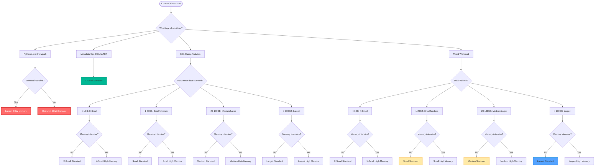
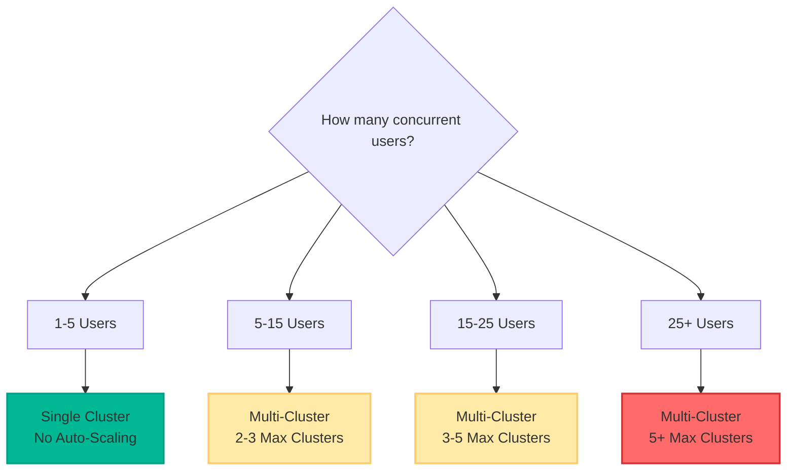
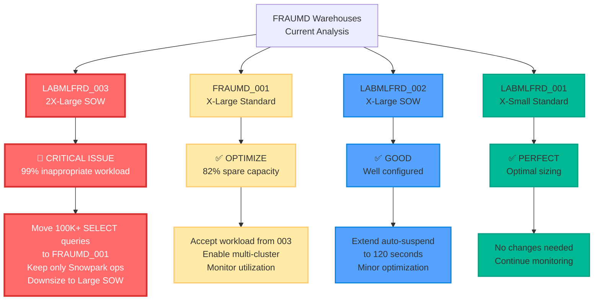

# Snowflake Warehouse Selection Decision Tree

## Visual Decision Tree for Warehouse Selection

### Mermaid Diagram Code


### Concurrency Decision Tree


### FRAUMD Specific Recommendations


## Decision Tree as Pseudocode

```
function selectWarehouse(workloadType, dataVolume, memoryIntensive, concurrentUsers) {
    
    // Step 1: Determine warehouse type
    if (workloadType === "SNOWPARK") {
        warehouseType = "SNOWPARK_OPTIMIZED"
        if (memoryIntensive) {
            size = "LARGE_OR_ABOVE"
            memory = "SOW_MEMORY_16X"
        } else {
            size = "MEDIUM_OR_ABOVE"
            memory = "SOW_STANDARD"
        }
    } else if (workloadType === "METADATA") {
        warehouseType = "STANDARD"
        size = "XSMALL"
        memory = "STANDARD"
    } else {
        warehouseType = "STANDARD"
        
        // Step 2: Determine size based on data volume
        if (dataVolume < "1GB") {
            size = "XSMALL"
        } else if (dataVolume < "20GB") {
            size = "SMALL"
        } else if (dataVolume < "100GB") {
            size = "MEDIUM"
        } else {
            size = "LARGE_OR_ABOVE"
        }
        
        // Step 3: Determine memory type
        if (memoryIntensive) {
            memory = "HIGH_MEMORY"
        } else {
            memory = "STANDARD"
        }
    }
    
    // Step 4: Determine clustering
    if (concurrentUsers <= 5) {
        clusters = "SINGLE_CLUSTER"
    } else if (concurrentUsers <= 15) {
        clusters = "MULTI_CLUSTER_2_3"
    } else if (concurrentUsers <= 25) {
        clusters = "MULTI_CLUSTER_3_5"
    } else {
        clusters = "MULTI_CLUSTER_5_PLUS"
    }
    
    return {
        type: warehouseType,
        size: size,
        memory: memory,
        clustering: clusters
    }
}
```

## Quick Reference Matrix

| **Data Volume** | **Memory Intensive** | **Standard** | **High Memory** | **Snowpark** |
|-----------------|---------------------|--------------|-----------------|--------------|
| **< 1GB**       | No                  | X-Small      | X-Small HM      | Not recommended |
| **< 1GB**       | Yes                 | X-Small HM   | X-Small HM      | Not recommended |
| **1-20GB**      | No                  | Small        | Small HM        | Medium SOW   |
| **1-20GB**      | Yes                 | Small HM     | Small HM        | Medium SOW Memory |
| **20-100GB**    | No                  | Medium       | Medium HM       | Large SOW    |
| **20-100GB**    | Yes                 | Medium HM    | Medium HM       | Large SOW Memory |
| **> 100GB**     | No                  | Large+       | Large+ HM       | Large+ SOW   |
| **> 100GB**     | Yes                 | Large+ HM    | Large+ HM       | Large+ SOW Memory |

## Implementation Examples

### Example 1: Data Exploration (FRAUMD Use Case)
```
Input: 
- Workload: SQL Analytics
- Data Volume: < 1GB (60% of LABMLFRD_003 queries)
- Memory Intensive: No
- Concurrent Users: 5-10

Output: Small Standard Warehouse
Recommendation: Move to FRAUMD_001 or create Small dedicated warehouse
```

### Example 2: ML Training (Legitimate Snowpark)
```
Input:
- Workload: Snowpark (Python ML)
- Data Volume: > 50GB
- Memory Intensive: Yes
- Concurrent Users: 2-3

Output: Large SOW_MEMORY_16X
Recommendation: Right-size LABMLFRD_003 for this specific use case
```

### Example 3: ETL Processing (Batch Operations)
```
Input:
- Workload: Mixed (CTAS + INSERT)
- Data Volume: 10-50GB
- Memory Intensive: No
- Concurrent Users: 1-3

Output: Medium Standard, Single Cluster
Recommendation: Use LABMLFRD_002 or dedicated Medium warehouse
```

## Visual Tools for Creating Diagrams

1. **Mermaid**: Copy the mermaid code above into any mermaid renderer
2. **Draw.io**: Use the text-based decision tree as a template
3. **Lucidchart**: Professional diagramming with decision tree templates
4. **Confluence**: Native mermaid support for wiki documentation
5. **PowerPoint/Google Slides**: Manual creation using shapes and connectors

## Usage Instructions

1. **For Documentation**: Copy the mermaid code into your documentation platform
2. **For Presentations**: Use the visual ASCII tree or create diagrams from the pseudocode
3. **For Training**: Use the quick reference matrix for hands-on workshops
4. **For Implementation**: Use the pseudocode as a basis for automated warehouse selection logic 